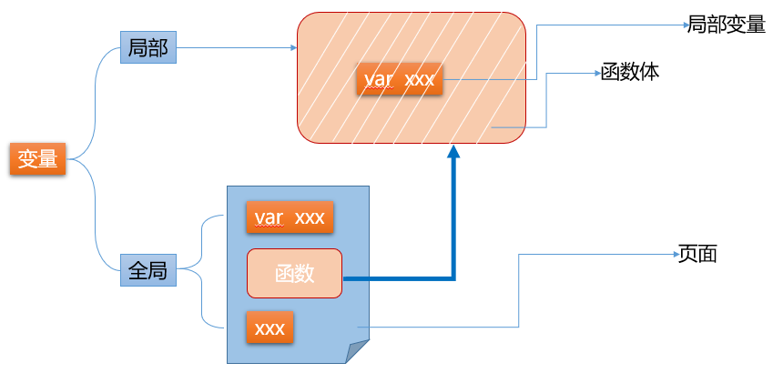

# 网页基础

| Tedu Python 教学部 |
| --- |
| 作者：吕泽 |

-----------

[TOC]

# 1. HTML

* 什么是网页 

  网页是基于浏览器的应用程序，是数据展示的载体

  

* 网页的访问
  * 浏览器
    * 代替用户向服务器发请求
    * 接收并解析数据展示给用户
  * 服务器
    * 存储数据
    * 处理并响应请求
  * 协议
    * 规范数据在传输过程中的打包方式
  
* 开发前的准备
  * 运行环境：浏览器，设置chrome为默认浏览器，作为网页文件的运行环境。
  * 调试工具：浏览器自带的调试工具，使用快捷键"F12"或右键"检查"打开。
  * 开发工具：不限，选用个人习惯的即可（VSCode、Sublime、PyCharm等）。

## 1.1 HTML概述

###  1.1.1 概念

超文本标记语言（HyperText Markup Language）浏览器能够识别和解析的语言，通过标签的形式构建页面结构和填充内容

### 1.1.2 标签

标签也称为标记或元素，用于在网页中标记内容

1. 语法：标签使用< >为标志，在< >内部写标签名和标签属性

   - 注释语法：

   ```html
   <!-- 此处为注释 -->
   ```

   - 标签名不区分大小写，推荐小写表示

2. 分类：

   - 双标签：成对出现，包含开始标签和结束标签。例：

   ```html
   <html>
   <!-- 内容或其他标签 -->
   </html>
   ```

   - 单标签：只有开始标签，没有结束标签，可以手动添加“/”表示闭合。例：

   ```html
   <br>
   <br/>
   ```

3. 标签属性：

   - 标签属性书写在开始标签中，使用空格与标签名隔开，用于设置当前标签的显示内容或者修饰显示效果。由属性名和属性值组成，属性值使用双引号表示。例：

    ```HTML
    <meta charset="utf-8">
    ```

   - 同一个标签中可以添加若干组标签属性，使用空格间隔。例：

    ```html
    <a href="http://www.tmooc.cn" target="_blank">达内慕课网</a>
    ```

### 1.1.3 使用

1. 创建网页文件，使用.html或.htm作为文件后缀

2. 添加网页的基本结构

   ```html 
   <!doctype html>
   <html>
   	<head>
   		<title>网页标题</title>
   		<meta charset="utf-8">
   	</head>
   	<body>
            网页主体内容
   	</body>
   </html>
   ```

   专业的开发工具支持HTML代码补全功能，如VSCode中，创建好HTML页面以后可以输入英文感叹号(!)然后按tab键补全页面基本结构(不同的开发工具补全的基本结构有细微的差别，可以忽略)。

3. 标签嵌套
   在双标签中书写其他标签，称为标签嵌套

   - 嵌套结构中，外层元素称为父元素，内层元素称为子元素；
   - 多层嵌套结构中，所有外层元素统称为祖先元素，内层元素统称为后代元素
   - 平级结构互为兄弟元素

## 1.2 常用标签介绍

### 1.2.1 基本结构解析

 ```html
<!-- 文档类型声明，便于浏览器正确解析标签及渲染样式 -->
<!doctype html> 
<!-- HTML文档开始的标志 -->
<html> 
   <!-- 头部设置，可在head中设置网页标题，网页选项卡图标，引入外部的资源文件，设置网页相关信息等 -->
   <head>
       <!-- 设置网页标题，显示在网页选项卡上方 -->
       <title>网页标题</title>
       <!-- 设置网页字符编码 -->
       <meta charset="utf-8"> 
   </head>
   <!-- 网页主体部分，显示网页主要内容 -->
   <body> 
       网页主体内容
   </body>
</html><!-- 文档结束-->
 ```

### 1.2.2 body中常用标签

  - 文本标签

    - 标题标签：自带加粗效果，从h1到h6字体大小逐级递减

    ```html
     <h1>一级标题</h1>
     <h2>二级标题</h2>
     <h3>三级标题</h3>
     <h4>四级标题</h4>
     <h5>五级标题</h5>
     <h6>六级标题</h6>
    ```

    - 段落标签：

     ```html
     <p>段落文本</p>
    
     ```

    - 普通文本标签：

     ```html
     <span>行分区标签，用于对特殊文本特殊处理</span>
     ```
    
- 格式标签：
      浏览器会忽略代码中的换行和空格，只显示为一个空格。想要实现页面中的换行，需要借助于换行标签。
    
 ```html
     <br>
     <hr> 画横线
     ```
    
- 字符实体：
      某些情况下，浏览器会将一些特殊字符按照HTML的方式解析，影响显示结果。此时需要将这类字符转换为其他的形式书写
      例：
    
```
     使用 &lt; 在页面中呈现 "<"
     使用 &gt; 在页面中呈现 ">"
     使用 &nbsp; 在页面中呈现一个空格
     使用 &copy; 在页面中呈现版权符号"©"
     使用 &yen; 在页面中呈现人民币符号"￥"
    
    ```
    
  - 容器标签
    常用于页面结构划分，结合CSS实现网页布局

       ```html
       <div id="top">页面顶部区域</div>
       <div id="main">页面主体区域</div>
       <div id="bottom">页面底部区域</div>
    
       ```

    练习 ： 创建exercise01.html，使用常用页面标签完成如下图所示页面:  注意<h>标签居中属性为 align="center"

    

    

  - 图片与超链接标签

    - 图片标签 用于在网页中插入一张图片。

      1. 属性 src 用于给出图片的URL，必填。
      2. 属性 width/height 用于设置图片尺寸，取像素值，默认按照图片的原始尺寸显示。
      3. 属性 title 用于设置图片标题，鼠标悬停在图片上时显示
      4. 属性 alt 用于设置图片加载失败后的提示文本

      语法：

    ```html
    
    
    ```

    - 超链接标签：用户可以点击超链接实现跳转至其他页面
      1. 属性 href 用于设置目标文件的URL，必填。
      2. 属性 target用于设置目标文件的打开方式，默认在当前窗口打开。可以设置新建窗口打开目标文本(取"_blank")

    ```html
    <a href="http://www.taobao.com" target="_self">淘宝</a>
    <a href="http://www.baidu.com" target="_blank">百度</a>
    
    ```

### 1.2.3 常用结构标签

  - 列表标签 

    - 有序列表（ordered list）
      默认使用阿拉伯数字标识每条数据

     ```html
    <ol>
    	<li>list item 列表项</li> 
    	<li>list item 列表项</li>
    	<li>list item 列表项</li>
    </ol>
    
     ```

    - 无序列表（unordered list）
      默认使用实心圆点标识列表项

     ```html
     <ul>
      	<li>list item 列表项</li> 
      	<li>list item 列表项</li>
      	<li>list item 列表项</li>
      </ul>
    
     ```

  - 表格标签

    - 表格由行和单元格组成，常用于直接的数据展示或辅助排版,基本结构如下

    ```html
    <!-- 创建表格标签 -->
    <table>
    	 <!-- 创建行标签 -->
    	<tr>
    		<!-- 行中创建单元格以显示数据 -->
    		<td>姓名</td>
    		<td>年龄</td>
    		<td>班级</td>
    	</tr>
    	<tr>
    		<td>迪丽热巴</td>
    		<td>20</td>
    		<td>002</td>
    	</tr>
    </table>
    
    ```

    - 单元格合并：用于调整表格结构，分为跨行合并和跨列合并，合并之后需要删除被合并的单元格，保证表格结构完整

      | 单元格属性 | 作用           | 取值       |
      | ---------- | -------------- | ---------- |
      | colspan    | 跨列合并单元格 | 无单位数值 |
      | rowspan    | 跨行合并单元格 | 无单位数值 |

      
      
      练习：创建exercise02.html 表单标签完成如下图所示页面,忽略画面中的颜色和字体即可


  - 表单标签
    表单用于采集用户的信息并提交给服务器，由表单元素和表单控件组成。表单元素form负责提交数据给服务器，表单控件负责收集数据。

     - 表单使用<form></form>

    | 属性名  | 取值                                                         |
    | ------- | ------------------------------------------------------------ |
    | action  | 设置数据的提交地址                                           |
    | method  | 设置数据的提交方式，默认为get方式，可以设置为post            |
    | enctype | 设置数据的编码类型，涉及二进制数据提交（例如图片，文件，音视频等），必须设置数据的提交方式为post,编码类型为"multipart/form-data" |

    例如：

    ```html
    <form action="" method="" enctype="">
    	<!--此处为表单控件-->
    </form>
    
    ```

     - 表单控件使用
       表单控件用于采集用户信息，可设置以下标签属性

    | 属性名      | 取值                                   |
    | ----------- | -------------------------------------- |
    | type        | 设置控件类型                           |
    | name        | 设置控件名称，最终与值一并发送给服务器 |
    | value       | 设置控件的值                           |
    | placeholder | 设置输入框中的提示文本                 |
    | checked     | 设置单选按钮或复选按钮的默认选中       |
    | selected    | 设置下拉菜单的默认选中                 |

表单控件用于采集用户信息，常用控件如下：

```html
  <input type="text">  文本框
  <input type="password">  密码框
  <input type="radio">  单选按钮
  <input type="checkbox">  复选框
  <input type="file">  文件上传
  <input type="button"> 普通按钮
  <input type="submit">  提交按钮
  <select></select>  下拉菜单
  <option></option>  下拉菜单选项	 
  <textarea></textarea> 文本域 

```

练习：创建exercise03.html 表单标签完成如下图所示页面


# 2. CSS

 CSS全称为： Cascading Style Sheets ，意为层叠样式表 ，与HTML相辅相成，实现网页的排版布局与样式美化

## 2.1 CSS使用方式

### 2.1.1 行内样式/内联样式

  借助于style标签属性，为当前的元素添加样式声明

```
 <标签名 style="样式声明">
```

  CSS样式声明 : 由CSS属性和值组成  例：

```
 style="属性:值;属性:值;"
```

  常用CSS属性 :

- 设置文本颜色 color:red;
- 设置背景颜色 background-color:green;
- 设置字体大小 font-size:32px;

### 2.1.2 内嵌样式

  借助于style标签，在HTML文档中嵌入CSS样式代码，可以实现CSS样式与HTML标签之间的分离。同时需借助于CSS选择器到HTML 中匹配元素并应用样式  示例:

```
  <style>
      选择器{
        属性:值;
        属性:值;
      }
  </style>
```

  选择器 : 通过标签名或者某些属性值到页面中选取相应的元素，为其应用样式  示例：

```
/*标签选择器 : 根据标签名匹配所有的该元素*/  
p{
    color:red;
  }
```

### 2.1.3 外链样式表

- 创建外部样式表文件 后缀使用.css
- 在HTML文件中使用<link>标签引入外部样式表

```
 <link rel="stylesheet" href="URL">
```

- 样式表文件中借助选择器匹配元素应用样式

## 2.2 样式表特征

### 2.2.1 层叠性

多组CSS样式共同作用于一个元素

### 2.2.2 继承性

后代元素可以继承祖先元素中的某些样式 例 : 大部分的文本属性都可以被继承


## 2.3 CSS 选择器

### 2.3.1 作用

匹配文档中的某些元素为其应用样式

### 2.3.2 分类 

*  标签选择器

根据标签名匹配文档中所有该元素 语法 :

```
标签名{
  属性:值;
}
```

* id选择器

根据元素的 id 属性值匹配文档中惟一的元素，id具有唯一性，不能重复使用 语法 :

```
  #id属性值{
  
  }
```

注意 :  id属性值自定义,可以由数字，字母，下划线，- 组成，不能以数字开头;  尽量见名知意，多个单词组成时，可以使用连接符，下划线，小驼峰表示

*  class选择器/类选择器

根据元素的class属性值匹配相应的元素,class属性值可以重复使用,实现样式的复用 语法 :

```
.class属性值 {
  
}
```

也可以指定某个标签下的某个类进行设置，标签在前,类选择器在后    	例 : a.c1{ }				

*  群组选择器

为一组元素统一设置样式 语法 :

```
selector1,selector2,selector3{	         
}
```

* 后代选择器

匹配满足选择器的所有后代元素(包含直接子元素和间接子元素) 语法 :

```
selector1 selector2{
}
```

匹配selector1中所有满足selector2的后代元素

* 子代选择器

匹配满足选择器的所有直接子元素 语法 :

```
selector1>selector2{
}
```

*  伪类选择器

用于定义元素的特殊状态,比如设置鼠标悬停在元素上时的样式，为已访问和未访问链接设置不同的样式，设置元素获得焦点时的样式等。它必须与基础选择器结合使用  :

```
:link 	 超链接访问前的状态
:visited 超链接访问后的状态
:hover	 鼠标滑过时的状态
:active  鼠标点按不抬起时的状态(激活)
```

使用 :

```
a:link{
}
a:visited{
}
.c1:hover{ }
```

注意 :

1. 超链接如果需要为四种状态分别设置样式,必须按照以下顺序书写

```
  :link
  :visited
  :hover
  :active
```

1. 超链接常用设置 :

```
  a{
  	/*统一设置超链接默认样式(不分状态)*/
  }
  a:hover{
  	/*鼠标滑过时改样式*/
  }
```


### 2.3.3 优先级问题

同一个元素的同一个样式(例如文本色)，在不同地方多次进行设置，最终选用哪一种样式？此时哪一种样式表的优先级高或者选择器综合权重大选用哪一种。

- 行内样式的优先级最高
- 文档内嵌与外链样式表,优先级一致,看代码书写顺序,后来者居上
- 浏览器默认样式和继承样式优先级都较低但浏览器默认样式比继承样式高

使用选择器为元素设置样式发生样式冲突时,选择器的权重需要计算比较,权重越大,优先级越高

| 选择器       | 权重 |
| ------------ | ---- |
| 标签选择器   | 1    |
| (伪)类选择器 | 10   |
| id选择器     | 100  |
| 行内样式     | 1000 |

复杂选择器(后代,子代,伪类)最终的权重为各个选择器权重值之和 群组选择器权重以每个选择器单独的权重为准，不进行相加计算 例 :

```
/*群组选择器之间互相独立，不影响优先级*/
body,h1,p{ /*标签选择器权重为 1 */
 color:red;
}
.c1 a{ /*当前组合选择器权重为 10+1  */
 color:green;
}
#d1>.c2{ /*当前组合选择器权重为 100+10 */
 color:blue;
}
```

练习：编写一个程序在div 中有 “PLUS会员”字样，实现如下效果：

鼠标指向前：


鼠标指向后：


## 2.4 标签分类

### 2.4.1 块元素

独占一行,不与元素共行;可以手动设置宽高,默认宽度与与父元素保持一致 例 : body  div   h1~h6   p   ul   ol   li   form    table    hr

### 2.4.2 行内元素

可以与其他元素共行显示;不能手动设置宽高,尺寸由内容决定 例 : span   a   

### 2.4.3 行内块元素

可以与其他元素共行显示,又能手动调整宽高 例 : img   input   button    textarea  td

### 2.4.4 嵌套原则

1. 块元素中可以嵌套任意类型的元素 
2. p元素段落标签只嵌套行内元素,不嵌套块元素
3. 行内元素中最好只嵌套行内或行内块元素

## 2.5 颜色和长度

### 2.5.1 常用长度单位

许多 CSS 属性接受“长度”值，诸如 `width`、`margin`、`padding`、`font-size` 等。长度单位有绝对长度和相对长度单位，绝对长度单位是固定的，用任何一个绝对长度表示的长度都将恰好显示为这个尺寸，但是我们不建议在屏幕上大量使用绝对长度单位，因为屏幕尺寸变化很大。

| 单位 | 描述                                               |
| ---- | -------------------------------------------------- |
| cm   | 绝对单位，厘米                                     |
| mm   | 绝对单位，毫米                                     |
| px   | 像素，一个相对屏幕分辨率的点                       |
| em   | 相对于元素的字体大小（未设置则相对浏览器默认字体） |
| %    | 相对父元素的百分比                                 |


### 2.5.2 颜色表达

- 英文单词：red，green，blue
- RGB(r,g,b) 使用三原色表示，每种颜色取值0~255
- RGBA(r,g,b,alpha) 三原色每种取值0~255，alpha取值0.0（透明）~1.0（不透明）
- HEX颜色 ： 即颜色的十六进制表示，以#为前缀,每两位为一组，代表一种三原色；每位的取值范围00-ff。比如红色**rgb(255,0,0)** 对应这种表达方式为 **#ff0000**

  

## 2.6 常用CSS样式

* 背景
	| 功能                   | 属性名                        | 取值                                                         |
| ---------------------- | ----------------------------- | ------------------------------------------------------------ |
| 宽度                   | width                         | 尺寸单位，行内元素无效                                       |
| 高度                   | height                        | 尺寸单位，行内元素无效                                       |
| 背景颜色               | background-color              | 颜色单位                                                     |
| 背景图片               | background-image              | url("路径")                                                  |
	
* 字体
	| 功能                   | 属性名                        | 取值                                                         |
| ---------------------- | ----------------------------- | ------------------------------------------------------------ |
| 字体大小               | font-size                     | 尺寸单位                                                     |
| 字体粗细程度           | font-weight                   | normal/bold(加粗)                                            |
| 字体样式               | font-style                    | normal/italic(倾斜)                                          |
| 字体名称               | font-family                   | 字体名称，如Arial,"黑体"                                     |
	
* 文本
	| 功能                   | 属性名                        | 取值                                                         |
| ---------------------- | ----------------------------- | ------------------------------------------------------------ |
| 文本颜色               | color                         | 颜色单位                                                     |
| 文本装饰线             | text-decoration               | none/underline(下划线)                                       |
| 文本内容的水平对齐方式 | text-align                    | left(默认值)/center/right/justify(两端对齐)                  |
| 行高(文本内容垂直对齐) | line-height                   | 尺寸单位,line-height = height 设置一行文本在元素中垂直居中,line-height > height 文本下移显示,line-height < height 文本靠上显示 |
	
* 边框
	| 功能                   | 属性名                        | 取值                                                         |
| ---------------------- | ----------------------------- | ------------------------------------------------------------ |
| 边框                   | border                        | 三个值，分别为宽度/样式/颜色，用空格隔开，如 1px solid red(1像素实线边框) |
| 单边框                 | border-top/right/bottom/left  | 同上                                                         |
	
* 边距
	| 功能                   | 属性名                        | 取值                                                         |
| ---------------------- | ----------------------------- | ------------------------------------------------------------ |
| 内边距                 | padding                       | 常用像素值，调整元素内容与边框之间的距离， 最多取4个值，按照顺序分别表示上右下左四个方向的距离，最小值为0 |
| 单方向内边距           | padding-top/right/bottom/left | 取一个值                                                     |
| 外边距                 | margin                        | 调整元素与元素之间的距离，最多取4个值，按照顺序分别表示上右下左四个方向的距离 |
| 单方向外边距           | margin-top/right/bottom/left  | 取一个值                                                     |
	
	


练习：

请基于所给的图片完成下图所示的页面内容：


# 3. JavaScript

## 3.1 JavaScript概述

*  JS 介绍

简称JS，是一种浏览器解释型语言,嵌套在HTML文件中交给浏览器解释执行。主要用来实现网页的动态效果，用户交互及前后端的数据传输等。
* JS 组成

1. 核心语法 -ECMAScript 规范了JS的基本语法
2. 浏览器对象模型 -BOM
     Browser Object Model，提供了一系列操作浏览器的方法
3. 文档对象模型 -DOM
     Document Object Model ，提供了一系列操作的文档的方法

## 3.2 使用方式

1. 元素绑定事件
      + 事件 ：指用户的行为（单击，双击等）或元素的状态（输入框的焦点状态等）
      + 事件处理：元素监听某种事件并在事件发生后自动执行事件处理函数。
      + 常用事件：onclick (单击事件) 
      + 语法 ：将事件名称以标签属性的方式绑定到元素上，自定义事件处理。
      ```html
      <!--实现点击按钮在控制台输出-->
      <button onclick="console.log('Hello World');">点击</button>
      ```
2. 文档内嵌。使用<script type="text/javascript"></script>标签书写 JS 代码
      + 语法 ：
      ```html
      <script>
        alert("网页警告框");
      </script>
      ```
      + 注意 ：<script></script>标签可以书写在文档的任意位置，书写多次，一旦加载到script标签就会立即执行内部的JS代码，因此不同的位置会影响代码最终的执行效果。通常放在head中的js会在点击等事件发生时调用，而放在body中的js往往是为了生成一定的内容。
3. 外部链接
      + 创建外部的JS文件 XX.js，在HTML文档中使用<script src=""></script>引入
      ```html
      <script src="index.js"></script>
      ```
      + 注意 ：<script></script>既可以实现内嵌 JS 代码，也可以实现引入外部的 JS 文件，但是只能二选一。

## 3.3 基础语法

### 3.3.1 语法规范

1. JS是由语句组成,语句由关键字,变量,常量,运算符,方法组成。分号可以作为语句结束的标志,也可以省略
2. JS严格区分大小写
3. 注释语法
    单行注释使用 //
    多行注释使用 /* */

### 3.3.2 JS的变量与常量

* 变量

1. 作用 : 用于存储程序运行过程中可动态修改的数据
2. 语法 : 使用关键var声明,自定义变量名
    ```javascript
    var a;		//变量声明
    a = 100;	//变量赋值
    var b = 200; //声明并赋值
    var m,n,k;	//同时声明多个变量
    var j = 10,c = 20; //同时声明并赋值多个变量
    ```
3. 命名规范 : 
      + 变量名,常量名,函数名,方法名自定义,可以由数字,字母,下划线,$组成,禁止以数字开头
      + 禁止与关键字冲突(var const function if else for while do break case switch return class)
      + 变量名严格区分大小写
      + 变量名尽量见名知意,多个单词组成采用小驼峰,例如："userName"
4. 使用注意 :
      + 变量如果省略var关键字,并且未赋值,直接访问会报错
      + 变量使用var关键字声明但未赋值,变量初始值为undefined
      + 变量省略var关键字声明,已被赋值,大多可正常使用，某些浏览器严格条件下会报错，不建议这么做

* 常量 

1. 作用 : 存储一经定义就无法修改的数据
2. 语法 : 必须声明的同时赋值
      ```javascript
      const PI = 3.14;
      ```
3. 注意 :
    + 常量一经定义,不能修改,强制修改会报错
    + 命名规范同变量,为了区分变量,常量名采用全大写字母

### 3.3.3 数据类型
* 基本数据类型

1. number 数值类型
      + 整数
          1.   十进制表示
            ```javascript
             var a = 100;
            ```
            2. 八进制表示
               以0为前缀
            ```javascript
             var b = 021; //结果为十进制的 17
            ```
            3. 十六进制
               以0x为前缀
            ```javascript
             var c = 0x35;//结果为十进制的 53
            ```
               使用 : 整数可以采用不同进制表示,在控制台输出时一律会按照十进制输出
      + 小数

          ```javascript
           var m = 1.2345;
          ```

2. string 字符串类型
   字符串 : 由一个或多个字符组成,使用""或''表示,每一位字符都有对应的Unicode编码
   ```javascript
   var s = "100";
   var s1 = "张三";
   ```


3. boolean 布尔类型
     只有真和假两个值，布尔值与number值可以互相转换。true 为 1，false 为 0

     ```javascript
     var isSave = true;
     var isChecked = false;
     ```

4. undefined  (程序返回的值)
     特殊值,变量声明未赋值时显示undefined
     ```javascript
     var a;
     console.log(a);//undefined
     ```

5. null 空类型  (主动使用的)
     解除对象引用时使用null,表示对象为空

6. 引用数据类型  

   函数，对象等

主要指对象，函数
### 3.3.4 数据类型转换
不同类型的数据参与运算时,需要转换类型

* 强制类型转换

1. 转换字符串类型
   方法 : toString()
   返回转换后的字符串
 ```javascript
 var a = 100;
 a = a.toString(); //"100"
 var b = true;
 b = b.toString(); //"true"
 ```
2. 转换number类型 

 方法 ： Number(param)
    参数为要进行数据类型转换的变量或值，返回转换后的结果:
	如果转换成功,返回number值
	如果转换失败,返回NaN,(Not a Number)，只要数据中存在非number字符,一律转换失败，返回 NaN

* 隐式类型转换（自动转换）

  当字符串与其他数据类型进行"+"运算时,表示字符串的拼接，不再是数学运算
  转换规则 ：将非字符串类型的数据转换成字符串之后进行拼接，最终结果为字符串

### 3.3.5 运算符
* 赋值运算符 

	= 将右边的值赋给左边变量
	
* 算数运算符

  ```
  +    -    *    / %  
  ```

* 复合运算符

	```
	+=     -=       *=       /=       %=
	```
	
* 自增或自减运算符

  ```
  ++      -- 变量的自增和自减指的是在自身基础上进行 +1或-1 的操作注意：
  ```

  * 如果自增或自减运算符与其他语句结合使用时，做前缀表示先进行自增/减++/--,再使用自增/减后的值参与语句，如果做后缀，就先结合其他语句，再进行自增/减++ / --

* 关系运算符/比较运算符

	```
	<     >     >=     <=      ==(相等)      !=(不相等)     ===(全等)   !==(不全等)
	```
	
	
1. 关系运算符用来判断表达式之间的关系,结果永远是布尔值 true/false

2. 相等与全等

  相等 : 不考虑数据类型,只做值的比较(包含自动类型转换)

  全等 : 不会进行数据类型转换,要求数据类型一致并且值相等才判断全等

* 逻辑运算符 

1. && 逻辑与  条件1&&条件2 
    表达式同时成立,最终结果才为true;
2. || 逻辑或  条件1||条件2  
    表达式中只要有一个成立,最终结果即为true; 
3. ! 逻辑非    !条件  
    对已有表达式的结果取反

## 3.4 流程控制

* 作用

控制代码的执行顺序

### 3.4.1 分支/选择结构

1. if语句

+ 简单if结构
  ``` text
  if(条件表达式){
  	表达式成立时执行的代码段
  }
  ```
  注意 : 除零值以外，其他值都为真，以下条件为假值false
  ```javascript
  if(0){}
  if(0.0){}
  if(""){} //空字符串
  if(undefined){}
  if(NaN){}
  if(null){}
  ```
  特殊写法 :
  	{ }可以省略,一旦省略，if语句只控制其后的第一行代码
+ if - else结构
	```text
	if(条件表达式){
  	//条件成立时执行
  }else{
  	//条件不成立时选择执行
  }
  ```
+ 多重分支结构
    ```javascript
      if(条件1){
      	//条件1成立时执行
      }else if(条件2){
      	//条件2成立时执行
      }else if(条件3){
      	//条件3成立时执行
      }...else{
      	//条件不成立时执行
      }
    ```


2. switch语句

+ 语法 :
```javascript
switch(value){
	 case 值1 :
	 //value与值1匹配全等时,执行的代码段
	 break; //结束匹配
	 case 值2 :
	 //value与值2匹配全等时,执行的代码段
	 break;
	 case 值3 :
     //value与值3匹配全等时,执行的代码段
	 break;
	 default:
 	 //所有case匹配失败后默认执行的语句
 	 break;
}
```
+ 使用 :
```javascript
1. switch语句用于值的匹配，case用于列出所有可能的值；只有switch()表达式的值与case的值匹配全等时，才会执行case对应的代码段
2. break用于结束匹配，不再向后执行；可以省略，break一旦省略，会从当前匹配到的case开始，向后执行所有的代码语句，直至结束或碰到break跳出
3. default用来表示所有case都匹配失败的情况，一般写在末尾，做默认操作
4. 多个case共用代码段
  		case 值1:
  		case 值2:
  		case 值3:
  		//以上任意一个值匹配全等都会执行的代码段
```


### 3.4.2 循环结构

+ 作用
根据条件，重复执行某段代码
+ 分类
1. while循环
```text
定义循环变量;
   while(循环条件){
   条件满足时执行的代码段
   更新循环变量;
}
```
2. do-while循环
```text
do{
	循环体;
	更新循环变量
}while(循环条件);
```


与 while 循环的区别 :

+ while 循环先判断循环条件，条件成立才执行循环体
+ do-while 循环不管条件是否成立，先执行一次循环体

3. for 循环
```text
for(定义循环变量;循环条件;更新循环变量){
	循环体;
}
```


循环控制 :

1. break 强制结束循环
2. continue 结束当次循环，开始下一次循环
   循环嵌套 :
   在循环中嵌套添加其他循环


## 3.5 函数


### 3.5.1 作用 
  封装一段待执行的代码

### 3.5.2 语法 

```javascript
  //函数声明
  function 函数名(参数列表){
  	函数体
  	return 返回值;
  }
  //函数调用
  函数名(参数列表);
```


### 3.5.3 使用 

  	函数名自定义，见名知意，命名规范参照变量的命名规范。普通函数以小写字母开头，用于区分构造函数(构造函数使用大写字母开头，定义类)


### 3.5.4 匿名函数

匿名函数：省略函数名的函数。语法为：

- 匿名函数自执行

```javascript
 (function (形参){
  
 })(实参);
```

- 定义变量接收匿名函数

```javascript
 var fn = function (){};
 fn(); //函数调用
```


### 3.5.5 作用域

JavaScript 中作用域分为全局作用域和函数作用域，以函数的{ }作为划分作用域的依据

1. 全局变量和全局函数
   - 只要在函数外部使用 var 关键字定义的变量，或函数都是全局变量和全局函数，在任何地方都可以访问
2. 局部变量/局部函数
   - 在函数内部使用 var 关键字定义的变量为局部变量，函数内部定义的函数也为局部函数，只能在当前作用域中使用，外界无法访问
3. 作用域链
   局部作用域中访问变量或函数，首先从当前作用域中查找，当前作用域中没有的话，向上级作用域中查找，直至全局作用域




## 3.6 DOM节点操作
DOM全称为 “Document Object Model”，文档对象模型，提供操作HTML文档的方法。（注：每个html文件在浏览器中都视为一篇文档,操作文档实际就是操作页面元素。）


### 3.6.1 节点对象

JavaScript 会对 html 文档中的元素、属性、文本进行封装，统称为节点对象，获取节点对象后可以通过方法操作相关的属性内容。

- 元素节点   ( 用于操作标签）

  | 方法                                    | 描述                   |
  | :-------------------------------------- | :--------------------- |
  | document.getElementById(*id*)           | 通过元素 id 来查找元素 |
  | document.getElementsByTagName(*name*)   | 通过标签名来查找元素   |
  | document.getElementsByClassName(*name*) | 通过类名来查找元素     |

  

- 属性节点（用于操作标签属性）

  ```
  element.id = "d1"; 		 //set 方法 注意属性值都要写成字符串形式
  console.log(element.id);  //get 方法
  element.style.display // 样式是元素对象的属性，同时样式也是对象也有自己的属性
  ```

  

- 文本节点（用于操作标签的文本内容）

  ```
  element.innerHTML : 读取或设置元素文本内容,可识别标签语法
  element.innerText : 设置元素文本内容,不能识别标签语法
  ```


### 3.6.2 操作标签的属性和内容

1. 元素节点对象提供了以下属性来操作元素内容

```text
innerHTML : 读取或设置元素文本内容,可识别标签语法
innerText : 设置元素文本内容,不能识别标签语法
```

2. 操作 DOM 树中的属性值：


```javascript
elem.getAttribute("attrname");//根据指定的属性名返回对应属性值
elem.setAttribute("attrname","value");//为元素添加属性,参数为属性名和属性值
elem.removeAttribute("attrname");//移除指定属性
```
3. 操作元素样式：
    为元素添加 id、class属性，或操作元素的行内样式，访问元素节点的style属性，获取样式对象；样式对象中包含CSS属性，使用点语法操作。

  ```
  elem.style = "width:300px;";
  elem.style.color = "white";
  elem.style.fontSize = "20px";
  
  注意 :
  - 属性值以字符串形式给出，单位不能省略
  - 如果css属性名包含连接符，使用JS访问时，一律去掉连接符,改为驼峰， font-size -> fontSize
  ```

  


# 4. jQuery
## 4.1 介绍 
jQuery 由 John Resig 于 2006 年创建。它旨在处理浏览器不兼容性并简化 HTML DOM 操作、事件处理、动画和 Ajax。十多年来，jQuery 一直是世界上最受欢迎的 JavaScript 库。

* 容易学习
* 简化了JavaScript编程书写
* 使用方便

## 4.2 使用 
### 4.2.1 引入
先引入jquery文件，才能使用jquery语法

1. CDN引入： 需要有网（备用）

   ```
   <script src="https://ajax.aspnetcdn.com/ajax/jQuery/jquery-1.11.3.min.js"></script>
   ```

2. 本地文件（常用）

   ```
   <script src="jquery-1.11.3/jquery.min.js"></script>
   ```

   

### 4.2.2 基本语法

jQuery 语法是为 HTML 元素的选取编制的，可以对元素执行某些操作。

基础语法是：*$(selector).action()*

- 美元符号定义 jQuery 标识
- 选择符（selector）“查询”和“查找” HTML 元素。可以创建元素节点或将原生JavaScript对象转换为jquery对象
- jQuery 的 action() 执行对元素的操作，jQuery定义了很多操作方法


例如 :

```javascript
 // 节点选择的特点，与样式选择器一致

 $("h1").hide()  隐藏h1元素节点
 $("#d1").hide()  隐藏id="d1"的元素
 $(".c1").hide()  隐藏class="c1"的元素
 $("body,h1,p").hide()  同时隐藏多个元素
 $(js节点对象).hide()  同时隐藏多个元素
 
```
### 4.2.3 JavaScript对象与jQuery对象转换
原生JavaScript对象与jQuery对象的属性和方法不能混用。可以根据需要，互相转换 :
1. 原生JavaScript转换jQuery对象
    $(原生对象)，返回 jQuery 对象
2. jQuery对象转换原生JavaScript对象
    + 方法一 : 根据下标取元素,取出即为原生对象
      var div = $("div")[0];
    + 方法二 : 使用jQuery的get(index)取原生对象
      var div2 = $("div").get(0);
### 4.2.4 jQuery选择器
jQuery通过选择器获取元素，使用格式为： $("选择器")
选择器分类 :

1. 基础选择器
```text
标签选择器：$("div")
ID 选择器：$("#d1")
类选择器：$(".c1")
群组选择器：$("body,p,h1")
```
2. 层级选择器
```text
后代选择器： $("div .c1")
子代选择器： $("div>span")
```
3. 过滤选择器，需要结合其他选择器使用。
```text
:first
  匹配第一个元素 例:$("p:first")
:last
  匹配最后一个元素 例:$("p:last")
:odd
  匹配奇数下标对应的元素
:even
  匹配偶数下标对应的元素
:eq(index)
  匹配指定下标的元素
:lt(index)
  匹配下标小于index的元素
:gt(index)
  匹配下标大于index的元素
:not(选择器)
  否定筛选,除()中选择器外,其他元素
```


### 4.2.5 操作元素内容

```javascript
html() //设置或读取标签内容,等价于原生innerHTML,可识别标签语法
text() //设置或读取标签内容,等价于innerText,不能识别标签
val()  //设置或读取表单元素的值,等价于原生value属性
```


### 4.2.6 操作标签属性

1. attr("attrName","value")
    设置或读取标签属性
    
2. prop("attrName","value")
    设置或读取标签属性
    注意 :在设置或读取元素属性时,attr()和prop()基本没有区别;但是在读取或设置表单元素(按钮)的选中状态时,必须用prop()方法,attr()不会监听按钮选中状态的改变,只看标签属性checked是否书写
    
3. removeAttr("attrName")
    移除指定属性
    
4. 针对类选择器,提供操作class属性值的方法

    ```
    addClass("className")	//添加指定的类名
    removeClass("className")//移除指定的类型,如果参数省略,表示清空class属性值
    toggleClass("className")//结合用户行为,实现动态切换类名.如果当前元素存在指定类名,则移除;不存在则添加
    ```
### 4.2.7 元素的创建,添加,删除
1. 作为子元素添加

```javascript
$obj.append(newObj);	//在$obj的末尾添加子元素newObj
$obj.prepend(newObj);	//作为第一个子元素添加至$obj中
$obj.after(newObj);		//在$obj的后面添加新元素
$obj.before(newObj);	//在$obj的前面添加新元素
```
2. 移除元素 

```javascript
$obj.remove();	//移除$obj
```

### 4.2.8 操作标签样式

```javascript
css("属性名","属性值")  //设置行内样式
css(JSON对象)			 //设置一组CSS样式 JavaScript Object Notation   JS对象标记
/*
JSON对象:常用数据传输格式
语法 :
   {
    "width":"200px",
    "height":"200px",
    "color":"red"
   }
 */
```

新元素创建并设置属性样式：使用$("标签语法")，返回创建好的元素:

```javascript
var div = $("<div></div>");	//创建元素
div.html("动态创建").attr("id","d1").css("color","red"); //链式调用，设置内容和属性
var h1 = $("<h1 id='d1'>一级标题</h1>");	//创建的同时设置内容，属性和样式
```


### 4.2.9 数据与对象遍历

1. $(selector).each() 方法规定为每个匹配元素规定运行的函数

   ```javascript
   $(selector).each(function(index,element){})
   ```

   必需。为每个匹配元素规定运行的函数。

   - *index* - 选择器的 index 位置
   - element - 当前的元素

2. $.each()函数是框架提供的一个工具类函数，通过它，你可以遍历对象、数组的属性值并进行处理

   ```javascript
   $.each(Object, function(index, data){});
   ```

   必需。为每个匹配元素规定运行的函数。

   - *index* - 选择器的 index 位置
   - data- 当前的数据
### 4.2.10 jQuery事件处理

1. 文档加载事件
   原生JavaScript 方法：window.onload
   jQuery方法:

```javascript
//语法一 
$(document).ready(function (){
  //文档加载完毕后执行
})
//语法二 
$().ready(function (){
  //文档加载完毕后执行
})
//语法三 
$(function(){
  //文档加载完毕后执行
})
```

区别：
原生onload事件不能重复书写，会产生覆盖问题；jquery中对事件做了优化,可以重复书写ready方法,依次执行

2. 事件绑定方式
   事件名称省略 on 前缀

```javascript
  //on("事件名称"，function)
  $("div").on("click",function(){});//新版本使用的多些
  //bind("事件名称",function)
  $("div").bind("click",function(){});//1.6-1.8间的版本
  //事件名作为方法名
  $("div").click(function(){});  
```

3. this表示事件的触发对象，但是是原生对象只能使用原生的属性和方法。如果想作为jquery对象使用，注意转换类型。$(this)转换为jquery对象，使用jquery方法。

## 4.3 应用

### 	4.3.1 页面效果


###     4.3.2 代码分析

*  页面元素

       ```html
<!DOCTYPE html>
<html lang="en">
<head>
    <meta charset="UTF-8">
    <meta http-equiv="X-UA-Compatible" content="IE=edge">
    <meta name="viewport" content="width=device-width, initial-scale=1.0">
    <title>jQuery应用</title>
    <script src="jquery.min.js"></script>
</head>
<body>
    <form action="">
        <select name="" id="city"></select>
        <select name="请选择" id="area"></select>
    </form>
</body>
</html>
       ```


* 数据部分

 ```javascript
var arr = [
                {
                    "name":"请选择",
                    "value":0,
                    "child":[
                        {
                            "cname":"请选择",
                            "cvalue":0
                        }
                    ]
                },
                {
                    "name":"北京",
                    "value":"bj",
                    "child":[
                        {
                            "cname":"海淀",
                            "cvalue":"b1"
                        },
                        {
                            "cname":"朝阳",
                            "cvalue":"b2"
                        }
                    ]
                },
                {
                    "name":"上海",
                    "value":"sh",
                    "child":[
                        {
                            "cname":"静安",
                            "cvalue":"s1"
                        },
                        {
                            "cname":"崇明",
                            "cvalue":"s2"
                        }
                    ]
                }
            ]
 ```


* 绑定城市

```javascript
 $.each(arr,function(i,o){
   $("#city").append(`<option value="${o.value}">${o.name}</option>`)
 })
```


* 绑定地区

  ```javascript
   $("#area").append(`<option value='0'>请选择</option>`)
   // 当对象发生变化时触发 onchange
   $("#city").on("change",function(){
   		$("#area option").remove() // 删除元素
    	$.each(arr,function(i,o){
        if(o.value == $("#city").val()){
          $.each(o.child,function(i,o){
            $("#area").append(`<option value="${o.cvalue}">${o.cname}</option>`)
          })
        }
      })
   })
  ```

  

  

   
