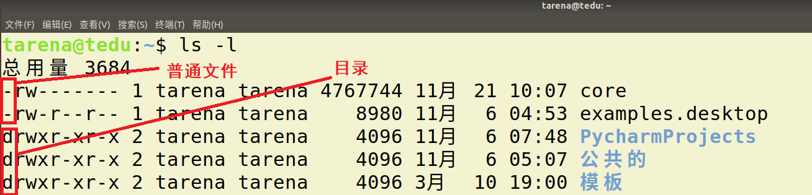
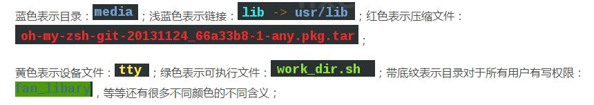
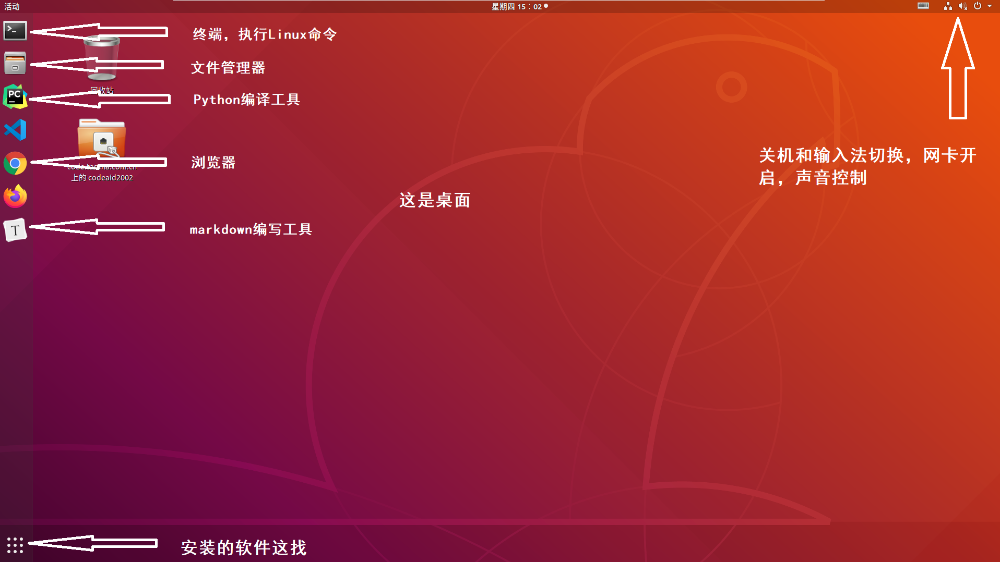
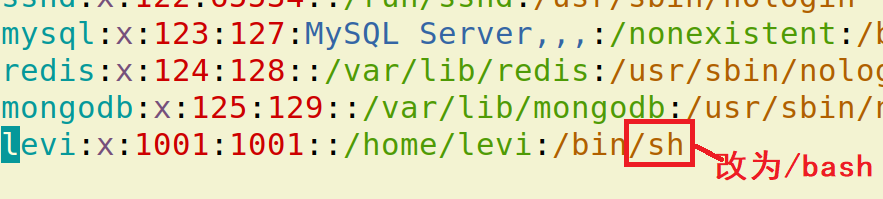
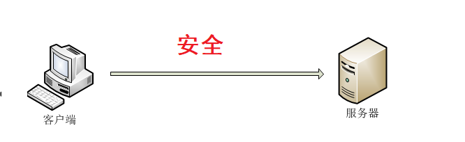
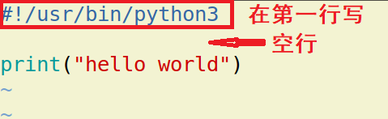
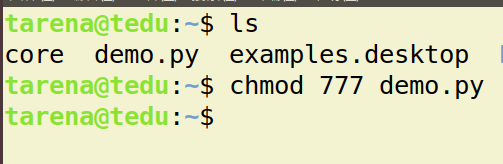

# Linux 操作系统

------

[TOC]

##  1. Linux操作系统认知

### 1.1 操作系统（Operation System简称OS）

* 定义

  操作系统是管理计算机硬件与软件资源的计算机程序，同时也是计算机系统的内核与基石。操作系统需要处理如管理与配置内存、决定系统资源供需的优先次序、控制输入设备与输出设备、操作网络与管理文件系统等基本事务。

  ---

  系统：系统一词来源于英文system的音译，即若干部分相互联系、相互作用，形成的具有某些功能的整体。

  中国著名学者[钱学森](https://baike.baidu.com/item/钱学森/26105)认为：系统是由相互作用相互依赖的若干组成部分结合而成的，具有特定功能的[有机整体](https://baike.baidu.com/item/有机整体/7557061)，而且这个有机整体又是它从属的更大系统的[组成](https://baike.baidu.com/item/组成)部分。

  


* 操作系统功能

  > 1. 管理好硬件设备，为用户提供调用方法
  > 2. 是计算机中最重要的系统环境
  > 3. 管理各种其他的软件和程序的运行
  > 4. 对系统中文件进行管理

* 操作系统分类

  > 1. 桌面系统：Windows ，maxOS为主，图形界面良好用户群体大。
  > 2. 服务器系统：Linux，Unix为主，安全，稳定，费用低占有量大。windows占有率很低。
  > 3. 嵌入式系统：Linux为主，主要用于小型只能设备，如只能 手机，机器人等。

- **操作系统** 

  一个软件平台，运行在计算机硬件之上，提供给应用程序一个空间，让应用更好的和硬件交互。

  > 硬件开发工程师 --》系统工程师（驱动工程师）--》应用工程师
  >                                            （前端工程师，后端工程师，测试工程师，UI工程师）
  >    运维工程师


### 1.2 Linux系统介绍

* Linux 诞生

  1991 年 **林纳斯（Linus）** 就读于赫尔辛基大学期间，对 Unix 产生浓厚兴趣，林纳斯 经常要用他的终端 仿真器（Terminal Emulator） 去访问大学主机上的新闻组和邮件，为了方便读写和下载文件，他自己编写了磁盘驱动程序和文件系统，这些在后来成为了 Linux 第一个内核的雏形，当时，他年仅 21 岁！林纳斯利用C做工具，编写了 Linux 内核，一开始 Linux 并不能兼容 Unix只适用于 386，后来经过全世界的网友的帮助，最终能够兼容多种硬件。

  

* Linux系统特点

  * Linux是一款免费的操作系统-----开源
  * 支持多种平台-----跨平台
  * 支持多用户
  * 具有非常强大的网络功能

* Linux 应用领域

  * Linux 服务器 : 目前是服务器系统中最广泛一种。

      

  * 桌面应用: 新版本的Linux系统特别在桌面应用方面进行了改进，达到相当的水平  

  * 嵌入式系统：由于Linux系统开放源代码，功能多样且具有极大的伸缩性，因此在嵌入式应用的领域有很广阔的应用市场。

* Linux系统构成

  * 内核: Linux操作系统的核心代码，是Linux系统的心脏，提供了系统的核心功能，用来与硬件交互。

    Linux内核官网 : [http://www.kernel.org](http://www.kernel.org)

  * 文件系统：通常指称管理磁盘数据的系统，可将数据以目录或文件的型式存储。每个文件系统都有自己的特殊格式与功能

  * 命令解释器：它使得用户能够与操作系统进行交互，负责接收用户命令，然后调用操作系统功能。

  * 应用软件：包含桌面系统和基础的软件操作工具等。

  

* Linux发型版本

  严格的来讲，Linux 只是一个系统内核，即计算机软件与硬件通讯之间的平台。一些组织或厂家将 Linux 内核与GNU软件（系统软件和工具）整合起来，并提供一些安装界面和系统设定与管理工具，这样就构成了一个发型套件，目前市面上较知名的发行版有：Ubuntu、RedHat、CentOS、Debian、Fedora、SuSE、OpenSUSE、Arch Linux、SolusOS 等。

### 1.3 文件系统

* 定义

  文件系统是计算机操作系统的重要的组成部分，用于组织和管理计算机存储设备上的大量文件。

* 文件系统结构

  * 熟悉的windows文件系统，分不同盘符

  

  * Linux的文件组织中没有盘符。将根（/）作为整个文件系统的唯一起点，其他所有目录都从该点出发。


​    

  犹如一颗倒置的树，所有存储设备作为这颗树的一个子目录。


* 普通文件和目录

  - 普通文件：包括文本，压缩包，音频视频等文件都是普通文件。
  - 目录：即文件夹，在Linux系统下多称之为目录。

  


* 主要目录功能

```reStructuredText
/：根目录，一般根目录下只存放目录，在 linux 下有且只有一个根目录，所有的东西都是从这里开始
当在终端里输入 /home，其实是在告诉电脑，先从 /（根目录）开始，再进入到 home 目录
1. /bin目录
/bin目录包含了引导启动所需的命令或普通用户可能用的命令(可能在引导启动后)。这些命令都是二进制文件的可执行程序(bin是binary----二进制的简称)，多是系统中重要的系统文件。
2. /sbin目录
/sbin目录类似/bin，也用于存储二进制文件。因为其中的大部分文件多是系统管理员使用的基本的系统程序，所以虽然普通用户必要且允许时可以使用，但一般不给普通用户使用。
3. /etc目录
/etc目录存放着各种系统配置文件，其中包括了用户信息文件/etc/ passwd，系统初始化文件/etc/rc等。linux正是因为这些文件才得以正常地运行。
4. /root目录
/root 目录是超级用户的目录。
5. /lib目录
/lib目录是根文件系统上的程序所需的共享库，存放了根文件系统程序运行所需的共享文件。这些文件包含了可被许多程序共享的代码，以避免每个程序都包含有相同的子程序的副本，故可以使得可执行文件变得更小，节省空间。
6. /dev目录
/dev目录存放了设备文件，即设备驱动程序，用户通过这些文件访问外部设备。比如，用户可以通过访问/dev/mouse来访问鼠标的输入，就像访问其他文件一样。
7. /usr文件系统
/usr 是个很重要的目录，通常这一文件系统很大，因为所有程序安装在这里。本地安装的程序和其他东西在/usr/local 下，因为这样可以在升级新版系统或新发行版时无须重新安装全部程序。
8. /var文件系统
/var 包含系统一般运行时要改变的数据。通常这些数据所在的目录的大小是要经常变化或扩充的。
9. /home
/home 普通用户的默认目录，在该目录下，每个用户拥有一个以用户名命名的文件夹。
/boot：放置 linux 系统启动时用到的一些文件，如 linux 的内核文件：/boot/vmlinuz，系统引导管理器：/boot/grub
/home：系统默认的用户家目录，新增用户账号时，用户的家目录都存放在此目录下
~ 表示当前用户的家目录
~edu 表示用户 edu 的家目录
/lib、/usr/lib、/usr/local/lib：系统使用的函数库的目录，程序在执行过程中，需要调用一些额外的参数时需要函数库的协助
/lost+fount：系统异常产生错误时，会将一些遗失的片段放置于此目录下
/mnt: /media：光盘默认挂载点，通常光盘挂载于 /mnt/cdrom 下，也不一定，可以选择任意位置进行挂载
/opt：给主机额外安装软件所摆放的目录
/proc：此目录的数据都在内存中，如系统核心，外部设备，网络状态，由于数据都存放于内存中，所以不占用磁盘空间，比较重要的文件有：/proc/cpuinfo、/proc/interrupts、/proc/dma、/proc/ioports、/proc/net/* 等
/sbin、/usr/sbin、/usr/local/sbin：放置系统管理员使用的可执行命令，如 fdisk、shutdown、mount 等。与 /bin 不同的是，这几个目录是给系统管理员 root 使用的命令，一般用户只能"查看"而不能设置和使用
/tmp：一般用户或正在执行的程序临时存放文件的目录，任何人都可以访问，重要数据不可放置在此目录下
/srv：服务启动之后需要访问的数据目录，如 www 服务需要访问的网页数据存放在 /srv/www 内
/usr：应用程序存放目录
/usr/bin：存放应用程序
/usr/share：存放共享数据
/usr/lib：存放不能直接运行的，却是许多程序运行所必需的一些函数库文件
/usr/local：存放软件升级包
/usr/share/doc：系统说明文件存放目录
/usr/share/man：程序说明文件存放目录
/var：放置系统执行过程中经常变化的文件
/var/log：随时更改的日志文件
/var/spool/mail：邮件存放的目录
/var/run：程序或服务启动后，其 PID 存放在该目录下
```


* 绝对路径和相对路径表达
  * 绝对路径：指文件在文件系统中以根目录为起始点的准确位置描述。例如“/usr/bin/gnect”就是绝对路径。最要的标志就是以 ‘/’ 作为路径描述的开头。
  * 相对路径：指相对于用户当前位置为起始点，对一个文件位置的逐层描述。例如，用户处在usr目录中时，只需要“games/gnect”就可确定这个文件。在相对路径描述时  .  表示当前目录,   ..  表示上一级目录。



### 1.4 Ubuntu使用 

作为Linux发行版中的后起之秀，Ubuntu Linux在短短几年时间里便迅速成长为从Linux初学者到资深专家都十分青睐的发行版。由于Ubuntu Linux是开放源代码的自由软件，用户可以登录Ubuntu Linux的官方网址免费下载该软件的安装包。

Ubuntu官网：[https://ubuntu.com/](https://ubuntu.com/)




## 2. Linux常用命令

* 学习目的
  1. Linux下有非常丰富的命令，可以用来完成大部分重要的Linux服务器操作维护功能，而且至今有些功能仍然通过命令操作比较方便。
  2. 实际工作中，大量服务器维护工作都是工程师通过远程控制来完成的，并没有图形界面，这时维护工作都需要通过命令来完成。
  3. 作为后端工程师，我们将来所写的代码都需要在服务器上运行，掌握基本的Linux 操作命令有助于我们将来对项目的部署和控制工作。


* 终端 ： 使用命令对Linux系统进行操作的窗口


* 命令行：书写Linux命令的提示行


* 打开关闭终端方法
  * 点击图形界面终端图标，通过ctrl+alt +t  ,shift+ctrl + t  , shift+ctrl+n 都可以快速打开一个终端。
  * 通过图形界面关闭，或者在命令行输入exit。


* 终端字体大小控制
  * 放大 摁住  ctrl 和 + 号 （不要忘了+号要使用shift）
  * 缩小 摁住  ctrl 和 -  号 


>   小技巧： 使用Tab键可以自动补全文件名，目录名等信息


* 命令格式 

  ```shell
  command [-options] [parameter]
  
  说明：
  command：命令名称，一般为英文单词或单词的缩写
  [-options]：命令选项，辅助命令进行功能细化，也可以省略
  parameter：传给命令的参数，可以是0个或多个
  
  #1 查看当前正在使用的 Shell
  # 使用一个环境变量，就可以查看到当前正在使用的 Shell 啦
  echo $SHELL
  ```


* 基础

    ```shell
    http://c.biancheng.net/linux/export.html
    在 Linux 系统中，除了 export 之外，env、set 和 declare 这三个命令也可以显示 Shell 中的变量。那这四个命令有什么区别呢？
    
    这个问题，我们需要从 Shell 变量说起。Shell 的变量，可以分为“环境变量”和“自定义变量”两种类型，两者的区别在于作用范围不同。环境变量可以在其进程的子进程中继续有效，而自定义变量的势力范围则无法延伸到其进程的子进程中。
    
    好了，知道了环境变量和自定义变量的区别，我们正式开始介绍 export/env/set/declare 的区别：
    env：显示当前用户的环境变量，但不会显示其自定义变量。
    export：功能同 env 一样，也是显示当前用户的环境变量，只不过该命令的输出是按变量名进行排序的。
    declare：显示当前 Shell 中定义的所有变量，包括用户的环境变量和自定义变量，该命令的输出按变量名进行排序。
    set：功能同 declare 一样，显示当前 Shell 中定义的所有变量，包括用户的环境变量和自定义变量。
    
    根据上面的说明，我们可以得出下面的结论：
    env 和 export 显示的是环境变量。
    set 和 declare 显示的是环境变量和自定义变量。
    
    echo $PATH
    export PATH=$PATH:/home/roc/operation_tools
    ```


    ```


-   通配符
    -   作用：对一类文件名称的书写进行简化，例如file1.txt、file2.txt、file3.txt……，用户不必一一输入文件名，可以使用通配符完成。

| 通配符          | 含义          | 实例                                       |
| ------------ | ----------- | ---------------------------------------- |
| **星号（\*）**   | 匹配任意长度的字符串  | 用file_\*.txt，匹配file_wang.txt、file_Lee.txt、file_Liu.txt |
| 问号（?）        | 匹配一个长度的字符   | 用flie_?.txt，匹配file_1.txt、file_2.txt、file_3.txt |
| **方括号（**[…]） | 匹配其中指定的一个字符 | 用file_[otr].txt，匹配file_o.txt、file_r.txt和file_t.txt |
| 方括号（[   - ]） | 匹配指定的一个字符范围 | 用file_[a-z].txt，匹配file_a.txt、file_b.txt，直到file_z.txt |


-   重定向&管道符

```bash
>：输出重定向，将文件重定向为输出源，新建模式，echo "hello world" > out.txt，将执行结果，写到out.txt文件中，若有同名文件将被删除
>>：输出重定向，将文件重定向为输出源，追加模式,ls /usr >> Lsoutput.txt，将ls /usr的执行结果，追加到Lsoutput.txt文件已有内容后
|管道，管道可以把一系列命令连接起来，意味着第一个命令的输出将作为第二个命令的输入，通过管道传递给第二个命令，第二个命令的输出又将作为第三个命令的输入，以此类推。
ls | grep 'test'
```


### 2.0 帮助

```bash
# 第一种
command --help
说明：
显示 `command` 命令的帮助信息

# 第二种
man command
说明：
空格键：显示手册页的下一屏
Enter键：一次滚动手册页的一行
b：回滚一屏
f：前滚一屏
q：退出
/word：搜索 word 字符串
```


### 2.1 文件管理

#### touch

```bash
# [文件名]如果文件不存在，新建文件
可以同时跟多个参数表示创建多个文件。创建多个文件空格隔开。（可以认为空格表示同一级）

```


#### rm

```bash
# [文件名]删除指定的文件名
删除表示直接删除，无法找回，如果删除目录需要加 -r选项 -f强制删除
```


#### cp

```bash
# 复制一个文件
如果拷贝的是一个目录需要使用 -r ，同时这个命令有另存为的作用
```


#### mv

```bash
# 移动一个文件
即使移动目录页不需要选项，有重命名的作用。
```


#### cat

```bash
# 文件名查看文件内容、创建文件、文件合并、追加文件内容等功能
# 查询操作系统信息
uname -a
cat /proc/version

```


#### find

```bash
# 路径 -name 文件名查找文件
find：会从指定目录及其所有子目录中查询搜索文件。
find / -name "*tomcat*"

```


#### file

```bash
# 文件名查看文件类型
```


#### diff

```bash
# 文件1 文件2对比两个文件差异
```


#### more

```bash
# 用于分屏显示文件内容，每次只显示一页内容

```


#### chmod

```bash
chmod修改文件权限
chmod在设置权限时，可以字母也可以使用三个数字分别对应 拥有者/组/其他用户的权限
直接修改文件|目录的 读|写|执行 权限，但是不能精确到 拥有者|组|其他
chmod  augo+/-rwx 文件名/目录名
```



>   例如：
>   `777` ===> `u=rwx,g=rwx,o=rwx`
>   `755` ===> `u=rwx,g=rx,o=rx`
>   `644` ===> `u=rw,g=r,o=r`


#### which

```bash
which显示执行命令所在位置，命令也是一个程序，实际就是显示程序所在位置,指令会在环境变量$PATH设置的目录里查找符合条件的文件。

```


#### ln

```bash
# 创建链接
一般使用  -s 选项 创建软链接，相当于快捷方式。
ln -s  hello.py  hello
# ln [参数][源文件或目录][目标文件或目录]
ln -s  # 创建软连接
```


#### chown 

```bash
chown

```


#### whereis

```bash
whereis python  #此命令将会列出系统所安装的所有版本的Python的路径

```


### 2.2 文档编辑

#### grep

```bash
# 搜索文本 文件名搜索文本文件内容
grep ： -n 用于显示行号，-i忽略大小写

```


#### wc

```bash
# 文件名查看文件行数，单词数等信息
wc : -c 表示查看多少字符，-l查看多少行，-w 查看多少单词。如果不加选项则显示这三项。
```


### 2.3 文件传输


### 2.4 磁盘管理

#### ls

```bash
# 查看当前文件夹下的内容
-l 展示详细信息。
-a展示隐藏文件（Linux下 . 开头的为隐藏文件）。
-h, --human-readable 与 -l 一起，以易于阅读的格式输出文件大小(例如 1K 234M 2G)，配合 -l 以人性化的方式显示文件大小
```


#### pwd

```bash
# 查看当前所在文件夹
```


#### cd

```bash
# [目录名]切换文件夹
参数为绝对路径或者相对路径，直接cd表示回到主目录。
```


#### mkdir

```bash
# [目录名]创建目录
-p 选项可以创建层目录
```


#### df

```bash
df显示磁盘剩余空间， -h选项以M为单位显示，-T显示文件系统类型 ext4的为磁盘
```


#### du

```linux
显示当前目录大小
du -sh
du命令解释： Summarize disk usage of each FILE, recursively for directories.

参数解释：

-s, --summarize       display only a total for each argument

-h, --human-readable  print sizes in human readable format (e.g., 1K 234M 2G)

如果不加-s，它会显示每个文件夹的大小，加上以后，只显示总的大小。

```


#### tree

```bash
tree -d 只显示目录

```


### 2.5 磁盘维护


### 2.6 网络通讯

#### netstat

```bash
# 查询是否使用了端口
netstat -anp | grep 端口号

```


#### nmcli

```bash
nmcli c r
nmcli c s
nmcli c up enp125s0f5
nmcli c de enp125s0f5
nmcli c add type ethernet con-name enp125s0f0 ifname enp125s0f0 ipv4.method manual ipv4.address 51.36.216.216/19 ipv4.gateway 51.36.192.1
nmcli c m ipv4.method manual ipv4.address 51.36.216.216/19 ipv4.gateway 51.36.192.1

```


### 2.7 系统管理

#### date

```bash
date显示当前时间
```


#### whoami

```bash
whoami显示当前用户
```


#### shutdown

```bash
关机或者重启
不指定选项和参数,默认表示1分钟之后关闭电脑
远程维护服务器时,最好不要关闭系统，而应该重新启动系统
# 重新启动操作系统，其中 now 表示现在
shutdown -r now
# 立刻关机，其中 now 表示现在
shutdown now
# 系统在今天的 20:25 会关机
shutdown 20:25
# 系统再过十分钟后自动关机
shutdown +10
# 取消之前指定的关机计划
shutdown -c
```


#### ps

```bash
ps aux`process status` 查看进程的详细状况
默认只会显示当前用户通过终端启动的应用程序
-a 显示终端上的所有进程，包括其他用户的进程
-u 显示进程的详细状态
-x 显示没有控制终端的进程
ps -aux  # 查看进程信息
	ps aux|grep 'runserver' 查出runserver进程号
	sudo kill -9 进程号
	sudo lsof -i:8000
	sudo kill -9 进程号

```


#### pstree

```bash
pstree  # 进程树结构

```


#### top

```bash
top 动态显示运行中的进程并且排序,要退出 `top` 可以直接输入 `q`
```


#### kill

```bash
kill [-9] 进程代号终止指定代号的进程，`-9` 表示强行终止,使用 `kill` 命令时，最好只终止由当前用户开启的进程，而不要终止 `root` 身份开启的进程，否则可能导致系统崩溃
```


#### sudo

```bash
sudo su
sudo放在一个命令前，表示使用管理员权限执行

```


#### free

```bash
# 内存
free -m

```


#### uname

```bash
# 查询操作系统信息
uname -a

```


### 2.8 系统设置

#### clear

```bash
# 清屏
等同于ctrl-l，清空屏幕。
```


### 2.9 备份压缩

#### tar

```bash
# 打包/解包
tar是Linux中最常用的备份工具，此命令可以把一系列文件打包到一个大文件中，也可以把一个打包的大文件恢复成一系列文件。
命令格式如下：
# 打包文件
tar -cvf 打包文件.tar 被打包的文件／路径...

# 解包文件
tar -xvf 打包文件.tar

选项说明
| 选项   | 含义                                 |
| ---- | ---------------------------------- |
| c    | 生成档案文件，创建打包文件                      |
| x    | 解开档案文件                             |
| v    | 列出归档解档的详细过程，显示进度                   |
| f    | 指定档案文件名称，f 后面一定是 .tar 文件，所以必须放选项最后 |
注意：`f` 选项必须放在最后，其他选项顺序可以随意


```


#### gzip

```bash
tar与gzip命令结合可以使用实现文件打包和压缩
    -   `tar` 只负责打包文件，但不压缩
    -   用 `gzip` 压缩 `tar` 打包后的文件，其扩展名一般用 `xxx.tar.gz`
在 `Linux` 中，最常见的压缩文件格式就是 `xxx.tar.gz`
在 `tar` 命令中有一个选项 -z 可以调用 `gzip`，从而可以方便的实现压缩和解压缩的功能
命令格式如下：
# 压缩文件
tar -zcvf 打包文件.tar.gz 被压缩的文件／路径...
# 解压缩文件
tar -zxvf 打包文件.tar.gz
# 解压缩到指定路径
tar -zxvf 打包文件.tar.gz -C 目标路径

| 选项   | 含义                      |
| ---- | ----------------------- |
| -C   | 解压缩到指定目录，注意：要解压缩的目录必须存在 |

```


#### bzip2

```bash
tar与bzip2命令结合可以使用实现文件打包和压缩（用法和 gzip 一样）
-   `tar` 只负责打包文件，但不压缩，
-   用 `bzip2` 压缩 `tar` 打包后的文件，其扩展名一般用 `xxx.tar.bz2`
在 `tar` 命令中有一个选项 -j 可以调用 `bzip2`，从而可以方便的实现压缩和解压缩的功能
命令格式如下：
# 压缩文件
tar -jcvf 打包文件.tar.bz2 被压缩的文件／路径...
# 解压缩文件
tar -jxvf 打包文件.tar.bz2

```


### 2.10 设备管理


### 2.11 其他命令

#### head

```bash
# 文件名显示文件头部
head，tail ： 选项-n，n表示一个数字，即可指定查看前n行或者后n行，不加选项默认查看10行。
```


#### tail

```bash
# 文件名显示文件尾部
head，tail ： 选项-n，n表示一个数字，即可指定查看前n行或者后n行，不加选项默认查看10行。
```


#### echo

```bash
echo向终端打印内容，-n表示打印完成不换行
```


#### ip

```bash
ip ad

```


#### nslookup

```bash
nslookup

```


#### lsblk

```bash
lsblk [选项] [<块设备> …]

```


#### netstat

```bash
netstat命令：netstat -tlnp 该命令可以列出所有正在监听的TCP端口和UDP端口，以及它们所对应的进程。 
-t 参数表示只显示TCP端口，
-l 参数表示只显示正在监听的端口，
-n 参数表示以数字形式显示端口号，
-p 参数表示显示进程名称。 

ss命令：ss -tlnp 该命令与netstat类似，也可以列出所有正在监听的TCP端口和UDP端口，以及它们所对应的进程。 
-t 参数表示只显示TCP端口，
-l 参数表示只显示正在监听的端口，
-n 参数表示以数字形式显示端口号，
-p 参数表示显示进程名称。 
推荐使用ss命令，因为它比netstat更快速和准确。

```


#### systemctl

```bash
systemctl list-unit-files --type=service

```


#### wget

```bash
wget

```


## 3 添加用户


### 3.1 基本概念

* 用户：Linux操作系统可以有不同的用户，这是系统管理的重要一环，不同的用户有自己独立的空间内容。

* 用户组：为了方便对用户管理，Linux操作系统使用用户组的概念。将不同的用户添加到对应的组中，可以方便用户设置权限的设置。

* root用户：Linux系统中的root用户通常用于系统的维护和管理，对操作系统的所有资源具有所有访问权限，一般工作中不会使用root用户进行系统操作，防止一些误操作带来系统损坏。


### 3.2  用户管理命令

```shell
01 groupadd  组名添加组
02 groupdel 组名删除组
03 useradd -m 用户  -g  组添加用户
04 passwd  用户名设置用户密码
05 userdel -r 用户删除用户
06 su  用户切换用户
07 chown  用户  文件修改文件用户
```


* useradd : -m 表示添加用户时添加家目录，-g表示选择用户所在组，如果不写默认会创建一个与用户同名的组。

  ```shell
  useradd -m levi
  ```

* passwd ： 设置密码，设置之后才能切换新用户登录

* 设置密码后为新用户添加sudo权限,打开sudoers文件增加如下内容，然后 :w! 强制保存 :q 退出

  ```
  sudo vi /etc/sudoers
  ```

  

  ```
  passwd levi
  注意：1. 新创建的用户和密码信息存储在 /etc/passwd文件中
       2. 如果切换用户终端命令行只有一个$ 提示，则vi打开这个文件，将该用户对应的内容修改
  ```

  

* userdel:  一般使用-r 彻底删除，如果删除失败说明刚刚使用了改用户，需要重启再删除。或者执行下面命令。

  


### 3.3 软件安装

Linux下安装的软件包是 deb格式软件包。由于当时Linux系统中软件包存在复杂的依赖关系。因而，通常使用网络安装。

| 作用         | 命令                 |
| ---------- | ------------------ |
| 升级软件包      | apt update         |
| 安装软件       | apt install        |
| 卸载软件       | apt remove --purge |
| 删除缓存的软件安装包 | apt clean          |


* 注意事项 ： 安装软件包通常需要使用管理员权限。
* 软件包下载位置：/var/cache/apt/archives

```
sudo apt install sl   # 安装
sudo apt remove --purge  sl  # 彻底卸载
# 一个小火车提示
$ sudo apt install sl
# 一个比较漂亮的查看当前进程排名的软件
$ sudo apt install htop
```


### 3.4 ssh服务

ssh是一种安全协议，主要用于给远程登录会话数据进行加密，保证数据传输的安全。在数据传输方面有很多应用。之前说到，实际工作中经常需要远程访问服务器，ssh就是通用的远程访问服务器的方法。


* 安装启动

  - 安装ssh服务 ： sudo apt-get install openssh-server

  - 查看ssh服务状态 ： ps -e|grep ssh

    

  - 启动和关闭 ：

    > sudo service ssh start/restart/stop

* 常用命令


| 序号   | 命令                              | 作用     |
| :--- | :------------------------------ | :----- |
| 01   | ssh 用户名@ip                      | 登录远程主机 |
| 02   | scp 用户名@ip:文件名或路径 用户名@ip:文件名或路径 | 远程复制文件 |

- 常见服务端口号列表：

| 序号   | 服务      | 端口号  |
| ---- | ------- | ---- |
| 01   | SSH 服务器 | 22   |
| 02   | Web 服务器 | 80   |
| 03   | HTTPS   | 443  |
| 04   | FTP 服务器 | 21   |

> 提示：有关 **端口号**的详细内容，在就业班会详细讲解！

```bash
ssh [-p port] user@remote
```

- `user` 是在远程机器上的用户名，如果不指定的话默认为当前用户
- `remote` 是远程机器的地址，可以是 **IP**／**域名**，或者是 **后面会提到的别名**
- `port` 是 **SSH Server 监听的端口**，如果不指定，就为默认值 `22`

> 提示：
>
> - 使用 `exit` 退出当前用户的登录
>
> 注意：
>
> - `ssh` 这个终端命令只能在 `Linux` 或者 `UNIX` 系统下使用
> - 如果在 `Windows` 系统中，可以安装 `PuTTY` 或者 `XShell` 客户端软件即可
>
> 提示：
>
> - 在工作中，SSH 服务器的端口号很有可能**不是 22**，如果遇到这种情况就需要使用 `-p` 选项，指定正确的端口号，否则无法正常连接到服务器

1. ssh登录

   ```shell
   ssh  levi@192.168.100.5    # 登录
   exit                      # 退出
   ```




2. scp拷贝

   ```shell
   
   # 注意：`:` 后面的路径写绝对路径
   scp  demo.py levi@192.168.100.5:/home/tarena
   
   # 把远程主目录下demo.py文件 复制到本地当前目录下
   scp  levi@192.168.100.5:/home/tarena/demo.py  .
   
   # 加上 -r 选项可以传送文件夹
   scp -r demo levi@192.168.100.5:/home/tarena/
   
   ```


* ssh秘钥

  * 什么时候使用： 如果使用的客户端个人计算机是自己独有的计算机，经常通过ssh访问服务器，此时不想频繁输入密码，则可以使用秘钥处理。

    

  * 使用方法

    ```
    1. 在个人计算机中生产秘钥对 ： ssh-keygen  执行以后会在主目录下生成一个.ssh文件夹,其中包含私钥文件id_rsa和公钥文件id_rsa.pub。
    2. 在服务器主机上创建文件~/.ssh/authorized_keys，将信任的计算机的id_rsa.pub文件内容追加到服务器authorized_keys文件中，并修改其权限为777。
    ```


### 3.5 终端启动Python服务


在服务器中并没有pycharm这些集成编译工具，所有当我们最后将程序部署在服务器上执行时，往往需要通过终端运行python程序。

1. 编写python程序在第一行增加解释器声明



2. 修改文件的执行权限



3. 执行代码


  

## 4 下载安装

```bash
sudo apt update
sudo apt install curl

yum install network-scripts NetworkManager
yum install network-scripts net-tools traceroute

wget http://chromedriver.storage.googleapis.com/103.0.5060.53/chromedriver_linux64.zip
```


## 5 总结

```bash
# echo $?
这是一个Shell命令，它用于获取上一个命令的退出状态码。如果上一个命令执行成功，它将返回0，否则它将返回一个非零值。由于在这个对话框中没有上一个命令，
因此执行echo $?将返回0。
grep没查到返回1
$ command > /dev/null 2>&1
pts/0
PPP 适配器
cat /etc/os-release
cat /proc/version
uname -a
cat /dev/null > 文件
pidof
ftp
sftp: sftp -o 'UserKnownHostsFile=/dev/null' -o 'StrictHostKeyChecking=no' -P 22 aa_release@8.46.251.250
grep -v
PS1
1:查看防火状态
systemctl status firewalld
service  iptables status
2:暂时关闭防火墙
systemctl stop firewalld
service  iptables stop
3:永久关闭防火墙
systemctl disable firewalld
chkconfig iptables off
4:重启防火墙
systemctl enable firewalld
service iptables restart
grep -irE "" --color
pgrep -f "spdk_tgt"
fio
/dev/disk/by-path
zgrep
sleep
sas盘基本信息，可以通过这个信息查看：lsblk -S -o NAME,SERIAL,WWN,REV,SIZE,PHY-SEC,VENDOR -b
tar 重复压缩会覆盖
lspci
lsblk
LS_OPTIONS="-A -N"
chsh
cat /etc/shells
echo $SHELL
wc
smartctl
lshw
lspci
lsblk
lsusb
ldd --version
crontab
at
date
ldconfig -p | grep libcrypto.so.10
lscpu

nl

在 Linux 中，可以使用`readlink`命令来查看符号链接的全部路径。例如，如果你有一个名为`link`的符号链接，可以使用以下命令来查看它的全部路径:```readlink -flink```其中，`-f`选项表示显示符号链接的全部路径。执行上述命令后，会输出`link`符号链接所指向的文件的完整路径。
参考答案2：
要查看符号链接的全部路径，可以使用`readlink`命令。以下是示例命令：
readlink -f /path/to/symlink
其中，`-f`选项会将符号链接解析为其最终目标文件的绝对路径。将`/path/to/symlink`替换为你要查看的符号链接的路径即可。

set -eux

设置时区：timedatectl set-timezone Asia/Shanghai

```


# FAQ


## 1. 运行方式

```bash
# 通过bash 或 sh
常用的sh命令选项如下：
-e：当命令执行出错时，立即退出。
-x：在执行命令之前，先显示该命令以及其参数。
-v：在执行命令之前，先显示该命令。
-c：执行命令之前，先清除环境变量。
-f：读取脚本文件。
```


```bash
# source 或 .
source first.sh
. first.sh
# 注意，点号与脚本文件之间记得要有空格。
# 注意：source 或 . 是在当前shell中执行的
```


```sh
# 相对路径和绝对路径
./first.sh
/root/first.sh
```


```sh
# 通过重定向
sh < first.sh
bash < first.sh
```


