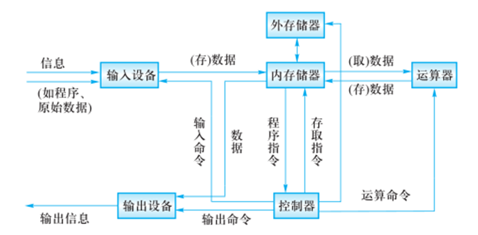
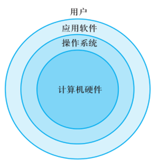
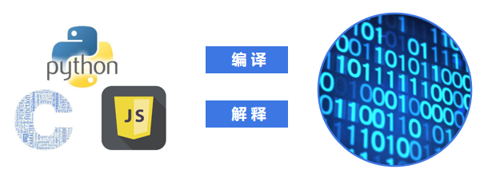
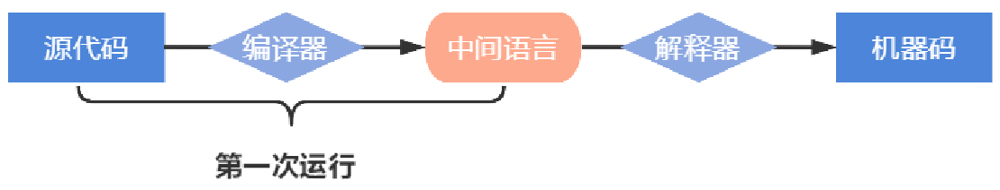
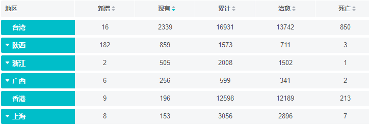

# 1. **前言**

## 1.1 获取资源

浏览器输入：code.tarena.com.cn

账号：tarenacode

密码：code_2013

地址：AIDCode/aid2204/01_month01/to_student_for_month01.zip


# 2. Python 简介

## 2.1 计算机基础结构

### 2.1.1 硬件

1944年，美籍匈牙利数学家冯·诺依曼提出计算机基本结构。


五大组成部分：运算器、控制器、存储器、输入设备、输出设备。

-- 运算器：按照程序中的指令，对数据进行加工处理。

-- 控制器：根据程序需求，指挥计算机的各个部件协调工作。

通常将运算器和控制器集成在中央处理器（CPU）中。


-- 存储器：保存各类程序的数据信息。

​      内存RAM -- 容量小，速度快，临时存储数据

​      硬盘HDD -- 容量大，速度慢，永久存储数据


输入设备：外界向计算机传送信息的装置。

​        例如：鼠标、键盘、扫描仪…

输出设备：计算机向外界传送信息的装置。  

​        例如：显示器、音响、打印机…



### 2.1.2 软件



操作系统：

​        -- 管理和控制计算机软件与硬件资源的程序。

​        -- 隔离不同硬件的差异，使软件开发简单化。

​        -- Windows，Linux，Unix。

应用软件：为了某种特定的用途而被开发的软件。

软件：程序 + 文档。

​        -- 程序是一组计算机能识别和执行的指令集合。

​        -- 文档是为了便于了解程序所需的说明性资料。

## 2.2 基础知识

### 2.2.1 Python 定义

是一个免费、开源、跨平台、动态、面向对象的编程语言。


### 2.2.2 Python程序的执行方式

#### 2.2.2.1 交互式

在命令行输入指令，回车即可得到结果。

(1) 打开终端

(2) 进入交互式：python3

(3) 编写代码：print("hello world") 

(4) 离开交互式：exit()

#### 2.2.2.2 文件式

将指令编写到.py文件，可以重复运行程序。

(1)  编写文件

(2)  打开终端

(3)   进入程序所在目录：cd 目录

(4)  执行程序： python3 文件名

### 2.2.3 Linux常用命令

(1)  pwd：查看当前工作目录的路径 

(2)  cd：改变工作目录（进入到某个目录）

练习：

(1) 在指定目录创建python文件.

--目录：/home/tarena/month01

--文件名：exercise01.py

(2) 在文件中写入：print("你好，世界!")

(3) 运行python程序

### 2.2.4 执行过程

计算机只能识别机器码(1010)，不能识别源代码(python)。



(1) 由源代码转变成机器码的过程分成两类：编译和解释。

(2) 编译：在程序运行之前，通过编译器将源代码变成机器码，例如：C语言。

-- 优点：运行速度快

-- 缺点：开发效率低，不能跨平台。

(3) 解释：在程序运行之时，通过解释器对程序逐行翻译，然后执行，例如Javascript。

-- 优点：开发效率高，可以跨平台；

-- 缺点：运行速度慢。

(4) python是解释型语言，但为了提高运行速度，使用了一种编译的方法。编译之后得到pyc文件，存储了字节码（特定于Python的表现形式，不是机器码）。




### 2.2.5 解释器类型

(1) CPython（C语言开发)

(2)  Jython (java开发)

(3) IronPython (.net开发)

# 3. 数据基本运算

## 3.1 基础知识

### 3.1.1 pycharm常用快捷键

```python
"""
    创建文件:exercise03
    汇率转换器
"""

# 1. 获取数据 - 美元
usd = input("请输入美元:")
# 2. 逻辑处理 - 美元 * 6.99
cny = int(usd) * 6.99
# 3. 显示结果 - xx美元是xx人民币
print(usd + "美元是" + str(cny) + "人民币")
```

(1) 移动到本行开头：home键

(2) 移动到本行末尾：end键盘

(3) 注释代码：ctrl + /

(4) 复制行：ctrl +d

(5) 删除行：shift + delete

(6) 选择列：shift + alt +鼠标左键

(7) 移动行：ctrl  + shift + 上下箭头

(8) 代码格式化：ctrl+alt+l

### 3.1.2 注释

给人看的，通常是对代码的描述信息。

(1) 单行注释：以#号开头。

(2) 多行注释：三引号开头，三引号结尾。

### 3.1.3 函数

表示一个功能，函数定义者是提供功能的人，函数调用者是使用功能的人。

(1)  print(数据) 作用：将括号中的内容显示在控制台中

```python
print("你好")
print("世界")
```

(2)  变量 = input(“需要显示的内容”) 作用：将用户输入的内容赋值给变量

```python
name = input("请输入姓名:")
age = input("请输入年龄:")
print(name + "的年龄是:" + age + ".")
```

练习1: 在终端中显示古诗“登高”

效果：

​                           登高

​                     作者：杜甫

风急天高猿啸哀，渚清沙白鸟飞回。

无边落木萧萧下，不尽长江滚滚来。

万里悲秋常作客，百年多病独登台。

艰难苦恨繁霜鬓，潦倒新停浊酒杯。

 

练习2：判断英文句子成分：I kiss you

效果：

请输入I kiss you的主语:I

请输入I kiss you的谓语:kiss

请输入I kiss you的宾语:you

您输入的主语是:I,谓语是:kiss,宾语是:you

## 3.2 数据

### 3.2.1 变量


(1)  定义：关联一个对象的标识符。

(2)  命名：必须是字母或下划线开头，后跟字母、数字、下划线。

​                  不能使用关键字(蓝色)，否则发生语法错误SyntaxError。

(3)  建议命名：字母小写，多个单词以下划线隔开。

```python
                   class_name = "xxx"
```

(4)  赋值：创建一个变量或改变一个变量关联的数据。

(5)  语法：

​	    变量名 = 数据

​        变量名1 = 变量名2 = 数据

​        变量名1, 变量名2 = 数据1, 数据2

```python
# 创建变量
name01 = "孙悟空"
name02 = "唐僧"
name03 = name01 + name02
# 修改变量
name01 = "悟空"
print(name03)
# 变量赋值变量
name04 = name01
print(name04)
```

### 3.2.2 删除语句

(1) 语法: 

```python
name01 = "悟空"
name02 = name01
del name01, name02
```

(2) 作用：

用于删除变量，同时解除与对象的关联。

如果可能则释放对象。

(3) 自动化内存管理的引用计数：

每个对象记录被变量绑定(引用)的数量，当为0时被销毁。

```python
name01 = "祁大圣"
name02 = name01
del name01, name02
 
list01 = []
list02 = []
list01.append(list02)
list02.append(list01)
del list01, list02
```


### 3.2.3 核心类型

在python中变量没有类型，但关联的对象有类型。

#### 3.2.3.1 整形int

(1) 表示整数，包含正数、负数、0。

​	如： -5, 100, 0

(2) 字面值：

​	十进制：每位用十种状态计数，逢十进一，写法是0~9。

```python
num01 = 10
```

​	二进制：每位用二种状态计数，逢二进一，写法是0b开头，后跟0或者1。

num02 = 0b10

​	八进制：每位用八种状态计数，逢八进一，写法是0o开头，后跟0~7。

```python
num03 = 0o10
```

​	十六进制：每位用十六种状态计数，逢十六进一，写法是0x开头，后跟0~9,A~F,a~f

```python
num04 = 0x10
```

#### 3.2.3.2 浮点型float 

(1) 表示小数，包含正数、负数，0.0。

(2) 字面值：

​	小数：1.0  2.5

​	科学计数法：

​		e/E (正负号) 指数 

​        1.23e-2 (等同于0.0123)

​        1.23456e5(等同于123456.0)

```python
# 小数
num01 = 1.23

# 科学计数法
num02 = 1e-5
print(0.00001)
```

#### 3.2.3.3 字符串str

​    (1) 用来记录文本信息(文字信息)。

​    (2) 字面值：双引号

#### 3.2.3.4 布尔bool

​	(1) 用来表示真和假的类型

​	(2) 只有两个值：

​			True 表示真(条件满足或成立)，本质是1

​			False 表示假(条件不满足或不成立)，本质是0

```python
result = input("请输入您的职业:") == "老师"
print(result) # 输入老师,结果True;输入其他,结果False
```

## 3.3 运算

### 3.3.1 类型转换

(1) 转换为整形: int(数据)

(2)  转换为浮点型:float(数据)

(3)  转换为字符串:str(数据)

(4)  转换为布尔:bool(数据)

​         结果为False：bool(0) bool(0.0) bool(None) 

(5)  混合类型自动升级：

 1 + 2.14 返回的结果是 3.14

 1 + 3.0  返回结果是: 4.0

```python
# str -> int
data01 = int("3")
# int -> str
data02 = str(5)

# str -> float
data03 = float("1.2")
# float -> str
data04 = str(1.2)

# int -> float
data05 = float(250)
# float -> int
data06 = int(1.9)
print(data06)  # 1 向下取整(截断删除)

# 注意：字符串转换为其他类型时,
# 必须是目标类型的字符串表达形式
# print(int("10.5"))　# 报错
# print(float("abc"))# 报错
```

练习：在终端中输入商品单价、购买的数量和支付金额。计算应该找回多少钱。

效果：

请输入商品单价：5

请输入购买数量：3

请输入支付金额：20

应找回：5.0

### 3.3.2 运算符

#### 3.3.2.1 算术运算符

\+   加法

\-   减法

\*   乘法

/   除法：结果为浮点数

//  整除：除的结果去掉小数部分

%  求余

**  幂运算

优先级从高到低：

 ()

**

\* / % //

\+ -


练习1：在终端中输入一个疫情确诊人数再录入一个治愈人数，打印治愈比例

格式：治愈比例为xx%

效果：

请输入确诊人数：500

请输入治愈人数：495

治愈比例为99.0%

 

练习2：古代的秤，一斤十六两。在终端中获取两，计算几斤零几两。

效果：

请输入总两数：100

结果为：6斤4两


练习3：

匀变速直线运动的速度与位移公式：

位移 = 初速度 × 时间 + 加速度 * 时间的平方 / 2

已知(在终端中录入)：位移、时间、初速度

计算：加速度

效果：

请输入距离：100

请输入初速度：6

请输入时间：10

加速度是：0.8

#### 3.3.2.2 增强运算符

y += x     相当于 y = y + x

y -= x      相当于 y = y - x

y *= x      相当于 y = y * x

y /= x      相当于 y = y / x

y //= x     相当于 y = y // x

y %= x     相当于 y = y % x

y \**= x     相当于 y = y ** x

```python
data01 = 10
# data01 + 5
# print(data01) # 10
data01 += 5   # data01 = data01 + 5
print(data01)  # 15
```

练习：在终端中输入一个四位整数，计算每位相加和。

例如：录入1234，打印1+2+3+4结果

效果：

请输入四位整数：1234

结果是：10

#### 3.3.2.3 比较运算符

 <     小于

 <=    小于等于

 \>     大于

 \>=    大于等于

 ==    等于

 !=     不等于

返回布尔类型的值

比较运算的数学表示方式:0 <= x <= 100

练习1：写出下列代码表达的命题含义

```python
    print(666 == "666")
    print(27 % 10 == 2)
    print(float(input("请输入你的身高：")) > 170)
```

练习2： 根据命题写出代码

输入的是正数

输入的是月份

输入的不是偶数

#### 3.3.2.4 逻辑运算符

(1) 与and

表示并且的关系，一假俱假。     

示例:

True and True   # True

True and False  # False

False and True  # False

False and False  # False

```python
int(input("请输存款:")) >= 100000 and input("请输房产:") == "有"
```

(2) 或or

表示或者的关系，一真俱真   

示例:

True or True    # True

True or False    # True

False or True    # True

False or False   # False 

```python
int(input("请输存款:")) > 100000 and input("请输房产:") == "有"
```

(3) 非 not 

表示取反

例如：

not True  # 返回False

not False # 返回True

练习:根据命题写出代码

年龄大于25 并且 身高小于170

职位是高管 或者 年薪大于500000

(4) 短路运算

一但结果确定，后面的语句将不再执行。

#### 3.3.2.5 身份运算符

(1) 语法:

x is y

x is not y

(2) 作用：

is 用于判断两个对象是否是同一个对象,是时返回True,否则返回False。

is not 的作用与is相反

#### 3.3.2.6 优先级

高到低：

​	算数运算符

​	比较运算符

​	增强运算符

​	身份运算符

​	逻辑运算符

# 4. 语句

## 4.1 行

(1) 物理行：程序员编写代码的行。

(2) 逻辑行：python解释器需要执行的指令。

(3) 建议：

​	一个逻辑行在一个物理行上。

​	如果一个物理行中使用多个逻辑行，需要使用分号；隔开。

(4) 换行： 

​	如果逻辑行过长，可以使用隐式换行或显式换行。

​	隐式换行：所有括号的内容换行,称为隐式换行

​    					括号包括: () []  {} 三种

​	显式换行：通过折行符 \ (反斜杠)换行，必须放在一行的末尾，目的是告诉解释器,下一行也是本行的语句。 

```python
# 4个物理行 4个逻辑行
a = 1
b = 2
c = a + b
print(c)

# 1个物理行 4个逻辑行(不建议)
a = 1;b = 2;c = a + b;print(c)

# 4个物理行 1个逻辑行
# -- 换行符
d = 1+\
    2+\
    3+4\
    +5+6

# -- 括号
e = (1+2+
     3+4
     +5+
     6)
```

## 4.2 选择语句

### 4.2.1 if else 语句

(1)  作用:

让程序根据条件有选择性的执行语句。

(2) 语法:

```python
  if 条件1:
     语句块1
  elif 条件2:
     语句块2
  else:
     语句块3
```

(3) 说明:

elif 子句可以有0个或多个。

else 子句可以有0个或1个，且只能放在if语句的最后。

(4) 演示：

```python
sex = input("请输入性别:")
if number == "男":
    print("您好，先生")
elif number == "女":
    print("您好，女士")
else:
    print("性别未知")
```

练习1:

在终端中输入整数

打印整数、 负数、零


练习2：

在终端中输入课程阶段数,显示课程名称

效果：

输入：        输出：

​    1          					Python语言核心编程

​    2          					Python高级软件技术

​    3          					Web 全栈

​    4           				   项目实战

​    5           				   数据分析、人工智能


练习3：

在终端中录入4个同学身高,打印最高的值.

算法：

170  160  180  165

假设第一个就是最大值

使用假设的和第二个进行比较, 发现更大的就替换假设的

使用假设的和第三个进行比较, 发现更大的就替换假设的

使用假设的和第四个进行比较, 发现更大的就替换假设的

最后，假设的就是最大的.

效果：

请输入第1个同学身高:170

请输入第2个同学身高:160

请输入第3个同学身高:180

请输入第4个同学身高:165

最高的同学:180


练习4：

根据心理年龄与实际年龄，打印智商等级。

智商IQ = 心理年龄MA 除以 实际年龄CA 乘以 100

天才：140以上（包含）

超常：120-139之间（包含）

聪慧：110-119之间（包含）

正常：90-109之间（包含）

迟钝：80-89之间（包含）

低能：80以下


练习5：

在终端中输入月份，打印相应的天数.

1 3 5 7 8 10 12 有 31天

2 有 29天

4 6 9 11 有 30天

超过月份提示月份有误

效果：

请输入月份:10

31天

## 4.3 循环语句

### 4.3.1 while语句

(1) 作用: 

可以让一段代码满足条件，重复执行。

(2) 语法:

```python
while 条件:
    # 满足条件执行的语句 
```

(3) 说明:

  条件满足执行循环体，然后再根据条件决定是否再执行循环体；

```python
count = 0  # 1. 开始 
while count < 3:  # 2. 结束
    print(count)  # 0  1  2
    count += 1  # 3. 间隔
```

练习1：

让下列代码重复执行，输入y继续(不输入y则退出)

```python
number = int(input("请输入数字："))
if number > 0:
    print("正数")
elif number < 0:
    print("负数")
else:
    print("零")
```

练习2：

在终端中显示0 1 2 3

在终端中显示2 3 4 5 6

在终端中显示1 3 5 7

在终端中显示8 7 6 5 4

在终端中显示-1 -2 -3 -4 -5

练习3：

在终端中循环录入5个成绩,

最后打印平均成绩(总成绩除以人数)

效果：

请输入成绩：98

请输入成绩：83

请输入成绩：90

请输入成绩：99

请输入成绩：78

平均分：89.6

练习4：

一张纸的厚度是0.01毫米

请计算，对折多少次超过珠穆朗玛峰(8844.43米)

思路:

数据：厚度、高度、次数

算法：厚度*=2      次数+=1

练习5：

程序产生1个,1到100之间的随机数。

让玩家重复猜测,直到猜对为止。

每次提示：大了、小了、恭喜猜对了,总共猜了多少次。

效果：

请输入要猜的数字:50

大了

请输入要猜的数字:25

小了

请输入要猜的数字:35

大了

请输入要猜的数字:30

小了

请输入要猜的数字:32

恭喜猜对啦,总共猜了5次

### 4.3.2 for 语句

(1) 作用:

用来遍历可迭代对象的数据元素。

可迭代对象是指能依次获取数据元素的对象，例如：容器类型。

(2)  语法:

```python
for 变量列表 in 可迭代对象:
    # 语句块1
```

(3) 说明:

  else子句可以省略。

  在循环体内用break终止循环时,else子句不执行。

```python
message = "我是齐天大圣孙悟空"
for item in message:
    print(item)  
```

练习:

在终端中输入任意整数，计算累加和.

"1234" -> "1" -> 累加 1

效果：

请输入一个整数:12345

累加和是 15

#### 4.3.2.1 range 函数

(1) 作用:

​      用来创建一个生成一系列整数的可迭代对象(也叫整数序列生成器)。

(2) 语法:

​       range(开始点，结束点，间隔)

(3) 说明:

函数返回的可迭代对象可以用for取出其中的元素

返回的数字不包含结束点

开始点默认为0

间隔默认值为1 

```python
# 写法1:range(开始,结束,间隔)
# 注意:不包含结束值
for item in range(1, 3, 1):
    print(item)

# 写法2:range(开始,结束)
# 注意:间隔默认为1
for item in range(1, 3):
    print(item)

# 写法3:range(结束)
# 注意:开始默认为0
for item in range(3):
    print(item)
```

练习：

在终端中累加 0 1 2 3

在终端中累加 2 3 4 5 6

在终端中累加 1 3 5 7

在终端中累加 8 7 6 5 4

在终端中累加 -1 -2 -3 -4 -5

## 4.4 跳转语句

### 4.4.1 break 语句

(1) 跳出循环体，后面的代码不再执行。

(2) 可以让while语句的else部分不执行。

### 4.4.2 continue 语句

(1)  跳过本次，继续下次循环。

```python
# 需求：累加1-100之间能被3整除的数字
# 思想：不满足条件跳过,否则累加.
sum_value = 0
for item in range(1, 101):
    if item % 3 != 0:
        continue
    sum_value += item
print(sum_value)
```

练习：累加10 -- 60之间，个位不是3/5/8的整数和。 

# 5. 容器类型

## 5.1 通用操作

### 5.1.1 数学运算符

(1) +：用于拼接两个容器

(2) +=：用原容器与右侧容器拼接,并重新绑定变量

(3) *：重复生成容器元素

(4) *=：用原容器生成重复元素, 并重新绑定变量

(5) < <= > >= == !=：依次比较两个容器中元素,一但不同则返回比较结果。

```python
# 1. 拼接2个容器元素
name = "悟空"
name += "八戒"
print(name)  # 悟空八戒

# 2. 容器元素重复
name = "唐僧"
name *= 2
print(name)  # 唐僧唐僧

# 3. 比较运算：依次比较两个容器中元素,一但不同则返回比较结果。
print("悟空" > "唐僧")
```

练习：

在终端中获取一个整数，作为边长，打印矩形。

效果：

请输入整数:5

$$$$$

$      $

$      $

$      $

$$$$$

*****

请输入整数:8

$$$$$$$$

$             $

$             $

$             $

$             $

$             $

$             $

$$$$$$$$

### 5.1.2 成员运算符

(1) 语法：

数据 in 序列

数据 not in 序列

(2) 作用：

如果在指定的序列中找到值，返回bool类型。

```python
# 4. 成员运算
# True
print("悟空" in "我是齐天大圣孙悟空")
print("圣孙" in "我是齐天大圣孙悟空")

# False
print("齐圣" in "我是齐天大圣孙悟空")
print("圣大" in "我是齐天大圣孙悟空") 
```

### 5.1.3 索引index

(1) 作用：定位单个容器元素。

(2) 语法：容器[整数]

(3) 说明：

正向索引从0开始，第二个索引为1，最后一个为len(s)-1。

反向索引从-1开始,-1代表最后一个,-2代表倒数第二个,以此类推,第一个是-len(s)。

```python
message = "我是花果山齐天大圣"
print(message[2])  # 花
print(message[-2])  # 大
print(len(message)) # 9
# 注意：索引不能越界IndexError
# print(message[99])
# print(message[-99]) 
```

### 5.1.4 切片slice

(1) 作用：

定位多个容器元素。

(2) 语法：

容器[开始索引:结束索引:步长]

(3) 说明：

结束索引不包含该位置元素

步长是切片每次获取完当前元素后移动的偏移量

开始、结束和步长都可以省略

```python
message = "我是花果山齐天大圣"
print(message[2:5:1])  # 花果山
print(message[1: 5])   # 是花果山
print(message[2:-4])   # 花果山
print(message[:-4])    # 我是花果山
print(message[:])      # 我是花果山齐天大圣
print(message[-3:])    # 天大圣 
print(message[:2])     # 我是
print(message[-2:])    # 大圣
print(message[-2: 3:-1])  # 大天齐山
print(message[1: 1])  # 空
print(message[2: 5:-1])  # 空
# 特殊:翻转
print(message[::-1])  # 圣大天齐山果花是我
```

练习：

  字符串： content = "我是京师监狱狱长金海。"

  打印第一个字符、打印最后一个字符、打印中间字符

  打印字前三个符、打印后三个字符

  命题：金海在字符串content中

  命题：京师监狱不在字符串content中

  通过切片打印“京师监狱狱长”

  通过切片打印“长狱狱监师京”

  通过切片打印“我师狱海”

  倒序打印字符

### 5.1.5 内建函数

(1) len(x)   返回序列的长度

(2) max(x)  返回序列的最大值元素

(3) min(x)  返回序列的最小值元素

(4) sum(x)  返回序列中所有元素的和(元素必须是数值类型)

## 5.2 字符串 str

### 5.2.1 定义

由一系列字符组成的不可变序列容器，存储的是字符的编码值。

### 5.2.2 编码

#### 5.2.2.1 基础知识

(1) 字节byte：计算机最小存储单位，等于8 位bit.

(2) 字符：单个的数字，文字与符号。

(3) 字符集(码表)：存储字符与二进制序列的对应关系。

(4) 编码：将字符转换为对应的二进制序列的过程。

(5)  解码：将二进制序列转换为对应的字符的过程。

#### 5.2.2.2 编码方式

(1) ASCII编码：包含英文、数字等字符，每个字符1个字节。

(2) GBK编码：兼容ASCII编码，包含21003个中文；英文1个字节，汉字2个字节。

(3) Unicode字符集：国际统一编码，旧字符集每个字符2字节，新字符集4字节。

(4) UTF-8编码：Unicode的存储与传输方式，英文1字节，中文3字节。

### 5.2.3 字面值

#### 5.2.3.1 单引和双引号的区别

(1) 单引号内的双引号不算结束符

(2) 双引号内的单引号不算结束符

#### 5.2.3.2 三引号作用

(1) 换行会自动转换为换行符\n

(2)三引号内可以包含单引号和双引号

(3) 作为文档字符串

#### 5.2.3.3 转义字符

(1) 定义：改变字符的原始含义。

(2) 语法：

```python
 \'   \"   \n   \\   \t 
```

(3) 原始字符串：取消转义。

```python
       a = r"C:\newfile\test.py"
```

#### 5.2.3.4 字符串格式化

(1) 定义：生成一定格式的字符串。

(2) 语法：字符串%(变量)

```python
"我的名字是%s,年龄是%s" % (name)
```

(3)  类型码：

%s 字符串   %d整数   %f 浮点数

```python
print("%.2d:%.2d"%(2,3)) # 02:03
print("治愈比例为%d%%" % 5) # 治愈比例为5%
print("价格%.2f元" % (5 / 3)) # 价格1.67元
```

练习：根据下列文字，提取变量，使用字符串格式化打印信息

湖北确诊67802人,治愈63326人,治愈率0.99

70秒是01分零10秒

## 5.3 列表 list

### 5.3.1 定义

由一系列变量组成的可变序列容器。

### 5.3.2 基础操作

(1) 创建列表： 

列表名 = []  

列表名 = list(可迭代对象)

(2)  添加元素：

列表名.append(元素) 

列表.insert(索引，元素)

(3)  定位元素：

列表名[索引] = 元素

变量 = 列表名[索引]

变量 = 列表名[切片] # 赋值给变量的是切片所创建的新列表 

列表名[切片] = 容器 # 右侧必须是可迭代对象，左侧切片没有创建新列表。

(4) 遍历：

正向：

​    for 变量名 in 列表名:

​       变量名就是元素

反向：

​    for 索引名 in range(len(列表名)-1,-1,-1):

​       列表名[索引名]就是元素

(5)  删除元素：

列表名.remove(元素) 

del 列表名[索引或切片]

```python
# 1. 创建
# 写法1:列表名 = [数据1,数据2]
# 姓名列表
list_names = ["悟空", "唐三藏", "八戒", "沙僧"]
# 年龄列表
list_ages = [26, 23, 25, 16]

# 写法2:列表名 = list(可迭代对象)
list_name = list("孙悟空")
print(list_name)  # ['孙', '悟', '空']

# 2. 添加
# -- 追加:列表名.append(数据)
list_names.append("小白龙")
# -- 插入: 列表名.insert(索引,数据)
list_names.insert(2, "哪吒")
print(list_names) # ['悟空', '唐三藏', '哪吒', '八戒', '沙僧', '小白龙']

# 3. 定位
# -- 索引：容器名[整数]
# -- 读取
element = list_names[-1]
print(element) # 小白龙
# -- 修改
list_names[-1] = "二郎神"
print(list_names) # ['悟空', '唐三藏', '哪吒', '八戒', '沙僧', '二郎神']
# -- 切片:容器名[整数:整数:整数]
# -- 通过切片读取，创建新列表(拷贝)
names = list_names[:3]
print(names) # ['悟空', '唐三藏', '哪吒']
# -- 通过切片修改，遍历右侧数据,依次存入左侧.
list_names[:3] = ["空空", "唐唐", "猪猪"]
# list_names[:3] = 100 # 因为100不能被for
list_names[:3] = "孙悟空"
print(list_names) # ['孙', '悟', '空', '八戒', '沙僧', '二郎神']

# 4. 遍历:操作容器每个元素
# -- 方式1： for 元素 in 容器
# 适用性：从头到尾依次读取
for name in list_names:
    print(name)

# -- 方式2：for 索引 in range(开始,结束,间隔):
# 适用性：非从头到尾依次读取
# len(list_names) - 1 是 最大索引(总数-1)
# -1 索引可以去到0
# -1 倒序
# 功能：倒序
for i in range(len(list_names) - 1, -1, -1):
    print(list_names[i])

# 功能：修改
for i in range(len(list_names)):
    # 文字长度是3的修改为None
    if len(list_names[i]) == 3:
        list_names[i] = None
print(list_names) # ['孙', '悟', '空', '八戒', '沙僧', None]

# 5. 删除
# -- 方式1：根据元素删除  列表名.remove(元素)
list_names.remove("八戒")

# -- 方式2：根据定位删除 del 容器名[索引或者切片]
del list_names[0]
del list_names[-2:]
print(list_names) # ['悟', '空']
```

练习1：

创建地区列表、新增列表、现有列表，累计列表分别存储3行(台湾、山西、浙江)信息



练习2：

向以上四个列表追加数据第4行(广西)信息

在第1个位置插入第5行(香港)信息

练习3： 

打印台湾疫情信息(xx地区新增xx人现有xx人)

将地区列表后2个元素修改为 ["ZJ","GX"]

打印新增列表元素(一行一个)

倒序打印现有列表元素(一行一个)

练习4：

在地区列表中删除“浙江”

在新增列表中删除第1个元素

在现有列表中删除前2个元素

在累计列表中删除全部元素

练习5：

八大行星："水星" "金星" "地球" "火星" "木星" "土星" "天王星" "海王星"

  -- 创建列表存储4个行星：“水星” "金星" "火星" "木星"

  -- 插入"地球"、追加"土星" "天王星" "海王星"

  -- 打印距离太阳最近、最远的行星(第一个和最后一个元素)

  -- 打印太阳到地球之间的行星(前两个行星)

  -- 删除"海王星",删除第四个行星

  -- 倒序打印所有行星(一行一个)

### 5.3.3 深拷贝和浅拷贝

浅拷贝：复制过程中,只复制一层变量,不会复制深层变量绑定的对象的复制过程。

深拷贝：复制整个依懒的变量。

练习1：画出下列代码内存图

```python
list01 = ["北京", "上海"]
list02 = list01
list01[0] = "广东"
list03 = list01[:]
list03[-1] = "深圳"
print(list01)#?
```

 练习2：画出下列内存图

```python
list01 = ["北京", "上海", "深圳"]
list02 = list01 
list01.insert(0,"天津")
del list01[1]
print(list02)# ?
```

 练习3：画出下列内存图

```python
import copy
list01 = ["北京",["上海","深圳"]]
list02 = list01
list03 = list01[:]
list04 = copy.deepcopy(list01)
list04[0] = "北京04"
list04[1][1] = "深圳04"
print(list01) # ?

list03[0] = "北京03" 
list03[1][1] = "深圳03"
print(list01) # ?
list02[0] = "北京02" 
list02[1][1] = "深圳02"
print(list01) # ?
```

### 5.3.4 列表与字符串转换

(1) 列表转换为字符串： 

​    result = "连接符".join(列表)

```python
list01 = ["a", "b", "c"]
result = "-".join(list01)
print(result)
```

练习：

在终端中,循环录入字符串,如果录入空则停止.

停止录入后打印所有内容(一个字符串)

效果：

请输入内容：香港

请输入内容：上海

请输入内容：新疆

请输入内容：

香港\_上海\_新疆

(2) 字符串转换为列表：

列表 = “a-b-c-d”.split(“分隔符”)

```python
# 使用一个字符串存储多个信息
list_result = "唐僧,孙悟空,八戒".split(",")
print(list_result)
```

练习：将下列英文语句按照单词进行翻转.

转换前：To have a government that is of people by people for people

转换后：people for people by people of is that government a have To

### 5.3.5 列表推导式

(1) 定义：

使用简易方法，将可迭代对象转换为列表。

(2) 语法：

变量 = [表达式 for 变量 in 可迭代对象]

变量 = [表达式 for 变量 in 可迭代对象 if 条件]

(3) 说明:

如果if真值表达式的布尔值为False,则可迭代对象生成的数据将被丢弃。

```python
list01 = [9, 15, 65, 6, 78, 89]
# 需求:在list01中挑出能被3整除的数字存入list02
# list02 = []
# for item in list01:
#     if item % 3 == 0:
#         list02.append(item)
list02 = [item for item in list01 if item % 3 == 0]
print(list02)

# 需求:在list01中所有数字的个位存储list03
# list03 = []
# for item in list01:
#     list03.append(item % 10)
list03 = [item % 10 for item in list01]
print(list03)
```

练习： 

生成10--30之间能被3或者5整除的数字

结果：[10, 12, 15, 18, 20, 21, 24, 25, 27]

生成5 -- 20之间的数字平方

结果：[25, 36, 49, 64, 81, 100, 121, 144, 169, 196, 225, 256, 289, 324, 361]

```python
#result = []
#for r in ["a", "b", "c"]:
#  for c in ["A", "B", "C"]:
#    result.append(r + c)
result = [r + c for r in list01 for c in list02]
```

## 5.4 元组 tuple

### 5.4.1 定义

(1) 由一系列变量组成的不可变序列容器。

(2) 不可变是指一但创建，不可以再添加/删除/修改元素。  

### 5.4.2 基础操作

(1) 创建空元组：

元组名 = ()

元组名 = tuple()

(2) 创建非空元组：

元组名 = (20,)

元组名 = (1, 2, 3)

元组名 = 100,200,300

元组名 = tuple(可迭代对象)

(3) 获取元素： 

变量 = 元组名[索引]

变量 = 元组名[切片] # 赋值给变量的是切片所创建的新列表 

(4) 遍历元组：

正向：

​    for 变量名 in 列表名:

​       变量名就是元素

反向：

​    for 索引名 in range(len(列表名)-1,-1,-1):

​       元组名[索引名]就是元素

```python
# 1. 创建
# -- 元组名 = (元素1, 元素2, 元素3)
tuple01 = (10, 20, 30)
# -- 元组名 = tuple( 可迭代对象 )
list01 = ["a", "b", "c"]
tuple02 = tuple(list01)

# 2. 定位
# -- 读取(索引／切片)
print(tuple01[0]) # 10
print(tuple01[:2]) # (10, 20)

# 3. 遍历
for item in tuple01:
    print(item)

for i in range(len(tuple01) - 1, -1, -1):
    print(tuple01[i])

# 4. 特殊
# 注意1：小括号可以省略
tuple03 = 10, 20, 30
# 注意2：如果元组中只有一个元素,必须有逗号
tuple04 = (10,)
# 拆包:　多个变量　= 容器
# a,b,c = tuple03
# a,b,c = ["A","B","C"]
a,b,c = "孙悟空"
*a,b = "孙悟空"
print(a) # ['孙', '悟']
print(b) # 空
```

练习1：画出下列代码内存图

```python
name = "张无忌"
names = ["赵敏", "周芷若"]
tuple01 = ("张翠山", name, names)
name = "无忌哥哥"
tuple01[2][0] = "敏儿"
print(tuple01) # ?
```

练习2：

根据月日,计算是这一年的第几天.

公式：前几个月总天数 + 当月天数

例如：5月10日

计算：31 29 31 30 + 10

### 5.4.3 作用

(1) 元组与列表都可以存储一系列变量，由于列表会预留内存空间，所以可以增加元素。

(2) 元组会按需分配内存，所以如果变量数量固定，建议使用元组，因为占用空间更小。

(3) 应用：

变量交换的本质就是创建元组：x, y = （y, x ）

格式化字符串的本质就是创建元祖："姓名:%s, 年龄:%d" % ("tarena", 15)

## 5.5 字典 dict

### 5.5.1 定义

 (1) 由一系列键值对组成的可变散列容器。

 (2) 散列：对键进行哈希运算，确定在内存中的存储位置，每条数据存储无先后顺序。

 (3) 键必须惟一且不可变(字符串/数字/元组)，值没有限制。

### 5.5.2 基础操作

(1) 创建字典：

字典名 = {键1：值1，键2：值2}

字典名 = dict (可迭代对象) 

(2) 添加/修改元素：

语法:

字典名[键] = 数据

说明:

键不存在，创建记录。

键存在，修改值。

(3) 获取元素：

变量 = 字典名[键]  # 没有键则错误

(4) 遍历字典：

for 键名 in 字典名:

​       字典名[键名]

for 键名,值名 in 字典名.items():

​       语句

(5)  删除元素：

del 字典名[键]

```python
# 1. 创建
# -- { 键1:值1, 键2:值2 }
dict_wk = {"name": "悟空", "age": 25, "sex": "女"}
dict_bj = {"name": "八戒", "age": 26, "sex": "男"}
dict_xbl = {"name": "小白龙", "age": 23, "sex": "女"}
# -- dict(  [(  ,  ),( , )]  )
# 列表转换为字典的格式要求：列表元素必须能够"一分为二"
list01 = ["八戒", ("ts", "唐僧"), [1001, "齐天大圣"]]
dict01 = dict(list01)

# 2. 添加 字典名[键] = 值
dict_wk["money"] = 100000
print(dict_wk) # {'name': '悟空', 'age': 25, 'sex': '女', 'money': 100000}

# 字典不能使用 索引 切片
# 3. 定位：字典名[键]
# -- 读取
print(dict_wk["name"])
# 注意：如果没有键则报错
# 解决：读取数据前,通过in判断.
if "money" in dict_wk:
    print(dict_wk["money"])

# -- 修改(与添加数据语法相同)
# 具有key为修改,没有key为添加
dict_wk["name"] = "空空"
print(dict_wk) # {'name': '空空', 'age': 25, 'sex': '女', 'money': 100000}

# 4. 删除 del 字典名[键]
del dict_wk["sex"]
print(dict_wk) # {'name': '空空', 'age': 25, 'money': 100000}

# 5. 遍历
# 方式1：for 键 in 字典名称
for key in dict_wk:
    print(key)

# 方式2：for 值 in 字典名称.values()
for value in dict_wk.values():
    print(value)

# 方式3：for 键,值 in 字典名称.items()
for key,value in dict_wk.items():
    print(key)
    print(value)

# 数据类型名称(   ... )
#　[('name', '李佳豪'), ('age', 25), ('sex', '女')]
print(list(dict_wk.items())) # [('name', '空空'), ('age', 25), ('money', 100000)]
```

练习1：

创建字典存储台湾、陕西、浙江、广西前4列(地区、新增、现有、累计)信息


练习2：

在终端中打印台湾的现有人数

在终端中打印陕西的新增和现有人数

浙江新增和现有人数各增加1

广西现有和累计人数各减少2

练习3：

删除台湾现有信息

删除陕西新增和现有信息

删除浙江现有和累计信息

删除广西新增人数保留键(通过键修改值)

练习4：

在终端中打印台湾所有键(一行一个)

在终端中打印陕西所有值(一行一个)

在终端中打印浙江所有键和值(一行一个)

在广西字典中查找值是256对应的键名称

### 5.5.3 字典推导式

(1) 定义：

使用简易方法，将可迭代对象转换为字典。

(2) 语法:

{键:值 for 变量 in 可迭代对象}

{键:值 for 变量 in 可迭代对象 if 条件}

练习1：

将两个列表，合并为一个字典

姓名列表["张无忌","赵敏","周芷若"]

房间列表[101,102,103]

{101: '张无忌', 102: '赵敏', 103: '周芷若'}

练习2：

颠倒练习1字典键值

{'张无忌': 101, '赵敏': 102, '周芷若': 103}


## 5.6 容器综合训练

练习1：在终端中打印如下图形 

$

$$

$$$

$$$$ 

练习2：二维列表

```python
list01 = [
      [1, 2, 3, 4, 5],
  	  [6, 7, 8, 9, 10],
 	  [11, 12, 13, 14, 15],
] 
```

1. 将第一行从左到右逐行打印 

效果：

​	1

​	2

​	3

​	4

​	5

2. 将第二行从右到左逐行打印 

​    效果：

​	10

​	9

​	8

​	7

​	 6

3. 将第三列行从上到下逐个打印 

​    效果：

​	3

​	 8

​	13

4. 将第四列行从下到上逐个打印 

​    效果：

​	14

​	9

​	4

5. 将二维列表以表格状打印

​    效果：

​	1 2 3 4 5

​	 6 7 8 9 10

​	11 12 13 14 15

练习3：多个人的多个爱好

```python
dict_hobbies = {
  "于谦": ["抽烟", "喝酒", "烫头"],
  "郭德纲": ["说", "学", "逗", "唱"],
}
```

1. 打印于谦的所有爱好(一行一个)

    效果：

    抽烟

    喝酒

    烫头

2. 计算郭德纲所有爱好数量

    效果：4

3. 打印所有人(一行一个)

    效果：

    于谦

    ​ 郭德纲

4. 打印所有爱好(一行一个) 

    抽烟

    喝酒

    烫头

    说

    学

    逗

    唱

练习4：

```python
dict_travel_info = {
	"北京": {
    	"景区": ["长城", "故宫"],
    	"美食": ["烤鸭", "豆汁焦圈", "炸酱面"]
  },
  	"四川": {
    	"景区": ["九寨沟", "峨眉山"],
    	"美食": ["火锅", "兔头"]
  }
}
```

1. 打印北京的第一个景区

    效果：

    长城 

2. 打印四川的第二个美食

    效果：

    兔头 

3. 所有城市 (一行一个)

    效果：

    北京

    四川

4. 北京所有美食(一行一个) 

    效果：

    烤鸭

    豆汁焦圈

    炸酱面

5. 打印所有城市的所有美食(一行一个)

    效果：

    烤鸭

    豆汁焦圈

    ​   炸酱面

    ​   火锅

    	 兔头

练习5：

​	对数字列表进行升序排列（小 --> 大）

练习6：

```python
# 疫情信息
list_epidemic = [
    {
        "region": "台湾", "new": 16,
        "now": 2339, "total": 16931,
    },
    {
        "region": "陕西", "new": 182,
        "now": 859, "total": 1573,
    },
    {
        "region": "浙江", "new": 2,
        "now": 505, "total": 2008,
    },
]
```

1. 打印第一条疫情信息,

  ​   格式：xx地区新增xx人,现有xx人,累计xx人

2. 打印所有疫情信息,

    格式：xx地区新增xx人,现有xx人,累计xx人

3. 打印累计人数小于10000的所有疫情信息,

    格式：xx地区新增xx人,现有xx人,累计xx人

4. 查找新增人数大于10的地区名称(将结果存入新列表)

5. 查找现有人数最大的地区信息(结果为字典)

6. 根据现有人数对疫情信息降序(大->小)排列

# 6 函数 function

## 6.1 pycharm快捷键

Ctrl + P        参数信息（在方法中调用参数）

Ctrl + Q        快速查看文档

## 6.2 定义

(1) 用于封装一个特定的功能，表示一个功能或者行为。

(2) 函数是可以重复执行的语句块, 可以重复调用。

## 6.3 作用

提高代码的可重用性和可维护性（代码层次结构更清晰）。

## 6.4 基础语法

#### 6.4.1 定义函数

(1) 语法：

def 函数名(形式参数):

   函数体

(2) 说明：

def 关键字：全称是define，意为”定义”。

函数名：对函数体中语句的描述，规则与变量名相同。

形式参数：函数定义者要求调用者提供的信息。

函数体：完成该功能的语句。

(3) 函数的第一行语句建议使用文档字符串描述函数的功能与参数。

```python
# 形式参数：表面的不具体的数据
def attack(count): 
    """
        攻击
    :param count:次数 
    """
    for __ in range(count):
        print("直拳")
        print("摆拳")
        print("勾拳")
```

#### 6.4.2 调用函数

(1) 语法：函数名(实际参数) 

(2) 说明：根据形参传递内容。

```python
# 实际参数：真实的具体的数据
attack(5)
attack(2)
```

练习1： 定义函数,在终端中打印一维列表. 

```python
list01 = [5, 546, 6, 56, 76, ]
for item in list01:
    print(item)
    
list02 = [7,6,879,9,909,]
for item in list02:
    print(item)
```

练习2：创建函数,在终端中打印矩形.

```python
number = int(input("请输入整数:")) # 5
for row in range(number):
  if row == 0 or row == number - 1:
     print("*" * number)
 else:
     print("*%s*" % (" " * (number - 2)))
```


#### 6.4.3 返回值

(1) 定义：

函数定义者告诉调用者的结果。

(2) 语法：

return 数据 

(3)  说明：

return后没有语句，相当于返回 None。

函数体没有return，相当于返回None。

```python
def func01():
    print("func01执行了")
    return 100

# 1. 调用者,可以接收也可以不接收返回值
func01()
res = func01()
print(res)

# 2.在Python语言中,
# 函数没有return或return后面没有数据,
# 都相当于return None
def func02():
    print("func02执行了")
    return

res = func02()
print(res) # None

# 3.return可以退出函数
def func03():
    print("func03执行了")
    return
    print("func03又执行了")

func03()

# 4. return 可以退出多层循环嵌套
def func04():
    while True:
        while True:
            while True:
                # break 只能退出一层循环
                print("循环体")
                return

func04()
```

练习1：创建计算治愈比例的函数

```python
confirmed = int(input("请输入确诊人数:"))
cure = int(input("请输入治愈人数:"))
cure_rate = cure / confirmed * 100
print("治愈比例为" + str(cure_rate) + "%")
```

练习2：定义函数,根据总两数,计算几斤零几两.:

提示：使用容器包装需要返回的多个数据

```python
total_liang = int(input("请输入两:"))
jin = total_liang // 16
liang = total_liang % 16
print(str(jin) + "斤零" + str(liang) + "两")
```

练习3：创建函数,根据课程阶段计算课程名称.

```python
number = input("请输入课程阶段数：")
if number == "1":
    print("Python语言核心编程")
elif number == "2":
    print("Python高级软件技术")
elif number == "3":
    print("Web全栈")
elif number == "4":
    print("项目实战")
elif number == "5":
    print("数据分析、人工智能")
```

练习4：创建函数,计算IQ等级

```python
ma = int(input("请输入你的心里年龄："))
ca = int(input("请输入你的实际年龄："))
iq = ma / ca * 100
if iq>= 140:
	print("天才")
elif iq >= 120:
    print("超常")
elif iq >= 110:
    print("聪慧")
elif iq >= 90:
    print("正常")
elif iq >= 80:
    print("迟钝")
else:
    print("低能")
```

练习5：创建函数,根据年龄计算人生阶段

```python
age = int(input("请输入年龄："))
if age <= 6:
  print("童年")
elif age <= 17: # 程序能执行到本行,说明age一定大于6
  print("少年")
elif age <= 40:
  print("青年")
elif age <= 65:
  print("中年")
else:
  print("老年")
```

练习6：定义函数，根据年月日计算是这一年的第几天.

​              如果2月是闰年,则29天平年28

```python
month = int(input("请输入月:"))
day = int(input("请输入日:"))
days_of_month = (31, 29, 31, 30, 31, 30, 31, 31, 30, 31, 30, 31)
total_days = sum(days_of_month[:month - 1])
total_days += day 
print(f"{month}月{day}日是第{total_days}天.")
```

```python
year = int(input("请输入年份:"))
if year % 4 == 0 and year % 100 != 0 or year % 400 == 0:
	day = 29
else:
	day = 28
```


## 6.5 可变／不可变类型在传参时的区别

(1) 不可变类型参数有:

数值型(整数，浮点数)

布尔值bool

None 空值

字符串str

元组tuple

(2) 可变类型参数有:

列表 list

字典 dict

(3) 传参说明：

不可变类型的数据传参时，函数内部不会改变原数据的值。

可变类型的数据传参时，函数内部可以改变原数据。 

练习1：画出下列代码内存图，并写出打印结果。

```python
def func01(p1, p2):
  p1 = "孙悟空"
  p2["八戒"] += 50

a = "悟空"
b = {"八戒": 100}
func01(a, b)
print(a) # ?
print(b) # ?
```

练习2：画出下列代码内存图，并写出打印结果。

```python
def func01(p1, p2): 
	p1 = [100, 200] 
	p2[:] = [300, 400]

a = [10, 20]
b = [30, 40]
func01(a, b)
print(a) # ?
print(b) # ?
```

练习3：根据下列代码，创建降序排列函数。

```python
list01 = [5, 15, 25, 35, 1, 2]

for r in range(len(list01) - 1):
  for c in range(r + 1, len(list01)):
     if list01[r] < list01[c]:
     list01[r], list01[c] = list01[c], list01[r]
    
print(list01)
```

练习4：定义函数，将列表中大于某个值的元素设置为None

​     		  参数                       	   		 结果

  [34, 545, 56, 7, 78, 8]  -10-> [None,None,None,7,None,8]

  [34, 545, 56, 7, 78, 8]  -100-> [34, None, 56, 7, 78, 8]

## 6.6 函数参数

### 6.6.1 实参传递方式argument

#### 6.6.1.1 位置实参

定义：实参与形参的位置依次对应。

```python
def fun01(p1, p2, p3):
    print(p1)
    print(p2)
    print(p3)
 
# 位置实参:根据顺序与形参进行对应
fun01(1, 2, 3)
```

#### 6.6.1.2 序列实参

定义：实参用*将序列拆解后与形参的位置依次对应。

```python
def func01(p1, p2, p3):
    print(p1, p2, p3)

# 序列实参:拆,按照顺序与形参对应
list01 = [1, 2, 3]
name = "孙悟空"
tuple01 = (4, 5, 6)
# func01(list01)
func01(*list01)  # 拆  1, 2, 3
func01(*name)  # 拆  孙 悟 空
func01(*tuple01)  # 拆  4, 5, 6
```


#### 6.6.1.3 关键字实参

定义：实参根据形参的名字进行对应。

```python
def fun01(p1, p2, p3):
    print(p1)
    print(p2)
    print(p3)
    
# 关键字实参:根据名字与形参进行对应
fun01(p1=1, p2=2, p3=3)
fun01(p2=2, p1=1, p3=3)
```

#### 6.6.1.4 字典关键字实参

(1) 定义：实参用**将字典拆解后与形参的名字进行对应。

(2) 作用：配合形参的缺省参数，可以使调用者随意传参。

```python
def func01(p1, p2, p3):
    print(p1, p2, p3)
    
# 字典实参:拆,按照名称与形参对应
dict01 = {"p2":"B","p1":"A","p3":"C"}
func01(**dict01)
```

### 6.6.2形参定义方式parameter

#### 6.6.2.1 默认形参

(1) 语法：

def 函数名(形参名1=默认值1, 形参名2=默认值2, ...):

​       函数体

(2) 说明：

默认参数必须自右至左依次存在，如果一个参数有默认值，则其右侧的所有参数都必须有默认值。

```python
def func01(p1 =0, p2="", p3=100):
    print(p1)
    print(p2)
    print(p3) 
    
func01(p2=2)
func01(p2=2,p3=3)
# 支持同时使用位置实参与关键字实参
func01(1,p3=3)
# 注意1:先位置实参,后关键字实参
# func01(p1 =1,2,3) # 错误
```

练习：

定义函数,根据小时、分钟、秒,计算总秒数

调用：提供小时、分钟、秒

调用：提供分钟、秒

调用：提供小时、秒

调用：提供分钟

#### 6.6.2.2 位置形参

语法：

def 函数名(形参名1, 形参名2, ...):

​       函数体

#### 6.6.2.3 命名关键字形参

(1) 语法：

def 函数名(*args, 命名关键字形参1, 命名关键字形参2, ...):
       函数体

def 函数名(*, 命名关键字形参1, 命名关键字形参2, ...):

​      函数体

(2) 作用：

强制实参使用关键字传参 

```python
# 命名关键字形参:
# 星号元组形参后面的位置形参
# 限制实参必须是关键字实参
def func01(*args, p1, p2):
    print(args)
    print(p1)
    print(p2)


func01(p1=1, p2=2)
func01(1, 2, 3, p1=1, p2=2)


def func02(p1, *, p2=0):
    print(p1)
    print(p2)


# 通常星号后面的命名关键字形参属于辅助参数,可选.
func02(1)
func02(1, p2=2)
```

#### 6.6.2.4 星号元组形参

(1) 语法：

def 函数名(*元组形参名):

​     函数体

(2) 作用：

可以将多个位置实参合并为一个元组

(3) 说明：

一般命名为'args'

形参列表中最多只能有一个

```python
# 位置实参数量可以无限
def func01(*args):
    print(args)

func01()  # 空元组
func01(1, 2, 34)  # (1, 2, 34)
# 不支持关键字实参
# func01(args = 1,a=1)
```

练习：定义数值累乘的函数

#### 6.6.2.5 双星号字典形参

(1) 语法：

def 函数名(**字典形参名):

​       函数体

(2) 作用：

可以将多个关键字实参合并为一个字典

(3) 说明:

一般命名为'kwargs'

形参列表中最多只能有一个

```python
# 关键字实参数量无限
def func01(**kwargs):
    print(kwargs) # {'a': 1, 'b': 2}

func01(a=1,b=2)
# func01(1,2,3) # 报错
```

#### 6.6.2.6 形参自左至右的顺序

位置形参 --> 星号元组形参 --> 命名关键字形参 --> 双星号字典形参

练习：说出程序执行结果.

```python
def func01(list_target):
  print(list_target)# ?

def func02(*args):
  print(args)# ?

def func03(*args,**kwargs):
  print(args)# ?
  print(kwargs)# ?

def func04(p1,p2,*,p4,**kwargs):
  print(p1)# ?
  print(p2)# ?
  print(p4)# ?
  print(kwargs)# ?

func01([1,2,3])
func02(*[1,2,3])
func03(1,2,3,a=4,b=5,c=6) 
func04(10,20,p4 = 30,p5 = 40)
```


# 6.7 作用域LEGB

## 6.7.1 定义

变量起作用的范围。

## 6.7.2 分类

(1)  Local局部作用域：函数内部。

(2)  Enclosing  外部嵌套作用域 ：函数嵌套。

(3)  Global全局作用域：模块(.py文件)内部。 

(4)  Builtin内置模块作用域：builtins.py文件。

## 6.7.3 变量名的查找规则

(1) 由内到外：L -> E -> G -> B

(2) 在访问变量时，先查找本地变量，然后是包裹此函数外部的函数内部的变量，之后是全局变量，最后是内置变量。

## 6.7.4 局部变量

(1) 定义在函数内部的变量(形参也是局部变量)

(2) 只能在函数内部使用

(3) 调用函数时才被创建，函数结束后自动销毁

## 6.7.5 全局变量

(1) 定义在函数外部,模块内部的变量。

(2) 在整个模块(py文件)范围内访问（但函数内不能将其直接赋值）。

## 6.7.6 global 语句

(1) 作用：

在函数内部修改全局变量。

在函数内部定义全局变量(全局声明)。

(2) 语法：

global 变量1, 变量2, …

(3) 说明

在函数内直接为全局变量赋值，视为创建新的局部变量。

不能先声明局部的变量，再用global声明为全局变量。

## 6.7.7 nonlocal 语句

(1) 作用：

在内层函数修改外层嵌套函数内的变量

(2) 语法

nonlocal 变量名1,变量名2, ...

(3) 说明

在被嵌套的内函数中进行使用

```python
# 2. 全局作用域:文件内部
#   全局变量:在全部作用域内创建的变量
#   适用范围:整个文件
data02 = 20
data03 = [30]

def func01():
    # 1. 局部作用域:函数内部
    # 局部变量:在局部作用域内创建的变量
    # 适用范围:一个函数
    data01 = 10
    print(data01)
    print(data02)

def func02():
    # print(data01) # 不能访问其他函数局部变量
    print(data02) # 读取全局变量

def func03():
    # 在局部作用域中不能修改全局变量
    # data02 = 200
    # 必须通过global语句声明
    global data02
    data02 = 200

def func04():
    # 没有修改全局变量
    # 在修改全局变量指向的列表
    # 所以不需要通过global语句声明
    data03[0] = 300

func01()
func02()
func03()
func04()
print(data02) # 200
print(data03) # [300]
```

练习：画出下列代码内存图

```python
data01 = 10

def func01(p):
    global data01
    data01 += 1
    p += 1

data02 = 10
func01(data02)
func01(data02)
print(data01)  # ?
print(data02)  # ?
```

