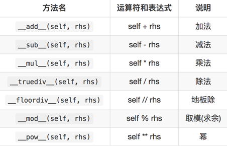
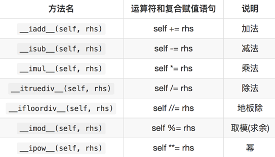

## 1. 概述

### 1.1 面向过程

(1) 定义：分析出解决问题的步骤，然后逐步实现。

例如：婚礼筹办

-- 请柬（选照片、措词、制作）

-- 宴席（场地、找厨师、准备桌椅餐具、计划菜品、购买食材）

-- 仪式（定婚礼仪式流程、请主持人）

(2) 公式：程序 = 算法 + 数据结构

(3) 优点：所有环节、细节自己掌控。

(4) 缺点：考虑所有细节，工作量大。 


### 1.2 面向对象

(1) 定义：找出解决问题的人，然后分配职责。

例如：婚礼筹办

-- 发请柬：找摄影公司（拍照片、制作请柬）

-- 宴席：找酒店（告诉对方标准、数量、挑选菜品） 

-- 婚礼仪式：找婚庆公司（对方提供司仪、制定流程、提供设备、帮助执行）

(2) 公式：程序 = 对象 + 交互

(3) 优点

a. 思想层面：

-- 可模拟现实情景，更接近于人类思维。

-- 有利于梳理归纳、分析解决问题。

b. 技术层面：

-- 高复用：对重复的代码进行封装，提高开发效率。

-- 高扩展：增加新的功能，不修改以前的代码。

-- 高维护：代码可读性好，逻辑清晰，结构规整。

(4) 缺点：学习曲线陡峭。


## 2. 类和对象

(1) 抽象：从具体事物中抽离出共性、本质，舍弃个别、非本质过程。

​                                                                                          具体


​                                                                                        抽象

​                                                                       数据：品牌、价格、颜色..

​                                                                       行为：通话..

(2) 类：一个抽象的概念，即生活中的”类别”。

(2) 对象：类的具体实例，即归属于某个类别的”个体”。

(3) 类是创建对象的”模板”。

### 2.1 语法

#### 2.1.1 定义类

(1) 代码

```python
class 类名:
	"""
		文档说明
	"""
     def __init__(self,参数):
		self.实例变量 = 参数

	 def 实例方法(self,参数):
        pass
```

(2) 说明

-- 类名所有单词首字母大写.

-- init 也叫构造函数，创建对象时被调用，也可以省略。

-- self 变量绑定的是被创建的对象，名称可以随意。

#### 2.1.2 实例化对象

(1) 代码

```python
对象名 = 类名(数据)
```

(2) 说明

-- 对象名存储的是实例化后的对象地址

-- 类名后面的参数按照构造函数的形参传递

(3) 演示

```python
class Wife:
    """
        自定义老婆类
    """
    # 数据
    def __init__(self, name, age, sex):
        # 初始化对象数据
        self.name = name
        self.age = age
        self.sex = sex

    # 行为(方法=函数)
    def play(self):
        print(self.name, "玩耍")

# 调用构造函数(__init__)
shang_er = Wife("双儿", 26, "女")
# 操作对象的数据
shang_er.age += 1
print(shang_er.age)
# 调用对象的函数
shang_er.play()# 通过对象地址调用方法,会自动传递对象地址.
# play(shanger)
print(shang_er)# <__main__.Wife object at 0x7f390e010f28>
```

练习：创建手机类，实例化两个对象并调用其函数，最后画出内存图。

​	数据：品牌、价格、颜色

​	行为：通话

### 2.2 实例成员

#### 2.2.1 实例变量

(1) 语法

a. 定义：对象.变量名

b. 调用：对象.变量名 

(2) 说明

a. 首次通过对象赋值为创建，再次赋值为修改.

```python
lili = Wife()
lili.name = "丽丽"
lili.name = "莉莉"
```

b. 通常在构造函数(\_\_init_)中创建

```python
lili = Wife("丽丽",24)
print(lili.name)
```

(3) 每个对象存储一份，通过对象地址访问

(4) 作用：描述某个对象的数据。

(5) \__dict__：对象的属性，用于存储自身实例变量的字典。

#### 2.2.2 实例方法

(1) 定义

```python
	def 方法名称(self, 参数):
         方法体
```

(2) 调用： 

```python
	对象.方法名称(参数)
    # 不建议通过类名访问实例方法
```

(3) 说明

-- 至少有一个形参，第一个参数绑定调用这个方法的对象,一般命名为self。

-- 无论创建多少对象，方法只有一份，并且被所有对象共享。

(4) 作用：表示对象行为。

(5) 演示

```python
class Wife:
    def __init__(self, name):
        self.name = name

    def print_self(self):
        print("我是：", self.name)

lili = Wife("丽丽")  # dict01 = {"name":"丽丽"}
lili.name = "莉莉"  # dict01["name"] = "莉莉"
print(lili.name)  # print(dict01["name"])
lili.print_self()
print(lili.__dict__)  # {"name":"丽丽"}

"""
# 支持动态创建类成员
# 类中的成员应该由类的创造者决定
class Wife:
    pass

w01 = Wife()
w01.name = "莉莉"
print(w01.name)#对象.变量名
"""

"""
# 实例变量的创建要在构造函数中__init__
class Wife:
    def set_name(self,name):
        self.name = name

w01 = Wife()
w01.set_name("丽丽")
print(w01.name)
"""
```

练习1：创建狗类，实例化两个对象并调用其函数，画出内存图。

​	数据：品种、昵称、身长、体重

​	行为：吃(体重增长1)

#### 2.2.3 跨类调用

```python
# 写法1：直接创建对象
# 语义：老张每次创建一辆新车去
class Person:
    def __init__(self, name=""):
        self.name = name

    def go_to(self,position):
        print("去",position)
        car = Car()
        car.run()

class Car:
    def run(self):
        print("跑喽～")

lz = Person("老张")
lz.go_to("东北") 
```

```python
# 写法2：在构造函数中创建对象
# 语义：老张开自己的车去
class Person:
    def __init__(self, name=""):
        self.name = name
        self.car = Car()

    def go_to(self,position):
        print("去",position)
        self.car.run()

class Car:
    def run(self):
        print("跑喽～")

lz = Person("老张")  
lz.go_to("东北") 
```

```python
# 方式3：通过参数传递
# 语义：老张用交通工具去
class Person:
    def __init__(self, name=""):
        self.name = name

    def go_to(self,vehicle,position):
        print("去",position)
        vehicle.run()

class Car:
    def run(self):
        print("跑喽～")

lz = Person("老张")
benz = Car()
lz.go_to(benz,"东北")
```

练习1：以面向对象思想,描述下列情景.

小明请保洁打扫卫生


练习2：以面向对象思想,描述下列情景.

玩家攻击敌人,敌人受伤(头顶爆字).


练习3：以面向对象思想,描述下列情景.

张无忌教赵敏九阳神功

赵敏教张无忌玉女心经

张无忌工作挣了5000元

赵敏工作挣了10000元

### 2.3 静态方法

(1) 定义：

```python
	@staticmethod
	def 方法名称(参数):
      	方法体
```

(2) 调用：

```python
    类名.方法名称(参数) 
    # 不建议通过对象访问静态方法
```

(3) 说明

-- 使用@ staticmethod修饰的目的是该方法不需要隐式传参数。

-- 静态方法不能访问实例成员和类成员

(4) 作用：定义常用的工具函数。

## 3. 三大特征

### 3.1 封装

#### 3.1.1 数据角度

(1) 定义：将一些基本数据类型复合成一个自定义类型。

(2) 优势：

-- 将数据与对数据的操作相关联。

-- 代码可读性更高（类是对象的模板）。

#### 3.1.2 行为角度

(1) 定义：

向类外提供必要的功能，隐藏实现的细节。

(2) 优势：

简化编程，使用者不必了解具体的实现细节，只需要调用对外提供的功能。

(3) 私有成员：

-- 作用：无需向类外提供的成员，可以通过私有化进行屏蔽。

-- 做法：命名使用双下划线开头。

-- 本质：障眼法，实际也可以访问。

​              私有成员的名称被修改为：_类名__成员名，可以通过_\_\_dict\__属性查看。

-- 演示

```python
class MyClass:
    def __init__(self, data):
        self.__data = data

    def __func01(self):
        print("func01执行了")

m01 = MyClass(10)
# print(m01.__data) # 无法访问
print(m01._MyClass__data)
print(m01.__dict__)  # {'_MyClass__data': 10}
# m01.__func01() # 无法访问
m01._MyClass__func01()
```

#### 3.1.3 案例:信息管理系统                               

##### 3.1.3.1 需求

实现对学生信息的增加、删除、修改和查询。

##### 3.1.3.2 分析

界面可能使用控制台，也可能使用Web等等。

(1) 识别对象：界面视图类   逻辑控制类   数据模型类

(2) 分配职责：

-- 界面视图类：负责处理界面逻辑，比如显示菜单，获取输入，显示结果等。

-- 逻辑控制类：负责存储学生信息，处理业务逻辑。比如添加、删除等

-- 数据模型类：定义需要处理的数据类型。比如学生信息。

(3)  建立交互：

界面视图对象  <----> 数据模型对象  <----> 逻辑控制对象

##### 3.1.3.3 设计

(1)  数据模型类：StudentModel  

-- 数据：编号 id,姓名 name,年龄 age,成绩 score 

(2)  逻辑控制类：StudentManagerController  

-- 数据：学生列表 __stu_list 

-- 行为：获取列表 stu_list,添加学生 add_student，删除学生remove_student，修改学生update_student，

​               根据成绩排序order_by_score。

(3)  界面视图类：StudentManagerView

-- 数据：逻辑控制对象__manager

-- 行为：显示菜单\_\_display_menu，选择菜单项\_\_select_menu_item，入口逻辑main，

​			   输入学生\_\_input_students，输出学生\_\_output_students，删除学生\_\_delete_student，

​			   修改学生信息__modify_student

### 3.2 继承

#### 3.2.1 继承方法

(1) 语法:

```python
class 父类:
   def 父类方法(self):
     方法体

class 子类(父类)：
   def 子类方法(self):
     方法体

儿子 = 子类()
儿子.子类方法()
儿子.父类方法()
```

(2) 说明：

子类直接拥有父类的方法.

(3) 演示：

```python
class Person:
    def say(self):
        print("说话")

class Teacher(Person):
    def teach(self):
        self.say()
        print("教学")

class Student(Person):
    def study(self):
        self.say()
        print("学习")

qtx = Teacher()
qtx.say()
qtx.teach()

xm = Student()
xm.say()
xm.study()
```

#### 3.2.2 内置函数

(1) isinstance(对象, 类型) 

​	返回指定对象是否是某个类的对象。

(2) issubclass(类型，类型)

​	返回指定类型是否属于某个类型。

(3) 演示

```python
# 对象 是一种 类型： isinstance(对象,类型)
# 老师对象 是一种 老师类型
print(isinstance(qtx, Teacher))  # True
# 老师对象 是一种 人类型
print(isinstance(qtx, Person))  # True
# 老师对象 是一种 学生类型
print(isinstance(qtx, Student))  # False
# 人对象 是一种 学生类型
print(isinstance(p, Student))  # False

# 类型 是一种 类型： issubclass(类型,类型)
# 老师类型 是一种 老师类型
print(issubclass(Teacher, Teacher))  # True
# 老师类型 是一种 人类型
print(issubclass(Teacher, Person))  # True
# 老师类型 是一种 学生类型
print(issubclass(Teacher, Student))  # False
# 人类型 是一种 学生类型
print(issubclass(Person, Student))  # False

# 是的关系
# 老师对象的类型 是 老师类型
print(type(qtx) == Teacher)  # True
# 老师对象的类型 是 人类型
print(type(qtx) == Person)  # False
```

(4) 练习：

创建子类：狗(跑)，鸟类(飞)

创建父类：动物(吃)

体会子类复用父类方法

体会 isinstance 、issubclass 与 type 的作用.

#### 3.2.3 继承数据

(1) 语法

```python
class 子类(父类):
 def __init__(self,父类参数,子类参数):
   super().__init__(参数) # 调用父类构造函数
   self.实例变量 = 参数
```

(2) 说明

子类如果没有构造函数，将自动执行父类的，但如果有构造函数将覆盖父类的。此时必须通过super()函数调用父类的构造函数，以确保父类实例变量被正常创建。

(3) 演示

```python
class Person:
    def __init__(self, name="", age=0):
        self.name = name
        self.age = age
        
# 子类有构造函数,不会使用继承而来的父类构造函数[子覆盖了父方法,好像它不存在]
class Student(Person):
    # 子类构造函数：父类构造函数参数,子类构造函数参数
    def __init__(self, name, age, score):
        # 调用父类构造函数
        super().__init__(name, age)

        self.score = score

ts = Person("唐僧",22)
print(ts.name)
kw = Student("悟空", 23, 100)
print(wk.name)
print(wk.score)
```

(4) 练习：

创建父类：车(品牌，速度)

创建子类：电动车(电池容量,充电功率)

创建子类对象并画出内存图。

#### 3.2.4 定义

(1) 概念： 重用现有类的功能，并在此基础上进行扩展。

(2) 说明：子类直接具有父类的成员（共性），还可以扩展新功能。

(3) 相关知识

-- 父类（基类、超类）、子类（派生类）。

-- 父类相对于子类更抽象，范围更宽泛；子类相对于父类更具体，范围更狭小。

-- 单继承：父类只有一个（例如 Java，C#）。

-- 多继承：父类有多个（例如C++，Python）。

-- Object类：任何类都直接或间接继承自 object 类。

### 3.3 多态

#### 3.3.1 定义

(1) 字面意思：对于一种行为有不同表现形态。

(2) 概念：对于父类的一个方法，在不同的子类上有不同体现。

(3) 说明：编码时调用父类方法，运行时传递子类对象执行子类方法。

#### 3.3.2 重写

(1) 定义：在子类定义与父类相同的方法。

(2) 作用：改变父类行为，体现子类个性。

#### 3.3.3 重写内置函数

(1) 定义：Python中，以双下划线开头、双下划线结尾的是系统定义的成员。我们可以在自定义类中进行重写，从而改变其行为。

(2) \_\_str\_\_ 函数：将对象转换为字符串(对人友好的)

-- 演示

```python
class Person:
    def __init__(self, name="", age=0):
        self.name = name
        self.age = age

    def __str__(self):
        return f"{self.name}的年龄是{self.age}"

wk = Person("悟空", 26)
# <__main__.Person object at 0x7fbabfbc3e48>
# 悟空的年龄是26
print(wk) 
# message = wk.__str__()
# print(message)

```

练习：

  直接打印商品对象: xx的编号是xx,单价是xx

  直接打印敌人对象: xx的攻击力是xx,血量是xx

```python
class Commodity:
  def __init__(self, cid=0, name="", price=0):
    self.cid = cid
    self.name = name
    self.price = price

class Enemy:
  def __init__(self, name="", atk=0, hp=0):
    self.name = name
    self.atk = atk
    self.hp = hp
```

(3) 算数运算符



-- 演示

```python
class Vector2:
    """
        二维向量
    """

    def __init__(self, x, y):
        self.x = x
        self.y = y

    def __str__(self):
        return "x是:%d,y是:%d" % (self.x, self.y)

    def __add__(self, other):
        return Vector2(self.x + other.x, self.y + other.y)

v01 = Vector2(1, 2)
v02 = Vector2(2, 3)
print(v01 + v02)  # v01.__add__(v02)
```

-- 练习：创建颜色类，数据包含r、g、b、a，实现颜色对象相加。

(4) 复合运算符重载



-- 演示

```python
class Vector2:
    """
        二维向量
    """

    def __init__(self, x, y):
        self.x = x
        self.y = y

    def __str__(self):
        return "x是:%d,y是:%d" % (self.x, self.y)

    # + 创建新
    def __add__(self, other):
        return Vector2(self.x + other.x, self.y + other.y)

    # += 在原有基础上修改(自定义类属于可变对象)
    def __iadd__(self, other):
        self.x += other.x
        self.y += other.y
        return self

v01 = Vector2(1, 2)
v02 = Vector2(2, 3)
print(id(v01))
v01 += v02
print(id(v01))
print(v01)
```

-- 练习：创建颜色类，数据包含r、g、b、a，实现颜色对象累加。

(5) 比较运算重载


-- 演示

```python
class Vector2:
    """
        二维向量
    """

    def __init__(self, x, y):
        self.x = x
        self.y = y

    # 决定相同的依据
    def __eq__(self, other):
        return self.x == other.x and self.y == other.y

    # 决定大小的依据
    def __lt__(self, other):
        return self.x < other.x


v01 = Vector2(1, 1)
v02 = Vector2(1, 1)
print(v01 == v02)  # True 比较两个对象内容(__eq__决定)
print(v01 is v02)  # False 比较两个对象地址

list01 = [
    Vector2(2, 2),
    Vector2(5, 5),
    Vector2(3, 3),
    Vector2(1, 1),
    Vector2(1, 1),
    Vector2(4, 4),
]

# 必须重写 eq
print(Vector2(5, 5) in list01)
print(list01.count(Vector2(1, 1)))

# 必须重写 lt
list01.sort()
print(list01)
```

-- 练习：创建颜色列表，实现in、count、index、max、sort运算。

### 3.4 设计思想

#### 3.4.1 封装

1.思想：分而治之，变则疏之

2.解释：将需求分为多个类实现，遇到变化点单独定义到类中

3.例如：创建人类、手机类、座机类

#### 3.4.2 继承

1.缺点：如果通过继承复用代码，当增加新功能时，必须修改客户端代码(增加父类,增加调用代码)

```python
class A(B, C):  # 增加父类
    def func01(self):
        self.func02()
        self.func03()  # 增加调用代码
        
class B:
    def func02(self):
        pass

class C:
    def func03(self):
        pass
```

2.思想：统一行为，隔离变化

3.解释：将多个变化点中的方法在父类中进行统一(func)，从而让客户端代码调用时不受变化点影响(A与BC)

```python
class A:
    def func01(self,obj):
        obj.func() # 先确定用法

class Base: # 隔离变化
    def func(self):# 统一行为
        pass
    
class B(Base):
    def func(self): # 后确定做法
        pass

class C(Base):
    def func(self):
        pass

a = A()
a.func01(B())
a.func01(C())
```

#### 3.4.3 多态

1.思想：编码时调用父，运行时执行子

2.解释：客户端代码根据父类方法进行调用， 多个变化点作为子类根据父类方法进行重写；程序运行后创建子类对象执行子类方法。

3.作用：增加变化点(子类)时，客户端代码不受影响。

案例：老张开车去东北，还有可能坐飞机。

```python
# -------------架构师------------------
class Person:
    def __init__(self, name=""):
        self.name = name

    def go_to(self, vehicle):
        print("去东北") 
        if isinstance(vehicle,Vehicle):# 车 是一种 交通工具
            vehicle.transport()


class Vehicle:  # 接口
    def transport(self):
        pass

# -------------程序员------------------

class Car(Vehicle):
    def transport(self):
        print("汽车在行驶")


class Airplane(Vehicle):
    # 重写快捷键:ctrl + o
    def transport(self):
        print("飞机在飞行")


# -------------测试------------------
lz = Person("老张")
car = Car() 
lz.go_to(car)
lz.go_to(Airplane())
lz.go_to("轮船")
```

