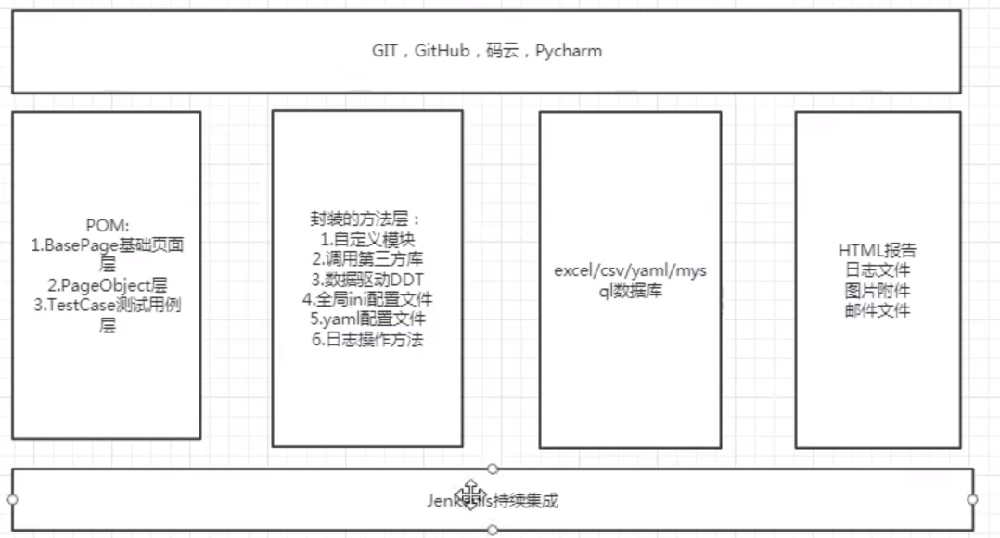

# 单元测试框架unittest



## 单元测试

单元测试（unit testing）是指对软件中的最小可测试单元进行检查和验证。对于单元测试中单元的含义，一般来说，要根据实际情况去判定其具体含义，如C语言中单元指一个函数，Java里单元指一个类，图形化的软件中可以指一个窗口或一个菜单等。总的来说，单元就是人为规定的最小的被测功能模块。

## 单元测试框架

在单元测试框架出现之前，开发人员在创建可执行测试时饱受折磨。最初的做法是在应用程序中创建一个窗口，配有"测试控制工具(harness)"。它只是一个窗口，每个测试对应一个按钮。这些测试的结果要么是一个消息框，要么是直接在窗体本身给出某种显示结果。由于每个测试都需要一个按钮，所以这些窗口很快就会变得拥挤、不可管理。

单元测试框架提供了一种统一的编程模型，可以将测试定义为一些简单的类，这些类中的方法可以调用希望测试的应用程序代码。开发人员不需要编写自己的测试控制工具；单元测试框架提供了测试运行程序(runner)，只需要单击按钮就可以执行所有测试。利用单元测试框架，可以很轻松地插入、设置和分解有关测试的功能。测试失败时，测试运行程序可以提供有关失败的信息，包含任何可供利用的异常信息和堆栈跟踪。 不同编程语言有不同的单元测试框架，如Java 的Junit, TestNg, c#的 Nunit,Python的unittest,Pyunit,testtools, subunit....

## 单元测试框架作用

· 提供用例组织与执行

· 提供丰富的断言方法

· 提供丰富的日志与测试结果

## Python单元测试框架——unittest

unittest官方文档 https://docs.python.org/2.7/library/unittest.html

unittest单元测试框架不仅可以适用于单元测试，还可以适用WEB自动化测试用例的开发与执行，该测试框架可组织执行测试用例，并且提供了丰富的断言方法，判断测试用例是否通过，最终生成测试结果。

 

## unittest核心要素

### 1.TestCase

一个TestCase的实例就是一个测试用例。什么是测试用例呢？就是一个完整的测试流程，包括测试前准备环境的搭建(setUp)，执行测试代码(run)，以及测试后环境的还原(tearDown)。元测试(unit test)的本质也就在这里，一个测试用例是一个完整的测试单元，通过运行这个测试单元，可以对某一个问题进行验证。

### 2.TestSuite

而多个测试用例集合在一起，就是TestSuite，而且TestSuite也可以嵌套TestSuite。 TestLoader是用来加载TestCase到TestSuite中的，其中有几个loadTestsFrom__()方法，就是从各个地方寻找TestCase，创建它们的实例，然后add到TestSuite中，再返回一个TestSuite实例。

### 3.TextTestRunner

TextTestRunner是来执行测试用例的，其中的run(test)会执行TestSuite/TestCase中的run(result)方法。 测试的结果会保存到TextTestResult实例中，包括运行了多少测试用例，成功了多少，失败了多少等信息。

### 4.Fixture

而对一个测试用例环境的搭建和销毁，是一个fixture。

## unittest案例

```python
# 构造一个类Math 包含整数加法运算

classMath:
  def __init__(self,a,b):
    self.a=int(a)
    self.b=int(b)

  def add(self):
      return self.a+self.b

# 对Math类进行单元测试

from caculator import* Math
import unittest


class TestMath(unittest.TestCase):

  def setUp(self):
    print("Start test")

  def test_add(self):
    j=Math(5,10)
    self.assertEqual(j.add(),15)
    # 用例失败场景
    # self.assertEqual(j.add(),12)

  def tearDown(self):
    print("test end")


if __name__=='__main__':
  **#构造测试集**
  suite=unittest.TestSuite()
  suite.addTest(TestMath("test_add"))
  **#执行测试**
  runner=unittest.TextTestRunner()
  runner.run(suite)

 
```


## 断言

断言内容是自动化脚本的重要内容，正确设置断言以后才能帮助我们判断测试用例执行结果。

```python
断言方法
 assertEqual(a, b) 判断a==b
 assertNotEqual(a, b) 判断a！=b
 assertTrue(x) bool(x) is True
 assertFalse(x) bool(x) is False
 assertIs(a, b) a is b
 assertIsNot(a, b) a is not b
 assertIsNone(x) x is None
 assertIsNotNone(x) x is not None
 assertIn(a, b) a in b
 assertNotIn(a, b) a not in b
 assertIsInstance(a, b) isinstance(a, b)
 assertNotIsInstance(a, b) not isinstance(a, b)

import unittest
from calculator import *


class TestMath(unittest.TestCase):

  def setUp(self):
    print("test is start")

  def add_test(self):
    j = Math(5,10)
    self.assertEqual(j.add(),10)

  def add_test1(self):
    j = Math(5,10)
    self.assertNotEqual(j.add(),10)

  def add_test2(self):
    j = Math(5,10)
    self.assertTrue(j.add()>10)

  def assertIs_test(self):
    self.assertIs("51zxw",'51zxw')
    # self.assertIs("51zxw",'abc')

  def assertIn_test(self):
    self.assertIn("51zxw","hello,51zxw")
    self.assertIn("888","hello,51zxw") 

  def tearDown(self):
    print("Test end")


if __name__=='__main__':
  suite=unittest.TestSuite()
  suite.addTest(TestMath("assertIn_test"))
  runer=unittest.TextTestRunner()
  runer.run(suite)
```

 

## 测试报告生成

自动化测试执行完成之后，我们需要生成测试报告来查看测试结果，使用HTMLTestRunner模块可以直接生成Html格式的报告。

### 下载地址：

http://tungwaiyip.info/software/HTMLTestRunner.html

### 下载后的修改:

· 94行引入的名称要改，从 import StringIO 改成import io。

· 539行 self.outputBuffer = StringIO.StringIO() 要改成self.outputBuffer=io.StringIO()

· 631行 print >>sys.stderr, '\nTime Elapsed: %s' % (self.stopTime-self.startTime)

修改为：print (sys.stderr, '\nTime Elapsed: %s' %(self.stopTime-self.startTime))

· 642行，if not rmap.has_key(cls): 需要换成 if not cls in rmap:

· 766行的uo = o.decode('latin-1')，改成 uo=o

· 772行，把 ue = e.decode('latin-1') 直接改成 ue = e

### 存放路径

将修改完成的模块存放在Python路径下Lib目录里面即可

 ```python
import unittest
from  HTMLTestRunner import HTMLTestRunner
import time
# 定义测试用例路径

test_dir='./test_case'
discover=unittest.defaultTestLoader.discover(test_dir,pattern="test*.py")

 
if __name__ == '__main__':
  #存放报告的文件夹
  report_dir='./test_report'
  #报告命名时间格式化
  now=time.strftime("%Y-%m-%d %H_%M_%S")
  #报告文件完整路径
  report_name=report_dir+'/'+now+'result.html'
#打开文件在报告文件写入测试结果

  with open(report_name,'wb') as f:
    runer=HTMLTestRunner(stream=f,title="Test Report",description='Test case result')
    runer.***\*run\****(discover)
    f.close()

测试报告美化
下载地址： https://github.com/easonhan007/HTMLTestRunner
#### 注意：
下载后也需要和前面的内容一样进行修改，然后放置在Python安装路径的Lib文件夹里
import unittest
from BSTestRunner import BSTestRunner
import time

test_dir='./test_case'
discover=unittest.defaultTestLoader.discover(test_dir,pattern="test*.py")

if __name__ == '__main__':
  report_dir='./test_report'
  now=time.strftime("%Y-%m-%d %H_%M_%S")
  report_name=report_dir+'/'+now+'result.html'
  with ***\*open\****(report_name,'wb')***\*as\**** f:
    runer=***\*BSTestRunner\****(stream=f,title="Test Report",description='Test case result')
    runer.***\*run\****(discover)
    f.***\*close\****()

 ```

