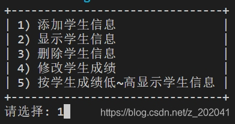
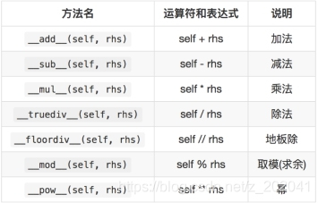
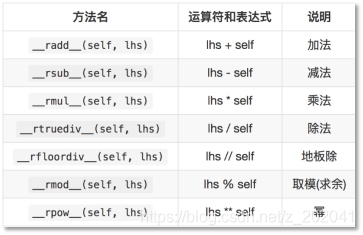
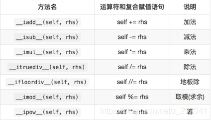
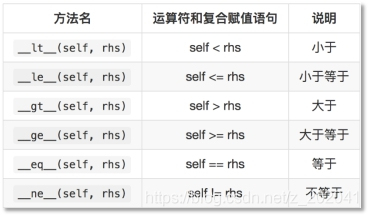

# python3_Object_Oriented

## 概述

### 三把斧

1、内存图

2、调试

3、架构设计图

### 面向过程

1. 分析出解决问题的步骤，然后逐步实现。

例如：婚礼筹办

-- 发请柬（选照片、措词、制作）

-- 宴席（场地、找厨师、准备桌椅餐具、计划菜品、购买食材）

-- 婚礼仪式（定婚礼仪式流程、请主持人）

2. 公式：程序 = 算法 + 数据结构

3. 优点：所有环节、细节自己掌控。

4. 缺点：考虑所有细节，工作量大。 

==以步骤、语句为核心。==

### 面向对象

1. 找出解决问题的人，然后分配职责。==以数据为核心。==

例如：婚礼筹办

-- 发请柬：找摄影公司（拍照片、制作请柬）

-- 宴席：找酒店（告诉对方标准、数量、挑选菜品） 

-- 婚礼仪式：找婚庆公司（对方提供司仪、制定流程、提供设备、帮助执行）

2. 公式：程序 = 对象 + 交互

==3. 可以更好地表达世界万物。==

==4.就像查地图一样，要俯瞰全局。==

5. 优点

(1) 思想层面：

-- 可模拟现实情景，更接近于人类思维。

-- 有利于梳理归纳、分析解决问题。

​		(2) 技术层面：

-- 高复用：对重复的代码进行封装，提高开发效率。

-- 高扩展：增加新的功能，不修改以前的代码。

-- 高维护：代码可读性好，逻辑清晰，结构规整


## 类和对象

```python
1. 类：一个抽象的概念，即生活中的”类别”。
2. 对象：类的具体实例，即归属于某个类别的”个体”。
3. 类是创建对象的”模板”。
-- 数据成员：名词类型的状态。
-- 方法成员：动词类型的行为。
4. 类与类行为不同，对象与对象数据不同。
```

### 语法

#### 定义类

```python
1. 代码
class 类名:
​	“””文档说明”””
​	def _init_(self,参数列表):
​		self.实例变量 = 参数
方法成员
2. 说明
-- 类名所有单词首字母大写.
--  _init_ 也叫构造函数，创建对象时被调用，也可以省略。
-- self 变量绑定的是被创建的对象，名称可以随意。
```

==Alt + 回车==

#### 创建对象(实例化)

变量 = 构造函数 (参数列表)

### 实例成员

老婆类

#### 实例变量

```python
1. 语法
(1) 定义：对象.变量名
(2) 调用：对象.变量名 
2. 说明
(1) 首次通过对象赋值为创建，再次赋值为修改.
w01 = Wife()
w01.name = “丽丽”
w01.name = “莉莉”
==体现了动态特性，运行的时候做一些事情。==
(2) 通常在构造函数(_init_)中创建。
w01 = Wife(“丽丽”,24)
print(w01.name)
(3) 每个对象存储一份，通过对象地址访问。
3. 作用：描述所有对象的共有数据。
4. __dict__：对象的属性，用于存储自身实例变量的字典。
```

#### 实例方法

```python
1. 语法
(1) 定义：  def 方法名称(self, 参数列表):
			   方法体
(2) 调用： 对象地址.实例方法名(参数列表)
		 不建议通过类名访问实例方法
2. 说明
(1) 至少有一个形参，第一个参数绑定调用这个方法的对象,一般命名为"self"。
(2) 无论创建多少对象，方法只有一份，并且被所有对象共享。
3. 作用：表示对象行为。
```

### 类成员

总行与支行

#### 类变量

```python
1. 语法
(1) 定义：在类中，方法外定义变量。
class 类名:
	变量名 = 表达式
(2) 调用：类名.变量名
   不建议通过对象访问类变量
2. 说明
-- 存储在类中。
--随类的加载而加载。
-- 只有一份，被所有对象共享。
3. 作用：描述所有对象的共有数据。
```

#### 类方法

```python
1. 语法
(1) 定义：
  @classmethod
  def 方法名称(cls,参数列表):
      方法体
(2) 调用：类名.方法名(参数列表) 
   不建议通过对象访问类方法
2. 说明
-- 至少有一个形参，第一个形参用于绑定类，一般命名为'cls'
-- 使用@classmethod修饰的目的是调用类方法时可以隐式传递类。
-- 类方法中不能访问实例成员，实例方法中可以访问类成员。
3. 作用：操作类变量。
```

### 静态方法

```python
1. 语法
(1) 定义：
  @staticmethod
  def 方法名称(参数列表):
      方法体
(2) 调用：类名.方法名(参数列表) 
   不建议通过对象访问静态方法
2. 说明
-- 使用@ staticmethod修饰的目的是该方法不需要隐式传参数。
-- 静态方法不能访问实例成员和类成员
3. 作用：定义常用的工具函数。
```

## 封装

### 定义

```python
1. 数据角度讲，将一些基本数据类型复合成一个自定义类型。
优点：符合人类的思考方式。
可以将数据与对数据的操作整合在一起。
代码可读性高。（类是对象的模板）
2. 行为角度讲，向类外提供必要的功能，隐藏实现的细节。
优势:以“模块化”的方式进行编程
  	（可以集中精力设计／组织／指挥多个类协同工作）
	-- 私有化：将名称命名为以双下划线开头.
             内部修改成员名称
     -- 属性：对实例变量的保护(拦截读/写操作)
     -- __slots__:限定类创建的对象只能有固定的实例变量.

3. 设计角度讲：
（1）分而治之
-- 将一个大的需求分解为许多类，每个类处理一个独立的功能（每个类负责一个职责）。
-- 拆分好处：便于分工，便于复用，可扩展性强。
(2) 变则疏之
-- 变化的地方独立封装，避免影响其他类。
(3) 高 内 聚
-- 类中各个方法都在完成一项任务(单一职责的类)。 （一个类有且只有一个发生变化的原因）
(4) 低 耦 合 
-- 类与类的关联性与依赖度要低(每个类独立)，让一个类的改变，尽少影响其他类。（类与类的关系松散）
[例如：硬件高度集成化，又要可插拔]
最高的内聚莫过于类中仅包含1个方法，将会导致高内聚高耦合。
最低的耦合莫过于类中包含所有方法，将会导致低耦合低内聚。
```

### 作用

1. 简化编程，使用者不必了解具体的实现细节，只需要调用对外提供的功能。

2. 松散耦合，降低了程序各部分之间的依赖性。

3. 数据和操作相关联，方法操作的是自己的数据。

### 私有成员

```python
1. 作用：无需向类外提供的成员，可以通过私有化进行屏蔽。
2. 做法：命名使用双下划线开头。
3. 本质：障眼法，实际也可以访问。
私有成员的名称被修改为：_类名__成员名，可以通过 _dict_ 属性或dir函数查看。 
```

### `__slots__`

```python
1. 作用：限定一个类创建的实例只能有固定的实例变量，不能再额外添加。
2. 语法：
在类中定义
__slots__ = (“变量名1”,”变量名2”…..)
3. 说明：含有__slots__属性的类所创建的对象没有__dict__属性, 即此实例不用字典来存储对象的实例属性。
4. 优点：访止用户因错写属性的名称而发生程序错误。
5. 缺点：丧失了动态语言可以在运行时为对象添加变量的灵活性。
```

### `属性@property`

```python
公开的实例变量，缺少逻辑验证。私有的实例变量与两个公开的方法相结合，又使调用者的操作略显复杂。而属性可以将两个方法的使用方式像操作变量一样方便。
1. 定义：
  @property
  def name(self):
    return self.__name

  @name.setter
  def name(self, name):
    self.__name = name
2. 调用：
对象.属性名 = 数据
变量 = 对象.属性名
3. 说明：
-- 通常两个公开的属性，保护一个私有的变量。
-- @property 负责读取，@属性名.setter 负责写入
-- 只写：属性名= property(None, 写入方法名)
```

### 案例:信息管理系统




#### 需求

​	实现对学生信息的增加、删除、修改和查询。

#### 分析

界面可能使用控制台，也可能使用Web等等。

1. 识别对象：界面视图类   逻辑控制类   数据模型类

2. 分配职责：

界面视图类：负责处理界面逻辑，比如显示菜单，获取输入，显示结果等。

逻辑控制类：负责存储学生信息，处理业务逻辑。比如添加、删除等

数据模型类：定义需要处理的数据类型。比如学生信息。

3. 建立交互：

界面视图对象  <----> 数据模型对象  <----> 逻辑控制对象

#### 设计

```python
	数据模型类：StudentModel	
​		数据：编号 id,姓名 name,年龄 age,成绩 score 
​	逻辑控制类：StudentManagerController	
​		数据：学生列表 __stu_list 
​		行为：获取列表 stu_list,添加学生 add_student，删除学生remove_student，修改学生update_student，根据成绩排序order_by_score。
​	界面视图类：StudentManagerView
​		数据：逻辑控制对象__manager
​		行为：显示菜单__display_menu，选择菜单项__select_menu_item，入口逻辑main，
输入学生__input_students，输出学生__output_students，删除学生__delete_student，修改学生信息__modify_student，按成绩输出学生__output_student_by_score
```

## 继承

### 语法

```python
1. 代码
class 子类(父类):
 def __init__(self,参数列表):
​		super().__init__(参数列表)
​		self.自身实例变量 = 参数
2. 说明
-- 子类拥有父类的所有成员。
-- 子类如果没有构造函数，将自动执行父类的，但如果有构造函数将覆盖父类的。此时必须通过super()函数调用父类的构造函数，以确保父类属性被正常创建。
```

### 多继承

一个子类继承两个或两个以上的基类，父类中的属性和方法同时被子类继承下来。

同名方法的解析顺序（MRO， Method Resolution Order）:

类自身 --> 父类继承列表（由左至右）--> 再上层父类

   A

   / \

   /  \

  B   C

   \  /

   \ /

​    D 

### 定义

1. 重用现有类的功能与概念，并在此基础上进行扩展。

2. 说明：

 -- 子类直接具有父类的成员（共性），还可以扩展新功能。

-- 事物具有一定的层次、渊源，继承可以统一概念。

例如：公司组织架构

​	    老板

行政中心     营销中心      技术中心

人力资源  行政部  销售部  策划部  研发部  产品部 

### 优点

1. 一种代码复用的方式。

2. 以层次化的方式管理类。

### 缺点

耦合度高

### 作用

​	隔离客户端代码与功能的实现方式。

### 适用性

多个类在概念上是一致的，且需要进行统一的处理。

### 相关概念

父类（基类、超类）、子类（派生类）。

父类相对于子类更抽象，范围更宽泛；子类相对于父类更具体，范围更狭小。

单继承：父类只有一个（例如 Java，C#）。

多继承：父类有多个（例如C++，Python）。

Object类：任何类都直接或间接继承自 object 类。

### 内置函数

isinstance(obj, class_or_tuple) 

返回这个对象obj 是否是某个类的对象,或者某些类中的一个类的对象。

## 多态

### 定义

​	父类的同一种动作或者行为，在不同的子类上有不同的实现。

### 作用

1. 继承将相关概念的共性进行抽象，多态在共性的基础上，体现类型的个性化（一个行为有不同的实现）。

2. 增强程序扩展性，体现开闭原则。

### 重写

子类实现了父类中相同的方法（方法名、参数），在调用该方法时，实际调用的是子类的方法。

快捷键 ctrl + o

#### 内置可重写函数

```python
Python中，以双下划线开头、双下划线结尾的是系统定义的成员。我们可以在自定义类中进行重写，从而改变其行为。
__str__函数：将对象转换为字符串(对人友好的)
__repr__函数：将对象转换为字符串(解释器可识别的)eval
```

#### 运算符重载

定义：让自定义的类生成的对象(实例)能够使用运算符进行操作。

##### 算数运算符




##### 反向算数运算符重载




##### 复合运算符重载



##### 比较运算重载



## 设计原则

### 开闭原则（目标、总的指导思想）

Open Closed rinciple

对扩展开放，对修改关闭。

增加新功能，不改变原有代码。

### 类的单一职责（一个类的定义）

Single esponsibility rinciple  

一个类有且只有一个改变它的原因。

### 依赖倒置（依赖抽象）

Dependency nversion rinciple

客户端代码(调用的类)尽量依赖(使用)抽象的组件。

抽象的是稳定的。实现是多变的。

### 组合复用原则（复用的最佳实践）

Composite Reuse Principle

如果仅仅为了代码复用优先选择组合复用，而非继承复用。

组合的耦合性相对继承低。

### 里氏替换（继承后的重写，指导继承的设计）

iskov Substitution rinciple

父类出现的地方可以被子类替换，在替换后依然保持原功能。

子类要拥有父类的所有功能。

子类在重写父类方法时，尽量选择扩展重写，防止改变了功能。

### 迪米特法则（类与类交互的原则）

Law of Demeter

不要和陌生人说话。

类与类交互时，在满足功能要求的基础上，传递的数据量越少越好。因为这样可能降低耦合度。

## 类与类的关系

泛化：子类与父类的关系，概念的复用，耦合度最高；

B类泛化A类，意味B类是A类的一种；

做法：B类继承A类 


关联(聚合/组合)：部分与整体的关系，功能的复用，变化影响一个类；

   A与B关联，意味着B是A的一部分；

做法：在A类中包含B类型成员。 

 

依赖：合作关系，一种相对松散的协作，变化影响一个方法；

   A类依赖B类，意味A类的某些功能靠B类实现；

   做法：B类型作为A类中方法的参数，并不是A的成员。
