# 后端开发基础

| 人工智能教学部 |
| -------------- |
| 作者：吕泽     |

------

[TOC]

##  1. 后端运行环境


### 1.1 操作系统（Operation System简称OS）

* 定义

  操作系统是管理计算机硬件与软件资源的计算机程序，同时也是计算机系统的内核与基石。操作系统需要处理如管理与配置内存、决定系统资源供需的优先次序、控制输入设备与输出设备、操作网络与管理文件系统等基本事务。
  
  


* 操作系统功能

  > 1. 管理好硬件设备，为用户提供调用硬件的方法
  > 2. 是计算机软件最重要的系统环境
  > 3. 管理各种其他的软件和应用程序的运行
  > 4. 对系统文件进行管理

  Windows，MacOS : 以桌面系统为主，服务器使用量相对较少。

  Linux ： 服务器和小型智能化设备为主，桌面系统占有量较少。

### 1.2 Linux


* Linux系统特点

  * Linux是一款开源免费的操作系统
  * 支持多种硬件平台
  * 具有非常强大的网络功能和稳定性
  * 支持多任务
  
* Linux 应用领域

  * Linux 服务器 : 目前Linux 系统是服务器计算机中占有量最大的，特别是国内。

      

  * 桌面应用：Linux系统在某些定制的桌面系统中也有广泛应用，如国家政府机关使用的一些操作系统中。  

  * 小型智能设备：由于Linux系统开放源代码，可以方便修改，在小型智能化设备领域有很广阔的市场，如机器人，手机，平板，智能穿戴，汽车。

* Linux系统构成

  * 内核: Linux操作系统的核心代码，是Linux系统的心脏，提供了系统的核心功能，用来与硬件交互。

    Linux内核官网 : [http://www.kernel.org](http://www.kernel.org)

  * 文件系统：通常指称管理磁盘数据的系统，可将数据以目录或文件的型式存储。每个文件系统都有自己的特殊格式与功能

  * 命令：它使得用户能够与操作系统进行交互，负责接收用户命令，然后调用操作系统功能。

  * 桌面系统和软件：包含桌面系统和基础的软件操作工具等。

  

* Linux发行版本

  严格的来讲，Linux 只是一个系统内核，基于此开发的市面上较知名的发行版有：Ubuntu、RedHat、CentOS、Debian 等。作为Linux发行版中的后起之秀，Ubuntu Linux在短短几年时间里便迅速成长为从Linux初学者到资深专家都十分青睐的发行版。
  
  Ubuntu官网：[https://ubuntu.com/](https://ubuntu.com/)
  
  

### 1.3 文件系统

* 定义

  文件系统是计算机操作系统的重要的组成部分，用于组织和管理计算机存储设备上的大量文件。

* 文件系统结构

  * 熟悉的windows文件系统，分不同盘符

  

  * Linux的文件组织中没有盘符。将根（/）作为整个文件系统的唯一起点，其他所有目录都从该点出发。

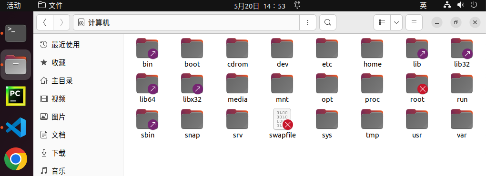

​    

  犹如一颗倒置的树，所有存储设备作为这颗树的一个子目录。


* 绝对路径和相对路径表达
  * 绝对路径：指文件在文件系统中以根目录为起始点的准确位置描述。例如“/usr/bin/gnect”就是绝对路径。最要的标志就是以 ‘/’ 作为路径描述的开头。
  * 相对路径：指相对于用户当前位置为起始点，对一个文件位置的逐层描述。例如，用户处在usr目录中时，只需要“games/gnect”就可确定这个文件。在相对路径描述时  .  表示当前目录,   ..  表示上一级目录。

```shell
主目录的绝对路径 ： /home/tarena
```


## 2. Linux系统命令

* 学习目的
  1. Linux下有非常丰富的命令，可以用来完成大部分重要的Linux服务器操作维护功能，而且至今有些功能仍然通过命令操作比较方便。
  2. 实际工作中，大量服务器维护工作都是工程师通过远程控制来完成的，这些工作工作往往需要通过命令来完成。
  3. 后端项目将来在服务器上运行，掌握基本的Linux 操作命令有助于我们将来对项目的部署和控制工作。


### 2.1 终端与命令行

* 终端 ： 使用命令对Linux系统进行操作的窗口
* 命令行：书写Linux命令的提示行

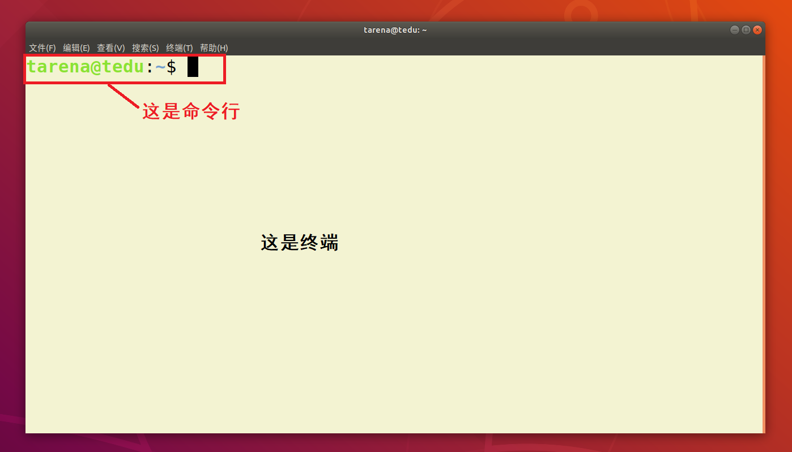


* 打开关闭终端快捷键
  * 打开 ：通过ctrl+alt +t都可以快速打开一个终端。
  * 关闭 ：ctrl-d


### 2.2 Linux常用命令

* 命令格式 

  ```shell
  command [-options] [parameter]
  
  说明：
  command：命令名称，一般为英文单词或单词的缩写
  [-options]：命令选项，辅助命令进行功能细化，也可以省略
  parameter：传给命令的参数，可以是0个或多个
  ```


* 常用快捷键
  * 清空屏幕 ： ctrl + l 
  * 调取历史命令 ： 上下箭头
  * 复制 ctrl-shift-c
  * 粘贴 ctrl-shift-v
  * 强行终止 ctrl-c


#### 2.2.1 文件与目录管理命令

| 序号 | 命令              | 作用                     |
| :--- | :---------------- | :----------------------- |
| 01   | ls                | 查看当前文件夹下的内容   |
| 02   | pwd               | 查看当前所在位置绝对路径 |
| 03   | cd    [目录名]    | 切换文件夹               |
| 04   | touch    [文件名] | 如果文件不存在，新建文件 |
| 05   | mkdir    [目录名] | 创建目录                 |
| 06   | rm    [文件名]    | 删除指定的文件名         |
| 07   | cp                | 复制一个文件             |
| 08   | mv                | 移动一个文件             |

* 部分命令细节说明
  * ls ：  -l 展示详细信息，-a 展示隐藏文件（Linux下 . 开头的为隐藏文件）。
  * cd： 参数为绝对路径或者相对路径，直接cd表示回到主目录，cd  - 回到上一次工作目录 。
  * touch :  可以同时跟多个参数表示创建多个文件。
  * cp ：如果拷贝的是一个目录需要使用 -r ，同时这个命令有另存为的作用
  * mv :  即使移动目录页不需要选项，有重命名的作用。
  * rm ：删除表示直接删除，无法找回，如果删除目录需要加 -rf 选项
  
    

> 小技巧： 使用Tab键可以自动补全文件名，目录名等信息


* 通配符

  * 作用：对一类文件名称的书写进行简化，例如file1.txt、file2.txt、file3.txt……，用户不必一一输入文件名，可以使用通配符完成。

    

  | 通配符     | 含义                 | 实例                                                         |
  | ---------- | -------------------- | ------------------------------------------------------------ |
  | 星号（\*） | 匹配任意长度的字符串 | 用file_\*.txt，匹配file_wang.txt、file_Lee.txt、file_Liu.txt |
  | 问号（?）  | 匹配一个长度的字符   | 用flie_?.txt，匹配file_1.txt、file_2.txt、file_3.txt         |


#### 2.2.2 文件查看命令

| 序号 | 命令                              | 作用                                                 |
| :--- | :-------------------------------- | :--------------------------------------------------- |
| 01   | cat    [文件名]                   | 查看文件内容、创建文件、文件合并、追加文件内容等功能 |
| 02   | grep    [搜索文本]    [文件名]    | 搜索文本文件内容                                     |
| 03   | find    [目录]   -name   [文件名] | 在一个目录及其子目录下查找文件                       |

* 部分命令细节说明
  * grep ： -n 用于显示行号，-i 忽略大小写
  * find：会从指定目录及其所有子目录中查询搜索文件。
  
* 管道

  管道可以把一系列命令连接起来，意味着第一个命令的输出将作为第二个命令的输入，通过管道传递给第二个命令，第二个命令的输出又将作为第三个命令的输入，以此类推。

```shell
ls | grep 'hello'
```

​	

#### 2.2.3 压缩解压命令

| 序号 | 命令        | 作用                                  |
| :--- | :---------- | :------------------------------------ |
| 01   | zip ，unzip | 将文件压缩为zip格式/将zip格式文件解压 |
| 02   | tar         | 对gz或者bz2格式进行压缩解压           |

* 部分命令细节说明
  * zip： 用于常与windows交互的情况，-r选项可以压缩目录 。
  
  * unzip  -d  可以选择解压位置
  
    * > zip    test.zip   filelist 
  
    * > unzip  test.zip
      >
      > unzip  -d  /home/tarena  test.zip
  
  * tar：-cjf 用于压缩bz2格式文件，-czf用于压缩gz格式文件，-xvf用于解压文件  -C用于指定解压位置。
  
    * > tar    -czf    file.tar.gz   file1  file2 
  
    * > tar   -xvf    file.tar.gz    -C    ..


#### 2.2.4 权限管理

| 序号 | 命令  | 作用                                   |
| :--- | :---- | :------------------------------------- |
| 01   | sudo  | 放在一个命令前，表示使用管理员权限执行 |
| 02   | chmod | 修改文件权限                           |


* 部分命令细节说明
  * sudo： 在打开终端第一次使用sudo时需要输入密码
  
  * `chmod` 在设置权限时，可以字母也可以使用三个数字分别对应 **拥有者** ／ **组** 和 **其他** 用户的权限
  
  ```bash
  直接修改文件|目录的 读|写|执行 权限，但是不能精确到 拥有者|组|其他
  chmod  augo+/-/=rwx 文件名/目录名
  chmod a=rw-  hello.py
  chmod o-w hello.py
  ```
  
  
  

#### 2.2.5 显示展示命令
| 序号 | 命令           | 作用             |
| :--- | :------------- | :--------------- |
| 01   | echo           | 向终端打印内容   |
| 02   | date           | 显示当前时间     |
| 03   | history  [num] | 显示历史命令记录 |
| 04   | tree           | 显示项目属性结构 |

* 部分命令细节说明
  * echo ： -n 表示打印完成不换行
  * history :  history 默认显示500条历史记录，后面可以加具体数字表示显示多少条
  
* 输出重定向

  | 重定向符  | 含义                               | 实例                                                         |
  | --------- | ---------------------------------- | ------------------------------------------------------------ |
  | >   file  | 将file文件重定向为输出源，新建模式 | echo "hello world"   > out.txt，将执行结果，写到out.txt文件中，若有同名文件将被删除 |
  | >>   file | 将file文件重定向为输出源，追加模式 | ls   /usr   >> output.txt，将ls   /usr的执行结果，追加到Lsoutput.txt文件已有内容后 |


​	

#### 	2.2.6 其他命令

| 序号 | 命令     | 作用                        |
| :--- | :------- | :-------------------------- |
| 01   | shutdown | 关机或者重启,管理员权限执行 |
| 02   | ln       | 创建链接                    |


* 部分命令细节说明
  * shutdown：
  
    * > shutdown -r now 立即重启
  
    * > shutdown now 立即关机
  
    * > shutdown +10 10分钟后关机
  
    * > shutdown -c  取消关机计划
  
  * ln : 一般使用  -s 选项 创建链接，相当于快捷方式，如果跨目录创建要使用绝对路径。
  
    ```shell
    ln  -s  /home/tarena/hello.py  hello
    ```
  


## 3. Linux服务器

### 3.1 vim 编辑器

#### 3.1.1 什么是 vim

vim是Linux操作系统中一个自带的编辑器。没有图形界面，只能编译文本内容，没有字体段落等设置，通过命令强大的命令完成一系列的编写工作。

#### 3.1.2 学习目的

1. 在实际工作中，要对 服务器上的文件进行简单的修改，使用 `vim` 进行快速的编辑即可。
2. 对一些配置文件的修改，需要一定的权限，这时vim编辑器是最佳选择。
3. vim 编辑器在系统管理、服务器管理编辑文件时，其功能不是图形界面的编辑器能比拟的。

#### 3.1.3 操作使用

* 打开和新建文件

```bash
$ vim  [文件名]

如果文件已经存在，会直接打开该文件
如果文件不存在，会新建一个文件
```


* 工作模式

  1. **命令模式**
     - **打开文件首先进入命令模式**，是使用 `vim` 的 **入口**
     - 通过 **命令** 对文件进行常规的编辑操作，例如：**定位**、**复制**、**粘贴**、**删除**……
     - 在其他图形编辑器下，通过 **快捷键** 或者 **鼠标** 实现的操作，都在 **命令模式** 下实现
  2. **末行模式** —— 执行 **保存**、**退出** 等操作 
     - 要退出 `vim` 返回到控制台，需要在末行模式下输入命令
     - **末行模式** 是 `vim` 的 **出口**
  3. **编辑模式** —— 正常的编辑文字


* 进入编辑模式命令

| 命令 |  英文  | 功能                   | 常用 |
| :--: | :----: | ---------------------- | :--: |
|  i   | insert | 在当前字符前插入文本   | 常用 |
|  o   |        | 在当前行后面插入一空行 | 常用 |


* 底行模式常用命令

| 命令 | 功能                           |
| :--: | ------------------------------ |
|  w   | 保存                           |
|  q   | 退出，如果没有保存，不允许退出 |
|  q!  | 强行退出，不保存退出           |
|  wq  | 保存并退出                     |

* 撤销和恢复撤销


|   命令   | 功能           |
| :------: | -------------- |
|    u     | 撤销上次命令   |
| ctrl - r | 恢复撤销的命令 |

* 删除文本

| 命令 | 功能                           |
| :--: | ------------------------------ |
|  x   | 删除光标所在字符，或者选中文字 |


### 3.2 软件安装

deb格式软件包是Linux中比较常见的。由于当时Linux系统中软件包存在复杂的依赖关系。因此，通常使用网络安装比较简单，不同的Linux操作系统会略有差异，但是大致原理是一样的。

| 作用               | 命令                  |
| ------------------ | --------------------- |
| 更新本地的资源列表 | apt   update          |
| 更新软件           | apt   upgrade         |
| 安装软件           | apt   install         |
| 卸载软件           | apt   remove  --purge |

* 注意事项 ： 安装软件包通常需要使用管理员权限。
* 资源列表 ：/etc/apt/sources.list

```shell
sudo apt install sl   # 安装
sudo apt remove --purge  sl  # 彻底卸载
```


### 3.3 pip3工具使用

#### 3.3.1 什么是pip3

pip3是安装Python3标准线上库的重要工具。Python以第三方库众多，使用方便而著称，在进行Python项目开发时经常需要安装一些标准库模块之外的第三方库模块以帮助我们完成开发任务，这时都少不了这个工具。在python3.6以后的版本中安装python默认就会自带这个工具。

#### 3.3.2 pip3常用命令

| 序号 | 命令                                 | 作用                 |
| :--: | ------------------------------------ | -------------------- |
|  01  | pip3     list                        | 查看已安装的Python包 |
|  02  | pip3    install   [包名]             | 安装软件包           |
|  03  | pip3    show    [包名]               | 查看已安装包的信息   |
|  04  | pip3    uninstall   [包名]           | 卸载已安装的python包 |
|  05  | pip3    install   --upgrade   [包名] | 更新包               |

```python
e.g. 
pip3 install pypinyin

from pypinyin import pinyin 
pinyin("不认识的字")
```


## 4. 进程线程技术

现今的操作系统大多为多任务的系统，即一个系统中可以同时运行多个任务，如果我们的程序能够充分利用操作系统这个特点，在程序中也可以同时去做多个任务则可以发挥更大的威力。

* 意义

  * 提高了任务之间的配合，可以根据运行情况进行任务创建。

    比如： 你也不知道用户在微信使用中是否会进行视频聊天，总不能提前启动起来吧，这是需要根据用户的行为启动新任务。

  * 充分利用计算机资源，提高了任务的执行效率。

    * 这种执行效率的提高并不是无限的，每台计算机都由一定的硬件资源，在资源被充分占用后就无法继续提高效率了
* 实现方法： 进程 ， 线程


### 4.1 进程（Process）

#### 4.1.1 进程概述

* 定义： 程序在计算机中的一次执行过程。

  - 程序是一个可执行的文件，是静态的占有磁盘。

  - 进程是一个动态的过程描述，占有计算机运行资源，有一定的生命周期。

    

* 进程状态

   * 三态  
       	  就绪态 ： 进程具备执行条件，等待系统调度分配cpu资源 
      
       	  运行态 ： 进程占有cpu正在运行 
      
       	  等待态 ： 进程阻塞等待，此时会让出cpu
      
      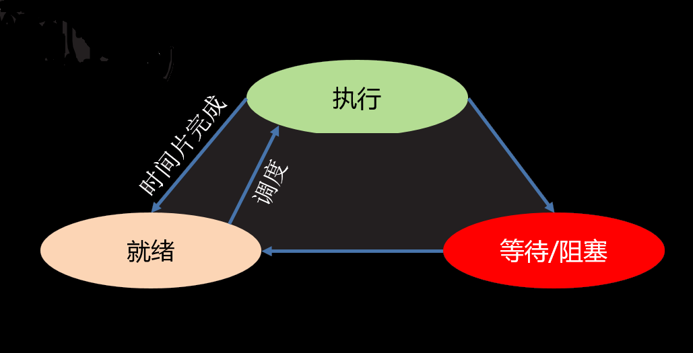
      


* 进程命令

  * 查看进程信息

    ```shell
    ps -u
    kill  -9  pid   可以用于杀死一个进程
    ```
		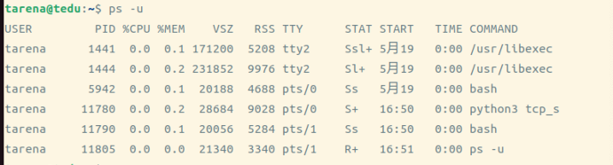
		
    * USER : 进程的创建者
    * PID  :  操作系统分配给进程的编号,大于0的整数，系统中每个进程的PID都不重复。PID也是重要的区分进程的标志。
    * %CPU,%MEM : 占有的CPU和内存
    * STAT : 进程状态信息，S表示阻塞状态  ，R 表示就绪状态或者运行状态
    * START : 进程启动时间
    * COMMAND : 通过什么程序启动的进程

  


#### 4.1.2 多进程编程

* 使用模块 ： multiprocessing

* 创建流程
  
  【1】 将需要新进程执行的事件封装为函数
  
  【2】 通过模块的Process类创建进程对象，关联函数
  
  【3】 通过进程对象调用start启动进程
  
  
  
* 主要类和函数使用

```python
    Process()
    功能 ： 创建进程对象
    参数 ： target 绑定要执行的目标函数 
           args 元组，用于给target函数位置传参
           kwargs 字典，给target函数键值传参
           daemon  bool值，让子进程随父进程退出
```

```python
    p.start()
    功能 ： 启动进程
```

> 注意 : 启动进程此时target绑定函数开始执行，该函数作为新进程执行内容，此时进程真正被创建

```python
	p.join([timeout])
	功能：阻塞等待子进程退出
	参数：最长等待时间
```


```python
进程创建示例：
"""
进程创建示例 01
"""
import multiprocessing as mp
from time import sleep

a = 1   # 全局变量

# 进程目标函数
def fun():
    print("开始运行一个进程")
    sleep(4)  # 模拟事件执行事件
    global a
    print("a =",a)  # Yes
    a = 10000
    print("进程执行结束")


# 实例化进程对象
process = mp.Process(target=fun)

# 启动进程  进程产生 执行fun
process.start()

print("我也做点事情")
sleep(3)
print("我也把事情做完了...")

process.join() # 阻塞等待子进程结束
print("a:",a) # 1  10000
```


```python
"""
进程创建示例02 ： 含有参数的进程函数
"""
from multiprocessing import Process
from time import sleep

#　含有参数的进程函数
def worker(sec,name):
    for i in range(3):
        sleep(sec)
        print("I'm %s"%name)
        print("I'm working....")

#　元组位置传参
# p = Process(target=worker,args=(2,"Tom"))

# 关键字传参
p = Process(target=worker,
            args = (2,),
            kwargs={"name":"Tom"},
            daemon=True) # 子进程伴随父进程结束
p.start()
sleep(3)

```


* 进程执行现象理解 
  
  * 新的进程是原有进程的子进程，子进程复制父进程全部内存空间，一个进程可以创建多个子进程。
  * 子进程只执行指定的函数，执行完毕子进程生命周期结束，但是子进程也拥有其他父进程资源。
  * 各个进程在执行上互不影响，也没有必然的先后顺序关系。
  * 进程创建后，各个进程空间独立，相互没有影响。
  * multiprocessing 创建的子进程中无法使用标准输入（即无法使用input）。


#### 4.1.3 进程相关函数


* 进程相关函数

```
    os.getpid()
    功能： 获取一个进程的PID值
    返回值： 返回当前进程的PID 
```

```
    os.getppid()
    功能： 获取父进程的PID号
    返回值： 返回父进程PID
```

```python
"""
创建多个子进程
"""
from multiprocessing import Process
from time import sleep
import sys, os


def th1():
    sleep(3)
    print("吃饭")
    print(os.getppid(), "--", os.getpid())


def th2():
    # sys.exit("不能睡觉了") # 进程结束
    sleep(1)
    print("睡觉")
    print(os.getppid(), "--", os.getpid())


def th3():
    sleep(2)
    print("打豆豆")
    print(os.getppid(), "--", os.getpid())


# 循环创建子进程
jobs = [] # 存放每个进程对象
for th in [th1, th2, th3]:
    p = Process(target=th)
    jobs.append(p) # 存入jobs
    p.start()

#  确保三件事都结束
for i in jobs:
    i.join()
print("三件事完成")
```


#### 4.1.4 创建进程类

进程的基本创建方法将子进程执行的内容封装为函数。如果我们更热衷于面向对象的编程思想，也可以使用类来封装进程内容。

* 创建步骤
  
  【1】 继承Process类
  
  【2】 重写`__init__`方法添加自己的属性，使用super()加载父类属性
  
  【3】 重写run()方法
  
  
  
* 使用方法
  
  【1】 实例化对象
  
  【2】 调用start自动执行run方法
  
  
  
  ```python
  """
  自定义进程类
  """
  from multiprocessing import Process
  from time import sleep
  
  
  class MyProcess(Process):
      def __init__(self, value):
          self.value = value
          super().__init__()  # 调用父类的init
  
      # 重写run 作为进程的执行内容
      def run(self):
          for i in range(self.value):
              sleep(2)
              print("自定义进程类。。。。")
  
  p = MyProcess(3)
  p.start() # 将 run方法作为进程执行
  ```
  
  

#### 4.1.5 进程间通信

* 必要性： 进程间空间独立，资源不共享，此时在需要进程间数据传输时就需要特定的手段进行数据通信。
* 常用进程间通信方法：消息队列，网络套接字等。

* 消息队列使用
  * 通信原理： 在内存中开辟空间，建立队列模型，进程通过队列将消息存入，或者从队列取出完成进程间通信。
  * 实现方法

	```python
	from multiprocessing import Queue
	
	q = Queue(maxsize=0)
	功能: 创建队列对象
	参数：最多存放消息个数
	返回值：队列对象
	
	q.put(data)
	功能：向队列存入消息
	参数：data  要存入的内容
	
	q.get()
	功能：从队列取出消息
	返回值： 返回获取到的内容
	
	q.full()   判断队列是否为满
	q.empty()  判断队列是否为空
	q.qsize()  获取队列中消息个数
	```

```python
进程间通信示例：
from multiprocessing import Process,Queue

# 创建消息队列
q = Queue(5)

# 子进程函数
def handle():
    while True:
        cmd = q.get() # 取出指令
        if cmd == "1":
            print("\n完成指令1")
        elif cmd == "2":
            print("\n完成指令2")

# 创建进程
p = Process(target=handle,daemon=True)
p.start()

while  True:
    cmd = input("指令：")
    if not cmd:
        break
    q.put(cmd) # 通过队列给子进程

```


### 4.2 线程 (Thread)


#### 4.2.1 线程概述

* 什么是线程
  
  【1】 线程被称为轻量级的进程，也是多任务编程方式
  
  【2】 线程可以理解为进程中再开辟的分支任务
  
  【3】 线程也是一个运行行为，消耗计算机资源

  【4】 一个进程中的所有线程共享这个进程的资源

  【5】 多个线程之间的运行同样互不影响各自运行
  
  【6】 线程的创建和销毁过程给计算机带来的压力远小于进程
  
  
  
  
  

#### 4.2.2 多线程编程

线程模块的用法几乎和进程一模一样，完全可以仿照完成。

* 线程模块： threading


* 创建方法

  【1】 创建线程对象

```python
from threading import Thread 

t = Thread()
功能：创建线程对象
参数：target 绑定线程函数
     args   元组 给线程函数位置传参
     kwargs 字典 给线程函数键值传参
     daemon bool值，主线程推出时该分支线程也推出
```

	【2】 启动线程

```
 t.start()
```

	【3】等待分支线程结束

```
t.join([timeout])
功能：阻塞等待分支线程退出
参数：最长等待时间
```

```python
线程示例01：

import threading
from time import sleep
import os

a = 1

#  线程函数
def music():
    global a
    print("a =",a)
    a = 10000
    for i in range(3):
        sleep(2)
        print(os.getpid(),"播放:黄河大合唱")

# 实例化线程对象
thread = threading.Thread(target=music)
# 启动线程 线程存在
thread.start()

for i in range(4):
    sleep(1)
    print(os.getpid(),"播放:葫芦娃")

# 阻塞等待分支线程结束
thread.join()
print("a:",a)
```

```python
线程示例02：

from threading import Thread
from time import sleep

# 带有参数的线程函数
def func(sec,name):
    print("含有参数的线程来喽")
    sleep(sec)
    print("%s 线程执行完毕"%name)

# 循环创建线程
for i in range(5):
    t = Thread(target=func,
               args=(2,),
               kwargs={"name":"T-%d"%i},
               daemon=True)
    t.start()
```


#### 4.2.3 创建线程类

1. 创建步骤
  
   【1】 继承Thread类
   
   【2】 重写`__init__`方法添加自己的属性，使用super()加载父类属性
   
   【3】 重写run()方法
   
   
   
2. 使用方法

   【1】 实例化对象

   【2】 调用start自动执行run方法
   
   ```python
   from threading import Thread
   from time import sleep
   
   class MyThread(Thread):
       def __init__(self,song):
           self.song = song
           super().__init__() # 得到父类内容
   
       # 线程要做的事情
       def run(self):
           for i in range(3):
               sleep(2)
               print("播放:",self.song)
   
   t = MyThread("让我们荡起双桨")
   t.start() # 运行run
   ```
   
   


#### 4.2.4 线程互斥锁

* 线程通信方法： 线程间使用全局变量进行通信

* 共享资源争夺
  * 共享资源：多线程都可以操作的资源称为共享资源。对共享资源的操作代码段称为临界区。
  * 影响 ： 对共享资源的无序操作可能会带来数据的混乱，或者操作错误。此时往往需要同步互斥机制协调操作顺序。

* 互斥锁机制

  当一个进程或者线程占有资源时会进行加锁处理，此时其他进程线程就无法操作该资源，直到解锁后才能操作。

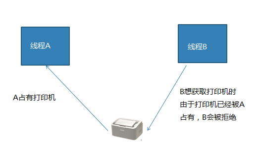


* 线程锁 Lock

```python
from  threading import Lock

lock = Lock()  创建锁对象
lock.acquire() 上锁  如果lock已经上锁再调用会阻塞
lock.release() 解锁
```

```python
Lock使用示例：

from threading import Thread, Lock

lock = Lock() #　创建锁
a = b = 0

def value():
    while True:
        lock.acquire() # 上锁
        if a != b:
            print("a = %d,b = %d" % (a, b))
        lock.release() # 解锁

t = Thread(target=value)
t.start()

while True:
    lock.acquire()
    a += 1
    b += 1
    lock.release()

```


* 线程锁的注意问题：死锁问题


```
死锁产生条件

* 互斥条件：即使用了互斥锁。

* 请求和保持条件：锁住一定资源不解锁的情况先再请求锁住其他资源。

* 不剥夺条件：不会受到线程外部的干扰，终止锁行为。

* 环路等待条件：指在发生死锁时，必然存在一个线程——资源的环形链，如 T0正在等待一个T1占用的资源；T1正在等待T2占用的资源，……，Tn正在等待已被T0占用的资源。
```


#### 4.2.5 GIL问题

* 什么是GIL问题 （全局解释器锁）

  由于python解释器设计中加入了解释器锁，导致python解释器同一时刻只能解释执行一个线程，大大降低了线程的执行效率。


* 导致后果
  因为遇到阻塞时线程会主动让出解释器，去解释其他线程。所以python多线程在执行多阻塞任务时可以提升程序效率，其他情况并不能对效率有所提升。
  

  
* 关于GIL问题的处理


    * 来自Guido：http://www.artima.com/forums/flat.jsp?forum=106&thread=214235
    
    * 尽量使用进程完成无阻塞的并发行为
    
    * 不使用c作为解释器 （可以用Java  C#）


​     

* 结论 
  * GIL问题与Python语言本身并没什么关系，属于解释器设计的历史问题。
  * 在无阻塞状态下，多线程程序程序执行效率并不高，甚至还不如单线程效率。
  * Python多线程只适用于执行有阻塞延迟的任务情形。

```python
线程效率对比进程实验：

class Prime(Thread):
    # 判断一个数是否为质数
    @staticmethod
    def is_prime(n):
        if n <= 1:
            return False
        for i in range(2,n // 2 + 1):
            if n % i == 0:
                return False
        return True

    def __init__(self,begin,end):
        self.__begin = begin
        self.__end = end
        super().__init__()

    def run(self):
        prime = [] # 存放所有质数
        for i in range(self.__begin,self.__end):
            if Prime.is_prime(i):
                prime.append(i)
        print(sum(prime))

@timeis
def process_10():
    jobs = []
    for i in range(1,100001,10000):
        t = Prime(i,i + 10000)
        jobs.append(t)
        t.start()
    for i in jobs:
        i.join()


if __name__ == '__main__':
    process_10()
```


#### 4.2.6 进程线程的区别联系

* 区别联系

1. 两者都是多任务编程方式
2. 进程的创建销毁过程给计算机带来的压力比线程多
3. 进程空间独立，数据互不干扰，有专门通信方法；线程使用全局变量通信
4. 一个进程可以有多个分支线程，两者有包含关系
5. 多个线程共享进程资源，在共享资源操作时往往需要同步互斥处理
6. Python线程存在GIL问题，但是进程没有。

* 使用场景


1. 任务场景：一个大型服务，往往包含多个独立的任务模块，每个任务模块又有多个小独立任务构成，此时整个项目可能有多个进程，每个进程又有多个线程。
3. 编程语言：Java,C#之类的编程语言在执行多任务时一般都是用线程完成，因为线程资源消耗少；而Python由于GIL问题往往使用多进程。


## 5. 网络编程

### 5.1 网络基础认知

#### 5.1.1 什么是网络

* 什么是网络 : 计算机网络功能主要包括实现资源共享，实现数据信息的快速传递。

  

#### 5.1.2 网络通信标准

* 面临问题

  1. 不同的国家和公司都建立自己的通信标准不利于网络互连
  2. 多种标准并行情况下不利于技术的发展融合

  


* OSI模型 （Open System Interconnection Reference Model）

  

  * 好处

    1. 建立了统一的通信标准

    2. 降低开发难度，每层功能明确，各司其职

    3. 七层模型实际规定了每一层的任务，该完成什么事情

    

* TCP/IP模型

  * 七层模型过于理想，结构细节太复杂
  * 在工程中应用实践难度大
  * 实际工作中以TCP/IP模型为工作标准流程

  
         

* 网络协议

  * 什么是网络协议：在网络数据传输中，都遵循的执行规则。
* 网络协议实际上规定了每一层在完成自己的任务时应该遵循什么规范。

* 服务端与客户端
  * 服务端（Server）：服务端是为客户端服务的，服务的内容诸如向客户端提供资源，保存客户端数据，处理客户端请求等。

  * 客户端（Client） ：也称为用户端，是指与服务端相对应，为客户提供一定应用功能的程序，我们平时使用的手机或者电脑上的程序基本都是客户端程序。

  


* 需要应用工程师做的工作 ： 编写应用工功能，明确对方地址，选择传输服务。

    

#### 5.1.4  通信地址


* IP地址

  * IP地址 ： 即在网络中标识一台计算机的地址编号。

  * IP地址分类

    * IPv4 ： 192.168.1.5 
    * IPv6 ：fe80::680a:76cf:ab11:2d73

  * IPv4 特点

    * 分为4个部分，每部分是一个整数，取值分为0-255

  * IPv6 特点

    * 分为8个部分，每部分4个16进制数，如果出现连续的数字 0 则可以用 :: 省略中间的0

  * IP地址相关命令

    * ifconfig : 查看Linux系统下计算机的IP地址

      

    * ping  [ip]：查看计算机的连通性 

      

  * 公网IP和内网IP

    * 公网IP指的是连接到互联网上的公共IP地址，可以与外部网络进行数据分享。（将来进公司，公司会申请公网IP作为网络项目的被访问地址）
    * 内网IP指的是一个局域网络范围内由网络设备分配的保留IP地址，不能访问局域网外的网络空间。

  

* 端口号

  * 端口：网络地址的一部分，在一台计算机上，每个网络程序对应一个端口。

    

  * 端口号特点

    * 取值范围： 0 —— 65535 的整数
    
    * 一台计算机上的网络应用所使用的端口不会重复
    
    * 通常 0——1023 的端口会被一些有名的程序或者系统服务占用，个人一般使用大于 1024 的端口
    
    * lsof   -i  :[port]     显示一个端口是否被占用，需要管理员权限执行
    
      ```
      sudo  lsof  -i  :3306
      ```
    
      

### 5.2 套接字通信

#### 5.2.1 套接字简介

* 套接字(Socket) ： 实现网络编程进行数据传输的一种技术手段,网络上各种各样的网络服务大多都是基于 Socket 来完成通信的。

  

* Python套接字编程模块：import  socket


### 5.3 TCP 网络传输

#### 5.3.1 TCP传输特点

* 面向连接的传输服务
  * 传输特征 ： 提供了可靠的数据传输，可靠性指数据传输过程中无丢失，无失序，无差错，无重复。
  * 可靠性保障机制（都是操作系统网络服务自动帮应用完成的）： 
    * 在通信前需要建立数据连接
    * 确认应答机制
    * 通信结束要正常断开连接

* 三次握手（建立连接）
  * 客户端向服务器发送消息报文请求连接
  * 服务器收到请求后，回复报文确定可以连接
  * 客户端收到回复，发送最终报文连接建立

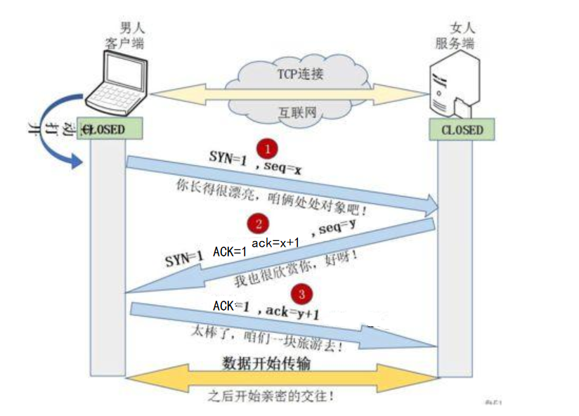
					

* 四次挥手（断开连接）
  * 主动方发送报文请求断开连接
  * 被动方收到请求后，立即回复，表示准备断开
  * 被动方准备就绪，再次发送报文表示可以断开
  * 主动方收到确定，发送最终报文完成断开

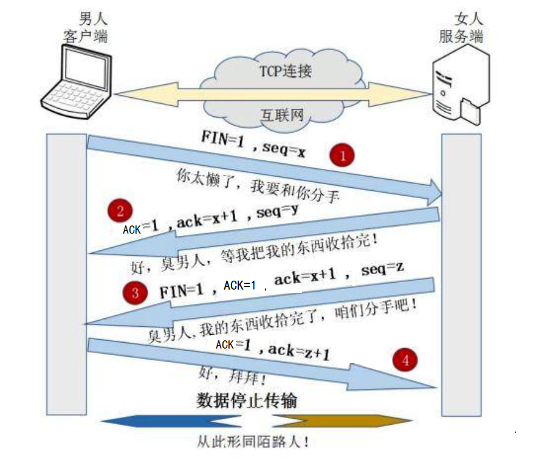

#### 5.3.2 TCP服务端


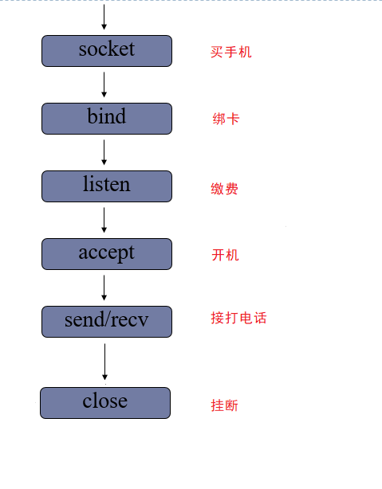


- 创建套接字

```python
sock=socket.socket(family,type)
功能：创建套接字
参数：family  网络地址类型 AF_INET表示ipv4
     type  套接字类型 SOCK_STREAM 表示tcp套接字 （也叫流式套接字） 
    返回值： 套接字对象
```

- 绑定地址
  * 本地地址 ： '127.0.0.1'
  * 网络地址 ： '172.40.91.185' （通过ifconfig查看）
  * 自动获取地址： '0.0.0.0'

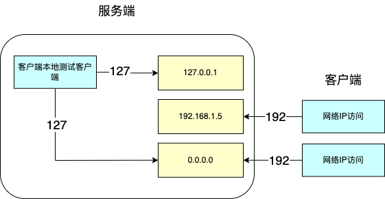

```python
    sock.bind(addr)
    功能： 绑定本机网络地址
    参数： 二元元组 (ip,port)  ('0.0.0.0',8888)
```

* 设置监听

```python
    sock.listen()
    功能 ： 将套接字设置为监听套接字
```

* 处理客户端连接请求

```python
    conn,addr = sock.accept()
    功能: 阻塞等待处理客户端请求
    返回值: conn  客户端连接套接字
           addr  连接的客户端地址
```

* 消息收发

```python
    data = conn.recv(buffersize)
    功能 : 接受客户端消息
    参数 ：每次最多接收消息的大小
    返回值： 接收到的内容

    n = conn.send(data)
    功能 : 发送消息
    参数 ：要发送的内容  bytes格式
    返回值： 发送的字节数
```

6. 关闭套接字

```python
    sock.close()
    功能：关闭套接字
```

```python
TCP服务端示例01：

from socket import *

# 创建tcp套接字
tcp_socket = socket(AF_INET,SOCK_STREAM)

# 绑定地址
tcp_socket.bind(("0.0.0.0",8888))

# 设置为监听套接字
tcp_socket.listen(5)

# 等待客户端连接
while True:
    print("Waiting for connect...")
    connfd,addr = tcp_socket.accept()
    print("Connect from",addr)

    # 循环收发消息  客户端退出 recv立即返回b""
    while True:
        data = connfd.recv(5)
        # data=b""客户端直接关闭  b"##"客户端主动告知关闭
        if not data or data == b'##':
            break
        print("收到:",data.decode())
        connfd.send(b"Thanks/")
    connfd.close()

# 关闭套接字
tcp_socket.close()
```


#### 5.3.3 TCP客户端 


* 创建TCP套接字
* 请求连接

```python
    sock.connect(server_addr)
    功能：连接服务器
    参数：地址元组，访问服务器使用的地址
```

* 收发消息

> 注意： 防止两端都阻塞，recv send要配合

* 关闭套接字

  

  ```python
  TCP客户端示例01：
  
  
  from socket import *
  
  # 服务端地址
  ADDR = ("127.0.0.1",8888)
  
  # 使用默认值--》tcp
  tcp_socket = socket()
  
  # 发起连接
  tcp_socket.connect(ADDR)
  
  # 循环发送接收消息
  while True:
      msg = input(">>")
      tcp_socket.send(msg.encode())
      # 结束发送
      if msg == "##":
          break
      data = tcp_socket.recv(1024)
      print("From server:",data.decode())
  
  tcp_socket.close()
  ```
  
  


#### 5.3.4 TCP套接字细节

* tcp连接中当一端退出，另一端调用recv时会返回一个空字节串。
* tcp连接中如果一端已经不存在，仍然试图通过send向其发送数据则会产生BrokenPipeError
* 一个服务端可以同时连接多个客户端，也能够重复被连接

#### 5.3.5 tcp粘包问题

* 网络收发缓冲区 ： 为了解决数据再传输过程中可能产生的速度不协调问题，操作系统在内存中设置了缓冲区
* 粘包产生原因
  * tcp以字节流方式进行数据传输，在接收时不区分消息边界
  * 发送速度比较快，消息同时到达，存储在缓冲区被一次性接收
* 带来的影响
  
  * 如果每次发送内容是一个独立的含义，需要接收端独立解析此时粘包会有影响。
* 处理方法
  
  * 消息格式化处理，如人为的添加消息边界，用作消息之间的分割
  * 控制发送的速度


## 6. 网络并发模型


### 6.1 网络并发模型概述

* 什么是网络并发

  在实际工作中，一个服务端程序往往要应对多个客户端同时发起访问的情况。如果让服务端程序能够更好的同时满足更多客户端网络请求的情形，这就是并发网络模型。

  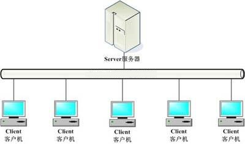

* 循环网络模型问题

  循环网络模型只能循环接收客户端请求，处理请求。同一时刻只能处理一个请求，处理完毕后再处理下一个。这样的网络模型虽然简单，资源占用不多，但是无法同时处理多个客户端请求就是其最大的弊端，往往只有在一些低频的小请求任务中才会使用。


### 6.2 多进程/线程并发模型

多进程/线程并发模中每当一个客户端连接服务器，就创建一个新的进程/线程为该客户端服务，客户端退出时再销毁该进程/线程，多任务并发模型也是实际工作中最为常用的服务端处理模型。

* 模型特点
  * 优点：能同时满足多个客户端长期占有服务端需求，可以处理各种请求。
  * 缺点： 资源消耗较大
  * 适用情况：客户端请求较复杂，需要长时间占有服务器。

* 创建流程
  * 创建网络套接字
  * 等待客户端连接
  * 有客户端连接，则创建新的进程/线程具体处理客户端请求
  * 主进程/线程继续等待处理其他客户端连接
  * 如果客户端退出，则销毁对应的进程/线程

```python
多进程并发模型示例：

"""
基于多进程的网络并发模型
重点代码 ！！

创建tcp套接字
等待客户端连接
有客户端连接，则创建新的进程具体处理客户端请求
父进程继续等待处理其他客户端连接
如果客户端退出，则销毁对应的进程
"""
from socket import *
from multiprocessing import Process
import sys

# 地址变量
HOST = "0.0.0.0"
PORT = 8888
ADDR = (HOST, PORT)

# 处理客户端具体请求
def handle(connfd):
    while True:
        data = connfd.recv(1024)
        if not data:
            break
        print(data.decode())
    connfd.close()

# 服务入口函数
def main():
    # 创建tcp套接字
    tcp_socket = socket()
    tcp_socket.bind(ADDR)
    tcp_socket.listen(5)
    print("Listen the port %d"%PORT)

    # 循环连接客户端
    while True:
        try:
            connfd, addr = tcp_socket.accept()
            print("Connect from", addr)
        except KeyboardInterrupt:
            tcp_socket.close()
            sys.exit("服务结束")

        # 创建进程 处理客户端请求
        p = Process(target=handle, args=(connfd,),daemon=True)
        p.start()

if __name__ == '__main__':
    main()
```

```python
多线程并发模型示例：
"""
基于多线程的网络并发模型
重点代码 ！！

思路： 网络构建    线程搭建    /   具体处理请求
"""
from socket import *
from threading import Thread


# 处理客户端具体请求
class Handle:
    # 具体处理请求函数 （逻辑处理，数据处理）
    def request(self, data):
        print(data)


# 创建线程得到请求
class ThreadServer(Thread):
    def __init__(self, connfd):
        self.connfd = connfd
        self.handle = Handle()
        super().__init__(daemon=True)

    # 接收客户端的请求
    def run(self):
        while True:
            data = self.connfd.recv(1024).decode()
            if not data:
                break
            self.handle.request(data)
        self.connfd.close()


# 网络搭建
class ConcurrentServer:
    """
    提供网络功能
    """
    def __init__(self, *, host="", port=0):
        self.host = host
        self.port = port
        self.address = (host, port)
        self.sock = self.__create_socket()

    def __create_socket(self):
        tcp_socket = socket()
        tcp_socket.bind(self.address)
        return tcp_socket

    # 启动服务 --> 准备连接客户端
    def serve_forever(self):
        self.sock.listen(5)
        print("Listen the port %d" % self.port)

        while True:
            connfd, addr = self.sock.accept()
            print("Connect from", addr)
            # 创建线程
            t = ThreadServer(connfd)
            t.start()


if __name__ == '__main__':
    server = ConcurrentServer(host="0.0.0.0", port=8888)
    server.serve_forever()  # 启动服务

```


## 7. 网络通信协议

### 7.1 TCP协议

#### 7.1.1 传输流程

- 发送端由应用程序发送消息，逐层添加首部信息，最终在物理层发送消息包。
- 发送的消息经过多个节点（交换机，路由器）传输，最终到达目标主机。
- 目标主机由物理层逐层解析首部消息包，最终到应用程序呈现消息。


#### 7.1.2 TCP协议首部信息

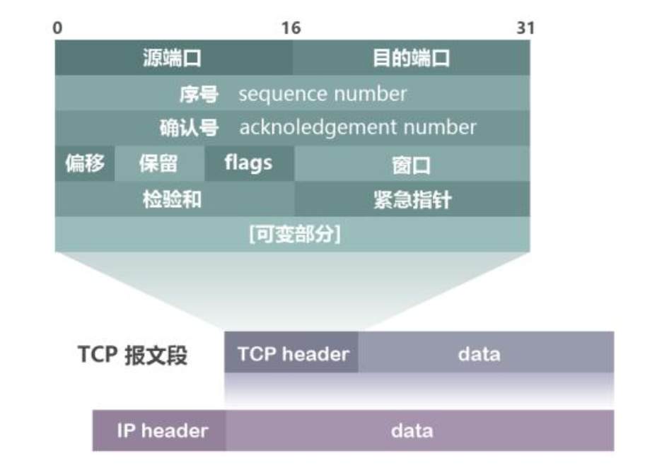


- 源端口和目的端口 各占2个字节，分别写入源端口和目的端口。
- 序号 占4字节。TCP是面向字节流的。在一个TCP连接中传送的字节流中的每一个字节都按顺序编号。例如，一报文段的序号是301，而接待的数据共有100字节。这就表明本报文段的数据的第一个字节的序号是301，最后一个字节的序号是400。
- 确认号 占4字节，是期望收到对方下一个报文段的第一个数据字节的序号。例如，B正确收到了A发送过来的一个报文段，其序号字段值是501，而数据长度是200字节（序号501~700），这表明B正确收到了A发送的到序号700为止的数据。因此，B期望收到A的下一个数据序号是701，于是B在发送给A的确认报文段中把确认号置为701。
- 确认ACK（ACKnowledgment） 仅当ACK = 1时确认号字段才有效，当ACK = 0时确认号无效。TCP规定，在连接建立后所有的传送的报文段都必须把ACK置为1。
- 同步SYN（SYNchronization） 在连接建立时用来同步序号。当SYN=1而ACK=0时，表明这是一个连接请求报文段。对方若同意建立连接，则应在响应的报文段中使SYN=1和ACK=1，因此SYN置为1就表示这是一个连接请求或连接接受报文。
- 终止FIN（FINis，意思是“完”“终”） 用来释放一个连接。当FIN=1时，表明此报文段的发送发的数据已发送完毕，并要求释放运输连接。

### 7.2 HTTP协议

#### 7.2.1 HTTP协议 （超文本传输协议）

- 用途 ： 网页获取，数据的传输
- 特点
  - 应用层协议，使用tcp进行数据传输
  - 简单，灵活，很多语言都有HTTP专门接口
  - 有丰富的请求类型
  - 可以传输的数据类型众多

#### 7.2.2 访问网页流程

1. 客户端（浏览器）通过tcp传输，发送http请求给服务端
2. 服务端接收到http请求后进行解析
3. 服务端处理请求内容，组织响应内容
4. 服务端将响应内容以http响应格式发送给浏览器
5. 浏览器接收到响应内容，解析展示

#### 7.2.3 HTTP请求

- 请求行 ： 具体的请求类别和请求内容

```
GET         /        HTTP/1.1
请求类别   请求内容     协议版本
请求类别：每个请求类别表示要做不同的事情 
    GET : 获取网络资源
    POST ：提交一定的信息，得到反馈
    HEAD ： 只获取网络资源的响应头
    PUT ： 更新服务器资源
    DELETE ： 删除服务器资源
```
- 请求头：对请求的进一步解释和描述
```
Accept-Encoding: gzip
```
- 空行
- 请求体: 请求参数或者提交内容


#### 7.2.4 HTTP响应

- 响应行 ： 反馈基本的响应情况
```
HTTP/1.1     200       OK
版本信息    响应码   附加信息
响应码 ： 
    1xx  提示信息，表示请求被接收
    2xx  响应成功
    3xx  响应需要进一步操作，重定向
    4xx  客户端错误
    5xx  服务器错误
```
- 响应头：对响应内容的描述
```
Content-Type: text/html
```
- - 空行
- 响应体：响应的主体内容信息
 


```

HTTP协议示例：
"""
http请求和响应 演示
"""
from socket import *

sock = socket()
sock.bind(("0.0.0.0",8000))
sock.listen(5)

# 等待浏览器连接

connfd,addr = sock.accept()
print("Connect from",addr)

# 接收HTTP请求

request = connfd.recv(1024)
print(request.decode())

# 组织响应

response = """HTTP/1.1 200 OK
Content-Type:text/html

hello world
"""
connfd.send(response.encode())

connfd.close()
sock.close()
```
```python
随堂练习：将网页 一个图片 通过浏览器访问显示出来
提示 ： Content-Type:image/jpeg

from socket import *

# 处理http请求

def handle(connfd):
    # 接收http请求
    request = connfd.recv(1024).decode()
    if not request:
        return
    # 组织响应
    response = "HTTP/1.1 200 OK\r\n"
    response += "Content-Type:image/jpeg\r\n"
    response += "\r\n"
    with open("abc.jpeg",'rb') as f:
        response =response.encode() +  f.read()
    connfd.send(response # 发送响应

def main():
    sock = socket()
    sock.bind(("0.0.0.0", 8000))
    sock.listen(5)

    # 等待浏览器连接
    while True:
        connfd, addr = sock.accept()
        print("Connect from", addr)
        handle(connfd) # 处理请求
        connfd.close()

if __name__ == '__main__':
    main()
```

### 7.3 简单的http服务

【1】 接收客户端（浏览器）请求 （静态网页）

【2】 解析客户端发送的请求

【3】 根据请求组织数据内容

【4】 将数据内容形成http响应格式返回给浏览器

