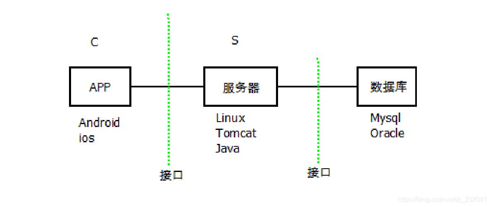
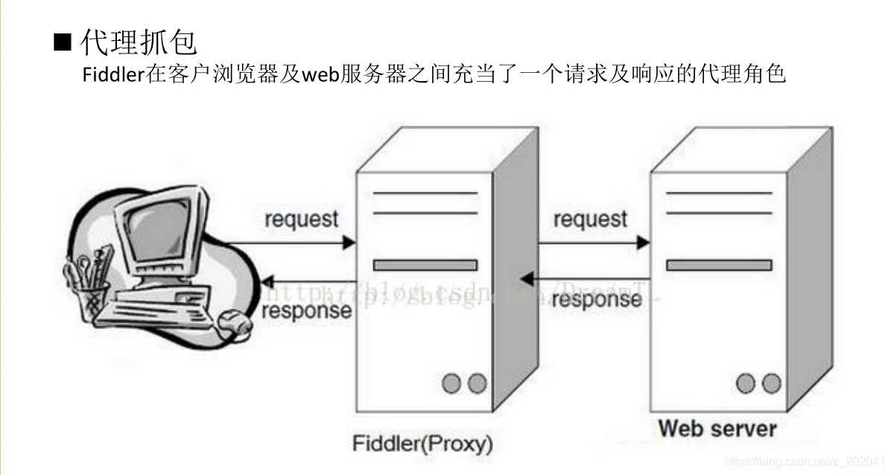

# 接口测试

## 接口测试介绍

### 1.1 什么是接口测试

**简介：**软件测试中所说的接口又称为API，接口测试是指用于与外部系统交互接口及软件系统内部模块/组件或子系统之间的内部接口测试。例如：

1、系统与系统之间的调用，比如银行会提供接口供支付宝网站调用，支付宝会提供接口给淘宝调用；

2、上层服务对下层服务的调用，比如服务层会调用数据库访问层的接口，而应用层又会调用服务层提供的接口；

3、服务之间的调用，比如注册用户时，会先调用用户查询的服务，查看该用户是否已经注册。

**接口测试技术：**

1. 工具和技术选型：接口上传输数据的内容格式协议及数据的传输承载协议类型决定该接口测试需要使用的工具和技术，协议通常包括自定义协议类型及标准协议类型。常见HTTP接口使用协议如下：

**JSON/XML on REST/HTTP**

**接口都由一组协议组成，定义会话层，表示层以及应用层的格式、内容等！**

2. 接口测试问题定位方法：接口测试通常的检查点包括：

| 检查点                    | **检查方法**       |
| ------------------------- | ------------------ |
| 输入/输出数据的格式和内容 | 抓包，数据分析     |
| 程序内部状态机迁移        | 系统日志，调试工具 |
| 数据持久化                | 数据库查询         |
| 性能                      | RT，QPS，TPS，RPS  |

**软件HTTP接口举例：**

HTTP协议属于会话层协议，具有成熟完善，易开发易调试易理解，行业支持力度大等特点，是目前比较常见的接口协议，比如通过HTTP协议传输的经度和纬度数据查询所在城市的接口:

http: 命令行接口测试工具

http://apis.juhe.cn/geo/ : URI,提供接口服务的网址

Lng:：经度

Lat：纬度1.2.1 HTTP常见概念

### **1.2 HTTP接口常见概念**

HTTP属于会话层协议，其下层协议是TCP协议。

**统一资源定位符(URL)** **：**

是对可以从互联网上得到的资源的位置和访问方法的一种简洁的表示，是互联网上标准资源的地址。互联网上的每个文件都有一个唯一的URL，它包含的信息指出文件的位置以及浏览器应该怎么处理它。

 http://bornmoney.com/money/rmb?quantity=1000000

 协议           主机                   路径                 查询参数

大概相当于： 中文://深圳.广东.中国/福田区/青年大厦/5楼/公司?名字=门道

**请求/响应：**

在接口的一次数据交换过程中，首先发起的是请求，一般是由前端发起，通过请求消息发送请求的数据；收到请求后进行处理的是后台，

处理完成后，后台向前端发送响应数据，完成一次数据交换。

> HTTP常用请求方法:

| **方法**   | **描述**                                                     |
| ---------- | ------------------------------------------------------------ |
| **POST**   | **增加(合同、订单、用户、任务等)**                           |
| **DELETE** | **删除**                                                     |
| **PUT**    | **修改**                                                     |
| **GET**    | **查询**                                                     |
| OPTIONS    | 允许客户端查看服务器的性能。                                 |
| TRACE      | 回显服务器收到的请求，主要用于测试或诊断。                   |
| HEAD       | 类似于get请求，只不过返回的响应中没有具体的内容，用于获取报头 |

> HTTP常见响应状态码：

| **状态码** | 意义               |
| ---------- | ------------------ |
| **200**    | OK                 |
| **201**    | 创建成功           |
| **204**    | 请求成功无返回内容 |
| **302**    | 临时移动           |
| **304**    | 没有修改           |
| **400**    | 错误请求           |
| **401**    | 没有授权           |
| **403**    | 禁止访问           |
| **404**    | 资源不存在         |
| **405**    | 方法不支持         |

**常用测试点:** 

1、功能测试：

 传参数，验返回值，增删改查/CRUD

2、异常注入测试：

 测试参数的无效等价类

**常用测试方法及工具**

1、手工测试：

postman/jmeter/soapui等

httpie/curl/httpsender等 

2、自动化测试：

 Java+TestNG

 Python+pytest

 Jmeter/RobotFramework

3、抓包工具：Fiddler

### **1.3 HTTP接口测试**

接口测试流程:

**需求评审**->接口设计评审->接口用例设计->测试执行->结果分析

注：开发人员提供接口设计文档

### **1.4 数据格式**

会话层之上是表示层和应用层，定义用户数据的格式及用户数据的内容。用户数据的格式会有很多，比如视频，音频，文本、压缩文件等。而在HTTP接口测试中，用户数据通常会以文本的格式传输，采用JSON或者XML协议：

JSON(JavaScript Object Notation, JS 对象标记)相比于XML(可扩展标记语言)，其语法比较简洁，传输及处理时效率较高。

JSON格式 XML格式

### **1.5 一个接口设计说明**

这个接口定义了通过HTTP接口管理一个task数据的方法，包含下面的内容：

Task的资源位置

查询Task内容的方法

增加/创建Task的方法

修改某个指定Task的方法

删除某个指定taskId的方法

### **1.6 Fiddler**

Fiddler是目前最常用的HTTP抓包工具之一，它能够记录客户端和服务器之间的所有HTTP请求，可以针对特定的HTTP请求，分析请求数据、设置断点、调试web应用、修改请求的数据，是常用调试工具。

Fiddler工作原理

代理抓包：Fiddler在客户浏览器及web服务器之间充当了一个请求及响应的代理角色

