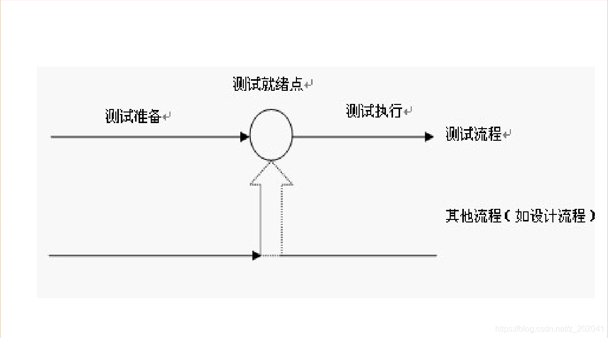

# Chapter 1 软件测试质量
1.1 什么是质量
1.2 质量
1.3 什么是软件质量
1.4 软件质量考虑要素
1.5 什么是质量保证
1.6 QC与QA的区别
1.7 ISO与ISO9000族标准的产生
1.8 CMMI
1.9 综合应用
1.1 什么是质量
物理学领域，物体所含物质的数量叫质量，是度量物体在同一地点重力势能和动能大小的物理量。
运用学领域，产品或工作的优劣程度。美国著名的质量管理专家朱兰（J.M.Juran）博士从顾客的角度出发，提出了产品质量就是产品的适用性。即产品在使用时能成功地满足用户需要的程度。用户对产品的基本要求就是适用，适用性恰如其分地表达了质量的内涵。
ISO8402“质量术语”定义
 质量：反映实体满足明确或隐含需要能力的特性总和。 
1.2 质量
1.3 什么是软件质量？
软件质量就是“软件与明确的和隐含的定义的需求相一致的程度” 
软件质量度量标准
① 软件需求是度量软件质量的基础，与需求不一致就是质量不高。
② 指定的标准定义了一组指导软件开发的准则，如果没有遵守这些准则，几乎肯定会导致质量不高。
③ 通常，有一组没有显式描述的隐含需求（如期望软件是容易维护的）。如果软件满足明确描述的需求，但却不满足隐含的需求，那么软件的质量仍然是值得怀疑的。

1.4 软件质量考虑要素
软件质量：
功能性
可靠性
易用性
性能
兼容性
可移植性
安全性
安装/卸载
可维护性
1.4.1 功能性
功能性
当软件在指定条件下使用时，软件产品提供满足明确和隐含要求的功能的能力。
适合性
软件产品符合需求，能解决用户业务问题。
准确性
软件产品数据和处理处理能力要准确。
互操作性
软件产品与其他系统的交互和对接能力。
安全保密性
软件产品权限安全，不同角色进入拥有不同的操作权限。
1.4.2 性能
时间特性
软件产品执行其功能时，提供满足需求的响应时间和处理时间以及吞吐率等指标的能力。
资源利用性
软件产品执行其功能时，提供满足需求的CPU、内存等占用率的能力。
1.4.3 安全性
软件在受到恶意攻击的情形下依然能够继续正确运行的能力
软件被在授权范围内合法使用的能力，如：序列号决定使用数。
1.4.4 兼容性
软件适应不同的规定环境下的能力
软件遵循与可移植性有关的标准或约定的能力
软件与其他替代软件兼容的能力
常见的兼容性（浏览器、操作系统）
1.4.5 可靠性
可靠性
 在指定条件下使用时，软件产品维持规定的性能级别的能力。
成熟性
 软件产品为避免由软件内部的故障而导致失效的能力。
容错性
软件出现故障或者违反其指定接口的情况下，依然维持规定的性能级别的能力。
易恢复性
失效发生后，重建规定的性能级别并恢复受直接影响的数据的能力。
1.4.6 易用性
易用性
在指定条件下使用时，软件产品被理解、学习、使用和吸引用户的能力。
易理解性
软件产品让用户无须过多学习就能理解的能力。
易学性
软件产品让用户即使参加了学习，学习成本高低的能力。
易操作性
软件产品让用户操作方便，符合使用习惯的能力。
吸引性
软件产品让用户觉得舒服、操作吸引眼球的能力。
用户体验性
 是以上几个特性的统称，部分企业把易用性也称之为用户体验性，是一个比较时髦的词。
1.4.7 安装/卸载
执行安装/卸载时，能按照一定的规格和流程将软件安装上的能力。
简化的软件安装/卸载过程。
提供亲切友善的操作逻辑或接口。
软件完整，避免被盗版、破解或植入病毒。
1.4.8 可维护性
易分析性
软件出问题后，快速判断问题点并能快速修复的能力。
易改变性
软件修改后可快速发布，快速投入生产的能力。
稳定性
软件避免由于软件修改而造成意外结果的能力。
易测试性
软件版本升级修改后被快速确认的能力。
1.4.9 可移植性
适应性
软件不需采用其他手段就可适应不同的指定环境的能力。
易安装性
软件在指定环境中被快速安装的能力。
共存性
软件在同一环境下同与其他软件共存的能力。
易替换性
软件在同一环境下，替代另一个相同用途的软件的能力。
1.5 什么是质量保证
为保证产品和服务充分满足消费者要求的质量而进行的有计划、有组织的活动。
软件研发过程中，通常定义了2个软件质量相关的角色。
 QA：QUALITY ASSURANCE 的简称，中文意思是质量保证
 QC：QUALITY CONTROL的简称，中文意思是质量控制
1.6 QC与QA的区别
QC和QA的主要区别：前者是保证产品质量符合规定,后者是建立体系并确保体系按要求运作,以提供内外部的信任。  QC就是测试人员，职责是尽可能早地发现软件的缺陷，并确保缺陷得到修复（有些企业里，测试人员被称为SQA）。
QA是流程的监督者，职责是创建和执行 改进软件开发过程，并防止软件缺陷发生的标准和方法。
1.7 ISO与ISO9000族标准的产生
 ISO：国际标准化组织
 ISO9000：国家质量管理体系标准
 1987年发布ISO 9000标准
 1959年美国国防部发布MIL-Q-9858A《质量大纲要求》和
MIL-Q-45208A《检验系统要求》
 — 从军品到民品
 — 从美国到其他国家
 — 从国家标准到国际标准
1.8.1 CMMI是什么？
Capability Maturity Model Integration (能力成熟度模型综合)
它综合了以下几方面: 
1、System engineering（系统工程）
 软件工程的对象是软件系统的开发活动，要求实现软件开发、运行、维护活
动系统化、制度化、量化。
2、Software engineering（软件工程）
 系统工程的对象是全套系统的开发活动，可能包括也可能不包括软件。系统
工程的核心是将客户的需求、期望和约束条件转化为产品解决方案，并对解
决方案的实现提供全程的支持。
3、Integrated Product and Process Development
（集成的产品和过程开发）
 集成的产品和过程开发是指在产品生命周期中，通过所有相关人员的通力合
作，采用系统化的进程来更好地满足客户的需求、期望和要求。
4、Supplier Sourcing（采购）
 主要内容包括：识别并评价产品的潜在来源、确定需要采购的产品的目标供
应商、监控并分析供应商的实施过程、评价供应商提供的工作产品以及对供
应协议和供应关系进行适当的调整。
1.8.2 CMMI是什么？
企业如何选择以上模块：
1、纯软件企业：选择CMMI中的软件工程的内容。
2、设备制造企业：选择系统工程和采购。
3、集成的企业：选择软件工程、系统工程和集成的产品和过程开发。
该模型提供一套可供公众使用的准则；这些准则描述那些成功地实施了过程改进的组织的特性。  该模型用“软件能力成熟度”来衡量这种软件综合能力。
1.8.3 CMMI等级
在模型中，所有软件组织的软件能力成熟度划分为5个等级—第1到第5级。数字越大，成熟度越高。高成熟度等级代表比较强的综合软件能力。
5个成熟度等级分别为：
第1级：初始级
第2级：受管理级
第3级：已定义级
第4级：定量管理级
第5级：持续优化级
实施CMMI的好处：
1、项目经理：提高自己的项目管理能力，从而使项目高质量、
低成本、按期地完成。
2、企业老板：提升企业管理水平，引入科学的管理理念，提升
企业整体管理水平。
1.9 综合应用
面试过程中，面试官随机问：
纸杯、电梯、门、笔怎么测？
请针对纸杯进行一个全面讨论 
# Chapter 2 软件测试概念
2.1 为什么需要软件测试
2.2 软件测试概念
2.3 软件测试目的
2.1 为什么需要软件测试
第一个Bug：1947年9月9日，正在哈佛大学测试 Mark II型艾肯中继器计算机，在电板编号为70的中继器触点旁发现了一只飞蛾 。操作员把飞蛾贴在计算机日志上了，并记录下了“首个发现Bug的实际案例”。
千年虫: 20世纪70年代，把４位数日期缩减为2位数，例如，1973->73,导致世界各地检查2000年兼容问题、解决2000年计算错误花费了数百亿美元!
Intel浮点除法软件缺陷：在计算机的“计算器”程序中输入以下算式：（4195835／3145727）×3145727–4195835如果答案是0，就说明该计算机浮点运算没问题。如果答案不是0，就表示计算机的浮点除法存在缺陷。1994年，英特尔奔腾CPU芯片就曾经存在这样一个软件缺陷，导致拿出4亿多美元来支付更换坏芯片的费用。
2.1 为什么需要软件测试
暴风影音：暴风影音“召回”全部软件曾引发六省断网事故，在2009年5 月19日黑客攻击DNS域名服务器造成连锁反应，最终酿成南方六省断网事件。最终在6月19日推出全新版本。
温州动车事故
12306一票难求
谈一谈发生在你身边的Bug案例。。。。。。
2.2 软件测试概念
在规定的条件下对程序进行操作，以发现错误，对软件质量进行评估。 
2.3 软件测试目的
发现bug、提高质量、降低成本。 
# Chapter 3 软件测试原则
所有的软件测试都应追溯到用户需求
应当把“尽早地和不断地进行软件测试”作为软件测试者的座右铭
完全测试是不可能的，测试需要终止
测试无法显示软件潜在的缺陷
充分注意测试中的群集现象
开发工程师应避免测试自己的程序
尽量避免测试的随意性
测试的抗药性
# Chapter 4 软件测试对象
软件包括程序、数据、文档，所以软件测试应该贯穿于整个软件生命周期中。
在整个软件生命周期中，各阶段又有不同的测试对象，形成了不同开发阶段的不同类型的测试。
# Chapter 5 软件测试模型
5.1 软件测试模型—V模型

5.2 软件测试模型—W模型

5.3 软件测试模型—X模型

5.4 软件测试模型—H模型

# Chapter 6 软件测试分类
6.1 按阶段划分
6.2 按是否运行程序划分
6.3 按是否查看代码划分
6.4 其他划分
6.1 按阶段划分
单元测试
集成测试
确认测试
系统测试
验收测试
6.1.1 按阶段划分-单元测试
概念
 单元测试又称模块测试，是针对程序模块（软件设计的最小单位）来进行正确性检验的测试工作。
单元测试的目的
 1、验证单元代码和详细设计文档的一致性
 2、发现在编码过程中引入的错误
 3、减少开发人员的调试代码时间
 4、大幅度减少后期缺陷的数量
6.1.1 按阶段划分-单元测试
单元测试案例
求绝对值的一个方法Abs()
public int Abs(int x)
{
 if (x<=0)
 return x ; 
 else
 return –x;
}
分析：代码把x>=0写成了x<=0，就出现了与设计不相符的错误。但实际上该代码编译是没有问题的。 在实际中，很多的单元测试工作都是程序员在做！
6.1.2 按阶段划分-集成测试
概念 
 集成测试是在单元测试的基础上，将所有模块按照概要设计要求（如根据流程图）组装成为子系统或系统而进行的测试。
集成测试的目的 
 1、验证各个子模块组合起来，能否达到预期要求的功能。
 2、验证一个模块的功能是否会对另一个模块的功能产生不利的影响。
6.1.2 按阶段划分-集成测试
集成测试又称为接口测试，是针对程序接口的一种测试。
时常有这样的情况发生，每个模块都能单独工作，但是将这些模块组装起来之后却不能正常工作。
A程序员写了代码，这些代码的功能提供给B程序员调用，但是由于A和B之间在方法的命名，大小写等问题上不一致，所以根本无法让A的数据给B用。
也就是说，在局部上不出问题，整合起来也不出问题吗？这很难说，因此集成测试就显得非常有必要。
现在问题出来了，我们怎么做集成呢？
 1、独立的测试完成后，组合成一个整体测，非增量式集成问 题：容易出现混乱，因为测试时可能发现一大堆问题，但每个故障的定位和纠正问题很难。
 2、把一个待测模块组合到已经测试过的模块上去，再进行测试，这种方式称为增量式集成。
 自上向下：桩程序
 自下向上：驱动程序
思考一个问题：清洗一台已经完全装配好的绞肉机容易，还是
清洗一台被完全拆分的绞肉机容易？
在实际中，很多的集成测试工作都是程序员在做！
6.1.3 按阶段划分-确认测试
确认测试：对照软件需求规格说明，对软件产品进行评估以确定其是否满足需求的过程。主要是对软件需求满足程度的一种评价和评估。
经过确认测试，应该得出的评价无非2种情况：
1、经过检验，软件功能、性能及其他方面的要求都已满足软件需求规格说明的规定，是一个合格的软件。
2、经过检验，发现与软件需求规格说明书有相当的偏离，得到了一个缺陷清单，这就需要开发部分和用户进行协调，找出解决的办法。
实际工作中，很多公司都不做确认测试，直接从集成测试跳到系统测试，即集成完成后，马上开始系统测试。
6.1.4 按阶段划分-系统测试
概念
 系统测试是将通过集成测试的软件，作为整个基于计算机系统的一个元素，与计算机硬件、外设、某些支持软件、数据和人员等其他系统元素结合在一起，在实际运行环境下，对计算机系统进行全面的功能覆盖。
系统测试的目的 
 验证软件产品是否满足用户需求。
6.1.4 按阶段划分-系统测试
常用的系统测试：
功能测试：对产品的各个功能进行验证，检查产品是否达到了用户要求的功能。
性能测试：通过自动化工具模式正常、峰值及异常负载条件，检查系统各项性能指标是否满足要求。
安全性测试：验证应用程序的安全级别和识别潜在安全性缺陷。
易用性测试：测试用户在使用软件时，软件交互的适应性、功能性和有效性。
兼容性测试：测试软件在不同的平台、不同的网络环境、不同的应用软件之间能否友好的运行。
配置测试
安装测试
卸载测试
6.1.5 按阶段划分-验收测试
概念
 验收测试是软件产品交付用户正式使用前的最后一道工序，它是以用户为主的测试，软件开发和软件测试人员也应参加。
验收测试的目的
 确认系统是满足用户需求并且能够发行。
验收形式：
① Alpha： Alpha测试是在用户组织模拟软件系统的运行环境下的一种验收测试，由用户或第三方测试公司进行的测试，模拟各类用户行为对即将面市的软件产品进行测试，试图发现并修改错误。俗称“内部测试”。
② Beta：Beta测试是用户公司组织各方面的典型终端用户在日常工作中实际使用beta版本，并要求用户报告异常情况，提出批评意见。俗称“公开测试”。
实际过程中：初验、终验
6.1.5 Alpha和Beta的区别
区别：两者的主要区别是测试场所不同。
Alpha测试是指把用户请到开发方的场所来测试， Alpha测试的环境是受开发方控制的，用户的数量相对比较少，时间比较集中。
Beta测试是指在一个或多个用户的场所进行的测试。beta测试的环境是不受开发方控制的，谁也不知道用户如何折磨软件，用户数量相对比较多，时间不集中。
alpha测试先于beta测试执行。
通用的软件产品需要较大规模的beta测试，测试周期比较长。如果产品通过了beta测试，那么就可以正式发行了。
一些软件开发公司把Alpha测试后发布的产品定义为：一个早期的、不稳定的软件版本所进行的验收测试，而Beta测试看成是对一个晚期的、更加稳定的软件版本所进行的验收测试。
6.2 按是否运行程序划分
静态测试：不运行被测试的软件，而只是静态的检查代码、界面或者文档

动态测试：实际运行被测试的软件，输入相应的测试数据，检查实际的输
出结果是否和预期结果相一致的过程。
6.3 按是否查看代码
黑盒测试
 把软件看成一个黑盒子，不管内部逻辑和内部特性，只依据规格说明书检查
程序的功能是否符合功能说明。
白盒测试
 又称为结构测试。着重于程序内部结构和算法，不关心功能和性能指标。
灰盒测试
 介于白盒和黑盒测试之间，基于程序运行时刻的外部表现同时又结合程序内
部逻辑结构来设计用例，执行程序并采集程序路径执行信息和外部用户接口结果的测试技术。
6.4.1 其他划分
回归测试
1、 测试新建bug，开发修改后将状态修改为“已修改”后通知测试进行验证，此
时测试人员所进行的测试称为回归测试。
2、 当测试回归后没有问题，但所测试的功能和其他模块或功能有一定的关系
（如数据有交叉和公式计算等），这时测试人员要针对这个部分再次测试，
保证不会因为修改了这个bug而导致新bug的产生（开发在修改代码或注释时
容易注释错），此时测试人员所进行的测试也称为回归测试。
3、 当项目（或模块和功能）快上线，测试经理会通知测试人员再把所有功能测试一次，保证上线后不会出问题，此时测试人员所进行的测试称为回归测试。
注意
1、回归测试在整个测试过程中占有很大的工作量比重，各个阶段都会进行多次回归测。
2、在渐进和快速迭代开发中，新版本的连续发布使回归测试进行的更加频繁，
3、在极端编程方法中，更是要求每天都进行若干次回归测试。
4、正确的回归测试策略来改进回归测试的效率和有效性是非常有意义的。
5、项目紧，执行1和2；项目不紧，执行1、2、3。
冒烟测试（BVT测试（Build Verification Test ））
1、 发布一个版本时，先对该版本进行最基本功能的测试，用以确认该版本基本功能正常后再开展进一步的测试工作；如基本功能不通过，打回给开发，直到冒烟通过。
2、 只有公司需要时才冒烟，并不是任何时候都冒烟，因为实际工作中项目往往比较紧。
3、 部分公司是让开发做冒烟，会给开发提供一个checklist。
随机测试（又名猴子测试）
随机选择测试数据做测试，主要根据经验进行功能和性能等抽查。
敏捷测试（敏捷开发引发）
敏捷最大特点是高度迭代，有周期性，并且能够及时、持续地响应客户的频繁反馈。简单点理解：天下武功，为快不破。
TDD（测试驱动开发）
开发功能代码之前，先编写测试代码。也就是说在明确要开发某个功能后，首先思考如何对这个功能进行测试，并完成测试代码的编写，然后编写相关的代码满足这些测试用例。然后循环进行添加其他功能，直到完全部功能的开发。在中国TDD已死！
# Chapter 7 软件测试风险
软件测试中的软件风险分析是根据预测软件将出现的风险，制定软件测试计划并排列优先等级，风险分析是对软件中潜在的问题进行识别、估计和评价的过程。
风险也包括进度风险、质量风险、人员风险、变更风险、成本风险等。
列举实际项目中遇到过的具体风险和风险控制手段
# Chapter 8 软件测试工程师
8.1 软件测试工程师岗位
8.2 软件测试工程师职业发展通道
8.3 软件测试工程师岗位要求
8.1 软件测试工程师岗位
岗位名字各种扩展
1、软件测试工程师
2、测试工程师
3、自动化测试工程师
4、性能测试工程师
5、测试开发工程师
岗位要求及后续职业规划发展
8.2 软件测试工程师职业发展通道

8.3 软件测试工程师岗位要求

