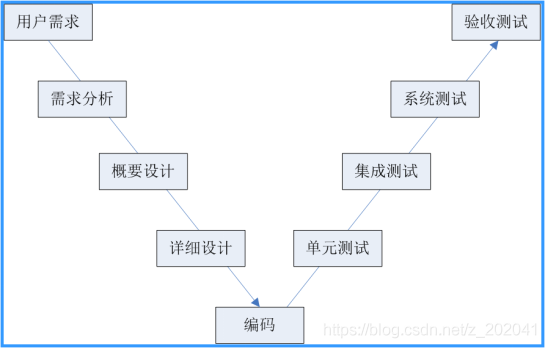

# 
软件测试的阶段划分

说明：该阶段划分没有涵盖需求和设计阶段的测试内容。
    1、单元测试
  （1）单元测试是测试阶段中的最小测试单位，一个方法（函数）、窗口、功能、类等都可以看成是一个单元。
  （2）单元测试主要参考详细设计阶段的相关文档
  （3）单元测试理论上使用白盒测试方式进行
   说明：在实际工作中，通常由开发人员进行单元测试（白盒），这样可以降低单元测试的成本。但是开发人员进行单元测试的质量不能保证，所以企业经常会采用交换互测，或者开发测第一轮（白盒），测试人员测第二轮（黑盒）的方法提高测试质量。
  （4）驱动模块和桩模块
 在单元测试中，测试者经常会需要编写桩模块和驱动模块。
   驱动模块：模拟被测模块的上一级模块（调用被测模块的）
   桩模块：模拟被测模块的下一级模块（被“被测模块”调用）
调用关系：驱动模块→被测模块→桩模块

    2、集成测试（组装测试）
 （1）在单元测试的基础上，对软件的各个部分进行逐步组装，合并的测试过程。
 （2）软件不是一蹴而就的，而是逐步组装完成的，在逐步组装的过程中会形成若干的版本。（迭代测试）
 （3）集成测试阶段主要依据概要设计相关文档
 （4）集成测试阶段主要采用黑盒测试，核心功能、重点、难点部分会辅助以白盒测试。
 （5）“冒烟”测试（版本验证测试）
   当测试组拿到新的版本测试任务时，通常会先进行“冒烟测试”--就是挑选较少的测试人员（1-3人，经验丰富），花费较短的时间（0.5-2天）对软件的核心功能进行快速测试，如果核心功能能够实现，就接受该版本，全组展开全面测试，如果核心功能无法实现，版本不稳定，就返回开发组。
 （6）集成测试阶段，测试方拿到一个新版本后，工作思路？
    首先：进行冒烟测试--验证版本是否能被接受（不一定有）
    接下来：
      返测--验证bug是否真正被解决
      回归测试--验证原有功能是否依然正常
    最后：对版本中新功能进行测试。（有可能会有版本没有新功能，只是对之前的bug进行修复。）
    3、系统测试
（1）是在软件组装完成后，对集成了软件和硬件的完整系统进行模拟真实环境的测试过程。
（2）系统测试阶段的测试重点：
   （a）模拟真实环境的完整系统的正确运行（功能、性能等）
   （b）完整系统的兼容性测试
 （3）系统测试阶段主要依据：需求相关文档
 （4）系统测试阶段应用黑盒测试方式
 （5）“确认”测试阶段
  在系统测试之前，会安排一次确认测试，主要确认以下两个内容：
   （a）确认组装完成的软件是否具备进行全面系统测试的基础。
   （b）确认文档是否准备齐全，尤其是要交付给用户的文档和参与认证的文档。
说明：确认测试阶段参与人员相对较少，周期较短，所以通常不将确认测试阶段与单元、集成、系统、验收测试等阶段并列。

    4、验收测试
（1）UAT:user acceptance test 用户接受度测试
 （2）验收测试是以用户为主对软件质量进行检查的过程。
 （3）验收测试分为两个小的阶段：
   （a）alpha测试阶段
    理论上应由用户参与，在软件公司的环境内（软件研发方对于发现的bug控制力强），对软件的检查。
   说明：在实际测试时，用户可能无法到软件公司进行alpha测试，通常会由软件公司找人代替用户完成。或者用户请第三方测试代替完成。
   （b）beta 测试阶段
   由最终用户在自己的环境内完成（软件研发方对于所发现的bug控制力较弱）。
  例：公共类软件（输入法、OS、网络游戏等、QQ） 将beta版软件免费发放给最终用户，通过收集用户在使用软件中遇到的问题（bug），来完成beta测试。（公测）
二、软件测试模型
   1、软件测试模型能够划分开发阶段和测试阶段（级别），并且能够体现开发与测试阶段的对应关系。常见的测试模型有v模型、w模型、H模型等
   2、v模型（面试常见题）
 （1）会画
 
（2）优、缺点
    优点：
     开发阶段和测试阶段（级别）划分清晰明确。
     开发阶段和测试阶段的对应关系清晰明确。
     v模型既包括底层的单元测试（代码级、专业级）又包含验收测试（界面级、用户级）。
   缺点：
   缺少需求和设计阶段的测试过程，给人以错觉，以为测试只是开发之后的收尾工作，但是实际上测试与开发工作是同步的。
   不应只测程序，需求和设计阶段的测试也是必须要进行的，文档也要测试。
   不符合"尽早测试原则”
和“不断测试原则"
   3、w模型（了解）
  （1）w模型可以看成是双v模型，第一个v表示开发活动，第二个v表示测试活动。
  （2）w模型解决了v模型的问题，加入了需求和设计阶段的测试内容。
  （3)w模型的优点
     加入了需求和设计阶段的测试内容，开发与测试是同步进行的。
     体现了文档和程序都需要测试
     符合尽早测试和不断测试原则

 三、软件测试的分类（名词、术语）
   1、按测试技术分类
   （1）黑盒测试：也叫功能测试，是不考虑程序的内部结构，只知道程序的输入和输出的情况下，进行的功能验证的测试方式。
   （2）白盒测试：也叫结构测试，是只考虑程序的内部结构，而不考虑外部功能的测试方式。
   （3）灰盒测试（了解）：将黑盒测试和白盒测试的要素结合起来进行测试的方式。通常是先黑盒测试发现问题，再进一步通过白盒测试进行bug调查。常应用于集成测试阶段。
  补充：白盒测试
   （1） 白盒测试质量较高，但是成本过高，而且测试效率低，时间成本特别高。
   （2）白盒测试要求测试者会编程。
   （3）白盒测试也需要编写用例。

   2、按测试是否需要运行被测系统划分
   （1）动态测试
   需要将程序运行起来测试的是动态测试。
   例：功能测试（黑盒测试）就是动态测试。
  白盒测试有可能是静态的，也有可能是动态的。
   （2）静态测试 
   不需要将程序运行就可以进行的测试是静态测试。
  例：文档测试
      UI测试（界面）
    （静态）代码测试：检查的是程序代码的规范性和标准性。
 问题：白盒测试和（静态）代码测试的区别？
  白盒测试：要求测试人员会编程；主要对程序的逻辑实现进行检测；需要编写测试用例；
  代码测试：不需要测试者会编程；测试重点是代码的规范性和标准型；测试者只需要对照代码检查单检查即可。
 3、功能测试和性能测试
   （1）功能测试
    所有软件都必须先进行功能测试，验证功能正确性。
    既可以手工完成功能测试，也可以借助自动化工具（selenium、Appium）实现自动化功能测试。

   （2）性能测试
   并不是所有软件都必须做性能测试，分布式软件（B/S,C/S）需要做性能测试。
   性能测试只能借助工具（LoadRunner，jmeter），通过自动化的方式实现，无法手工进行。
   性能测试常用来进行压力测试、负载测试等（性能测试课程会学）
  4、其它（名词、面试题）
   （1）返测：对开发人员修改的bug进行测试，已验证bug是否已经被解决。
   （2）回归测试（回测）：在当前版本中对上一个版本测过的所有功能，再重新测试一遍，叫回归测试。
回归测试能够验证在当前版本中原有功能是否依然正常。
回归测试中存在重复（之前的用例重复执行），建议使用自动化方式进行，可以提高回归测试效率。
   （3）随机测试（猴子测试--monkey  testing）
   就是在测试用例执行完成后，随意挑选数据测试的过程。随机测试只能是用例执行后的补充测试。
   （4）兼容性测试：
   就是所设计软件与硬件和其他软件之间的兼容性的测试，主要分成以下三类：
  （a） 与硬件兼容
      与整机兼容
      与外设兼容
  （b） 与软件兼容
      与操作系统兼容
      与浏览器兼容（B/S）
      与其他应用软件之间的兼容
       与数据库（DBMS）兼容
  （c）数据兼容
   软件的不同版本之间的数据兼容问题。

   （5）功能（黑盒）测试的方法有哪些？使用策略是什么？
   （6）软件项目的测试流程？
    步骤1：需求分析
    步骤2：制定测试计划 （问题：测试计划的主要组成）
   步骤3：设计测试的过程（分析设计测试用例）
   步骤4：执行测试，记录测试的结果（通过pass，失败failed）
   步骤5：记录缺陷，跟踪和管理缺陷（缺陷报告）
   步骤6：测试总结（提交《测试报告》《测试总结报告》）

v模型
需求分析、概要设计、详细设计、编码、单元测试、集成测试、系统测试、验收测试
单元测试：又称模块测试，针对单一的程序模块进行的测试。
集成测试：又叫组装测试，在单元测试的基础上，对所有模块进行测试。
系统测试：将整个软件看做一个整体来进行测试，包括功能、性能、兼容性。
验收测试：
内测版（alpha）内部交流版本，可能存在很多bug，不建议用户安装；
公测版（beta）面向所有用户，通过用户的反馈再去修改细节；
候选版（gamma）与正式软件相差无几。

测试v模型优缺点
优点：包含了底层测试（单元测试）和高层测试（系统测试）；清楚地标识了开发和测试的各个阶段；自上而下逐步求精，每个阶段分工明确，便于整体项目的把控。
缺点：自上而下的顺序导致了测试工作在编码之后，就导致错误不能及时的修改；实际工作中，需求经常变化，导致v模型步骤反复执行，返工量很大，灵活度较低。
改良：每个步骤进行小的迭代工作。

不同维度下有多少种测试？
按照软件测试阶段划分？
单元测试、集成测试、系统测试、回归测试、验收测试
按测试视角划分？
外部视角（黑盒测试）-内部测试（白盒测试）-内外兼顾（灰盒测试）
按测试对象的属性划分？
GUI（图形用户界面测试）、功能测试、易用性测试、接口测试、性能测试、安全性测试、兼容性测试
静态测试、动态测试
手工测试、自动化测试
