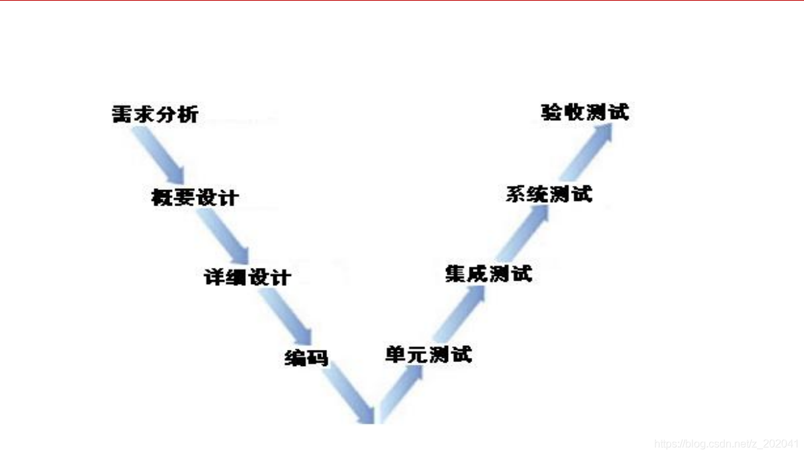
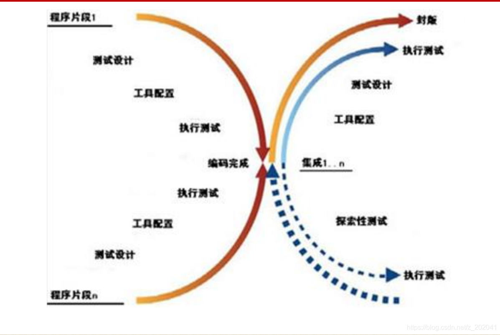
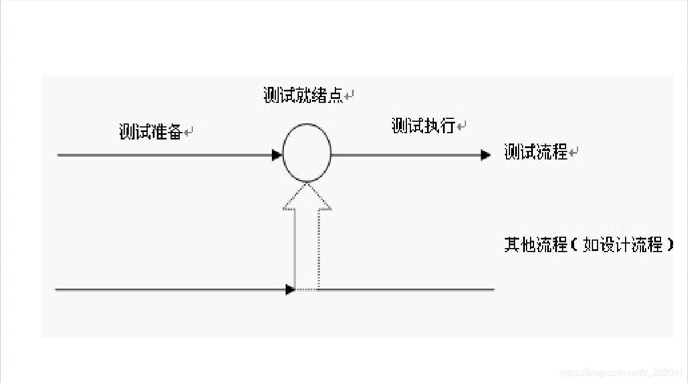

# windows基础

## 软件

### 定义

计算机=软件+硬件
软件=程序+文档
注意：测试对象是程序和文档，不能只测程序，文档也要测。

### 开发阶段

>   阶段

第一阶段：需求分析阶段
由产品部门的需求分析人员完成
产出物：《需求规格说明书》
第二阶段：设计阶段
由系统架构师或分析师完成
产出物：《概要设计说明书》、《详细设计说明书》
第三阶段：编码阶段 
由开发人员完成
产出物：程序

>   说明

1、需求分析阶段

```
 由需求分析人员完成
《需求规格说明书》
```

2、概要设计阶段

```
 由系统架构师或分析师完成
 《概要设计说明书》
```

3、详细设计阶段

```
 由系统架构师或分析师完成
《详细设计说明书》
```

4、编码阶段

```
  由开发人员完成
  程序
```

### 缺陷

1、缺陷定义方式1（5条）重点
说明：定义与顺序无关，只要满足其中任何一条就是bug。
（1）需求要求的功能没有实现。
（2）实现了需求没有要求的功能。（画蛇添足）
（3）软件中出现了指明不应该出现的错误。
（4）需求虽未明确说明，但是应该实现的功能没有实现。
（5）软件不易使用，难以理解，运行缓慢等，站在用户角度上，一切不好的地方。
2、软件缺陷的定义2（理解）--IEEE
（1）从软件产品的外部来看，   --黑盒测试（功能）
（2）从软件产品的内部来看，  --白盒测试

### 测试流程

软件项目的测试流程
1、熟悉、分析需求
2、制定测试计划

```
测试计划通常由测试组长或测试经理制定。
测试人员要阅读并执行测试计划。
```

3、设计测试（分析，编写测试用例）
4、执行测试，并记录测试结果（通过，失败）
5、记录缺陷
6、对缺陷跟踪、管理
7、测试总结（测试总结报告/测试报告）
   测试总结主要总结测试中的数据。
   提示：面试时经常会问到具体数据，参考总结报告，提前准备。
要求：必须熟练掌握，并且有项目经验后，要能够结合项目说明。

### 缺陷报告

#### 1、什么是缺陷报告？

   （1）测试人员发现bug，通过缺陷报告将bug记录下来。
   （2）通过缺陷报告测试方将bug告知给开发方。
   （3）通过缺陷报告实现对bug的跟踪管理。
   （4）缺陷报告是测试方和开发方之间重要的沟通方式。

#### 2、如何编写缺陷报告？

（1）说明：在企业中缺陷是通过缺陷管理工具进行管理，常见的工具有：禅道、QC、bugfree、bugzilla、jira（鸡爪）、企业自制等
不同企业使用不同的bug管理工具，模板会有不同，但是缺陷管理的核心部分是大同小异的。
（2）缺陷的核心组成部分：
  案例：除法操作，除数是0时，程序异常退出。
   1）缺陷编号（defect ID）

```
记录发现bug的顺序号
```

   在工具中缺陷编号是自动生成的，可以唯一标识每条缺陷。
  说明：在企业中项目的缺陷是统一管理的，所以编号是统一生成，不是只生成自己的。
  2）缺陷标题（summary）
 简明扼要的将缺陷描述出来（概括）
   说明：没有标准答案，老师给的也只是参考。
  3）缺陷发现者/创建者（detected by）
  测试人员发现bug，填写自己的工作账号
  4）提交缺陷的日期（detected on date）

```
注意：发现缺陷后应及时提交缺陷。
```

   说明：1、发现缺陷应确认审核，尽量避免提交“假bug”2、缺陷“审核”后，不要人为延误应及时提交。
  5）指派给谁（assigned to）
   指派过程：
   首先：测试人员→开发方负责人
   接下来：开发方负责人→具体负责的开发人员
  6）功能模块（subject）
   定位在哪个模块中发现的该bug
   说明：开发方负责人可以通过功能模块，明确解决该bug的对应开发人员。
  7）版本（detected in release）
   说明：在软件研发过程中出现的若干临时版本，和软件最终发布的版本都是版本，都需要测试。
 扩展：回归测试(重点)
  回归测试就是在当前版本中，对上一个版本中测过的所有功能点，再重新测试一遍。
  回归测试的必要性：通过回归测试验证当前版本中:新增加的功能对原有功能是否有影响，带来bug；修复的bug是否同时带来了新的问题。
  回归测试存在重复，建议使用自动化的方式进行，可以大大提高回归测试效率。
  8）状态（status）
   表明该缺陷处于怎样的处理情况。
   缺陷的状态：
   新的（new）
   激活的（open）
   已解决的（fixed）
   关闭的（closed）
   被拒绝的（rejected）
   重新激活的（reopen）   
重点面试题：缺陷的跟踪管理过程（生命周期、一生、流程、步骤）？

 步骤1：测试人员提交新的bug给开发方负责人。
  步骤2：开发方负责人审核bug，
   情况1：bug审核通过，开发方负责人将会激活bug，并指派给相应的开发人员。
  情况2：bug审核未通过，开发方将拒绝bug。
  步骤3：开发人员解决bug，解决后将缺陷设置为“已解决”状态。（待返测的bug）
  步骤4：测试人员对已解决的bug进行返测，
   情况1：返测通过，测试人员将bug关闭。
   情况2：返测未通过，测试人员将缺陷重新激活，并指派回开发人员继续解决，直到返测通过，bug关闭为止。
 9）缺陷的严重程度（severity）
  表明缺陷有多糟糕，对程序的影响有多坏。
   严重级别：(1,2,3,4)
   致命的（urgent）
   严重的（high)
   中等的（medium）--最多
   建议性的小问题(low)
发现问题：严重级别的定义过于笼统，容易在实际工作中引起争议，所以公司通常会编写级别的详细说明，进一步规范级别的划分。
注意：严重级别定义应专业、准确，不应为了引起开发方重视而故意夸大。
不同公司、项目组严重级别详细说明可能不同，工作中要注意参考。
10）缺陷的优先级（priority）
表明的是希望或者建议开发方在什么时候，什么版本解决该bug。
  优先级的级别：
   立即解决（urgent）
   下一个版本解决（high）--常用
   软件产品发布之前解决（medium）
   尽量在软件发布之前解决（low）
   注意：对于优先级不同公司的详细说明可能不同，要注意参考。

补充：关于严重程度和优先级的面试题。
  Q1:影响优先级的因素有哪些？
   （1）缺陷的严重程度，一般越严重，优先级越高。
   （2）开发人员的开发压力，开发压力越小，解决bug的优先级越高。
   （3）缺陷的影响范围，影响范围越大，bug的优先级越高。

```
（4）解决bug的成本（时间），成本越小，优先级越高。
```

  Q2：缺陷的严重程度和优先级一定是严格成正比关系吗？
  缺陷的严重程度和优先级不是严格成正比的，例如：界面的错别字，就是严重级别低，但是优先级高的情况。

  Q3：优先级和严重程度一旦确定后能改吗？
 严重程度一旦确定不能修改；
  优先级一般能改，而且经常延后处理。
  	Q4：是否存在发布的软件中，有bug是发现了但是没有解决的情况？
  在发布的软件中可能存在发现但是没有解决的bug。此类bug应通过“bug讨论”，在权衡解决的成本，和不解决是否给用户带来严重后果，以及是否会造成法律纠纷后才能决定。
  关于此类bug，软件企业通常通过后期升级版本或者打补丁的方式给予解决。
11）缺陷描述（description）
   通过将发现的过程和数据记录下来，使开发人员能够重现该bug。（开发人员能看明白）
 要求：逻辑要清晰，用语应专业、准确，描述应易读、易懂，在描述中不要出现任何评价性的语言。如实记录缺陷。


# 软件测试定义

描述一种用来促进鉴定软件的正确性、完整性、安全性和质量的过程。


# 软件测试目的

**发现缺陷**，并进行修复，以确保系统满足预期结果

**质量评估**，说明系统在相应时间点的质量情况，为利益干系人决策是否发布版本提供依据

**预防缺陷**，在软件生命周期早期，通过对测试依据（如合同要求、行业标准、法律要求等）和需求文档进行测试，可以预防将缺陷引入代码中


# 软件测试原则

测试可以显示缺陷的存在

穷尽测试时不肯能的

测试尽早介入

缺陷具有集群性

杀虫剂悖论

测试活动依赖于测试内容，测试内容决定测试活动

系统发布取决于是否满足客户需求，而不是是否还有缺陷


# 软件测试对象

软件包括程序、数据、文档，所以软件测试应该贯穿于整个软件生命周期中。
在整个软件生命周期中，各阶段又有不同的测试对象，形成了不同开发阶段的不同类型的测试。


# 软件测试质量

1.1 什么是质量
物理学领域，物体所含物质的数量叫质量，是度量物体在同一地点重力势能和动能大小的物理量。
运用学领域，产品或工作的优劣程度。美国著名的质量管理专家朱兰（J.M.Juran）博士从顾客的角度出发，提出了产品质量就是产品的适用性。即产品在使用时能成功地满足用户需要的程度。用户对产品的基本要求就是适用，适用性恰如其分地表达了质量的内涵。
ISO8402“质量术语”定义
 质量：反映实体满足明确或隐含需要能力的特性总和。 
1.2 质量
1.3 什么是软件质量？
软件质量就是“软件与明确的和隐含的定义的需求相一致的程度” 
软件质量度量标准
① 软件需求是度量软件质量的基础，与需求不一致就是质量不高。
② 指定的标准定义了一组指导软件开发的准则，如果没有遵守这些准则，几乎肯定会导致质量不高。
③ 通常，有一组没有显式描述的隐含需求（如期望软件是容易维护的）。如果软件满足明确描述的需求，但却不满足隐含的需求，那么软件的质量仍然是值得怀疑的。

1.4 软件质量考虑要素
软件质量：
功能性
可靠性
易用性
性能
兼容性
可移植性
安全性
安装/卸载
可维护性
1.4.1 功能性
功能性
当软件在指定条件下使用时，软件产品提供满足明确和隐含要求的功能的能力。
适合性
软件产品符合需求，能解决用户业务问题。
准确性
软件产品数据和处理处理能力要准确。
互操作性
软件产品与其他系统的交互和对接能力。
安全保密性
软件产品权限安全，不同角色进入拥有不同的操作权限。
1.4.2 性能
时间特性
软件产品执行其功能时，提供满足需求的响应时间和处理时间以及吞吐率等指标的能力。
资源利用性
软件产品执行其功能时，提供满足需求的CPU、内存等占用率的能力。
1.4.3 安全性
软件在受到恶意攻击的情形下依然能够继续正确运行的能力
软件被在授权范围内合法使用的能力，如：序列号决定使用数。
1.4.4 兼容性
软件适应不同的规定环境下的能力
软件遵循与可移植性有关的标准或约定的能力
软件与其他替代软件兼容的能力
常见的兼容性（浏览器、操作系统）
1.4.5 可靠性
可靠性
 在指定条件下使用时，软件产品维持规定的性能级别的能力。
成熟性
 软件产品为避免由软件内部的故障而导致失效的能力。
容错性
软件出现故障或者违反其指定接口的情况下，依然维持规定的性能级别的能力。
易恢复性
失效发生后，重建规定的性能级别并恢复受直接影响的数据的能力。
1.4.6 易用性
易用性
在指定条件下使用时，软件产品被理解、学习、使用和吸引用户的能力。
易理解性
软件产品让用户无须过多学习就能理解的能力。
易学性
软件产品让用户即使参加了学习，学习成本高低的能力。
易操作性
软件产品让用户操作方便，符合使用习惯的能力。
吸引性
软件产品让用户觉得舒服、操作吸引眼球的能力。
用户体验性
 是以上几个特性的统称，部分企业把易用性也称之为用户体验性，是一个比较时髦的词。
1.4.7 安装/卸载
执行安装/卸载时，能按照一定的规格和流程将软件安装上的能力。
简化的软件安装/卸载过程。
提供亲切友善的操作逻辑或接口。
软件完整，避免被盗版、破解或植入病毒。
1.4.8 可维护性
易分析性
软件出问题后，快速判断问题点并能快速修复的能力。
易改变性
软件修改后可快速发布，快速投入生产的能力。
稳定性
软件避免由于软件修改而造成意外结果的能力。
易测试性
软件版本升级修改后被快速确认的能力。
1.4.9 可移植性
适应性
软件不需采用其他手段就可适应不同的指定环境的能力。
易安装性
软件在指定环境中被快速安装的能力。
共存性
软件在同一环境下同与其他软件共存的能力。
易替换性
软件在同一环境下，替代另一个相同用途的软件的能力。
1.5 什么是质量保证
为保证产品和服务充分满足消费者要求的质量而进行的有计划、有组织的活动。
软件研发过程中，通常定义了2个软件质量相关的角色。
 QA：QUALITY ASSURANCE 的简称，中文意思是质量保证
 QC：QUALITY CONTROL的简称，中文意思是质量控制
1.6 QC与QA的区别
QC和QA的主要区别：前者是保证产品质量符合规定,后者是建立体系并确保体系按要求运作,以提供内外部的信任。  QC就是测试人员，职责是尽可能早地发现软件的缺陷，并确保缺陷得到修复（有些企业里，测试人员被称为SQA）。
QA是流程的监督者，职责是创建和执行 改进软件开发过程，并防止软件缺陷发生的标准和方法。
1.7 ISO与ISO9000族标准的产生
 ISO：国际标准化组织
 ISO9000：国家质量管理体系标准
 1987年发布ISO 9000标准
 1959年美国国防部发布MIL-Q-9858A《质量大纲要求》和
MIL-Q-45208A《检验系统要求》
 — 从军品到民品
 — 从美国到其他国家
 — 从国家标准到国际标准
1.8.1 CMMI是什么？
Capability Maturity Model Integration (能力成熟度模型综合)
它综合了以下几方面: 
1、System engineering（系统工程）
 软件工程的对象是软件系统的开发活动，要求实现软件开发、运行、维护活
动系统化、制度化、量化。
2、Software engineering（软件工程）
 系统工程的对象是全套系统的开发活动，可能包括也可能不包括软件。系统
工程的核心是将客户的需求、期望和约束条件转化为产品解决方案，并对解
决方案的实现提供全程的支持。
3、Integrated Product and Process Development
（集成的产品和过程开发）
 集成的产品和过程开发是指在产品生命周期中，通过所有相关人员的通力合
作，采用系统化的进程来更好地满足客户的需求、期望和要求。
4、Supplier Sourcing（采购）
 主要内容包括：识别并评价产品的潜在来源、确定需要采购的产品的目标供
应商、监控并分析供应商的实施过程、评价供应商提供的工作产品以及对供
应协议和供应关系进行适当的调整。
1.8.2 CMMI是什么？
企业如何选择以上模块：
1、纯软件企业：选择CMMI中的软件工程的内容。
2、设备制造企业：选择系统工程和采购。
3、集成的企业：选择软件工程、系统工程和集成的产品和过程开发。
该模型提供一套可供公众使用的准则；这些准则描述那些成功地实施了过程改进的组织的特性。  该模型用“软件能力成熟度”来衡量这种软件综合能力。
1.8.3 CMMI等级
在模型中，所有软件组织的软件能力成熟度划分为5个等级—第1到第5级。数字越大，成熟度越高。高成熟度等级代表比较强的综合软件能力。
5个成熟度等级分别为：
第1级：初始级
第2级：受管理级
第3级：已定义级
第4级：定量管理级
第5级：持续优化级
实施CMMI的好处：
1、项目经理：提高自己的项目管理能力，从而使项目高质量、
低成本、按期地完成。
2、企业老板：提升企业管理水平，引入科学的管理理念，提升
企业整体管理水平。
1.9 综合应用
面试过程中，面试官随机问：
纸杯、电梯、门、笔怎么测？
请针对纸杯进行一个全面讨论 


# 软件测试模型

5.1 软件测试模型—V模型


5.2 软件测试模型—W模型


5.3 软件测试模型—X模型


5.4 软件测试模型—H模型



# 软件测试分类

```reStructuredText
冒烟测试
ucd（ui）测试
功能测试
易用性测试
性能测试
兼容性测试
安全性测试
稳定性测试
可靠性测试
随机测试
自动化测试

```


# 软件测试的阶段划分

说明：该阶段划分没有涵盖需求和设计阶段的测试内容。
    1、单元测试
  （1）单元测试是测试阶段中的最小测试单位，一个方法（函数）、窗口、功能、类等都可以看成是一个单元。
  （2）单元测试主要参考详细设计阶段的相关文档
  （3）单元测试理论上使用白盒测试方式进行
   说明：在实际工作中，通常由开发人员进行单元测试（白盒），这样可以降低单元测试的成本。但是开发人员进行单元测试的质量不能保证，所以企业经常会采用交换互测，或者开发测第一轮（白盒），测试人员测第二轮（黑盒）的方法提高测试质量。
  （4）驱动模块和桩模块
 在单元测试中，测试者经常会需要编写桩模块和驱动模块。
   驱动模块：模拟被测模块的上一级模块（调用被测模块的）
   桩模块：模拟被测模块的下一级模块（被“被测模块”调用）
调用关系：驱动模块→被测模块→桩模块

    2、集成测试（组装测试）
 （1）在单元测试的基础上，对软件的各个部分进行逐步组装，合并的测试过程。
 （2）软件不是一蹴而就的，而是逐步组装完成的，在逐步组装的过程中会形成若干的版本。（迭代测试）
 （3）集成测试阶段主要依据概要设计相关文档
 （4）集成测试阶段主要采用黑盒测试，核心功能、重点、难点部分会辅助以白盒测试。
 （5）“冒烟”测试（版本验证测试）
   当测试组拿到新的版本测试任务时，通常会先进行“冒烟测试”--就是挑选较少的测试人员（1-3人，经验丰富），花费较短的时间（0.5-2天）对软件的核心功能进行快速测试，如果核心功能能够实现，就接受该版本，全组展开全面测试，如果核心功能无法实现，版本不稳定，就返回开发组。
 （6）集成测试阶段，测试方拿到一个新版本后，工作思路？
    首先：进行冒烟测试--验证版本是否能被接受（不一定有）
    接下来：
      返测--验证bug是否真正被解决
      回归测试--验证原有功能是否依然正常
    最后：对版本中新功能进行测试。（有可能会有版本没有新功能，只是对之前的bug进行修复。）
    3、系统测试
（1）是在软件组装完成后，对集成了软件和硬件的完整系统进行模拟真实环境的测试过程。
（2）系统测试阶段的测试重点：
   （a）模拟真实环境的完整系统的正确运行（功能、性能等）
   （b）完整系统的兼容性测试
 （3）系统测试阶段主要依据：需求相关文档
 （4）系统测试阶段应用黑盒测试方式
 （5）“确认”测试阶段
  在系统测试之前，会安排一次确认测试，主要确认以下两个内容：
   （a）确认组装完成的软件是否具备进行全面系统测试的基础。
   （b）确认文档是否准备齐全，尤其是要交付给用户的文档和参与认证的文档。
说明：确认测试阶段参与人员相对较少，周期较短，所以通常不将确认测试阶段与单元、集成、系统、验收测试等阶段并列。

    4、验收测试
（1）UAT:user acceptance test 用户接受度测试
 （2）验收测试是以用户为主对软件质量进行检查的过程。
 （3）验收测试分为两个小的阶段：
   （a）alpha测试阶段
    理论上应由用户参与，在软件公司的环境内（软件研发方对于发现的bug控制力强），对软件的检查。
   说明：在实际测试时，用户可能无法到软件公司进行alpha测试，通常会由软件公司找人代替用户完成。或者用户请第三方测试代替完成。
   （b）beta 测试阶段
   由最终用户在自己的环境内完成（软件研发方对于所发现的bug控制力较弱）。
  例：公共类软件（输入法、OS、网络游戏等、QQ） 将beta版软件免费发放给最终用户，通过收集用户在使用软件中遇到的问题（bug），来完成beta测试。（公测）
二、软件测试模型
   1、软件测试模型能够划分开发阶段和测试阶段（级别），并且能够体现开发与测试阶段的对应关系。常见的测试模型有v模型、w模型、H模型等
   2、v模型（面试常见题）
 （1）会画

（2）优、缺点
    优点：
     开发阶段和测试阶段（级别）划分清晰明确。
     开发阶段和测试阶段的对应关系清晰明确。
     v模型既包括底层的单元测试（代码级、专业级）又包含验收测试（界面级、用户级）。
   缺点：
   缺少需求和设计阶段的测试过程，给人以错觉，以为测试只是开发之后的收尾工作，但是实际上测试与开发工作是同步的。
   不应只测程序，需求和设计阶段的测试也是必须要进行的，文档也要测试。
   不符合“尽早测试原则”
和“不断测试原则”
   3、w模型（了解）
  （1）w模型可以看成是双v模型，第一个v表示开发活动，第二个v表示测试活动。
  （2）w模型解决了v模型的问题，加入了需求和设计阶段的测试内容。
  （3）w模型的优点
     加入了需求和设计阶段的测试内容，开发与测试是同步进行的。
     体现了文档和程序都需要测试
     符合尽早测试和不断测试原则

 三、软件测试的分类（名词、术语）
   1、按测试技术分类
   （1）黑盒测试：也叫功能测试，是不考虑程序的内部结构，只知道程序的输入和输出的情况下，进行的功能验证的测试方式。
   （2）白盒测试：也叫结构测试，是只考虑程序的内部结构，而不考虑外部功能的测试方式。
   （3）灰盒测试（了解）：将黑盒测试和白盒测试的要素结合起来进行测试的方式。通常是先黑盒测试发现问题，再进一步通过白盒测试进行bug调查。常应用于集成测试阶段。
  补充：白盒测试
   （1） 白盒测试质量较高，但是成本过高，而且测试效率低，时间成本特别高。
   （2）白盒测试要求测试者会编程。
   （3）白盒测试也需要编写用例。

   2、按测试是否需要运行被测系统划分
   （1）动态测试
   需要将程序运行起来测试的是动态测试。
   例：功能测试（黑盒测试）就是动态测试。
  白盒测试有可能是静态的，也有可能是动态的。
   （2）静态测试 
   不需要将程序运行就可以进行的测试是静态测试。
  例：文档测试
      UI测试（界面）
    （静态）代码测试：检查的是程序代码的规范性和标准性。
 问题：白盒测试和（静态）代码测试的区别？
  白盒测试：要求测试人员会编程；主要对程序的逻辑实现进行检测；需要编写测试用例；
  代码测试：不需要测试者会编程；测试重点是代码的规范性和标准型；测试者只需要对照代码检查单检查即可。
 3、功能测试和性能测试
   （1）功能测试
    所有软件都必须先进行功能测试，验证功能正确性。
    既可以手工完成功能测试，也可以借助自动化工具（selenium、Appium）实现自动化功能测试。

   （2）性能测试
   并不是所有软件都必须做性能测试，分布式软件（B/S,C/S）需要做性能测试。
   性能测试只能借助工具（LoadRunner，jmeter），通过自动化的方式实现，无法手工进行。
   性能测试常用来进行压力测试、负载测试等（性能测试课程会学）
  4、其它（名词、面试题）
   （1）返测：对开发人员修改的bug进行测试，已验证bug是否已经被解决。
   （2）回归测试（回测）：在当前版本中对上一个版本测过的所有功能，再重新测试一遍，叫回归测试。
回归测试能够验证在当前版本中原有功能是否依然正常。
回归测试中存在重复（之前的用例重复执行），建议使用自动化方式进行，可以提高回归测试效率。
   （3）随机测试（猴子测试--monkey  testing）
   就是在测试用例执行完成后，随意挑选数据测试的过程。随机测试只能是用例执行后的补充测试。
   （4）兼容性测试：
   就是所设计软件与硬件和其他软件之间的兼容性的测试，主要分成以下三类：
  （a） 与硬件兼容
      与整机兼容
      与外设兼容
  （b） 与软件兼容
      与操作系统兼容
      与浏览器兼容（B/S）
      与其他应用软件之间的兼容
       与数据库（DBMS）兼容
  （c）数据兼容
   软件的不同版本之间的数据兼容问题。

   （5）功能（黑盒）测试的方法有哪些？使用策略是什么？
   （6）软件项目的测试流程？
    步骤1：需求分析
    步骤2：制定测试计划 （问题：测试计划的主要组成）
   步骤3：设计测试的过程（分析设计测试用例）
   步骤4：执行测试，记录测试的结果（通过pass，失败failed）
   步骤5：记录缺陷，跟踪和管理缺陷（缺陷报告）
   步骤6：测试总结（提交《测试报告》《测试总结报告》）

v模型
需求分析、概要设计、详细设计、编码、单元测试、集成测试、系统测试、验收测试
单元测试：又称模块测试，针对单一的程序模块进行的测试。
集成测试：又叫组装测试，在单元测试的基础上，对所有模块进行测试。
系统测试：将整个软件看做一个整体来进行测试，包括功能、性能、兼容性。
验收测试：
内测版（alpha）内部交流版本，可能存在很多bug，不建议用户安装；
公测版（beta）面向所有用户，通过用户的反馈再去修改细节；
候选版（gamma）与正式软件相差无几。

测试v模型优缺点
优点：包含了底层测试（单元测试）和高层测试（系统测试）；清楚地标识了开发和测试的各个阶段；自上而下逐步求精，每个阶段分工明确，便于整体项目的把控。
缺点：自上而下的顺序导致了测试工作在编码之后，就导致错误不能及时的修改；实际工作中，需求经常变化，导致v模型步骤反复执行，返工量很大，灵活度较低。
改良：每个步骤进行小的迭代工作。

不同维度下有多少种测试？
按照软件测试阶段划分？
单元测试、集成测试、系统测试、回归测试、验收测试
按测试视角划分？
外部视角（黑盒测试）-内部测试（白盒测试）-内外兼顾（灰盒测试）
按测试对象的属性划分？
GUI（图形用户界面测试）、功能测试、易用性测试、接口测试、性能测试、安全性测试、兼容性测试
静态测试、动态测试
手工测试、自动化测试


# 测试方法

Chapter 1 功能测试
Chapter 2 性能测试
Chapter 3 安全性测试
Chapter 4 兼容性测试
Chapter 5 可靠性测试
Chapter 6 易用性测试
Chapter 7 安装/卸载测试
Chapter 8 测试方法综合应用

## 功能测试

1.1 功能测试

-   根据产品特性、操作描述和用户方案，测试一个产品的特性和可操作行为以确定它们满足设计需求。
-   有的系统有前后台，如：淘宝，我们要分别对前后台测试；有的系统有PC端，APP端，如：珍爱网，我们要分别对两端测试。

1.2 功能测试关注点

-   功能点
    每个系统的模块中都有一些共有的功能，如：登录、增加、删除、修改、查询、导入、导出、打印等。因此实际测试中，我们要都把这些功能首先测试一遍。
-   业务流程
    模块和模块、功能与功能之间不是孤立没有联系的，相反，正是因为他们之间的相互关系才组合成了我们复杂的系统，因此测试时，要把他们之间的关系全部走通。

### 功能点-登录

1、输入正确的用户名及密码，执行登录。
2、不输入用户名或密码，执行登录。
3、输入错误的用户名及密码，执行登录。
4、输入错误的用户名及正确密码，执行登录。
5、输入正确的用户名及错误密码，执行登录。
6、输入正确用户名，不输入密码。
7、不输入用户名，输入正确密码。
8、已登录用户，在其他pc输入正确的密码和用户名，执行登录。 9、同一台电脑，同一个浏览器，不同用户登录，内容是否串。
10、输入禁用的用户名和正确密码，执行登录。
11、在没有登录的情况下，输入模块地址。
12、系统超时。
13、登录后点击回退，应不能回退。
14、注意结合数据库表进行测试。

### 功能点-新建

1、正确的输入所有字段的信息，执行提交。

2、只输入必填字段信息，执行提交。

3、不输入任何信息。
4、不输入必填字段信息，执行提交。

5、输入各字段的信息，执行取消。

6、输入的字符串长度不符合规定的字符串度，执行提交。

7、输入的字符不符合规定的字符类型，执行提交。

8、输入不允许重复的数据。
① 大小写
② 重复数据前后跟上一个空格
9、在输入框的两端输入空格。

10、点击输入框中的关闭图标，关闭。

11、验证正则。

### 功能点-修改

1、正确的输入所有字段的信息，执行提交。 

2、只输入必填字段信息，执行提交。 

3、不输入任何信息。
4、不输入必填字段信息，执行提交。 

5、输入各字段的信息，执行取消。 

6、输入的字符串长度不符合规定的字符串度，执行提交。 

7、输入的字符不符合规定的字符类型，执行提交。 

8、输入不允许重复的数据。

9、在输入框的两端输入空格。

10、点击输入框中的关闭图标，关闭。

11、验证正则。

12、更新后的每个字段和新增时对应，读数据前也同步验证数据是否一一对
应。

### 功能点-查询

1、不输入任何条件。
2、输入部分有效查询条件。
3、输入全部有效的查询条件。
4、输入无效的条件。
5、输入条件，执行重置。 
6、输入% _ ‘' 空格，执行查询。 
7、【注意】 ① 输入数据，点击查询后，查询输入不清空
② 组合查询时，注意优先级，应先保证用户常用的组合再随机多次组合条件查询
③ 进入界面，是直接显示全部还是先不进行查询，要视业务来定。如：
a. 点击订单管理，进入界面后，没有任何订单，用户根据查询条件查询出订单，主要是为了解决订单太多诱发的性能问题的一种解决方案。
b. 点击订单管理，默认查出所有订单，输入查询条件后根据条件查询订单。
8、组合查询时，通过日志等方式查询SQL，验看SQL性能，测试时也注意数
据量大时的组合查询。

### 功能点-删除

1、选择数据，执行删除。 
2、单选，执行删除，弹出删除提示，执行取消。 
3、多选，执行删除，弹出删除提示，执行取消。 
4、未选择任何数据，直接执行删除。 
5、单选，执行删除，弹出删除提示，执行确定。 
6、多选，执行删除，弹出删除提示，执行确定。 
7、分页删
注意： 

1.  有的系统，点击删除后并没有删除数据，而是将数据纳入到“回收站”功能下或将状态从1切换到0，因此要注意结合数据库进行查询，在数据库中是否也删除了。
2.  删除时一定要有提示（二次确认），提醒用户是否真的要删除数据，防止误操作。
3.  删除后，是否可以添加同样的数据记录。

### 功能点-导入

1.  文件类型正确、大小合适。
2.  文件类型正确，大小不合适。
3.  文件类型错误，大小合适。
4.  文件类型和大小都合适，上传一个正在使用中的图片。
5.  文件类型大小都合适，手动输入存在的图片地址来上传。
6.  文件类型和大小都合适，输入不存在的图片地址来上传。
7.  文件类型和大小都合适，输入图片名称来上传。
8.  不选择文件直接点击上传，查看是否给出提示。
9.  连续多次选择不同的文件，查看是否上传最后一次选择的文件。

### 功能点-导出

1.  文件名的正确验证（如果导出文件命名中有中文需详细关注）
2.  导出文件格式的验证（如之间的分割符，是否有表头等，换行是否正确）
3.  是否在设定的时间生成导出文件（定时发布和生成的系统）
4.  导出出错时系统处理方式验证（如是否正常发送报警邮件，邮件的格式和内容是否正确）
5.  导出字段内容、字段位置、字段对应等和预期的一致性验证（尤其日期、邮件、中文显示字段、小数点字段等） 

### 功能点-权限验证

1.  不限制管理员使用系统的任何功能。
2.  有2级管理员时，验证2级权限的准确性。
3.  普通用户进入系统，只能看到其对应菜单，点击对应功能如无权限，应提示无权限（有的系统动态控制功能，无权限时看不见功能键）。
4.  尽量不要用超级管理员进行测试，用新建的用户进行测试。测试人员尽量不要使用同一个用户进行测试。
5.  Rbac和Auth权限认证。

### 控件-输入框

1、英文全角、英文半角、数字、空或者空格、特殊字符“~！@#￥%……&*？[]{}”特别要注意单引号和空格（前后空格）。 
2、禁止直接输入特殊字符时，使用“粘贴、拷贝”功能尝试输入，如：网银密码。
3、长度
4、类型
5、只能输数的输入框，如：商品售价、排序。
① 整数、小数、中英数字符之间混合但包含有数字
② 小数允许2位的，输入多位
6、输入足长数据的影响。
① 足长后，列表显示会扭曲
② 足长后，系统截断处理
③ 足长后，超过长度部分用”…”表示
7、系统规定的输入数据类型、长度等是否符合真实业务逻辑。
① 如：身高只能输入3位数字，很多系统设为只要输入数字即可。

### 密码输入框

1、密文显示。
2、需要重复输入密码的，输入前后不统一的密码。
3、复制、粘贴到密码框。
① 特殊不允许粘的系统应不能粘
② 粘贴时也同样密文显示
4、通过第三方控件或键盘控件点击时，能成功输入到密码框。
5、提交后，加密插入数据库，并同步验证加密方式，目前流行的md5，password。 
6、添加时密文入库，修改时也密文入库且加密方式一致。
7、在修改信息时，应不直接提供修改密码功能（视具体系统，比较特殊）。

### 控件-日期

1、正常输入开始和结束日期
2、只有开始日期没有结束日期
3、只有结束日期没有开始日期
4、开始日期<=结束日期
5、日期格式和要求不一致
① 完全不一致
② 不全
注意： 
1、日期控件的中英文问题。
2、日期控件在开发中都是第三方提供的，因此如果这个控件是英文，则如提出让开发修改为中文的bug，一般都会被开发否决。

### 控件-单选框/复选框

-   单选框 
    ① 先选“男”，再选“女”
    ② 先选“男”，再选“女”，再选“男”
-   复选框
    ① 不选
    ② 只选1 
    ③ 随机多选
    ④ 全选

### 控件-下拉框

-   单选下拉 
    ① 选择第一个
    ② 随机选择中间数据
    ③ 选择最后一个
-   多选下拉 
    ① 不选
    ② 随机选
    ③ 多选
    ④ 全选
-   联动下拉 
    ① 如省市县联动，先选省、再选市、再选县
    ② 不选省，先选市或县

### 重复提交表单/返回按钮/必填

-   重复提交表单
    ① 单页面中一秒多次点击提交
    ② 可切换窗口界面中多次提交表单
    ③ 点击返回后再次提交表单 

-   返回按钮
    ① 有的系统或登录后再点返回应不能返回
    ② 多次返回
    ③ 多次返回后再向前

-   必填
    ① 必填项要有红色“*” 
    ② 不必填时的处理方式

    -   鼠标离开后，马上给提示（异步），建议这种方案
    -   提交表单后，弹出信息（同步）

    ③ 必填信息没有填写并提交表单得到表单返回后，焦点应自动定位到必填项上

### 快捷键/回车键/刷新键

-   快捷键
    ① 支持常用的ctrl+c、ctrl+a等功能
    ② 支持tab键切换控件
    ③ 有(s)的，可用alt+s来触发
-   回车键
    ① 输入完成后直接回车
    ② 进入页面后直接回车
-   刷新键
    ① F5
    ② CTRL+F5

### URL

1.  直接输入URL，如：直接输入主页U错误并返回到登录页RL而不通过登录验证，应提示。
2.  再需要验证的模块，直接输入URL地址。
3.  URL不能暴露用户关键或核心信息，如：密码。
4.  URL大小写不敏感，有的系统URL大小写是敏感的，应设置为不敏感。

### 其他

1.  与网络有关的步骤或者模块必须考虑到断网的情况，如：正在支付，断网后支付是否回滚事务。
2.  每个页面都有相应的title，不能为空，或者显示“无标题页”，alert框也不能出现“来自网页的消息”。
3.  页面出现滚动条时，滚动条上下滚动时，页面是否正常。
4.  测试数据避免单纯输入“123”、“abc“，让测试数据尽量接近实际。
5.  提示信息：提示信息完整、正确、详细，让用户能理解即可。
6.  重置按钮不要忽视，很多时候会失效或错误的研发成了提交按钮。

### 业务流程

-   功能和功能之间

1.  新建用户时，下拉选择用户角色，角色功能下对应的角色名并同步将角色id保存到中间表角色下拉框为动态读取。
2.  订单状态切换。

-   模块和模块之间

1.  请假单审批流程
2.  采购入库
    -   系统和系统之间
        A系统通过同步获取B系统数据，而数据是有一定的业务关系和抓取规则，测试时需验证规则和是否按照业务逻辑在获取。
    -   数据库和数据库之间
        有的系统，本身用oracle数据库，但需要从其他oracle甚至mssql等数据库中获取数据资源，且还有一定的获取规则。
    -   接口

### 接口

-   Webservice接口

1.  Web Service技术， 能使得运行在不同机器上的不同应用无须借助附加的、专门的第三方软件或硬件， 就可相互交换数据或集成。
2.  无论它们所使用的语言、 平台或内部协议是什么， 都可以相互交换数据。

-   Api接口

1.  API（Application Programming Interface，应用程序编程接口）。
2.  API是一些预先定义的类、方法、异常等，目的是提供应用程序与开发人员基于某软件或硬件得以访问一组例程的能力，而又无需访
    问源码，或理解内部工作机制的细节。


# 自动化测试模型

## 概念

自动化测试模型可以看作自动化测试框架与工具设计的思想。自动化测试不仅仅是单纯写写脚本运行就可以了，还需要考虑到如何使脚本运行效率提高，代码复用、参数化等问题。自动化测试模型分为四大类：线性模型，模块化驱动测试、数据驱动、关键词驱动。

```python
线性模型
线性脚本中每个脚本都相互独立，且不会产生其他依赖与调用，其实就是简单模拟用户某个操作流程的脚本。

模块化驱动测试
线性模型虽然每个用例都可以拿出来独立运行，但是用例之间重复代码很多，开发、维护成本高。其实把重复的操作代码封装为独立的公共模块，当用例执行时需要用到这部分，直接调用即可，这就是模块驱动的方式。比如登录系统、退出登录、截图函数等等。

数据驱动测试
模块驱动的模型虽然解决了脚本的重复问题，但是需要测试不同数据的用例时，模块驱动的方式就不很适合了。 数据驱动就是数据的改变从而驱动自动化测试的执行，最终引起测试结果的改变。 装载数据的方式可以是列表、字典或是外部文件（txt、csv、xml、excel），目的就是实现数据和脚本的分离。

关键字驱动测试
通过关键字的改变引起测试结果的改变叫关键字驱动测试。 selenium IDE也是一种传统的关键字驱动的自动化工具，Robot Framework 是一个功能更强大的关键字驱动测试框架
```


