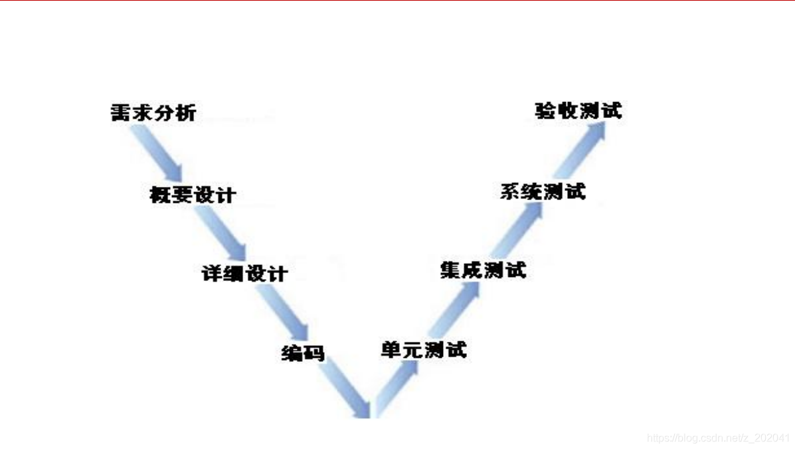
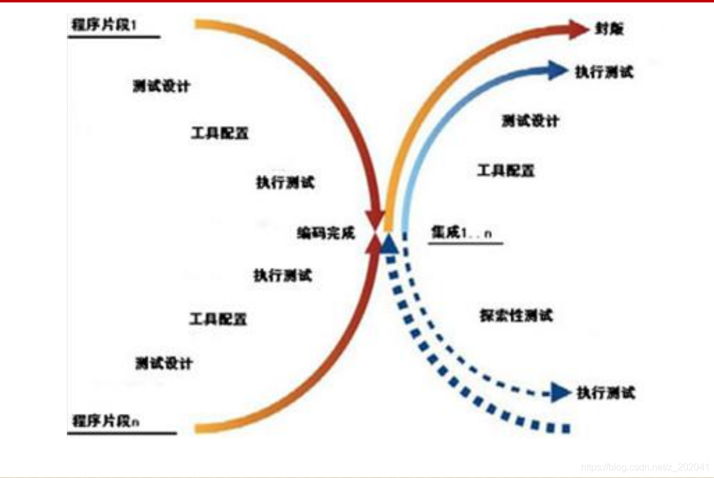

# 软件测试定义

描述一种用来促进鉴定软件的正确性、完整性、安全性和质量的过程。


# 软件测试目的

**发现缺陷**，并进行修复，以确保系统满足预期结果

**质量评估**，说明系统在相应时间点的质量情况，为利益干系人决策是否发布版本提供依据

**预防缺陷**，在软件生命周期早期，通过对测试依据（如合同要求、行业标准、法律要求等）和需求文档进行测试，可以预防将缺陷引入代码中


# 软件测试原则

测试可以显示缺陷的存在

穷尽测试时不肯能的

测试尽早介入

缺陷具有集群性

杀虫剂悖论

测试活动依赖于测试内容，测试内容决定测试活动

系统发布取决于是否满足客户需求，而不是是否还有缺陷


# 软件测试对象

软件包括程序、数据、文档，所以软件测试应该贯穿于整个软件生命周期中。
在整个软件生命周期中，各阶段又有不同的测试对象，形成了不同开发阶段的不同类型的测试。


# 软件测试质量

1.1 什么是质量
物理学领域，物体所含物质的数量叫质量，是度量物体在同一地点重力势能和动能大小的物理量。
运用学领域，产品或工作的优劣程度。美国著名的质量管理专家朱兰（J.M.Juran）博士从顾客的角度出发，提出了产品质量就是产品的适用性。即产品在使用时能成功地满足用户需要的程度。用户对产品的基本要求就是适用，适用性恰如其分地表达了质量的内涵。
ISO8402“质量术语”定义
 质量：反映实体满足明确或隐含需要能力的特性总和。 
1.2 质量
1.3 什么是软件质量？
软件质量就是“软件与明确的和隐含的定义的需求相一致的程度” 
软件质量度量标准
① 软件需求是度量软件质量的基础，与需求不一致就是质量不高。
② 指定的标准定义了一组指导软件开发的准则，如果没有遵守这些准则，几乎肯定会导致质量不高。
③ 通常，有一组没有显式描述的隐含需求（如期望软件是容易维护的）。如果软件满足明确描述的需求，但却不满足隐含的需求，那么软件的质量仍然是值得怀疑的。

1.4 软件质量考虑要素
软件质量：
功能性
可靠性
易用性
性能
兼容性
可移植性
安全性
安装/卸载
可维护性
1.4.1 功能性
功能性
当软件在指定条件下使用时，软件产品提供满足明确和隐含要求的功能的能力。
适合性
软件产品符合需求，能解决用户业务问题。
准确性
软件产品数据和处理处理能力要准确。
互操作性
软件产品与其他系统的交互和对接能力。
安全保密性
软件产品权限安全，不同角色进入拥有不同的操作权限。
1.4.2 性能
时间特性
软件产品执行其功能时，提供满足需求的响应时间和处理时间以及吞吐率等指标的能力。
资源利用性
软件产品执行其功能时，提供满足需求的CPU、内存等占用率的能力。
1.4.3 安全性
软件在受到恶意攻击的情形下依然能够继续正确运行的能力
软件被在授权范围内合法使用的能力，如：序列号决定使用数。
1.4.4 兼容性
软件适应不同的规定环境下的能力
软件遵循与可移植性有关的标准或约定的能力
软件与其他替代软件兼容的能力
常见的兼容性（浏览器、操作系统）
1.4.5 可靠性
可靠性
 在指定条件下使用时，软件产品维持规定的性能级别的能力。
成熟性
 软件产品为避免由软件内部的故障而导致失效的能力。
容错性
软件出现故障或者违反其指定接口的情况下，依然维持规定的性能级别的能力。
易恢复性
失效发生后，重建规定的性能级别并恢复受直接影响的数据的能力。
1.4.6 易用性
易用性
在指定条件下使用时，软件产品被理解、学习、使用和吸引用户的能力。
易理解性
软件产品让用户无须过多学习就能理解的能力。
易学性
软件产品让用户即使参加了学习，学习成本高低的能力。
易操作性
软件产品让用户操作方便，符合使用习惯的能力。
吸引性
软件产品让用户觉得舒服、操作吸引眼球的能力。
用户体验性
 是以上几个特性的统称，部分企业把易用性也称之为用户体验性，是一个比较时髦的词。
1.4.7 安装/卸载
执行安装/卸载时，能按照一定的规格和流程将软件安装上的能力。
简化的软件安装/卸载过程。
提供亲切友善的操作逻辑或接口。
软件完整，避免被盗版、破解或植入病毒。
1.4.8 可维护性
易分析性
软件出问题后，快速判断问题点并能快速修复的能力。
易改变性
软件修改后可快速发布，快速投入生产的能力。
稳定性
软件避免由于软件修改而造成意外结果的能力。
易测试性
软件版本升级修改后被快速确认的能力。
1.4.9 可移植性
适应性
软件不需采用其他手段就可适应不同的指定环境的能力。
易安装性
软件在指定环境中被快速安装的能力。
共存性
软件在同一环境下同与其他软件共存的能力。
易替换性
软件在同一环境下，替代另一个相同用途的软件的能力。
1.5 什么是质量保证
为保证产品和服务充分满足消费者要求的质量而进行的有计划、有组织的活动。
软件研发过程中，通常定义了2个软件质量相关的角色。
 QA：QUALITY ASSURANCE 的简称，中文意思是质量保证
 QC：QUALITY CONTROL的简称，中文意思是质量控制
1.6 QC与QA的区别
QC和QA的主要区别：前者是保证产品质量符合规定,后者是建立体系并确保体系按要求运作,以提供内外部的信任。  QC就是测试人员，职责是尽可能早地发现软件的缺陷，并确保缺陷得到修复（有些企业里，测试人员被称为SQA）。
QA是流程的监督者，职责是创建和执行 改进软件开发过程，并防止软件缺陷发生的标准和方法。
1.7 ISO与ISO9000族标准的产生
 ISO：国际标准化组织
 ISO9000：国家质量管理体系标准
 1987年发布ISO 9000标准
 1959年美国国防部发布MIL-Q-9858A《质量大纲要求》和
MIL-Q-45208A《检验系统要求》
 — 从军品到民品
 — 从美国到其他国家
 — 从国家标准到国际标准
1.8.1 CMMI是什么？
Capability Maturity Model Integration (能力成熟度模型综合)
它综合了以下几方面: 
1、System engineering（系统工程）
 软件工程的对象是软件系统的开发活动，要求实现软件开发、运行、维护活
动系统化、制度化、量化。
2、Software engineering（软件工程）
 系统工程的对象是全套系统的开发活动，可能包括也可能不包括软件。系统
工程的核心是将客户的需求、期望和约束条件转化为产品解决方案，并对解
决方案的实现提供全程的支持。
3、Integrated Product and Process Development
（集成的产品和过程开发）
 集成的产品和过程开发是指在产品生命周期中，通过所有相关人员的通力合
作，采用系统化的进程来更好地满足客户的需求、期望和要求。
4、Supplier Sourcing（采购）
 主要内容包括：识别并评价产品的潜在来源、确定需要采购的产品的目标供
应商、监控并分析供应商的实施过程、评价供应商提供的工作产品以及对供
应协议和供应关系进行适当的调整。
1.8.2 CMMI是什么？
企业如何选择以上模块：
1、纯软件企业：选择CMMI中的软件工程的内容。
2、设备制造企业：选择系统工程和采购。
3、集成的企业：选择软件工程、系统工程和集成的产品和过程开发。
该模型提供一套可供公众使用的准则；这些准则描述那些成功地实施了过程改进的组织的特性。  该模型用“软件能力成熟度”来衡量这种软件综合能力。
1.8.3 CMMI等级
在模型中，所有软件组织的软件能力成熟度划分为5个等级—第1到第5级。数字越大，成熟度越高。高成熟度等级代表比较强的综合软件能力。
5个成熟度等级分别为：
第1级：初始级
第2级：受管理级
第3级：已定义级
第4级：定量管理级
第5级：持续优化级
实施CMMI的好处：
1、项目经理：提高自己的项目管理能力，从而使项目高质量、
低成本、按期地完成。
2、企业老板：提升企业管理水平，引入科学的管理理念，提升
企业整体管理水平。
1.9 综合应用
面试过程中，面试官随机问：
纸杯、电梯、门、笔怎么测？
请针对纸杯进行一个全面讨论 


# 软件测试模型

5.1 软件测试模型—V模型


5.2 软件测试模型—W模型


5.3 软件测试模型—X模型


5.4 软件测试模型—H模型


# 软件测试分类

```reStructuredText
冒烟测试
ucd（ui）测试
功能测试
易用性测试
性能测试
兼容性测试
安全性测试
稳定性测试
可靠性测试
随机测试
自动化测试

```

