# Docker手册

##  参考资料

官方文档：https://docs.docker.com/docker-for-windows/

【官方文档超级详细】

仓库地址：https://hub.docker.com/

【发布到仓库，git pull push】

b站教程：https://www.bilibili.com/video/BV1og4y1q7M4?

【这个教程非常简洁！且深入！基于企业应用场景！推荐！以下笔记都基于该课程】

视频原版文档：https://gitee.com/nasheishei/docker_learning.git

## ①  安装


1. 通过运行hello-world映像，验证Docker引擎已正确安装

   ```shell
   $ sudo docker run hello-world
   ```

```shell
# 卸载可能存在的旧版本
$ sudo apt-get remove docker docker-engine docker.io containerd runc


# 在新主机上首次安装Docker引擎之前，需要设置Docker储存库。然后，您可以从存储库安装和更新Docker。
# 更新apt包索引并安装包以允许apt在HTTPS上使用存储库:
$ sudo apt-get update

$ sudo apt-get install \
    apt-transport-https \
    ca-certificates \
    curl \
    gnupg-agent \
    software-properties-common


# 添加Docker的官方GPG密钥:
$ curl -fsSL https://download.docker.com/linux/ubuntu/gpg | sudo apt-key add -


# 使用以下命令设置稳定存储库。要添加夜间存储库或测试存储库，请在下面命令中的单词stable后面添加单词nightly或test(或both)。了解夜间和测试频道。
# 注意:下面的lsb_release -cs子命令返回你的Ubuntu发行版的名称，比如xenial。有时候，在Linux Mint这样的发行版中，您可能需要将$(Isb_release -cs)更改为您的父Ubuntu发行版。例如，如果你正在使用Linux Mint Tessa，你可以使用仿生。Docker对未测试和不支持的Ubuntu发行版不提供任何保证
# 阿里源
sudo add-apt-repository "deb [arch=amd64] http://mirrors.aliyun.com/docker-ce/linux/ubuntu 	$(lsb_release -cs) stable"


# 安装Docker引擎
# 更新apt包索引，安装最新版本的Docker Engine和containerd，或者进入下一步安装特定版本:
$ sudo apt-get update
$ sudo apt-get install docker-ce docker-ce-cli containerd.io

# 启动 Docker
$ sudo systemctl start docker

# 查看版本号，验证是否启动
$ docker version
# 设置开机启动
$ sudo systemctl enable docker

# 设置用户组
sudo groupadd docker     		#添加docker用户组
sudo gpasswd -a $USER docker    #将登陆用户加入到docker用户组中
sudo service docker restart 	# 重启docker
pkill X     					# 重新登陆用户 生效
docker images    				#测试docker命令是否可以使用sudo正常使用

# 设置docker镜像源地址（阿里云，每个人的地址不一样，去阿里云搜索镜像）
sudo mkdir -p /etc/docker
sudo tee /etc/docker/daemon.json <<-'EOF'
{
  "registry-mirrors": ["https://************"]
}
EOF
sudo systemctl daemon-reload
sudo systemctl restart docker

docker info # 查看镜像源是否更改有以下信息即成功
Registry Mirrors:
  https://****************/
```

# docker常用命令

## 帮助命令

```shell
docker version		# 版本信息
docker info			# docker的系统信息，包括镜像和容器的数量
docker 命令 --help	# 万能命令
```

帮助文档地址：https://docs.docker.com/reference/

## 镜像命令

### docker images  查看已有镜像

```shell
mth@mth:~$ docker images
REPOSITORY          TAG                 IMAGE ID            CREATED             SIZE
hello-world         latest              bf756fb1ae65        6 months ago        13.3kB

REPOSITORY	镜像的仓库源
TAG			镜像的标签
IMAGE ID	镜像的id
CREATED		镜像的创建时间
SIZE		镜像的大小

#可选项
-a, --a11	#列出所有镜像
-q, --quiet	#只显示镜像的id
```

### docker search 搜索镜像

```shell
mth@mth:~$ docker search mysql
NAME                              DESCRIPTION                                     STARS               OFFICIAL            AUTOMATED
mysql                             MySQL is a widely used, open-source relation…   9770                [OK]
mariadb                           MariaDB is a community-developed fork of MyS…   3565                [OK]   

#可选项
--filter=STARS=3000	 # 搜索出来的镜像就是STARS大于3000的
mth@mth:~$ docker search mysql --filter=STARS=3000
NAME                DESCRIPTION                                     STARS               OFFICIAL            AUTOMATED
mysql               MySQL is a widely used, open-source relation…   9770                [OK]                
mariadb             MariaDB is a community-developed fork of MyS…   3565                [OK]                

# 如果搜索报错，看看自己是不是网没开……
```

### docker pull  镜像下载

```shell
docker pull 镜像名[:tag]

mth@mth:~$ docker pull mysql
Using default tag: latest		# 如果不写 tag，默认就是latest
latest: Pulling from library/mysql
6ec8c9369e08: Pull complete 	# 分层下载，docker iamge的核心联合文件系统
177e5de89054: Pull complete 
ab6ccb86eb40: Pull complete 
e1ee78841235: Pull complete 
09cd86ccee56: Pull complete 
78bea0594a44: Pull complete 
caf5f529ae89: Pull complete 
cf0fc09f046d: Pull complete 
4ccd5b05a8f6: Pull complete 
76d29d8de5d4: Pull complete 
8077a91f5d16: Pull complete 
922753e827ec: Pull complete 
Digest: sha256:fb6a6a26111ba75f9e8487db639bc5721d4431beba4cd668a4e922b8f8b14acc
Status: Downloaded newer image for mysql:latest
docker.io/library/mysql:latest	# 真实地址

docker pull mysql   等价于   docker pull docker.io/library/mysql:latest

# 指定版本下载	版本号一定要在官方的镜像里有才行
docker pull mysql:5.7

```

### docker rmi 删除镜像和容器

```shell
docker rmi -f 镜像ID			# 删除指定容器和镜像
docker rmi -f 镜像ID 镜像ID 	# 删除多个指定的容器和镜像
docker rmi -f $(docker images -aq)  # 删除所有镜像和容器

# 不加 f 只删除镜像，如果该镜像已有容器，则报错
```

### docker history 镜像历史记录

```shell
docker history 镜像ID
# 查看镜像的历史修改记录
```


## 容器命令

**说明:我们有了镜像才可以创建容器, linux,下载- -个centos镜像来测试学习**

```shell
docker pull ubuntu:18.04
```

### 新建容器并启动

```shell
docker run [可选参数] image

# 参数说明
--name='Name'		容器名字，自定义
-d					后台运行方式启动
-it					交互模式启动，并进入容器
-p					指定容器端口  -p 8080:8080
	-p ip:主机端口:容器端口
	-p 主机端口:容器端口	# 常用方式
	-p 容器端口
	容器端口
-P					指定随机端口

# 启动并进入容器	如果镜像不是最新版本，需要加上版本号，否则将会自动下载最新版本镜像	/bin/bash 是指定一个控制台程序来运行
mth@mth:~$ docker run -it ubuntu:18.04 /bin/bash
root@894e382ef99b:/# 

# 测试
docker run -d --name nginx01 -p 8888:80 nginx
# 退出容器
exit
```

### 查看所有运行的容器

```shell
docker ps	# 当前在运行的容器

-a		# 当前在运行的容器 + 历史运行过的容器
-n=?	# 最近创建的容器
-q		# 只显示容器编号
```

### 退出容器

```shell
exit	# 退出且容器停止运行
Ctrl + p + q	# 退出，但容器继续运行
```

### 删除容器

```shell
docker rm 容器ID	# 不能删除正在运行的容器
docker rm -f $(docker ps -aq)  # 删除所有容器
```

### 启动和停止容器的操作

```shell
docker start 容器ID		#启动
docker restart 容器ID		#重新启动
docker stop 容器ID		#停止，如果报错就kill
docker kill 容器ID		#停止
```

### 进入一个已经在运行的容器

```shell
docker exec -it 容器名 /bin/bash
```


## 常用其他命令

### 后台启动

```shell
docker run -d ubuntu:18.04 

#问题docker ps，发现ubuntu停止了
#常见的坑: docker 容器使用后台运行，就必须要有要一个前台进程，docker发现没有应用，就会自动停止
```

### 日志

```shell
# 使用一段shell脚本命令写入日志
docker run -d ubuntu:18.04 /bin/sh -c "while true;do echo mth;sleep 1;done"

# 查看容器ID
docker ps
CONTAINER ID        IMAGE               
173114d1eb1c        ubuntu:18.04

# 查看该容器日志 
--tail 10  # 查看10条
-tf			# 查看全部
docker logs -tf --tail 10 173114d1eb1c

```

### cpu和内存占用状态

```shell
docker stats [容器ID]
# 不写容器ID就是查看所有容器

# 如果某个容器占用内存过高比如 ES，可以考虑限制它的内存使用
# -e ES_JAVA_OPTS='-Xms64m -Xmx512m'	占用内存64M，最大占用512M
docker run -d --name ES01 -p 9200:9200 -p 9300:9300 -e 'discovery.type=single-node' -e ES_JAVA_OPTS='-Xms64m -Xmx512m' elasticsearch:7.6.2
```

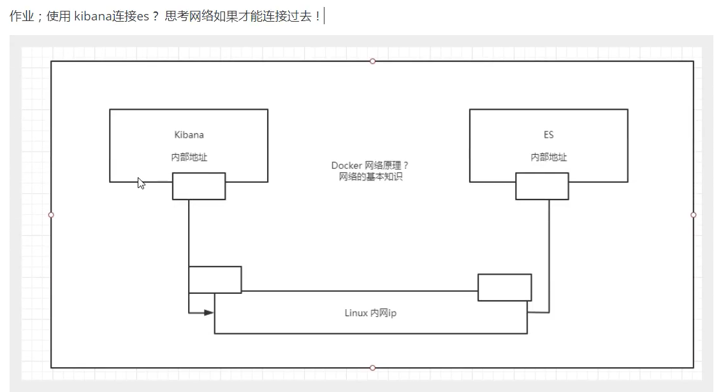

### 进程信息

```shell
docker top 容器ID

docker top 173114d1eb1c
UID                 PID                 PPID                C                   STIME               TTY                 TIME                CMD
root                19116               19094               0                   18:41               ?                   00:00:00            /bin/sh -c while true;do echo mth;sleep 1;done
root                19187               19116               0                   18:41               ?                   00:00:00            sleep 1

```

### 源数据

```shell
docker inspect 容器ID

[
    {
        "Id": "173114d1eb1c79b28c83c5fe48190a7a7fbc01f3b5974baa0e8f80961d767712",
        "Created": "2020-07-27T10:31:42.3497819Z",
        "Path": "/bin/sh",
        "Args": [
            "-c",
            "while true;do echo mth;sleep 1;done"
        ],
        "State": {
            "Status": "running",
            "Running": true,
            "Paused": false,
            "Restarting": false,
            "OOMKilled": false,
            "Dead": false,
            "Pid": 19116,
            "ExitCode": 0,
            "Error": "",
            "StartedAt": "2020-07-27T10:41:22.520059975Z",
            "FinishedAt": "2020-07-27T10:34:34.720440076Z"
        },
        "Image": "sha256:2eb2d388e1a255c98029f40d6d7f8029fb13f1030abc8f11ccacbca686a8dc12",
        "ResolvConfPath": "/var/lib/docker/containers/173114d1eb1c79b28c83c5fe48190a7a7fbc01f3b5974baa0e8f80961d767712/resolv.conf",
        "HostnamePath": "/var/lib/docker/containers/173114d1eb1c79b28c83c5fe48190a7a7fbc01f3b5974baa0e8f80961d767712/hostname",
        "HostsPath": "/var/lib/docker/containers/173114d1eb1c79b28c83c5fe48190a7a7fbc01f3b5974baa0e8f80961d767712/hosts",
        "LogPath": "/var/lib/docker/containers/173114d1eb1c79b28c83c5fe48190a7a7fbc01f3b5974baa0e8f80961d767712/173114d1eb1c79b28c83c5fe48190a7a7fbc01f3b5974baa0e8f80961d767712-json.log",
        "Name": "/sweet_bouman",
        "RestartCount": 0,
        "Driver": "overlay2",
        "Platform": "linux",
        "MountLabel": "",
        "ProcessLabel": "",
        "AppArmorProfile": "docker-default",
        "ExecIDs": null,
        "HostConfig": {
            "Binds": null,
            "ContainerIDFile": "",
            "LogConfig": {
                "Type": "json-file",
                "Config": {}
            },
            "NetworkMode": "default",
            "PortBindings": {},
            "RestartPolicy": {
                "Name": "no",
                "MaximumRetryCount": 0
            },
            "AutoRemove": false,
            "VolumeDriver": "",
            "VolumesFrom": null,
            "CapAdd": null,
            "CapDrop": null,
            "Capabilities": null,
            "Dns": [],
            "DnsOptions": [],
            "DnsSearch": [],
            "ExtraHosts": null,
            "GroupAdd": null,
            "IpcMode": "private",
            "Cgroup": "",
            "Links": null,
            "OomScoreAdj": 0,
            "PidMode": "",
            "Privileged": false,
            "PublishAllPorts": false,
            "ReadonlyRootfs": false,
            "SecurityOpt": null,
            "UTSMode": "",
            "UsernsMode": "",
            "ShmSize": 67108864,
            "Runtime": "runc",
            "ConsoleSize": [
                0,
                0
            ],
            "Isolation": "",
            "CpuShares": 0,
            "Memory": 0,
            "NanoCpus": 0,
            "CgroupParent": "",
            "BlkioWeight": 0,
            "BlkioWeightDevice": [],
            "BlkioDeviceReadBps": null,
            "BlkioDeviceWriteBps": null,
            "BlkioDeviceReadIOps": null,
            "BlkioDeviceWriteIOps": null,
            "CpuPeriod": 0,
            "CpuQuota": 0,
            "CpuRealtimePeriod": 0,
            "CpuRealtimeRuntime": 0,
            "CpusetCpus": "",
            "CpusetMems": "",
            "Devices": [],
            "DeviceCgroupRules": null,
            "DeviceRequests": null,
            "KernelMemory": 0,
            "KernelMemoryTCP": 0,
            "MemoryReservation": 0,
            "MemorySwap": 0,
            "MemorySwappiness": null,
            "OomKillDisable": false,
            "PidsLimit": null,
            "Ulimits": null,
            "CpuCount": 0,
            "CpuPercent": 0,
            "IOMaximumIOps": 0,
            "IOMaximumBandwidth": 0,
            "MaskedPaths": [
                "/proc/asound",
                "/proc/acpi",
                "/proc/kcore",
                "/proc/keys",
                "/proc/latency_stats",
                "/proc/timer_list",
                "/proc/timer_stats",
                "/proc/sched_debug",
                "/proc/scsi",
                "/sys/firmware"
            ],
            "ReadonlyPaths": [
                "/proc/bus",
                "/proc/fs",
                "/proc/irq",
                "/proc/sys",
                "/proc/sysrq-trigger"
            ]
        },
        "GraphDriver": {
            "Data": {
                "LowerDir": "/var/lib/docker/overlay2/996d272e035fdcaf96c7fea487b97cef7bb0a378ef06ccaaf391df3fffcd44c3-init/diff:/var/lib/docker/overlay2/eb8529e8f6ae5ffde2e24501d5e6e6a55542291588f7cd6508380b508ba1ca97/diff:/var/lib/docker/overlay2/9e6d7ce7135e100f773c06f0edc1f3c0faf984f9e9cf9d1d99b23d36347f2334/diff:/var/lib/docker/overlay2/5a0c2817fa0578e7a9b743f0c49f956195ff7da34afe136aee7ee32018dd64e6/diff:/var/lib/docker/overlay2/a2f258ff263766e71254a084f00036c4854034f6098ca6a9774deb659af043e2/diff",
                "MergedDir": "/var/lib/docker/overlay2/996d272e035fdcaf96c7fea487b97cef7bb0a378ef06ccaaf391df3fffcd44c3/merged",
                "UpperDir": "/var/lib/docker/overlay2/996d272e035fdcaf96c7fea487b97cef7bb0a378ef06ccaaf391df3fffcd44c3/diff",
                "WorkDir": "/var/lib/docker/overlay2/996d272e035fdcaf96c7fea487b97cef7bb0a378ef06ccaaf391df3fffcd44c3/work"
            },
            "Name": "overlay2"
        },
        "Mounts": [],
        "Config": {
            "Hostname": "173114d1eb1c",
            "Domainname": "",
            "User": "",
            "AttachStdin": false,
            "AttachStdout": false,
            "AttachStderr": false,
            "Tty": false,
            "OpenStdin": false,
            "StdinOnce": false,
            "Env": [
                "PATH=/usr/local/sbin:/usr/local/bin:/usr/sbin:/usr/bin:/sbin:/bin"
            ],
            "Cmd": [
                "/bin/sh",
                "-c",
                "while true;do echo mth;sleep 1;done"
            ],
            "Image": "ubuntu:18.04",
            "Volumes": null,
            "WorkingDir": "",
            "Entrypoint": null,
            "OnBuild": null,
            "Labels": {}
        },
        "NetworkSettings": {
            "Bridge": "",
            "SandboxID": "d7738af3d45487779fe5568694e6ade7e1080decf0fb4b5e3cae033d3745a4e1",
            "HairpinMode": false,
            "LinkLocalIPv6Address": "",
            "LinkLocalIPv6PrefixLen": 0,
            "Ports": {},
            "SandboxKey": "/var/run/docker/netns/d7738af3d454",
            "SecondaryIPAddresses": null,
            "SecondaryIPv6Addresses": null,
            "EndpointID": "c2c4bf066a5aac07c684c8ca37465bc65eefe517133576df88c36d15d9094380",
            "Gateway": "172.17.0.1",
            "GlobalIPv6Address": "",
            "GlobalIPv6PrefixLen": 0,
            "IPAddress": "172.17.0.2",
            "IPPrefixLen": 16,
            "IPv6Gateway": "",
            "MacAddress": "02:42:ac:11:00:02",
            "Networks": {
                "bridge": {
                    "IPAMConfig": null,
                    "Links": null,
                    "Aliases": null,
                    "NetworkID": "5d336fd7b8adfa6e026f048f0fd09ff5821d0d3a5a06e5c4d08ed8dd36f8c220",
                    "EndpointID": "c2c4bf066a5aac07c684c8ca37465bc65eefe517133576df88c36d15d9094380",
                    "Gateway": "172.17.0.1",
                    "IPAddress": "172.17.0.2",
                    "IPPrefixLen": 16,
                    "IPv6Gateway": "",
                    "GlobalIPv6Address": "",
                    "GlobalIPv6PrefixLen": 0,
                    "MacAddress": "02:42:ac:11:00:02",
                    "DriverOpts": null
                }
            }
        }
    }
]

```

### 进入当前正在运行的容器

```shell
docker exec -it 容器ID BashShell

# 方式一   在容器内打开一个新的终端（新的进程）
docker exec -it 容器ID /bin/bash

# 方式二	打开容器内正在运行的进程终端，不会启用新的进程
docker attach 容器ID
```

### 从容器内拷贝文件到主机上

```shell
docker cp 容器ID:容器内路劲 目的主机路径
```


# docker 镜像

## 镜像是什么

​		镜像是一种轻量级、可执行的独立软件包,来打包软件运行环境和基于运行环境开发的软件,它包含运行某个软件所需的所有内容,包括代码、运行时、库、环境变量和配置文件。

所有的应用,直接打包docker镜像,就可以直接跑起来!

如何得到镜像:

​	●从远程仓库下载

​	●朋友拷贝给你

​	●自己制作一个镜像DockerFile

## Docker镜像加载原理

> UnionFS (联合文件系统) :

 Union文件系统( UnionFS)是-种分层、轻量级并且高性能的文件系统,它支持对文件系统的修改作为一次提交来一层层的叠加,同时可以将不同目录挂载到同一个虚拟文件系统下(unite several directories into a single virtualfilesystem)。Union 文件系统是Docker镜像的基础。镜像可以通过分层来进行继承,基于基础镜像(没有父镜像) , 可以制作各种具体的应用镜像。

> Docker镜像加载原理

docker的镜像实际_上由-层-层的文件系统组成,这种层级的文件系统UnionFS.

bootfs(boot file system)主要包含bootloader和kernel, bootloader主要是引|导加载kernel, Linux刚启动时会加载bootfs文件系统,在Docker镜像的最底层是bootfs。这一层与我们典型的Linux/Unix系统是一样的,包含boot加载器和内核。当boot加载完成之后整个内核就都在内存中了,此时内存的使用权已由bootfs转交给内核,此时系统也会卸载bootfs.

rootfs (root file system) , 在bootfs之上。包含的就是典型Linux 系统中的/dev, /proc, /bin, /etc等标准目录和文件。rootfs就是各种不同的操作系统发行版,比如Ubuntu , Centos等等。

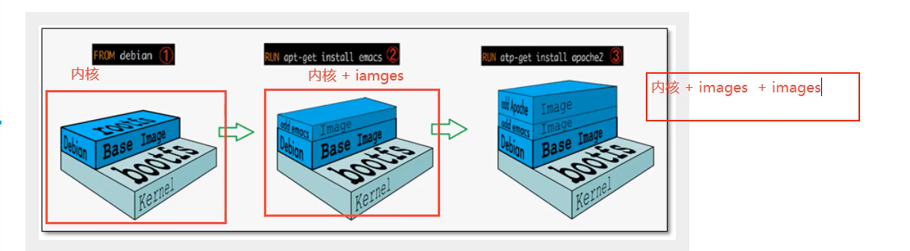

平时我们安装进虚拟机的CentOS都是好几个G ,为什么Docker这里才200M ?

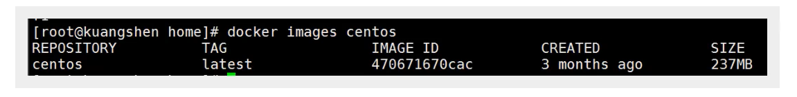

对于- -个精简的OS , rootfs 可以很小,只需要包含最基本的命令, I具和程序库就可以了,因为底层直接用Host的kernel ,自己只需要提供rootfs就可以了。由此可见对于不同的linux发行版, bootfs基本是一致的, rootfs会有差别,因此不同的发行版可以公用bootfs.

虚拟机是分钟级别,容器是秒级! 

## 分层理解

> 分层的镜像

我们可以去下载一个镜像,注意观察下载的日志输出,可以看到是一层一层的在下载!


所有的Docker镜像都起始于一个基础镜像层,当进行修改或增加新的内容时,就会在当前镜像层之上,创建新的镜像层。

举一个简单的例子,假如基于Ubuntu Linux 16.04创建一个新的镜像 ,这就是新镜像的第一层;如果在该镜像中添加Python包,就会在基础镜像层之上创建第二个镜像层 ;如果继续添加一个安全补丁, 就会创建第三个镜像层。

该镜像当前已经包含3个镜像层,如下图所示(这只是一个用于演示的很简单的例子 。

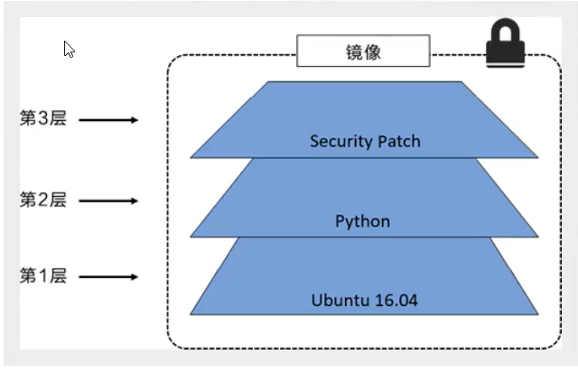

在添加额外的镜像层的同时,镜像始终保持是当前所有镜像的组合,理解这一点非常重要。 下图中举 了一个简单的例子,每个镜像层包含3个文件,而镜像包含了来自两个镜像层的6个文件。

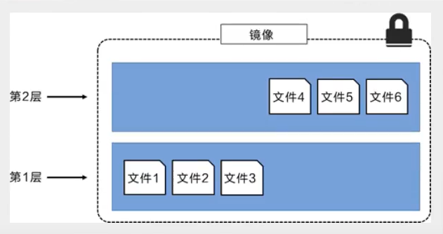

上图中的镜像层跟之前图中的略有区别,主要目的是便于展示文件。

下图中展示了一个稍微复杂的三层镜像,在外部看来整个镜像只有6个文件,这是因为最上层中的文件7文件5的一个更新版本。

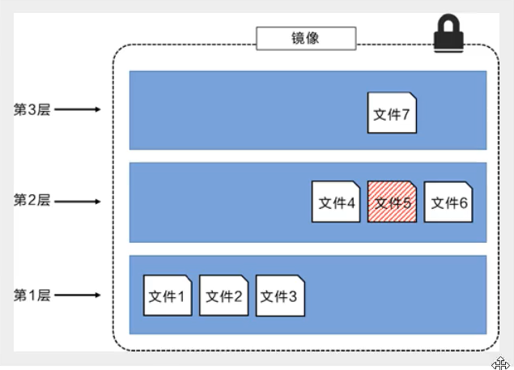

这种情况下，上层镜像层中的文件覆盖了底层镜像层中的文件。这样就使得文件的更新版本作为- -个新镜像层添加到镜像当中。

Docker通过存储引擎(新版本采用快照机制)的方式来实现镜像层堆栈,并保证多镜像层对外展示为统一的文件系统。

Linux.上可用的存储引擎有AUFS、Overlay2、 Device Mapper、Btrfs 以及ZFS。顾名思义,每种存储引擎都基于Linux中对应的文件系统或者块设备技术,并且每种存储弓|擎都有其独有的性能特点。

Docker在Windows上仅支持windowsfilter -种存储引擎,该引擎基于NTFS文件系统之上实现了分层和CoW[1]。

下图展示了与系统显示相同的三层镜像。所有镜像层堆叠并合并,对外提供统-的视图。

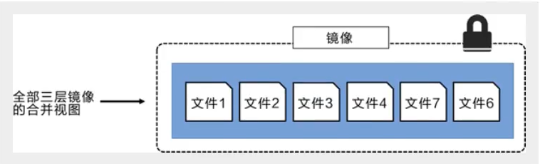

> 特点

Docker镜像都是只读的,当容器启动时,一个新的可写层被加载到镜像的顶部!

这一层就是我们通常说的容器层,容器之下的都叫镜像层!

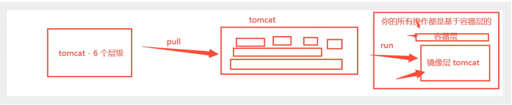

## 上传镜像

```shell
docker commit 提交容器成为一个新的副本

#命令和git原理类似
docker commit -m="提交的描述信息" -a="作者" 容器id 目标镜像名:[版本]

如果你想要保存当前容器的状态，就可以通过commit来提交，获得一个镜像，就好比我们以前学习VM时候，快照!commit没有分层
```


# 容器数据卷

## 什么是容器数据卷

**docker的理念回顾**

将应用和环境打包成一个镜像!

数据?如果数据都在容器中,那么我们容器删除,数据就会丢失!需求:数据可以持久化

MySQL,容器删了,删库跑路!需求: MySQL数据可以存储在本地!

容器之间可以有一个数据共享的技术! Docker 容器中产生的数据,同步到本地!

这就是卷技术!目录的挂载,将我们容器内的目录,挂载到Linux上面!

**容器的持久化和同步操作，容器间的数据共享**

## 使用数据卷

> 方式一:直接使用命令来挂载-v

```shell
docker run -it -v 主机目录:容器内目录
# 挂载之后，两个对应目录之间的数据是双向同步的，就算容器未启动，修改主机目录数据，容器内数据也会发生修改
# 以后容器内的配置文件修改，就不需要进入容器内操作，只需要将其挂载出来，在主机内修改就可以
# 测试
docker run -it -v /home/mth/ceshi:/home ubuntu /bin/bash

#启动起来时候我们可以通过docker inspect 容器id
```

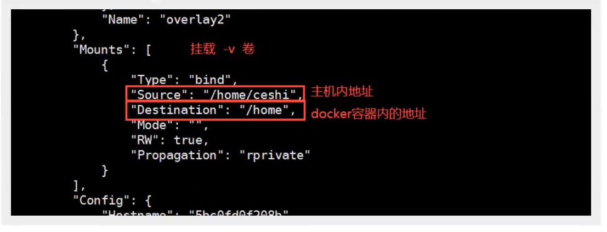

**测试用例 安装MySQL**

```shell
# 获取镜像
docker pull mysql:5.7

# 创建容器，需要挂载数据	下面代码是一行
mth@mth:~$ docker run -d -p 3310:3306 --name mysql_01 -e MYSQL_ROOT_PASSWORD=mu7401889 -v /home/mth/mysql_ceshi/conf:/etc/mysql/conf.d -v /home/mth/mysql_ceshi/data:/var/lib/mysql mysql:5.7

# 参数详解
-d 		# 后台运行
-p 		# 端口映射
-v 		# 卷挂载	可以有多个-v，挂载多个卷
-e 		# 环境配置，可以有多个-e，配置多个环境变量，必须配置的环境变量在dockerhub里面的文档里去找
--name 	# 容器名字

# 官方测试语法
$ docker run --name some-mysql -e MYSQL_ROOT_PASSWORD=my-secret-pw -d mysql:tag
```

## 匿名和具名挂载

**所有挂载的卷，在没有指定主机目录的情况下，都会存储在 /var/lib/docker/volumes/卷名/_data 路径下**

```shell
# 匿名挂载 --> -v 只跟容器路径，没有主机路径且不指定卷名
docker run -d --name nginx01 -P -v /etc/nginx nginx

# 通过 docker volume ls 查看所有卷
mth@mth:~$ docker volume ls
DRIVER              VOLUME NAME
local               09eb3e9e6e5aeef2d694f43b4dff14011470f107fac0a84d8a152cd2117bd868
# 匿名挂载的数据卷就是这种长编码的名字

# 具名挂载 --> -v 后面不跟主机路径，跟的是 卷名:容器路径			不加'/'就是卷名，加了就是主机路径
docker run -d -P --name nginx02 -v juming_nginx:/etc/nginx nginx

# 通过 docker volume ls 查看所有卷   能够看到具名挂载的名字
mth@mth:~$ docker volume ls
DRIVER              VOLUME NAME
local               09eb3e9e6e5aeef2d694f43b4dff14011470f107fac0a84d8a152cd2117bd868
local               juming_nginx

# 通过 docker inspect 卷名 查看卷的详细信息
mth@mth:~$ docker inspect juming_nginx
[
    {
        "CreatedAt": "2020-07-28T15:05:22+08:00",
        "Driver": "local",
        "Labels": null,
        "Mountpoint": "/var/lib/docker/volumes/juming_nginx/_data",		# 卷所在路径
        "Name": "juming_nginx",
        "Options": null,
        "Scope": "local"
    }
]

所有挂载的卷，在没有指定主机目录的情况下，都会存储在 /var/lib/docker/volumes/卷名/_data 路径下
```

```shell
#如何确定是具名挂载还是匿名挂载，还是指定路径挂载!
-v 容器内路径			# 匿名挂载
-v 卷名:容器内路径			# 具名挂载
-v /宿主机路径::容器内路径 	# 指定路径挂载
```

拓展:

```shell
#通过 -v 容器内路径: ro rw 改变读写权限
ro 		# readonly 只读
rw		# readwrite 可读可写

docker run -d -P --name *** -v ****:ro ****
#一旦这个了设置了容器权限，容器对我们挂载出来的内容就有限定了!
docker run -d -P --name nginx02 -v juming-nginx:/etc/nginx:ro nginx
```

**ro 的卷数据只能在主机内修改，容器无法对其修改**


## 数据卷容器

**多个MySQL同步数据**

```shell
docker run *** volumes-from 需要挂载的容器名 ***

# 创建第一个容器，与本地文件进行挂载
docker run -d -p 3310:3306 --name mysql_01 -e MYSQL_ROOT_PASSWORD=mu7401889 -v /etc/mysql/conf.d -v /var/lib/mysql mysql:5.7

# 创建第二个容器，与第一个容器进行挂载
docker run -d -p 3311:3306 --name mysql_02 -e MYSQL_ROOT_PASSWORD=mu7401889 volumes-from mysql_01 mysql:5.7

# 这个时候，两个数据库数据同步
```

**结论：**

容器之间配置信息的传递,数据卷容器的生命周期一直持续到没有 容器使用为止。

但是一旦你持久化到了本地，这个时候,本地的数据是不会删除的! 


# Dockerfile


dockerfile是用来构建dokcer镜像的文件!令参数脚本!

构建步骤:

1、编写一个dockerfile 文件

2、docker build构建成为一个镜像

3、docker run运行镜像

4、docker push发布镜像( DockerHub、阿里云镜像仓库! )


## dockerfile构建过程

**基础知识:**

1、每个保留关键字(指令)都是必须是大写字母

2、执行从上到下顺序执行

3、# 表示注释

4、每一个指令都会创建提交一个新的镜像层,并提交!

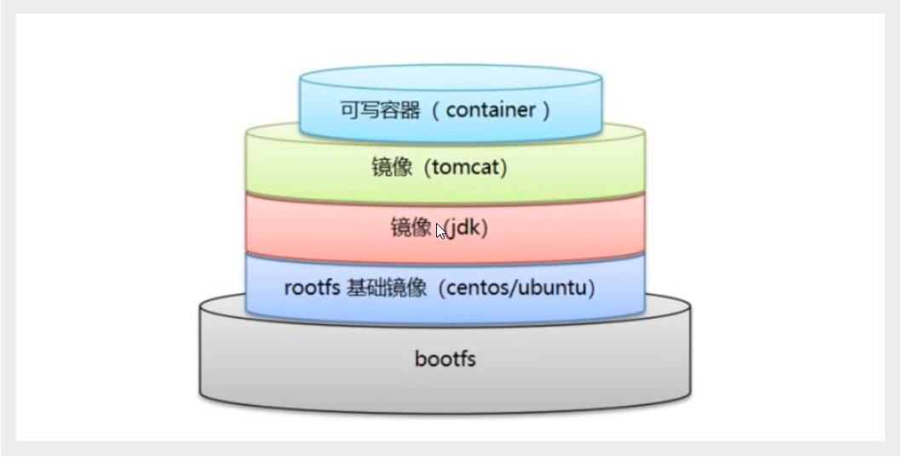

dockerfile 是面向开发的,我们以后要发布项目,做镜像,就需要编写 dockerfile 文件,这个文件十分简单!

Docker 镜像逐渐成为企业交付的标准,必须要掌握!

步骤：开发,部署, 运维。。。缺一不可！

DockerFile :构建文件,义了-切的步骤,源代码

Dockerlmages ：通过DockerFile构建生成的镜像,最终发布和运行的产品!

Docker容器：容器就是镜像运行起来提供服务器

## dockerfile 指令

```shell
FROM 		# 基础镜像，一切从这里开始
MAINTAINER	# 作者：我的 姓名+邮箱
RUN			# 镜像构建的时候需要运行的命令
ADD			# 添加文件，会自动解压
WORKDIR		# 镜像的工作目录，就是 -it 进入之后默认所在的目录
VOLUME		# 挂载的目录
EXPOSE		# 暴露端口配置
CMD			# 指定这个容器启动的时候需要运行的命令，只有最后一个会生效，可以被替代
ENTRYPOINT	# 指定这个容器启动的时候需要运行的命令，可以追加命令
ONBUILD		# 当构建一个被继承的dockerfile，这个时候就会运行 onbilud 的指令
COPY		# 类似ADD，将文件拷贝到镜像中
ENV			# 构建的时候设置环境变量  值是键值对
```

**测试，配置一个ubuntu镜像**

```shell
# 创建目录，和dockerfile文件，并写入以下指令
FROM ubuntu:18.04
MAINTAINER mouTH<553630934@qq.com>
ENV MYPATH /user/local
WORKDIR $MYPATH
RUN apt-get update
RUN apt-get install -y vim
RUN apt-get install -y ifconfig
EXPOSE 80
CMD echo $MYPATH
CMD echo '-------end-------'
CMD /bin/bash


# RUN apt-get install -y vim    -y 就是自动回答安装时的选择
# 输出以下信息即为成功
Successfully built bdeb05fc6fc5
Successfully tagged myubuntu:0.2

```

**CMD 和 ENTRYPOINT 的区别**

```shell
CMD  模式

# 编写dockerfile文件并创建镜像
FROM ubuntu:18.04
CMD ls -a

# 构建镜像
docker build -f cmd_ceshi -t cmd_ceshi .

# 创建容器 观察输出
mth@mth:~/docker_ceshi/dockerfile$ docker run 2e704c402ef4
.
..
.dockerenv
bin
boot
dev
etc
home
lib
lib64

# 用追加命令的方式创建容器  发现报错
mth@mth:~/docker_ceshi/dockerfile$ docker run 2e704c402ef4 -l
docker: Error response from daemon: OCI runtime create failed: container_linux.go:349: starting container process caused "exec: \"-l\": executable file not found in $PATH": unknown.
ERRO[0000] error waiting for container: context canceled

# cmd 的情况下 -l 会替换掉原本的 ls -a  ，但是 -l 本身并不是一个完整的命令，所以报错
```

```shell
ENTRYPOINT  模式

# 编写dockerfile文件并创建镜像
FROM ubuntu:18.04
ENTRYPOINT ls -a

# 构建镜像
docker build -f enterpoint_ceshi -t enterpoint_ceshi .

# 创建容器 观察输出
mth@mth:~/docker_ceshi/dockerfile$ docker run 92674093cd63
.
..
.dockerenv
bin
boot
dev
etc
home
lib
lib64

# 用追加命令的方式创建容器 成功
mth@mth:~/docker_ceshi/dockerfile$ docker run 92674093cd63 -l
.
..
.dockerenv
bin
boot
dev
etc
home

```

Dockerfile 中很多命令都十分的相似，我们需要了解它们的区别，我们最好的学习就是对比他们然后测试效果！


## 发布自己的镜像（阿里云）

> 登陆阿里云

1.找到容器镜像服务

2.创建命名空间（大的项目，里面可以存放整个项目的所有镜像）

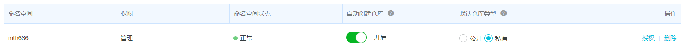

3.创建镜像仓库	一般选择本地仓库


4.点击仓库查看详细信息

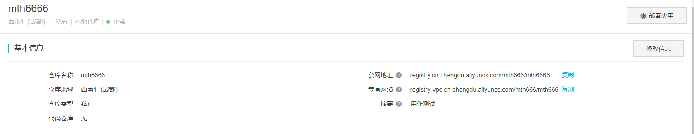

5.操作指南

### 1. 登录阿里云Docker Registry

```shell
$ sudo docker login --username=楼上小寒 registry.cn-chengdu.aliyuncs.com
```

用于登录的用户名为阿里云账号全名，密码为开通服务时设置的密码。

您可以在访问凭证页面修改凭证密码。

### 2. 从Registry中拉取镜像

```shell
$ sudo docker pull registry.cn-chengdu.aliyuncs.com/mth666/mth6666:[镜像版本号]
```

### 3. 将镜像推送到Registry

```shell
$ sudo docker login --username=楼上小寒 registry.cn-chengdu.aliyuncs.com
$ sudo docker tag [ImageId] registry.cn-chengdu.aliyuncs.com/mth666/mth6666:[镜像版本号]
# [镜像版本号] 就是给镜像取得别名
$ sudo docker push registry.cn-chengdu.aliyuncs.com/mth666/mth6666:[镜像版本号]
```

请根据实际镜像信息替换示例中的[ImageId]和[镜像版本号]参数。

### 4. 选择合适的镜像仓库地址

从ECS推送镜像时，可以选择使用镜像仓库内网地址。推送速度将得到提升并且将不会损耗您的公网流量。

如果您使用的机器位于VPC网络，请使用 registry-vpc.cn-chengdu.aliyuncs.com 作为Registry的域名登录，并作为镜像命名空间前缀。

### 5. 示例

使用"docker tag"命令重命名镜像，并将它通过专有网络地址推送至Registry。

```shell
$ sudo docker imagesREPOSITORY                                                         TAG                 IMAGE ID            CREATED             VIRTUAL SIZEregistry.aliyuncs.com/acs/agent                                    0.7-dfb6816         37bb9c63c8b2        7 days ago          37.89 MB$ sudo docker tag 37bb9c63c8b2 registry-vpc.cn-chengdu.aliyuncs.com/acs/agent:0.7-dfb6816
```

使用"docker images"命令找到镜像，将该镜像名称中的域名部分变更为Registry专有网络地址。

```shell
$ sudo docker push registry-vpc.cn-chengdu.aliyuncs.com/acs/agent:0.7-dfb6816
```

## 小结

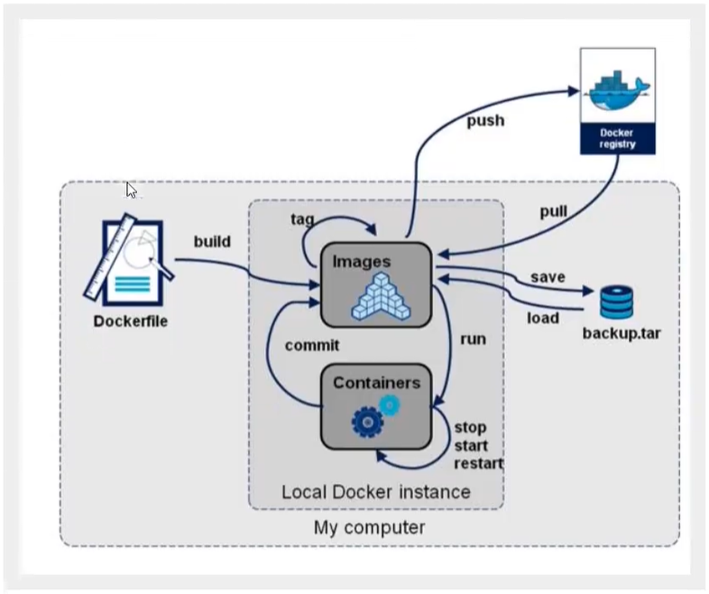

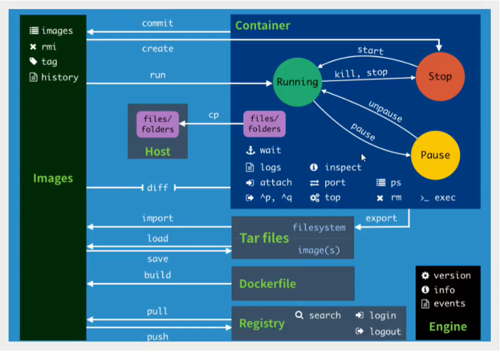


# Docker 网络

## 简介

> 清空所有环境
>
> 查看IP地址

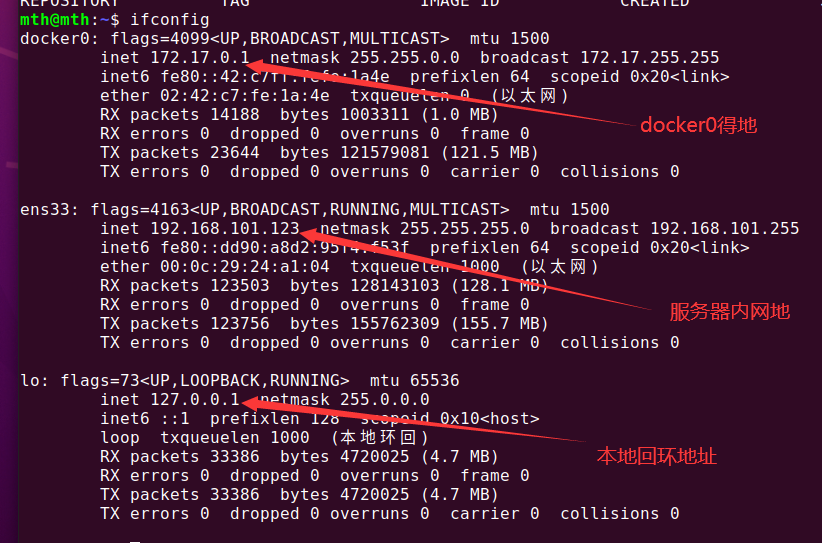


docker 可以直接访问容器，但是容器之间相互访问，需要靠指定得网络（默认是docker0）来转发通信

**启动容器之后，进入到容器里面查看IP**，发现 eth0 就是分配给容器的ID 

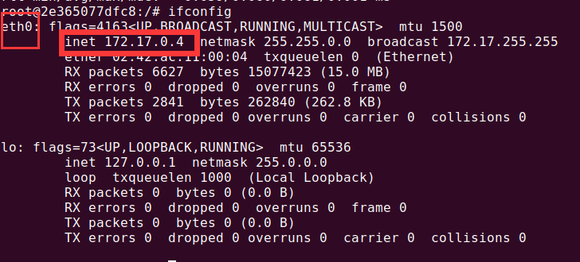


**此时在主机再次查看IP，发现主机多出来一个IPV6的地址，这个地址就是专门用来与我们刚启动的容器通信的**

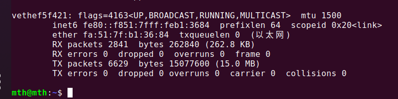

> 原理

1、我们每启动一个 docker 容器, docker 就会给容器分配一个 ip ,我们只要安装了docker ,就会有一个网卡docker0，桥接模式,使用的技术是 evth-pair 技术!

2.没启动一个容器就会多出一对虚拟网卡，这对网卡就是用来容器和指定路由之间通信的，容器与容器之间的通信也靠它


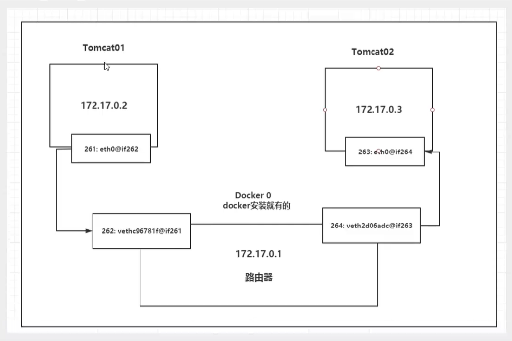


## link 该项技术已经不推荐使用

**实质就是一个hosts映射**

> 思考一个场景 ,我们编写了一个微服务，database url=ip:，项目不重启,数据库ip换掉了,我们希望可以处理这个问题,可以名字来进行访问容器 ?

```shell
# 使用 --link 容器名 指定关联容器（单方面）
mth@mth:~$ docker run -it -P --name my_ubuntu03 --link my_ubuntu02 ubuntu

# 【原理】
# 查看 hosts 配置，在这里原理发现!
root@804904ee7d31:/# cat /etc/hosts
127.0.0.1	localhost
::1	localhost ip6-localhost ip6-loopback
fe00::0	ip6-localnet
ff00::0	ip6-mcastprefix
ff02::1	ip6-allnodes
ff02::2	ip6-allrouters
172.17.0.4	my_ubuntu02 2e365077dfc8
172.17.0.2	804904ee7d31

# 其实这个 my_ubuntu03 就是在本地配置了 my_ubuntu02 的配置：172.17.0.4	my_ubuntu02 2e365077dfc8 指定对my_ubuntu02的访问指向172.17.0.4这个端口。
```

我们现在玩Docker已经不建议使用--link了!

自定义网络!不适用 docker0 !

docker0 问题:他不支持容器名连接访问!

## 自定义网络

**查看docker 所有网络**

```shell
docker network ls
```

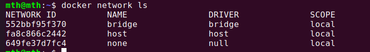

### 网络模式

bridge : 桥接 docker默认的模式，我们自己搭建网络也用这个

none : 不配置网络

host : 和宿主机共享网络

container : 容器网络联通（用的少，局限很大）

### 创建自定义网络

```shell
# 创建子网络
docker network create --driver [bridge] --subnet IP/域 --gateway 该子网IP 该子网名称

# 测试
mth@mth:~$ docker network create --driver bridge --subnet 192.232.0.0/16 --gateway 192.232.0.1 mynet
8804207f9988c6e6e4d03b1ee3f82240bad70df3df7013d9abea36e0ee4c53a4
# 通过 docker network ls 查看现有网络
mth@mth:~$ docker network ls
NETWORK ID          NAME                DRIVER              SCOPE
552bbf95f370        bridge              bridge              local
fa8c866c2442        host                host                local
8804207f9988      【mynet】              bridge              local
649fe37d7fc4        none                null                local

# docker inspect mynet 查看该网络详情
```

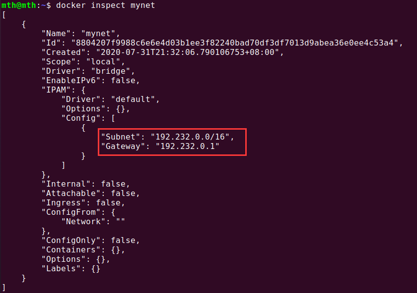

```shell
# 在自定义的子网下，启动两个容器
docker run -d -P --name my_net_ubuntu01 --net mynet ubuntu
docker run -d -P --name my_net_ubuntu02 --net mynet ubuntu

# 发现可以直接 ping 名字联通
```

自定义网络的好处：

redis - 不同的集群使用不同的网络,保证集群是安全和健康的

mysql - 不同的集群使用不同的网络,保证集群是安全和健康的

### 网络连通

多个不同子网内的容器如何通信，不能将两个子网直接连接，而是要让单个容器同时归属于对方的子网（一个容器两个IP）

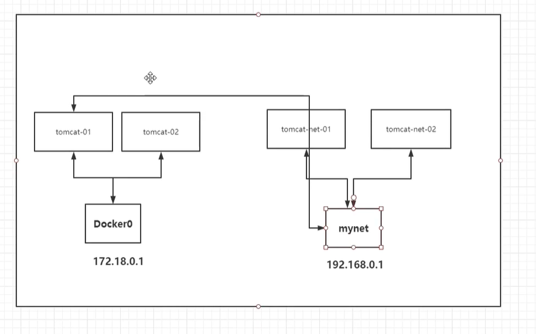

```shell
docker network connect 网络名 容器名

# 测试
docker network connect mynet my_ubuntu01

# 连通之后就是将 my_ubuntu01 放到了 mynet 网络下.
# 实质就是一个容器，两个IP
```

### 部署redis集群


