## docker基础

### 1.1 引言

```python
1. 我本地运行没问题
	环境不一致
2. 哪个哥们又写死循环了， 怎么这么卡。
	在多用户的操作系统下，会相互影响。
3. 淘宝在双11的时候，用户量暴增。
	运维成本过高的问题。
4. 学习一门技术，学习安装成本过高。
	关于安装软件成本过高。
```

### 1.2 docker的思想

```python
1. 集装箱：
	会将所有需要的内容放到不同的集装箱中，谁需要这些环境就直接拿到这个集装箱就可以了。
2. 标准化：
	1. 运输的标准化：docker有一个码头，所有上传的集装箱都放在了这个码头上，当谁需要某些环境，就直接指派鲸鱼去搬运这个集装箱就可以了。
    2. 命令的标准化：docker提供了一系列的命令，去帮助我们获取集装箱等等操作。
    3. 提供了rest的api：衍生出了很多图形化的界面，rancher。
3. 隔离性：
	docker在运行集装箱的内容时，会在Linux的内核中，单独开辟一片空间，这片空间不会影响到其他程序。
```

- 注册中心。（超级码头，上面放的就是集装箱）

- 镜像。（集装箱）
- 容器。（运行起来的镜像）

### 1.3 镜像的操作

```sh
#1. 拉取镜像到本地
docker pull 镜像名称[:tag]
docker pull daocloud.io/library/tomcat:8.5.15-jre8
#2. 查看全部本地的镜像
docker images
#3. 删除本地镜像
docker rmi 镜像的标识
# 4. 镜像的导入导出
# 将本地的镜像导出
docker save -o 导出的路径 镜像id
# 加载本地的镜像文件
docker load -i 镜像文件
# 修改镜像名称
docker tag 镜像id 新镜像名称:版本
```

### 1.4 容器的操作

```sh
#1. 运行容器
# 简单操作
docker run 镜像的标识|镜像名称[:tag]
# 常用的参数
docker run -d -p 宿主机端口:容器端口 --name 容器名称 镜像的标识|镜像名称[:tag]
# -d 代表后台运行
# -p 宿主机端口:容器端口 为了映射当前Linux的端口和容器的端口
# --name 容器名称： 指定容器的名称
#2. 查看正在运行的容器
docker ps [-qa]
#-a: 查看全部容器，包括没有运行的
#-q: 只查看容器的标识
#3. 查看容器的日志
docker logs -f 容器id
#-f: 可以滚动查看日志的最后几行
#4. 进入到容器的内部
docker exec -it 容器id bash
#5. 删除容器（删除容器前， 需要先停止容器）
docker stop 容器id
docker stop $(docker ps -qa)
docker rm 容器id
docker rm $(docker ps -qa)
#6. 启动容器
docker start 容器id
```

### 1.5 数据卷

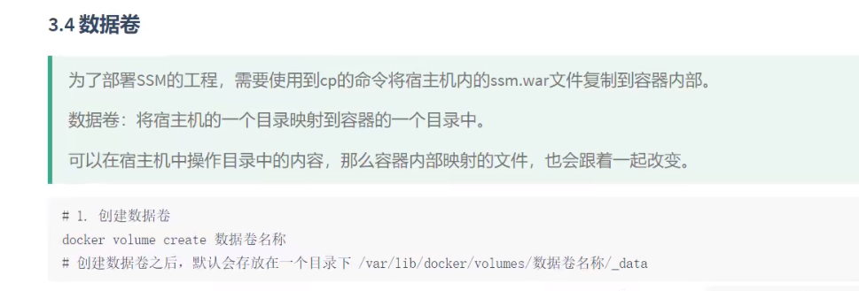

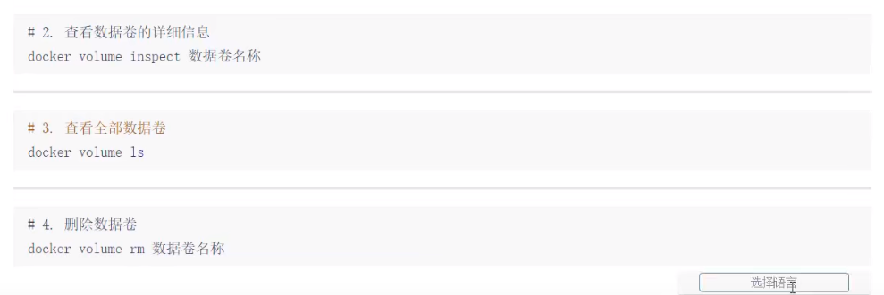

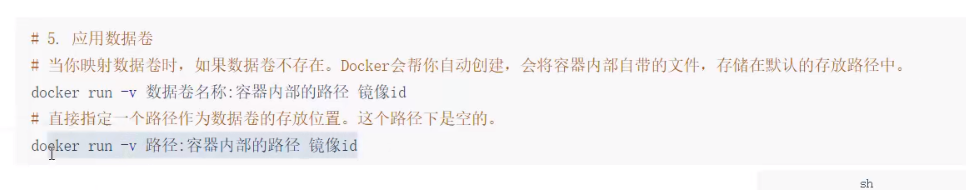

## 应用


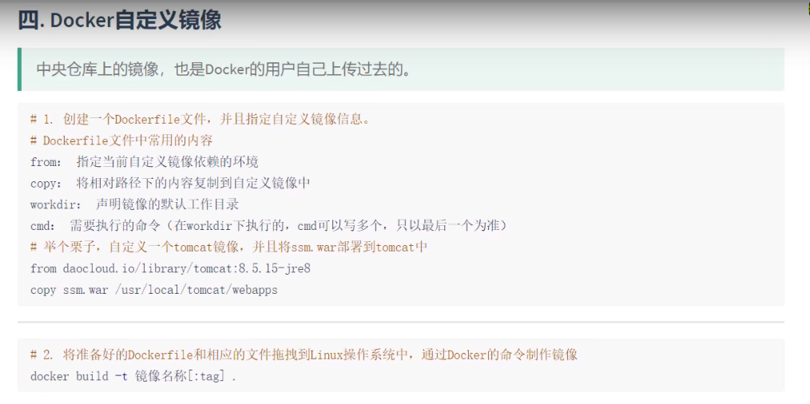

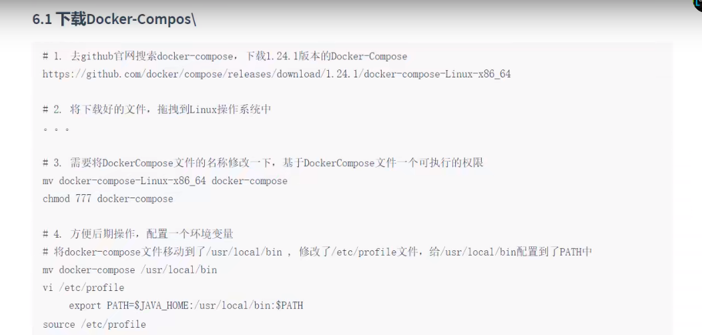

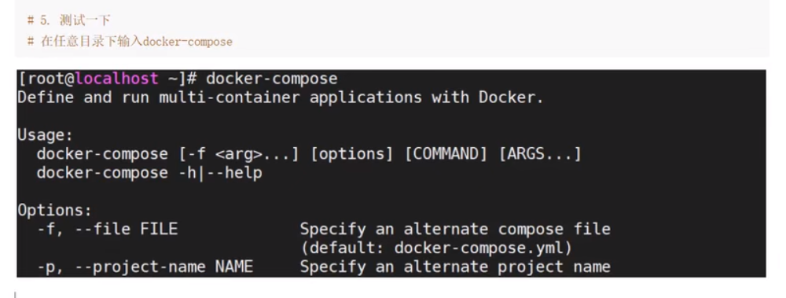

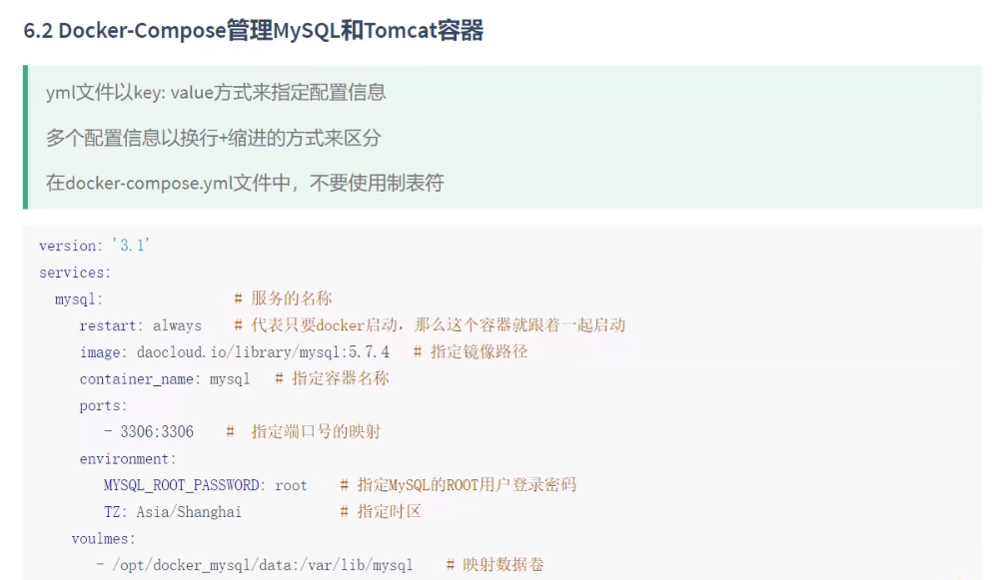

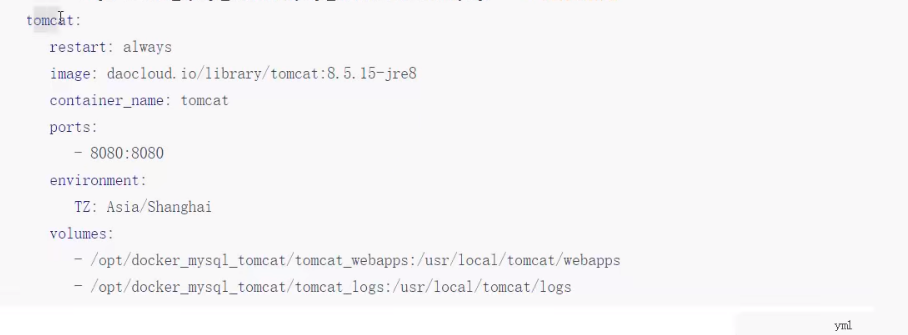

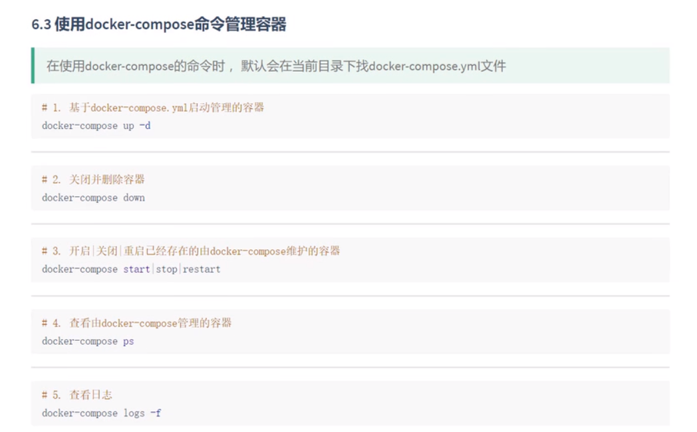

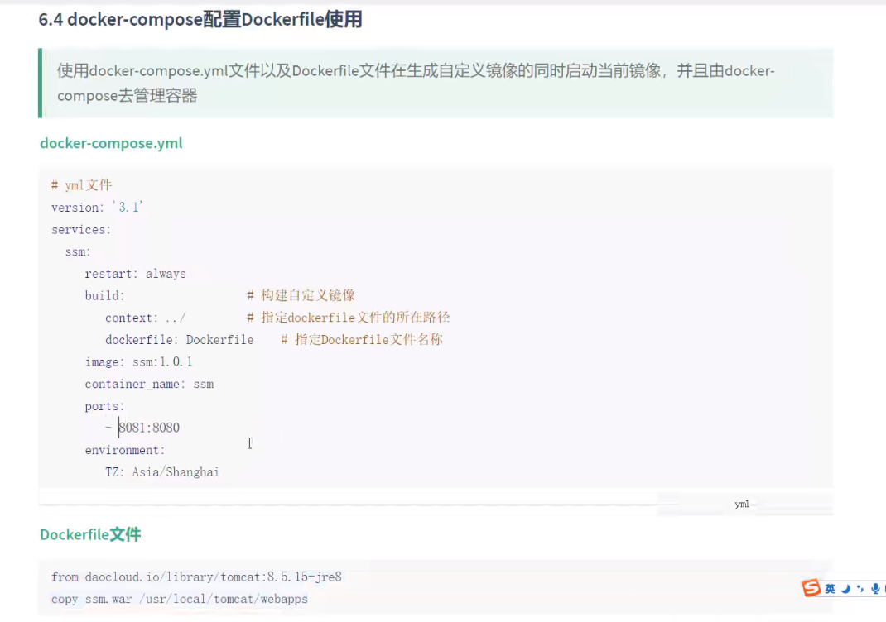

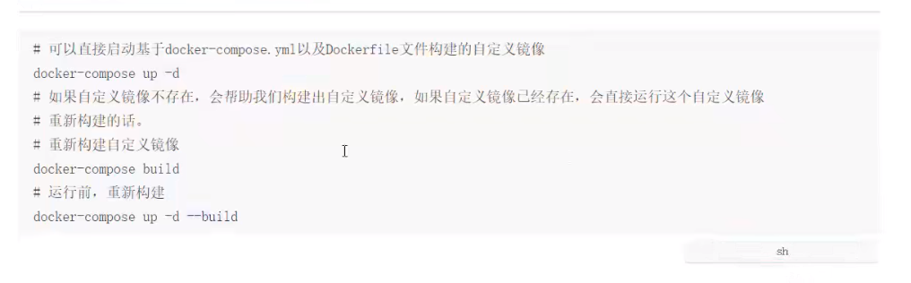

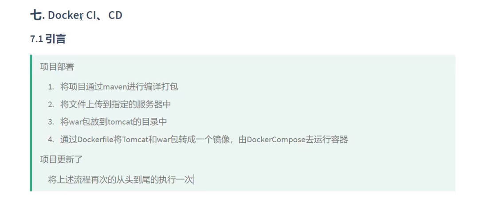

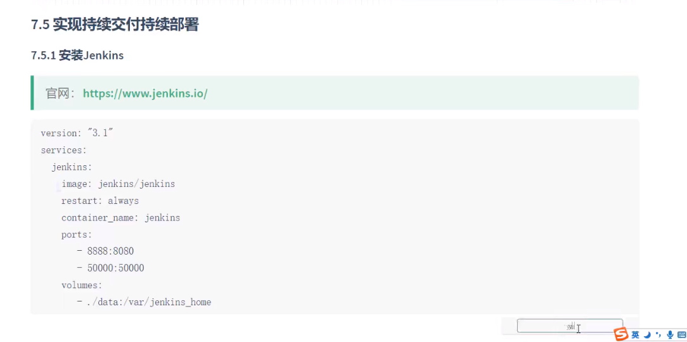

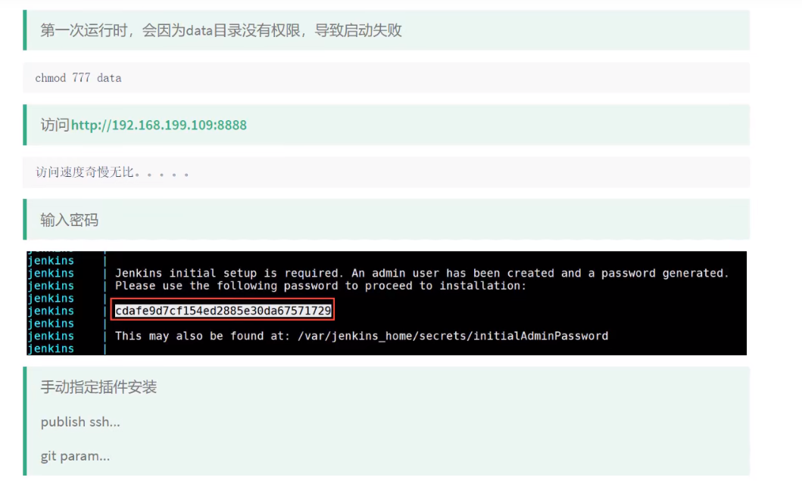


# 经验

```bash
查看日志步骤：
查看部署的服务
docker service ls
查看容器部署的节点
docker service ps 容器
1、docker ps 查看容器Id xx
2、进入容器 docker exec  -ti   xx  /bin/bash
 xx就是容器id
3、cd .. 
4、cd {服务名}/log
5、cat xxx.log	

docker run -d -p 30001:8080 --name jenkins tomcat:v1.0
docker logs –f –t  微服务容器ID
docker logs –tfn row(从日志末尾开始行数)  微服务容器ID 

export JAVA_HOME=/usr/local/jdk-11.0.15
export PATH=$JAVA_HOME/bin:$PATH

```

