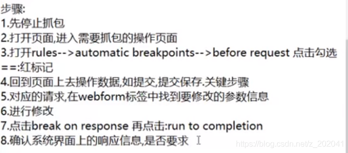
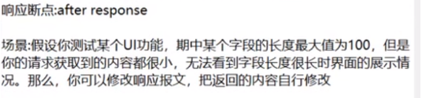
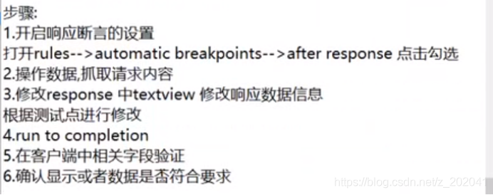
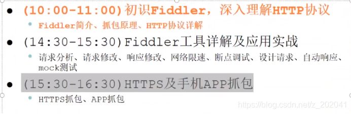
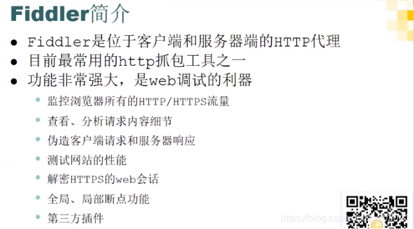
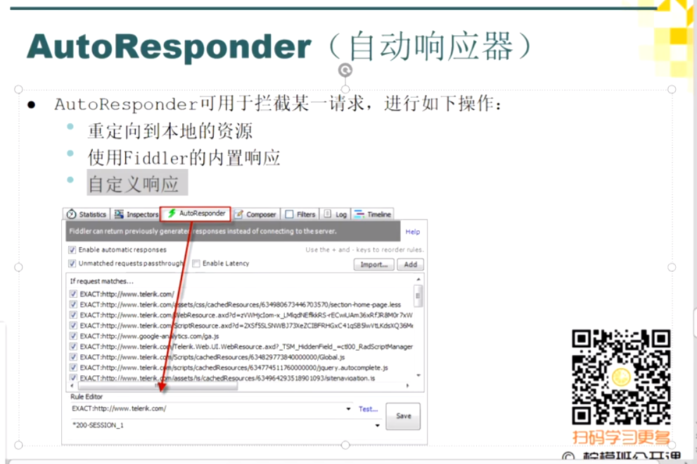

# fiddler用法（1）












# **Fiddler抓包工具**

-   **配置Fiddler**

    ```python
    【1】Tools -> Options -> HTTPS
        1.1) 添加证书信任:  勾选 Decrypt Https Traffic 后弹出窗口，一路确认
        1.2) 设置之抓浏览器的包:  ...from browsers only

    【2】Tools -> Options -> Connections
        2.1) 设置监听端口（默认为8888）

    【3】配置完成后重启Fiddler（'重要'）
        3.1) 关闭Fiddler,再打开Fiddler
    ```

-   **配置浏览器代理**

    ```python
    【1】安装Proxy SwitchyOmega谷歌浏览器插件

    【2】配置代理
        2.1) 点击浏览器右上角插件SwitchyOmega -> 选项 -> 新建情景模式 -> myproxy(名字) -> 创建
        2.2) 输入  HTTP://  127.0.0.1  8888
        2.3) 点击 ：应用选项
        
    【3】点击右上角SwitchyOmega可切换代理

    【注意】: 一旦切换了自己创建的代理,则必须要打开Fiddler才可以上网
    ```

-   **Fiddler常用菜单**

    ```python
    【1】Inspector ：查看数据包详细内容
        1.1) 整体分为请求和响应两部分
        
    【2】Inspector常用菜单
        2.1) Headers ：请求头信息
        2.2) WebForms: POST请求Form表单数据 ：<body>
                       GET请求查询参数: <QueryString>
        2.3) Raw : 将整个请求显示为纯文本
    ```

