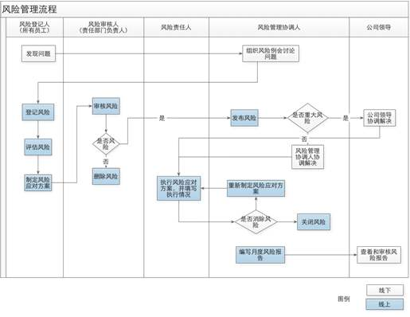
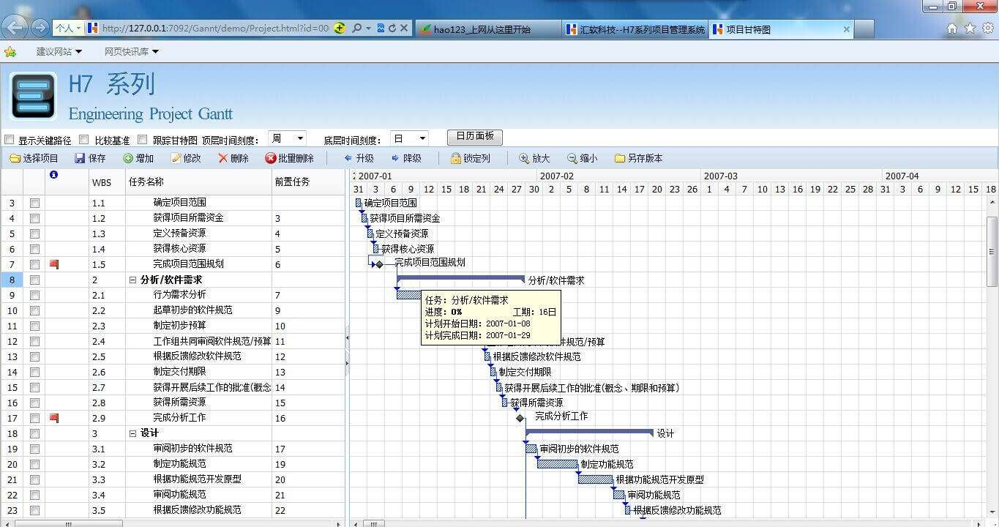

综合项目及工具
==========================

-----------

[TOC]

## 1. 软件项目开发

### 1.1 软件项目开发流程

```
需求分析 ----> 概要设计  ---> 项目计划 ----> 详细设计---> 编码测试 -----> 项目测试 ----> 调试修改 ---> 项目发布----> 后期维护
```

* 需求分析 ： 确定用户的真实需求 

>  1. 确定用户的真实需求，项目的基本功能
>  2. 确定项目的整体难度和可行性分析
>  3. 需求分析文档，用户确认

* 概要设计：对项目进行初步分析和整体设计

> 1. 确定整体架构
> 2. 进行技术可行性分析
> 3. 确定技术整体思路和使用框架模型
> 4. 形成概要文档指导开发流程



* 项目计划 ： 确定项目开发的时间轴和流程

> 1. 确定开发工作的先后顺序
> 2. 确定时间轴  ，事件里程碑
> 3. 人员分工 
> 4. 形成甘特图和思维导图等辅助内容



* 详细设计 ： 项目的具体实现

> 1.形成详细设计文档 ： 思路，逻辑流程，功能说明，技术点说明，数据结构说明，代码说明

* 编码测试 ： 按照预定计划实现代码编写，并且做基本检测

> 1. 代码编写
> 2. 写测试程序
> 3. 技术攻关

* 项目测试 ： 对项目按照功能进行测试

> 1. 跨平台测试 ，使用测试
> 2. 根据测试报告进行代码修改
> 3. 完成测试报告

* 项目发布

> 1.项目交付用户进行发布
> 2.编写项目说明文档

* 后期维护

> 1.维护项目正常运转
> 2.进行项目的迭代升级

### 1.2  开发注意事项

* 按时完成项目工作和项目时间不足之间的冲突
* 项目实施人员之间的冲突

### 1.3 项目管理工具

* 编写文档： word  ppt  excel  markdown   LaTex
* 项目流程图 ： Mindmanager  visio
* 项目管理 ： project
* 代码管理 ： svn   git


## 2. GIT和GitHub

### 2.1 GIT概述

* 什么是GIT

  GIT是一个开源的分布式版本控制系统，用于高效的管理各种大小项目和文件。

* 代码管理工具的用途
  * 防止代码丢失，做备份
  * 项目的版本管理和控制，可以通过设置节点进行跳转
  * 建立各自的开发环境分支，互不影响，方便合并
  * 在多终端开发时，方便代码的相互传输

* GIT的特点

  * git是开源的，多在*nix下使用，可以管理各种文件

  * git是分布式的项目管理工具(SVN是集中式的)

  * git数据管理更多样化，分享速度快，数据安全

  * git 拥有更好的分支支持，方便多人协调

    

* Linux下GIT安装

> sudo apt  install  git


### 2.2 GIT使用


* 基本概念
  * 工作区：项目所在操作目录，实际操作项目的区域

    暂存区: 用于记录工作区的工作（修改）内容
  * 仓库区: 用于备份工作区的内容
  * 远程仓库: 远程主机上的GIT仓库

> 注意： 在本地仓库中，git总是希望工作区的内容与仓库区保持一致，而且只有仓库区的内容才能和其他远程仓库交互。


