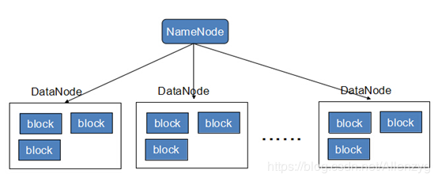
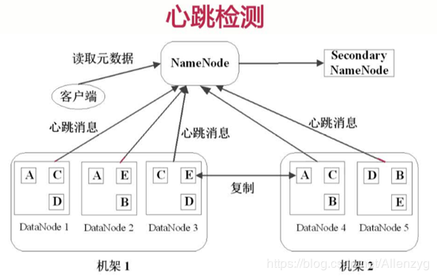
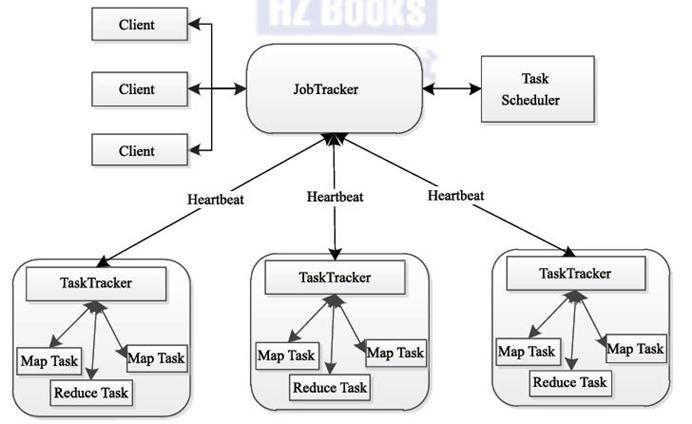
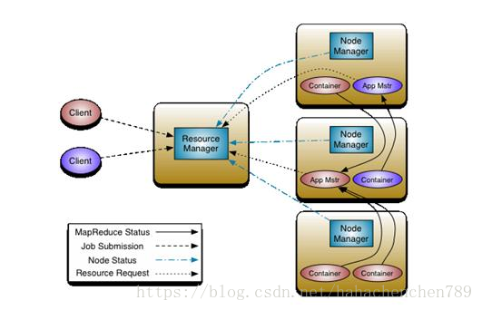
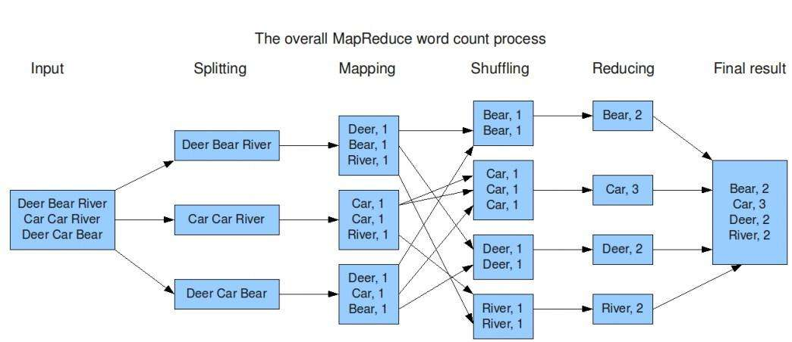

## **Day01**

## **1. 大数据简介**

### **1.1 大数据的由来**

```
	随着计算机技术的发展，互联网的普及，信息的积累已经到了一个非常庞大的地步，信息的增长也在不断的加快，随着互联网、物联网建设的加快，信息更是爆炸式增长，收集、检索、统计这些信息越发困难，必须使用新的技术来解决这些问题
```

### **1.2 什么是大数据**

```
【1】定义
	大数据指无法在一定时间范围内用常规软件工具进行捕捉、管理和处理的数据集合，需要新处理模式才能具有更强的决策力、洞察发现力和流程优化能力的海量、高增长率和多样化的信息资产
	
【2】总结
	大数据是指即从各种各样类型的数据中，获得有价值的信息
```

### **1.3 大数据特性**

```
【1】大体量（Volume）
	数据体量大,一般从TB级别开始计算，可从数百TB到数十数百PB甚至EB的规模
	KB、MB、GB、TB、PB、EB、... ...
	1KB = 1024Bytes
	1MB = 1024K
	1GB = 1024M
	1TB = 1024G
	1PB = 1024T
	1EB = 1024P
	... ...
【2】多样性（Variety）
	数据的种类和来源多
【3】时效性（Velocity）
	很多大数据需要在一定的时间限度下得到及时处理
【4】准确性（Veracity）
	处理的结果要保证一定的准确性
【5】大价值（Value）
	大数据包含很多深度的价值，大数据分析挖掘和利用将带来巨大的商业价值

【补充】
	数据的价值密度越来越低,但是这并不意味着想要的数据越来越少,相反我们想要的数据是越来越多，但是样本总量的增长速度是要高于想要的数据的增长速度的
```

### **1.4 大数据与Hadoop**

```
【1】Hadoop是什么？
    1.1) Hadoop是一种分析和处理海量数据的软件平台
    1.2) Hadoop是一款开源软件，使用JAVA开发
    1.3) Hadoop可以提供一个分布式基础架构
```

### **1.5 带来的问题**

```
【1】数据存储问题 - 存储速度、存储空间
【2】数据计算|分析问题 - 性能与效率问题

【说明】
	1、numpy、pandas处理上GB的数据,如果处理TB、PB级别数据怎么办？
	2、传统企业解决
	3、谷歌解决方案:
	  使用MapReduce算法,将任务分成小份,并将他们分配到多台计算机,并且能够从多台计算机收集并合并，得到最终的结果。
	  谷歌实现了分布式存储、分布式计算
```

## **2. Hadoop简介**

###  **2.1 Hadoop概述**

#### **2.1.1 Hadoop概念**

- **定义**

  Hadoop是Yahoo!开发，后贡献给了Apache的一套开源的、可靠的、可扩展的用于分布式计算的框架

- **Hadoop作者** 

  Doug cutting

- **Hadoop名字由来** 

  以Hadoop作者的孩子的一个棕黄色的大象样子的玩具的命名

  


#### **2.1.2 Hadoop特点**

- **高可靠性** 

  Hadoop按位存储和数据处理的能力值得信赖

- **高扩展性**

  Hadoop通过可用的计算机集群分配数据，完成存储和计算任务，这些集群可以方便地扩展到数以千计的节点中，具有高扩展性

- **高效性**

  Hadoop能够在节点之间进行动态地移动数据，并保证各个节点的动态平衡，处理速度非常快，具有高效性

- **高容错性**

  Hadoop能够自动保存数据的多个副本（默认是3个），并且能够自动将失败的任务重新分配


#### **2.1.3 Hadoop能做什么**

- **大数据量存储**

  分布式存储（各种云盘，百度，360~还有云平台均有hadoop应用）

- **日志处理**

- **搜索引擎**

  如何存储持续增长的海量网页:  单节点 V.S. 分布式存储

  如何对持续增长的海量网页进行排序: 超算 V.S. 分布式计算

- **数据挖掘**

  目前比较流行的广告推荐

#### **2.1.4 Hadoop版本**

- **Hadoop1.0**

  包含Common，HDFS和MapReduce，停止更新

- **Hadoop2.0**

  包含了Common，HDFS，MapReduce和YARN。Hadoop2.0和Hadoop1.0完全不兼容。

- **Hadoop3.0**

  包含了Common，HDFS，MapReduce，YARN。Hadoop3.0和Hadoop2.0是兼容的

### **2.2 Hadoop核心组件**

#### **2.2.1 HDFS（Hadoop Distributed File System）**

- **HDFS**

  分布式存储，解决海量数据的存储

- **HDFS特点及原理**

  HDFS具有扩展性、容错性、海量数量存储的特点

  原理为将大文件切分成指定大小的数据块, 并在分布式的多台机器上保存多个副本

- **HDFS角色和概念**

  1. Client

     切分文件、访问HDFS、与NameNode交互获取文件位置信息、与DataNode交互读取和写入数据

  2. Namenode

     Master节点，管理HDFS的名称空间和数据块映射信息，配置副本策略，处理所有客户端请求

  3. Secondarynode

     定期同步NameNode，紧急情况下，可转正

  4. Datanode

     数据存储节点，存储实际的数据

     汇报存储信息给NameNode

  5. Block

     每块默认128MB大小

     每块可以多个副本

- **HDFS示意图**

  

- **HDFS原理图**

  ==1、每个数据块3个副本，分布在两个机架内的节点，2个副本在同一个机架上，另外一个副本在另外的机架上==

  

  ==2、心跳检测，datanode定期向namenode发送心跳消息。查看是否有datanode挂掉了==

  ​								

  ==3、secondary namenode;定期同步元数据映像文件和修改日志，namenode发生故障，secondaryname会成为主namenode==

  ​					

  

- **HDFS写文件流程**

  ```
  【1】客户端将文件拆分成固定大小128M的块，并通知namenode
  【2】namenode找到可用的datanode返回给客户端
  【3】客户端根据返回的datanode，对块进行写入
  【4】通过流水线管道流水线复制
  【5】更新元数据，告诉namenode已经完成了创建新的数据块，保证namenode中的元数据都是最新的状态
  ```

  ​	

- **HDFS读文件流程**

  ```
  【1】客户端向namenode发起读请求，把文件名，路径告诉namenode
  【2】namenode查询元数据，并把数据返回客户端
  【3】此时客户端就明白文件包含哪些块，这些块在哪些datanode中可以找到
  ```

  ​	

#### **2.2.2 MapReduce**

- **MapReduce实现了分布式计算**

  Hadoop的MapReduce是对google三大论文的MapReduce的开源实现，实际上是一种编程模型，是一个分布式的计算框架，用于处理海量数据的运算，由JAVA实现

- **MapReduce原理图**

  

- **MapReduce角色及概念**

  1. JobTracker

     –Master节点只有一个

     –管理所有作业/任务的监控、错误处理等

     –将任务分解成一系列任务，并分派给TaskTracker

  2. TaskTracker

     –Slave节点，一般是多台

     –运行Map Task和Reduce Task

     –并与JobTracker交互，汇报任务状态

  3. Map Task

     –解析每条数据记录，传递给用户编写的map()并执行，将结果输出

  4. Reducer Task

     –从Map Task的执行结果中，远程读取输入数据，对数据进行排序，将数据按照分组传递给用户编写的reduce函数执行

#### 2.2.3 Yarn

- **作用**

  负责整个集群资源的管理和调度，是Hadoop的一个通用的资源管理系统

- **定义**

  Apache Hadoop YARN （Yet Another Resource Negotiator，另一种资源协调者）是一种新的 Hadoop 资源管理器，它是一个通用资源管理系统，可为上层应用提供统一的资源管理和调度，它的引入为集群在利用率、资源统一管理和数据共享等方面带来了巨大好处

- **原理图**

  

- **Yarn角色及概念**

  1. Resourcemanager
  
     –处理客户端请求 
  
     –启动/监控ApplicationMaster
  
     –监控NodeManager
  
     –资源分配与调度 
  
  2. Nodemanager
  
     –单个节点上的资源管理 
  
     –处理来自ResourceManager的命令 
  
     –处理来自ApplicationMaster的命令 
  
  3. ApplicationMaster
  
     –为应用程序申请资源，并分配给内部任务 
  
     –任务监控与容错 
  
  4. Container
  
     –对任务运⾏行环境的抽象，封装了CPU 、内存等
  
  5. Client
  
     –用户与Yarn交互的客户端程序 
  
     –提交应用程序、监控应用程序状态，杀死应用程序等 

### **2.3 Hadoop总结**

#### **2.3.1 Hadoop组成**

1. 分布式存储 - HDFS
2. 分布式计算 - MapReduce
3. 资源管理 - Yarn

#### **2.3.2 HDFS特点**

- **HDFS优点**
  1. 高可靠性
  2. 高扩展性
  3. 高效性
  4. 高容错性
  5. 低成本 ：与一体机、商用数据仓库等相比，hadoop是开源的，项目的软件成本因此会大大降低

- **HDFS缺点**
  1. 不能做到低延迟，由于hadoop针对高数据吞吐量做了优化，牺牲了获取数据的延迟，所以对于低延迟数据访问，不适合hadoop
  2. 不适合大量小文件存储，由于namenode将文件系统的元数据存储在内存中，因此该文件系统所能存储的文件总数受限于namenode的内存容量，根据经验，每个文件、目录和数据块的存储信息大约占150字节
  4. 对于上传到HDFS上的文件，不支持修改文件，HDFS适合一次写入，多次读取的场景

#### **2.3.3 HDFS相关**

- **名词**
  1. NameNode
  2. DataNode

- **写入文件流程**
  1. 客户端将文件拆分成固定大小128M的块，并通知namenode
  2. namenode找到可用的datanode返回给客户端
  3. 客户端根据返回的datanode，对块进行写入
  4. 通过流水线管道流水线复制
  5. 更新元数据，告诉namenode已经完成了创建新的数据块，保证namenode中的元数据都是最新的状态

- **读取文件流程**
  1. 客户端向namenode发起独立请求，把文件名，路径告诉namenode
  2. namenode查询元数据，并把数据返回客户端
  3. 此时客户端就明白文件包含哪些块，这些块在哪些datanode中可以找到

## **3. 环境安装**

### **3.1 安装方式**

- **单机模式**

  只能启动MapReduce

- **伪分布式**

  能启动HDFS、MapReduce 和 YARN的大部分功能

- **完全分布式**

  能启动Hadoop的所有功能

### **3.2 安装JDK**

#### **3.2.1 JDK安装步骤**

1. 下载JDK安装包（下载Linux系统的 .tar.gz 的安装包）

   https://www.oracle.com/java/technologies/javase/javase-jdk8-downloads.html

2. 更新Ubuntu源

   sudo apt-get update

3. 将JDK压缩包解压到Ubuntu系统中 /usr/local/ 中

   sudo tar -zxvf jdk-8u251-linux-x64.tar.gz -C /usr/local/

4. 将解压的文件夹重命名为 jdk8

   cd /usr/local/

   sudo mv jdk1.8.0_251/ jdk8

5. 添加到环境变量

   cd /home/tarena/

   sudo gedit .bashrc

   在文件末尾添加如下内容:

   ```
   export JAVA_HOME=/usr/local/jdk8
   export JRE_HOME=$JAVA_HOME/jre
   export CLASSPATH=.:$JAVA_HOME/lib:$JRE_HOME/lib
   export PATH=.:$JAVA_HOME/bin:$PATH
   ```

   source .bashrc

6. 验证是否安装成功

   java -version

   <出现java的版本则证明安装并添加到环境变量成功 java version "1.8.0_251">

### **3.3 安装Hadoop并配置伪分布式**

#### **3.3.1 Hadoop安装配置步骤**

1. 安装SSH

   sudo apt-get install ssh

2. 配置免登录认证,避免使用Hadoop时的权限问题

   ssh-keygen -t rsa   （输入此条命令后一路回车）

   cd ~/.ssh

   cat id_rsa.pub >> authorized_keys

   ssh localhost   （发现并未让输入密码即可连接）

   exit   （退出远程连接状态）

3. 下载Hadoop 2.10（374M）

   https://archive.apache.org/dist/hadoop/common/hadoop-2.10.0/hadoop-2.10.0.tar.gz

4. 解压到 /usr/local 目录中,并将文件夹重命名为 hadoop，最后设置权限

   sudo tar -zxvf hadoop-2.10.0.tar.gz -C /usr/local/

   cd /usr/local

   sudo mv hadoop-2.10.0/ hadoop2.10

   sudo chown -R tarena hadoop2.10/

5. 验证Hadoop

   cd /usr/local/hadoop2.10/bin

   ./hadoop version   （此处出现hadoop的版本）

6. 设置JAVE_HOME环境变量

   sudo gedit /usr/local/hadoop2.10/etc/hadoop/hadoop-env.sh

   把原来的export JAVA_HOME=${JAVA_HOME}改为
   export JAVA_HOME=/usr/local/jdk8

7. 设置Hadoop环境变量

   sudo gedit /home/tarena/.bashrc

   在末尾追加

   ```
   export HADOOP_HOME=/usr/local/hadoop2.10
   export CLASSPATH=.:{JAVA_HOME}/lib:${HADOOP_HOME}/sbin:$PATH
   export PATH=.:${HADOOP_HOME}/bin:${HADOOP_HOME}/sbin:$PATH
   ```

   source /home/tarena/.bashrc

8. 伪分布式配置，修改2个配置文件（core-site.xml 和 hdfs-site.xml）

9. 修改core-site.xml

   sudo gedit  /usr/local/hadoop2.10/etc/hadoop/core-site.xml

   添加如下内容

   ```html
   <configuration>
       <property>
           <!--数据目录配置参数-->
           <name>hadoop.tmp.dir</name>
           <value>file:/usr/local/hadoop2.10/tmp</value>
       </property>
       <property>
           <!--文件系统配置参数-->
           <name>fs.defaultFS</name>
           <value>hdfs://localhost:9000</value>
       </property>
   </configuration>
   ```
   
10. 修改hdfs-site.xml

    sudo gedit /usr/local/hadoop2.10/etc/hadoop/hdfs-site.xml

    添加如下内容

    ```html
    <configuration>
        <property>
            <!--副本数量-->
            <name>dfs.replication</name>
            <value>1</value>
        </property>
        <property>
            <!--namenode数据目录-->
            <name>dfs.namenode.name.dir</name>
            <value>file:/usr/local/hadoop2.10/tmp/dfs/name</value>
        </property>
        <property>
            <!--datanode数据目录-->
            <name>dfs.datanode.data.dir</name>
            <value>file:/usr/local/hadoop2.10/tmp/dfs/data</value>
        </property>
    </configuration>
    ```
    
11. 配置YARN - 1

    cd /usr/local/hadoop2.10/etc/hadoop

    cp mapred-site.xml.template mapred-site.xml

    sudo gedit mapred-site.xml

    添加如下配置

    ```html
    <property>
        <name>mapreduce.framework.name</name>
        <value>yarn</value>
    </property>
    ```
    
12. 配置YARN - 2

    sudo gedit yarn-site.xml

    添加如下配置：

    ```html
    <property>
        <name>yarn.nodemanager.aux-services</name>
        <value>mapreduce_shuffle</value>
    </property>
    ```

13. 执行NameNode格式化

    cd /usr/local/hadoop2.10/bin

    ./hdfs namenode -format

    出现 Storage directory /usr/local/hadoop2.10/tmp/dfs/name has been successfully formatted 则表示格式化成功

14. 启动Hadoop所有组件

    cd /usr/local/hadoop2.10/sbin

    ./start-all.sh

    启动时可能会出现警告，直接忽略即可，不影响正常使用

15. 启动成功后，可访问Web页面查看 NameNode 和 Datanode 信息，还可以在线查看 HDFS 中的文件

     http://localhost:50070

16. 查看Hadoop相关组件进程

    jps

    会发现如下进程

    ```
    NameNode
    DataNode
    SecondaryNameNode
    ResourceManager
    NodeManager
    ```

17. 测试 - 将本地文件上传至hdfs

    hadoop fs -put 一个本地的任意文件 /

    hadoop fs -ls /

    也可以在浏览器中Utilities->Browse the file system查看

## **4. HDFS Shell操作**

### **4.1 命令格式**

hadoop fs 命令

### **4.2 常用命令汇总**

- **查看HDFS系统目录（ls）**

  命令格式 ：hadoop fs -ls 路径

  示例 ：hadoop fs -ls /

- **创建文件夹（mkdir）**

  命令格式1 ：hadoop fs -mkdir 绝对路径

  命令格式2 ：hadoop fs -mkdir -p 绝对路径   （可递归创建文件夹）

  示例1 ：hadoop fs -mkdir /test

  示例2 ：hadoop fs -mkdir -p /test/stu

- **上传文件（put）**

  命令格式 ：hadoop fs -put 本地文件 HDFS目录

  示例 ：hadoop fs -put words.txt /test/

- **下载文件（get）**

  命令格式 ：hadoop fs -get HDFS文件 本地目录

  示例 ：hadoop fs -get /test/words.txt /home/tarena/

- **删除文件或目录（rm）**

  命令格式1 ：hadoop fs -rm 文件或目录的绝对路径

  命令格式2 ：hadoop fs -rm -r 目录  （删除文件夹要加 -r 选项）

  示例1 ：hadoop fs -rm /test/words.txt

  示例2 ：hadoop fs -rm -r /test

- **查看文件内容（text）**

  命令格式 ：hadoop fs -text 文件绝对路径

  示例 ：hadoop fs -text /test/words.txt

- **移动（mv）**

  命令格式 ：hadoop fs -mv 源文件 目标目录

  示例 ：hadoop fs -mv /test/words.txt /words.txt

- **复制（cp）**

  命令格式 ：hadoop fs -cp 源文件  目标目录

  示例 ：hadoop fs -cp /test/words.txt  /words.txt

### **4.3 HDFS Shell操作练习**

1. 在本地 /home/tarena/ 下新建 students.txt
2. 在students.txt中任意添加内容
3. 在HDFS中创建 /studir/stuinfo/ 目录
4. 将本地students.txt文件上传到HDFS中
5. 查看HDFS中 /studir/stuinfo/students.txt 的内容
6. 将HDFS中 /studir/stuinfo/students.txt 下载到本地命名为 new_students.txt
7. 删除HDFS中的 /studir 目录

## **5. MapReduce详解**

### **5.1 MapReduce概述**

#### 5.1.1 MapReduce定义

1. MapReduce是Hadoop提供的一套进行分布式计算的框架，用于大规模数据集（大于1TB）的并行运算
2. MapReduce将计算过程拆分为2个阶段：Map(映射)阶段和Reduce(规约)阶段

#### 5.1.2 MapReduce编程模型

- **MapReduce分而治之思想**

  ```
  【示例1】
      需要在一堆扑克牌(张数未知)中统计四种花色的牌有多少张
      思路：
      	首先：需要找几个人（比如说四个人），每人给一堆，数出来四种花色的张数
      	然后：这四个人，每个人只负责统计一种花色，最终将结果汇报给一个人，此为典形的map-reduce模型
      
  【示例2】
      一堆钞票，请查找出各种面值的钞票分别有多少张？
      思路：
      	首先：每个人分一部分钞票，输出各种面值的分别有多少张
      	然后：汇总，每个人负责统计一种面值
  ```

- **统计文件中每个单词出现的次数原理图**

  

### **5.2 MapReduce编程实现**

#### **5.2.1 相关库安装**

sudo pip3 install mrjob

#### **5.2.2 Python实现wordcount案例**

1. 新建words.txt，并写入如下内容

   ```
   hello world
   hello tarena
   I am world and tarena
   I love tarena world
   ```

2. python代码实现wordcount

   ```python
   """
   1.mapper的执行次数由行数决定，
     参数1：行首的便宜量（一般用不到）
     参数2：一行的内容，经常写做 line
     
   2.reduce的执行次数由键的个数决定
     参数1（key）：由mapper() 发送
     参数2（value）：所有相同key的值的序列
   """
   
   from mrjob.job import MRJob
   
   class MRJobCounter(MRJob):
       def mapper(self, _, line):
           for w in line.split():
               yield w, 1
               
       def reducer(self, word, occurence):
           yield word, sum(occurence)
           
   if __name__ == '__main__':
       MRJobCounter.run()
   ```

3. 运行MapReduce程序的两种方式

   ```
   [1]本地模式（一次启动多个进程）
       python3 wordCount.py -r local word.txt > out2.txt
       
   [2]Hadoop模式
       python3 wordCount.py -r hadoop word.txt -o hdfs:///out
       
       验证
       	hadoop fs -ls /out
       	hadoop fs -text /out/part-00000
   ```

## **6. hive**

### **6.1 Hive概述**

#### **6.1.1 Hive概述**

1. Hive是基于Hadoop的一个**数据仓库工具**。可以将结构化的数据文件映射为一张表，并提供完整的sql查询功能，本质上还是一个文件
2. 底层是将sql语句转换为MapReduce任务进行运行
3. 本质上是一种**大数据离线分析**工具
4. 学习成本相当低，不用开发复杂的mapreduce应用，十分适合数据仓库的统计分析
5. hive可以用来进行 数据提取、转化、加载，这是一种可以存储、查询和分析存储在hadoop上的数据。

#### **6.1.2 数据仓库**

1. 数据是集成的，数据的来源可能是：MySQL、oracle、网络日志、爬虫数据...... 等多种异构数据源。Hadoop你就可以看成是一个数据仓库，分布式文件系统hdfs就可以存储多种不同的异构数据源

2. 数据仓库不仅要存数据，还要管理数据，即：hdfs 和 mapreduce，从这个角度看之前的hadoop其实就是一个数据仓库，hive其实就是在hadoop之外包了一个壳子，hive是基于hadoop的数据仓库工具，不通过代码操作，通过类sql语言操作数据仓库中的数据。

   底层其实仍然是分布式文件系统和mapreduce，会把sql命令转为底层的代码

3. 数据仓库的特征

   1. 数据仓库是多个异构数据源集成的
   2. 数据仓库存储的一般是历史数据，大多数的应用场景是读数据（分析数据）
   3. 数据库是为捕获数据而设计，而数据仓库是为了分析数据而设计
   4. 数据仓库是弱事务的，因为数据仓库存的是历史数据，一般都读（分析）数据场景

4. OLTP系统（online transaction processing）

   1. 数据库属于OLTP系统，联机事务处理，涵盖了企业大部分的日常操作，比如购物、库存、制造、银行、工资、注册、记账等，比如mysql oracle等关系型数据库
   2. OLTP系统的访问由于要保证原子性，所以有事务机制和恢复机制

5. OLAP系统（online analytical processing）

   1. 数据仓库属于OLAP系统，联机分析处理系统，hive等
   2. OLAP系统一般存储的是历史数据，所以大部分都是只读操作，不需要事务

#### **6.1.3 Hive的HQL**

1. HQL - Hive通过类SQL的语法，来进行分布式的计算
2. HQL用起来和SQL非常的类似，Hive在执行的过程中会将HQL转换为MapReduce去执行，所以Hive其实是基于Hadoop的一种分布式计算框架，底层仍然是MapReduce

#### **6.1.4 Hive特点**

- **Hive优点**
  1. 学习成本低，只要会sql就能用hive
  2. 开发效率高，不需要编程，只需要写sql
  3. 模型简单，易于理解
  4. 针对海量数据的高性能查询和分析
  5. 与 Hadoop 其他产品完全兼容
- **Hive缺点**
  1. 不支持行级别的增删改
  2. 不支持完整的在线事务处理

#### **6.1.5 Hive适用场景**

1. Hive 构建在基于静态（离线）批处理的Hadoop 之上，Hadoop通常都有较高的延迟并且在作业提交和调度的时候需要大量的开销。因此，Hive 并不能够在大规模数据集上实现低延迟快速的查询因此，Hive并不适合那些需要低延迟的应用
2. Hive并不提供实时的查询和基于行级的数据更新操作。Hive 的最佳使用场合是大数据集的离线批处理作业，例如，网络日志分析。

### **6.2 Hive安装**

#### **6.2.1 详细安装步骤**

1. 下载hive安装包（**2.3.7版本**）

   http://us.mirrors.quenda.co/apache/hive/

2. 解压到 /usr/local/ 目录下

   sudo tar -zxvf apache-hive-2.3.7-bin.tar.gz -C /usr/local

3. 给文件夹重命名

   sudo mv /usr/local/apache-hive-2.3.7-bin /usr/local/hive2.3.7

4. 设置环境变量

   sudo gedit /home/tarena/.bashrc
   在末尾添加如下内容

   ```
   export HIVE_HOME=/usr/local/hive2.3.7
   export PATH=.:${HIVE_HOME}/bin:$PATH
   ```

5. 刷新环境变量

   source /home/tarena/.bashrc

6. 下载并添加连接MySQL数据库的jar包（**8.0.19 Ubuntu Linux Ubuntu Linux 18.04**）

   下载链接: https://downloads.mysql.com/archives/c-j/
   解压后找到 mysql-connector-java-8.0.19.jar 
   将其拷贝到 /usr/local/hive2.3.7/lib
   sudo cp -p mysql-connector-java-8.0.19.jar /usr/local/hive2.3.7/lib/

7. 创建hive-site.xml配置文件

   sudo touch /usr/local/hive2.3.7/conf/hive-site.xml

   sudo gedit /usr/local/hive2.3.7/conf/hive-site.xml
   并添加如下内容

   ```html
   <configuration>
           <property>
               <name>javax.jdo.option.ConnectionURL</name>
               <value>jdbc:mysql://localhost:3306/hive?createDatabaseIfNotExist=true</value>
               <description>JDBC connect string for a JDBC metastore</description>
           </property>
           <property>
               <name>javax.jdo.option.ConnectionDriverName</name>
               <value>com.mysql.cj.jdbc.Driver</value>
               <description>Driver class name for a JDBC metastore</description>
           </property>
           <property>
               <name>javax.jdo.option.ConnectionUserName</name>
               <value>root</value>
               <description>username to use against metastore database</description>
           </property>
           <property>
               <name>javax.jdo.option.ConnectionPassword</name>
               <value>123456</value>
               <description>password to use against metastore database</description>
           </property>
   </configuration>
   ```

8. 在hive配置文件中添加hadoop路径

   cd /usr/local/hive2.3.7/conf
   sudo cp -p hive-env.sh.template hive-env.sh
   sudo gedit /usr/local/hive2.3.7/conf/hive-env.sh
   添加如下内容: 

   ```
   HADOOP_HOME=/usr/local/hadoop2.10
   export HIVE_CONF_DIR=/usr/local/hive2.3.7/conf
   ```

9. hive元数据初始化

   schematool -dbType mysql -initSchema

10. 测试hive

    hive

    hive>show databases;

    如果能够正常显示内容，则hive安装并配置完毕

#### **6.2.2 hive安装总结**

1. 安装JDK
2. 安装Hadoop
3. 配置JDK和Hadoop的环境变量
4. 下载Hive安装包
5. 解压安装hive
6. 下载并安装MySQL连接器
7. 启动Hadoop的HDFS和Yarn
8. 启动hive

### **6.3 Hive基本操作**

#### **6.3.1 文件和表如何映射**

1. 流程操作准备

   ```
   mkdir hivedata
   cd /home/tarena/hivedata/
   vi t1.txt
   
   1,tom,23
   2,lucy,25
   3,jim,33
   ```
   
2. 如何建立一张表和其对应

   ```
   【1】进入到hive的命令行进行建库建表操作
   	create database tedu;
   	use tedu;
   	create table t1(id int, name string, age int);
   
   【2】到hdfs中确认目录
   	/user/hive/warehouse/ 会有tedu.db
   
   【3】将本地t1.txt放到hdfs指定目录中
   	hadoop fs -put /home/tarena/hivedata/t1.txt /user/hive/warehouse/tedu.db/t1
   
   【4】在hive命令行进行查看测试
   	hive>select * from t1;
   	发现都是 NULL ，可能是分隔符的问题
   ```

3. 如何建立一张表和其对应 - 续1

   ```
   【1】创建表t2，并指定分隔符为 ,
   	create table t2(id int, name string, age int)row format delimited fields terminated by ',';
   
   【2】将t1.txt放到hdfs指定目录中
   	hadoop fs -put /home/tarena/hivedata/t1.txt /user/hive/warehouse/tedu.db/t2
   
   【3】查询验证
   	hive>select * from t2;
   	发现有具体数据了
   
   	hive>select count(id) from t2;
   ```

4. 练习

   ```
   【1】题目：把 /etc/passwd 映射为 stu库中的 t4表
   【2】答案
   	1、sudo cp /etc/passwd /home/tarena/
   	2、hive中建表
   		use stu;
   		create table usertab(
   		username string,
   		password string,
   		uid int,
   		gid int,
   		comment string,
   		homedir string,
   		shell string
   		)row format delimited fields terminated by ':';
   	3、hadoop fs -put /home/tarena/passwd /user/hive/warehouse/stu.db/t4
   	4、select * from t4;
   ```

5. 补充(MySQL数据导入)

   ```
   【1】sudo cp /etc/passwd /var/lib/mysql-files
   【2】mysql -uroot -p123456
   【3】use stu;
   【4】建表
   create table t4(
   username varchar(50),
   password char(1),
   uid int,
   gid int,
   comment varchar(100),
   homedir varchar(100),
   shell varchar(100)
   );
   【5】执行数据导入
   load data infile '/var/lib/mysql-files/passwd'
   into table t4
   fileds terminated by ':'
   lines terminted by '\n';
   【6】查询确认
   select * from t4;
   ```

#### **6.3.2 hive基础指令**

| 命令                                                         | 作用                                                | 额外说明                                                     |
| :----------------------------------------------------------- | :-------------------------------------------------- | :----------------------------------------------------------- |
| show  databases;                                             | 查看都有哪些数据库                                  |                                                              |
| create database testdb;                                      | 创建testdb数据库                                    | 创建的数据库，实际是在Hadoop的HDFS文件系统里创建一个目录节点，统一存在： /user/hive/warehouse 目录下 |
| use  testdb;                                                 | 进入testdb数据库                                    |                                                              |
| show tables;                                                 | 查看当前数据库下所有表                              |                                                              |
| create table stutab    (id int,name string);                 | 创建stutab表，以及相关的两个字段                    | hive里，表示字符串用的是string，不用char和varchar     所创建的表，也是HDFS里的一个目录节点 |
| insert into stutab values(1,'zhang')；                       | 向stutab表插入数据                                  | HDFS不支持数据的修改和删除，因此已经插入的数据不能够再进行任何的改动     在Hadoop2.0版本后支持了数据追加。实际上，insert into 语句执行的是追加操作     hive支持查询，行级别的插入。不支持行级别的删除和修改     hive的操作实际是执行一个job任务，调用的是Hadoop的MR     插入完数据之后，发现HDFS stutab目录节点下多了一个文件，文件里存了插入的数据，因此，hive存储的数据，是通过HDFS的文件来存储的。 |
| select * from stutab                                         | 查看表数据                                          | 也可以根据字段来查询，比如select  id from stutab             |
| drop table stutab                                            | 删除表                                              |                                                              |
| select  * from stutab                                        | 查询stutab表数据                                    |                                                              |
| load data local inpath '/home/tarena/1.txt' into table stutab; | 通过加载文件数据到指定的表里                        | 在执行完这个指令之后，发现hdfs stu目录下多了一个1.txt文件。由此可见，hive的工作原理实际上就是在管理hdfs上的文件，把文件里数据抽象成二维表结构，然后提供hql语句供程序员查询文件数据     可以做这样的实验：不通过load 指令，而通过插件向stu目录下再上传一个文件，看下hive是否能将数据管理到stu表里。 |
| create table stu1(id int,name string) row format delimited fields   terminated by  '    '; | 创建stu1表，并指定分割符 空格。                     |                                                              |
| desc  stu                                                    | 查看 stu表结构                                      |                                                              |
| create table stu2 like stu                                   | 创建一张stu2表，表结构和stu表结构相同               | like只复制表结构，不复制数据                                 |
| insert  overwrite  table stu2    select * from stu           | 把stu表数据插入到stu2表中                           |                                                              |
| insert   overwrite local directory '/home/tarena/stu' row format delimited fields terminated by  '  ' select * from   stu; | 将stu表中查询的数据写到本地的/home/tarena/stu目录下 |                                                              |
| insert   overwrite directory '/stu' row format delimited fields terminated by  '    '  select   * from stu; | 将stu表中查询的数据写到HDFS的stu目录下              |                                                              |
| alter table  stu rename to   stu2                            | 为表stu重命名为stu2                                 |                                                              |
| alter table stu   add columns (age int);                     | 为表stu增加一个列字段age，类型为int                 |                                                              |
| exit                                                         | 退出hive                                            |                                                              |
|                                                              |                                                     |                                                              |

- **Hive练习**

  在电商网站上，当我们进入到某电商页面浏览商品时，就会产生用户对商品访问情况的数据，包含两个字段(商品id，点击次数)，以逗号分隔，由于数据量很大，所以为了方便统计，我们只截取了一部分数据，内容如下：

  ```
  1010031,100
  1010102,100
  1010152,97
  1010178,96
  1010280,104
  1010320,103
  1010510,104
  1010603,96
  1010637,97
  ```

问题（hive中实现）:

问题1: 实现文件和表的映射

```
create table product_tab(
goods_id int,
goods_click int
)row format delimited fields terminated by ',';

load data local inpath '/home/tarena/data/product.txt' into table product_tab;
```

问题2: 使用HQL命令实现对商品点击次数从低到高进行排序，即要求输出如下:

```
96 1010178
96 1010603
97 1010152
97 1010637
100 1010031
100 1010102
103 1010320
104 1010280
104 1010510

select goods_click,goods_id from product_tab order by goods_click;
```

**6.3.3 内部表和外部表**

1. 默认为内部表，外部表的关键字 ：external

2. 内部表：对应的文件夹就在默认路径下 /user/hive/warehouse/库名.db/

3. 外部表：数据文件在哪里都行，无须移动数据

4. 示例

   ```mysql
   【1】创建外部表并查看（location指映射的文件路径）
   create external table studenttab(
   id int,
   name string,
   sex string, 
   age int
   )row format delimited fields terminated by ',' location '/stu';
   
   【2】上传文件并测试
   	hadoop fs -mkdir /stu
   	hadoop fs -put students.txt /stu
   	hive>select * from studenttab;
   	发现已经存在了数据，而且在默认路径下根本就没有文件夹
   
   【3】 删除表
   	2.1)删除内部表 drop table t2; 元数据和具体数据全部删除
   	2.2)删除外部表 drop table studenttab; 发现数据还在，只是删除了元数据
   	
   【4】内部表是受hive管理的表，外部表是不受hive管理的表
   
   【5】应用场景
   	对于一些原始日志文件，同时被多个部门同时操作的时候就需要使用外部表，如果不小心将meta data删除了，HDFS上的data还在可以恢复，增加了数据的安全性。
   	在对数据做统计分析时候用到的中间表，结果表可以使用内部表，因为这些数据不需要共享，使用内部表更为合适
   
   【6】实际工作中外部表使用较多，先在分布式文件系统中传文件，然后管理
   ```

5. 内部表和外部表区别总结

   ```
   【1】内部表无external关键字，外部表有
   【2】内部表由Hive自身管理，外部表由HDFS管理
   【3】内部表/user/hive/warehouse位置，外部表存在hdfs中任意位置
   【4】内部表元数据及存储数据一起删除，外部表会删除元数据，HDFS上不会被删除
   ```

#### 6.3.3 Hive复杂数据类型

1. **array**

   1.1 特点为集合里的每一个字段都是一个具体的信息，不会是那种key与values的关系

   1.2 建表时，字段名 array<string>

   1.3 建表时，collection items terminated by '分隔符'

   1.4 详情请见如下示例，比如文件内容如下:

   ```python
   # 1. 数据样本(\t分割)
   # 姓名   工作地点
   yaya	beijing,shanghai,tianjin,hangzhou
   lucy	shanghai,chengdu,wuhan,shenzhen
   
   # 2. 将本地文件上传至hdfs
   hadoop fs -mkdir /stuinfo
   hadoop fs -put array.txt /stuinfo
   
   # 3. 建表测试   array<string>
   create external table array_tab(
   name string, 
   work_locations array<string>
   ) row format delimited fields terminated by '\t' collection items terminated by ',' location '/stuinfo';
   
   # 4. 基本查询
   hive>select * from array_tab;
   
   # 5. 查询在天津工作过的用户信息
   hive>select * from array_tab where array_contains(work_locations, 'tianjin');
   
   # 6. 查询所有人的第一工作城市
   hive>select name,work_locations[0] from array_tab;
   ```

   1.5 查询 array_contains()函数

   ​	查询在天津工作过的用户信息

   ​	select * from array_tab where array_contains(work_locations, 'tianjin');

2. **map**

   2.1 样本中部分字段基于 key-value 模型

   2.2 详情见如下示例

   ```mysql
   # 1. 数据样本:map.txt
   # 编号(id)   姓名(name)   家庭成员(member)  年龄(age)
   1,yaya,father:yababa#mother:yamama#brother:daya,28
   2,pandas,father:panbaba#mother:panmama#brother:dapan,25
   3,ai,father:aibaba#mother:aimama#brother:daai,30
   4,ds,father:dsbaba#mother:dsmama#brother:dads,29
           
   # 2. 创建对应表
   create table map_tab(
   id int,
   name string,
   members map<string,string>,
   age int
   )row format delimited fields terminated by ','
   collection items terminated by '#' 
   map keys terminated by ':';
   
   # 3. 数据映射
   load data local inpath '/home/tarena/map.txt' into table map_tab;
   
   # 4. 基本查询
   select * from map_tab;
   
   # 5. 查询 yaya 的爸爸是谁
   select members['father'] from map_tab where name='yaya';
   ```

   2.3 **练习**

   ```mysql
   【1】文件: ip_map.txt
   tom 192.168.234.21
   tom 192.168.234.22
   rose 192.168.234.21
   jary 192.168.234.21
   Rose 192.168.234.21
   rose 192.168.234.23
   rose 192.168.234.21
   jary 192.168.234.21
   rose 192.168.234.21
   jary 192.168.234.21
   jary 192.168.234.21
   
   【2】将文件上传到hdfs中的 /ip_map 目录中,如果没有该目录则新建
   	hadoop fs -mkdir /ip_map
   	hadoop fs -put ip_map.txt /ip_map/
   	
   【3】创建外部表: map_tab2，
   	create external table map_tab2(info map<string, string>) row format delimited fields terminated by '\t' map keys terminated by ' ' location '/ip_map';
   	
   【4】查询所有数据
   	select * from map_tab2;
   	
   【5】查询tom访问过的ip地址
   	select info['tom'] from map_tab2 where info['tom'] is not null;
   	
   【6】查询tom都访问过哪些ip地址
   	select distinct(info['tom']) from map_tab2 where info['tom'] is not null;
   ```

3. **struct**

   3.1 这个数据类型的特点就是可以包含各种各样的数据类型。但是struct可以是任意数据类型，在写struct数据类型时，在<>中要写清楚struct字段中的字段名称跟数据类型

   3.2 详情见如下示例

   ```mysql
   # 1. 数据样本：struct.txt
   # IP         用户信息
   192.168.1.1#yaya:30
   192.168.1.2#pandas:50
   192.168.1.3#tiger:60
   192.168.1.4#lion:70
   
   # 2. 创建对应表
   create table struct_tab(
   ip string,
   userinfo struct<name:string,age:int>
   )row format delimited fields terminated by '#'
   collection items terminated by ':';
   
   # 3. 数据映射
   load data local inpath '/home/tarena/struct.txt' into table struct_tab;
   
   # 4. 查询所有数据
   select * from struct_tab;
   
   # 5. 查询所有用户的名字
   select userinfo.name from struct_tab;
   
   # 6. 查询访问过192.168.1.1的用户的名字
   select userinfo.name from struct_tab where ip='192.168.1.1';
   ```

#### 6.3.4 分区表

1. 有些时候数据是有组织的，比方按日期/类型等分类，而查询数据的时候也经常只关心部分数据，比方说我只想查2020年6月6号，此时可以创建分区，查询具体某一天的数据时，不需要扫描全部目录，所以会明显优化性能

2. 一个Hive表在HDFS上是有一个对应的目录来存储数据，普通表的数据直接存储在这个目录下，而分区表数据存储时，是再划分子目录来存储的

3. 使用`partioned by (xxx)`来创建表的分区

4. 分区表示例

   ```mysql
   # 可以按天来做管理，1天一个分区，意义在于优化查询
   # 1. 样本数据 - employee.txt
   # 员工编号(id)    员工姓名(name)   员工工资(salary)
   1,赵丽颖,100000
   2,超哥哥,12000
   3,迪丽热巴,130000
   4,宋茜,800000
   
   # 2. 创建分区表 - 内部表
   create table employee(
   id int,
   name string,
   salary decimal(20,2)
   ) partitioned by (date1 string) row format delimited fields terminated by ',';
     
   # 3. 添加分区并查看 - 此时在hdfs中已经创建了该分区的对应目录
   alter table employee add partition(date1='2000-01-01');
   show partitions employee;
   
   # 4. 加载数据到分区
   load data local inpath '/home/tarena/employee.txt' into table employee partition(date1='2000-01-01');
   
   # 5. 查询确认
   select * from employee where date1='2000-01-01';
   ```

5. 分区表的用途

   1. 避免全表扫描
   2. 一般的应用是以天为单位，一天是一个分区，比如2000-01-01是一个目录，对应的表的一个分区

6. 分区表常用指令

   1. show partitions 表名;
   2. alter table 表名 add partition(date1='2000-01-02');
   3. msck repair table 表名;     此为修复分区
   4. alter table 表名 drop partition(date1='2000-01-02');

7. 添加分区的两种方式

   ```mysql
   【1】添加分区方式一
   	# 准备新的文件,employee2.txt,内容如下
   	5,赵云,5000
   	6,张飞,6000
   	1.1) alter table employee add partition(date1='2000-01-02');
   	1.2) load data local inpath '/home/tarena/employee2.txt' into table employee partition(date1='2000-01-02');
   	1.3) select * from employee;
   	
   【2】添加分区方式二
   	# 准备新的文件,employee3.txt,内容如下
   	7,司马懿,8000
   	8,典韦,7800
   	2.1) hadoop fs -mkdir /user/hive/warehouse/tedu.db/employee/date1=2000-01-03;
   	2.2) hadoop fs -put '/home/tarena/employee3.txt' /user/hive/warehouse/tedu.db/employee/date1=2000-01-03;
   	2.3) msck repair table employee;
   	2.4) select * from employee;
   ```

8. **练习-创建外部表分区表**

   ```mysql
   【1】创建数据存放目录
   	/weblog
   	/weblog/reporttime=2000-01-01 # 存放data1.txt数据
   	/weblog/reporttime=2000-01-02 # 存放data2.txt数据
   	hadoop fs -mkdir -p /weblog/reporttime=2000-01-01
   	hadoop fs -mkdir -p /weblog/reporttime=2000-01-02
   	hadoop fs -put data1.txt /weblog/reporttime=2000-01-01
   	hadoop fs -put data2.txt /weblog/reporttime=2000-01-02
   【2】准备两个文件
   	# data1.txt
   	1 rose 200
   	2 tom 100
   	3 lucy 200
   	# data2.txt
   	4 yaya 300
   	5 nono 100
   	6 doudou 200
   【3】外部表 weblog_tab # 注意:1、location '/weblog' 2、添加分区字段
   	create external table weblog_tab(
   	id int,
   	name string,
   	score int
   	)partitioned by(reporttime string)
   	row format delimited fields terminated by ' '
   	location '/weblog';
   【4】修复分区,并查询确认
   	msck repair table weblog_tab;
   【5】查询确认
   	select * from weblog_tab;
   ```

#### 6.3.5 分桶表

1. 分桶是相对分区进行更细粒度的划分。分桶将整个数据内容按照某列属性值的hash值进行区分，按照取模结果对数据分桶。如取模结果相同的数据记录存放到一个文件

2. 桶表也是一种用于优化查询而设计的表类型。创建桶表时，指定桶的个数、分桶的依据字段，hive就可以自动将数据分桶存储。查询时只需要遍历一个桶里的数据，或者遍历部分桶，这样就提高了查询效率

3. 关键字: clustered by(分桶字段) into 4 buckets

4. 桶表创建

   ```mysql
   # 1. 样本数据 - 学生选课系统:course.txt
   # 学生编号(id)   学生姓名(name)  选修课程(course)
   1,佩奇,Python
   2,乔治,Hive
   3,丹尼,Python
   4,羚羊夫人,Hadoop
   5,奥特曼,AI
   6,怪兽,DS
   
   # 2. 先创建普通表 - student
   create table student(
   id int,
   name string,
   course string
   )row format delimited fields terminated by ',';
   load data local inpath '/home/tarena/course.txt' into table student;
   
   # 3. 开启分桶功能并指定桶的数量
   set hive.enforce.bucketing = true;
   set mapreduce.job.reduces=4;
   
   # 4. 创建分桶表 - stu_buck
   create table stu_buck(
   id int,
   name string,
   course string
   ) clustered by(id) into 4 buckets row format delimited fields terminated by ',';
   
   # 5. 分桶表数据导入
   insert into table stu_buck select * from student;
   
   # 6. 到浏览器中查看，发现stu_buck文件夹中出现了4个桶表
   
   
   # 7. 总结
   	1. 分桶表创建之前需要开启分桶功能
   	2. 分桶表创建的时候，分桶的字段必须是表中已经存在的字段，即要按照表中某个字段进行分开
   	3. 针对分桶表的数据导入，load data的方式不能够导成分桶表的数据，没有分桶效果
   ```

5. 关于分桶表

   4.1 想要把表格划分的更加细致

   4.2 分桶表的数据采用 insert + select ，插入的数据来自于查询结果（查询时候执行了mr程序）

   4.3 分桶表也是把表所映射的结构化数据文件分成更细致的部分，但是更多的是用在join查询提高效率之上，只需要把join的字段在各自表当中进行分桶操作即可

#### **6.3.6 hive常用字符串操作函数**

1. select length('hello2020');

2. ==select length(name) from employee;==

   用途: 比如说第一列为手机号，第二列为身份证号，我来查证手机号是否合法，身份证号是否合法，检测是否为脏数据

3. select reverse('hello');

4. select concat('hello', 'world')

   假如说有一个表是三列，可以拼接列

   select concat(id,name) from w1;

   select concat(id,',',name)  from w1;

5. select concat_ws('.', 'www', 'baidu', 'com');

   只能操作字符串，不能有整型

6. ==select substr('abcde', 2);==

   用途：截取身份证号的后四位？可以使用此方法

7. select upper('ddfFKDKFdfd')

8. select lower('dfdfKJKJ')

   可以做数据的转换

9. select trim("     dfadfd.   ");

   去除左右两侧的空白，可以加 l  和 r

#### 6.3.7 Hive总结

- **完整Hive总结**

  ```
  【1】hive建立一张表，跟已经存在的结构化的数据文件产生映射关系
  	映射成功后，就可以通过写HQL来分析这个结构化的数据文件，避免了写mr程序的麻烦
  
  【2】数据库：和hdfs中 /user/hive/warehouse 下的一个文件夹对应
  	表 ：和数据库文件夹下面的子文件夹 /user/hive/warehouse/库名.db/表名
  	表的数据位置目前不能随便存放，一定要在指定的数据库表的文件夹下面
  	建立表的时候，需要指定分隔符，否则可能会映射不成功
  
  【3】建表的字段个数和字段类型，要跟结构化数据中的个数类型一致
  
  【4】分区表字段不能够在表中已经存在
  	分区字段是一个虚拟的字段，不存放任何数据
  	分区字段的数据来自于装载分区表数据的时候指定的
  	分区表的字段在hdfs上的效果就是在建立表的文件夹下面又创建了子文件夹
  	建立分区表的目的把数据的划分更加细致，减少了查询时候全表扫描的成本，只需要按照指定的分区扫描数据并显示结果即可
  	分区表就是辅助查询，缩小查询范围，加快数据的检索速度
  	
  【5】分桶表在创建之前需要开启分桶功能
  	分桶表创建时，分桶的字段必须是表中已经存在的字段，即要按照表中的哪个字段进行分开
  	分桶表也是把表所映射的结构数据文件分成更细致的部分，但是更多的是用在join查询提高效率之上，只需要把join的字段在各自表中进行分桶操作
  ```

### **6.4 Hive之影评分析案例**

#### 6.4.1 数据说明

现有三份数据，具体数据如下：

1. users.txt

   ```
   【1】数据格式（共有6040条数据）
   	3:M:25:15:55117
   【2】对应字段
   	用户id、 性别、  年龄、 职业、 邮政编码
   	user_id  gender  age   work    coding
   ```

2. movies.txt

   ```
   【1】数据格式（共有3883条数据）
   	3:Grumpier Old Men (1995):Comedy|Romance
   【2】对应字段
   	电影ID、 电影名字、电影类型
   	movie_id   name    genres
   ```

3. ratings.txt

   ```
   【1】数据格式（共有1000209条数据）
   	1:661:3:978302109
   【2】对应字段
   	用户ID、  电影ID、  评分、  评分时间戳
   	user_id   movie_id  rating    times
   ```

#### 6.4.2 案例说明

1. 求被评分次数最多的10部电影，并给出评分次数（电影名，评分次数）
2. 求movieid = 2116这部电影各年龄的平均影评（年龄，影评分）
3. 分别求男性，女性当中评分最高的10部电影（性别，电影名，影评分）
4. 求最喜欢看电影（影评次数最多）的那位女性评最高分的10部电影的平均影评分（观影者，电影名，影评分）

#### 6.4.3 库表映射实现

1. 建库

   ```mysql
   create database movie;
   use movie;
   ```

2. 创建t_user表并导入数据 - a

   ```mysql
   create table t_user(
   user_id bigint,
   gender string,
   age int,
   work string,
   code string
   )row format delimited fields terminated by ':';
   
   load data local inpath '/home/tarena/data/users.txt' into table t_user;
   ```

3. 创建t_movie表并导入数据 - b

   ```mysql
   create table t_movie(
   movie_id bigint,
   name string,
   genres string
   )row format delimited fields terminated by ':';
   
   load data local inpath '/home/tarena/data/movies.txt' into table t_movie;
   ```

4. 创建t_rating表并导入数据 - c

   ```mysql
   create table t_rating(
   user_id bigint,
   movie_id bigint,
   rating double,
   times string
   )row format delimited fields terminated by ':';
   
   load data local inpath '/home/tarena/data/ratings.txt' into table t_rating;
   ```

#### 6.4.4 案例实现

1. 求被评分次数最多的10部电影，并给出评分次数（电影名，评分次数）

   ```mysql
   【1】需求字段
   	1.1) 电影名: t_movie.name
   	1.2) 评分次数: t_rating.rating
   【2】思路
   	按照电影名进行分组统计，求出每部电影的评分次数并按照评分次数降序排序
   【3】实现
   create table result1 as
   select b.name as name,count(b.name) as total from t_movie b inner join t_rating c on b.movie_id=c.movie_id
   group by b.name
   order by total desc
   limit 10;
   ```

2. 求movieid = 2116这部电影各年龄的平均影评（年龄，影评分）

   ```mysql
   【1】需求字段
   	1.1) 年龄: t_user.age
   	1.2) 影评分: t_rating.rating
   【2】思路
   	t_user和t_rating表进行联合查询，movie_id=2116过滤条件，年龄分组
   【3】实现
   create table result3 as
   select a.age as age, avg(c.rating) as avgrate from t_user a
   join t_rating c
   on a.user_id=c.user_id 
   where c.movie_id=2116 
   group by a.age;
   ```

3. 分别求男性，女性当中评分最高的10部电影（性别，电影名，影评分）

   ```mysql
   【1】需求字段
   	1.1) 性别: t_user.gender
   	1.2) 电影名:t_movie.name
   	1.3) 影评分:t_rating.rating
   【2】思路
   	2.1) 三表联合查询
   	2.2) 按照性别过滤条件，电影名作为分组条件，影评分作为排序条件进行查询
   【3】实现
   3.1) 女性当中评分最高的10部电影
   create table result2_F as
   select 'F' as sex, b.name as name,  avg(c.rating) as avgrate 
   from t_rating c join t_user a on c.user_id=a.user_id
   join t_moive b on c.moive_id=b.movie_id
   where a.gender='F'
   group by b.name order by avgrate desc 
   limit 10;
   
   3.2) 男性当中评分最高的10部电影
   create table result2_M as
   select 'M' as sex, b.name as name,  avg(c.rating) as avgrate 
   from t_rating c join t_user a on c.user_id=a.user_id
   join t_moive b on c.moive_id=b.movie_id
   where a.gender='M'
   group by b.name order by avgrate desc 
   limit 10;
   ```

4. 求最喜欢看电影（影评次数最多）的那位女性评最高分的10部电影的平均影评分（电影编号，电影名，影评分）

   ```mysql
   【1】需求字段
   	1.1) 电影编号: t_rating.movie_id
   	1.2) 电影名: t_movie.name
   	1.3) 影评分: t_rating.rating
   【2】思路
   	2.1) 先找出最喜欢看电影的那位女性
   	2.2) 根据2.1中的女性user_id作为where过滤条件，以看过的电影的影评分rating作为排序条件进行排序，找出评分最高的10部电影
   	2.3) 求出2.2中10部电影的平均分
   	
   【3】实现
   3.1) 最喜欢看电影的女性（t_rating.user_id, 次数)
   create table result4_A as 
   select c.user_id,count(c.user_id) as total from t_rating c 
   join t_user a on c.user_id=a.user_id 
   where a.gender='F'
   group by c.user_id order by total desc limit 1;
   
   3.2) 找出那个女人评分最高的10部电影
   create table result4_B as
   select c.movie_id, c.rating as rating from t_rating c
   where c.user_id=1150 order by rating desc limit 10;
   
   3.3) 求出10部电影的平均分
   select d.movie_id as movie_id, b.name as name,avg(c.rating) from result4_B d join t_rating on d.movie_id=c.movie_id
   join t_movie on c.movie_id=b.movie_id
   group by d.movie_id, b.name;
   ```


