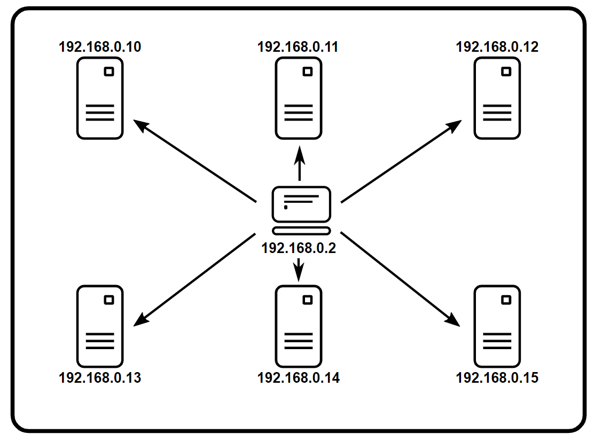
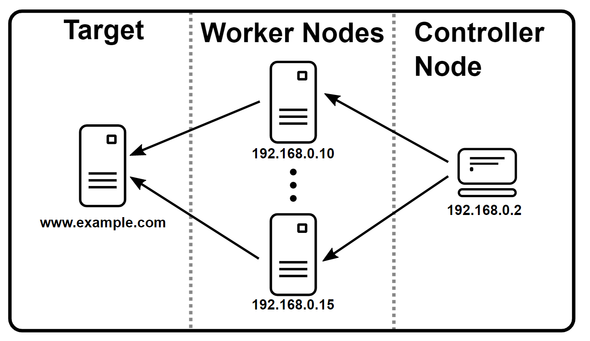
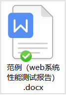

# 性能测试关键指标

- 响应时间
    - 快：响应时间有多快

- 并发量
    - 多：能够支持最大的用户访问量

- 吞吐量

- 系统性能计数器（资源使用率）
    - 省：资源使用率

    好：持久稳定运行，稳定性（长时间运行）

    **多快好省**

## 响应时间

1. **响应时间RT(Response-time)**

    对请求做出响应所需要的时间，是用户感知软件性能的主要指标。

2. **响应时间包括**（测试比较关注）

    - 用户客户端呈现时间
    - 请求/响应数据网络传输时间
    - 应用服务器处理时间
    - 数据库系统处理时间  


3. **1/3/5秒原则**（用户比较关注）

    在1s以内得到响应，用户会觉得系统响应很快，体验非常好；1-3秒得到响应，用户可以接收，体验还不错；3-5秒才响应，用户就感觉慢了，体验有点糟糕；一旦响应超过5秒，用户就会认为是个失败的体验，选择离开或重新发起请求。

## 并发量

1. **系统用户数**	

    - 软件系统注册用户总数

    - 对硬盘、内存、cpu资源上的使用有一定影响，因此性能测试时需构造这部分用户

2. **在线用户数**    

    - 某段视角内访问的用户数，这些用户只是在线，不一定同时做某一件事情
    - 与内存有关，如保持会话，数据处理（程序都是在内存中运行的）

3. **并发用户数**    

    - 某一个时间同时向软件系统提交请求的用户数，场景不一定是同一个
    - 分为严格并发和广义的并发

4. **并发用户数计算**

    - 经验公式

        **平均并发用户数的计算**

        $C=nL/T$
        C——是平均的并发用户数
        n——是平均每天访问用户数
        L——是一天内用户从登录到退出的平均时间（login session的平均值）
        T——是考察时间长度（一天内有多长时间有用户使用系统）

        **并发用户数峰值计算**

        $C' = C + 3 \sqrt C$

    - 举例

        >  假设系统A，该系统有3000个用户，平均每天大概有400个用户要访问该系统，对于一个典型用户来说，一天之内用户从登陆到退出的平均时间为4小时，而在一天之内，用户只有在8小时之内会使用该系统。

          那么，
          平均并发用户数为：

        $C= 400 \times 4 / 8 = 200$
          并发用户数峰值为：

        $C' = 200 + 3 \sqrt {200} = 243$

## 吞吐量

1. **吞吐量（Throughput）**

    - 单位时间内处理用户的请求数

    - 最常用有2个量化指标

        - **TPS（Transactions Per Second）**（每秒事务数）
        - **QPS（Queries-per-second）**（每秒查询率）

    - TPS和QPS

        - TPS是单位时间内处理事务的数量，QPS是单位时间内请求的数量。TPS代表一个事务的处理，可以包含了多次请求。TPS的一次事务代表一次用户操作到服务器返回结果，QPS的一次请求代表一个接口的一次请求到服务器返回结果。

        - Qps基本类似于Tps，但是不同的是，对于一个页面的一次访问，形成一个Tps；但一次页面请求，可能产生多次对服务器的请求，服务器对这些请求，就可计入“Qps”之中。

            例如：访问一个页面会请求服务器3次，一次访问，产生一个“T”，产生3个“Q”

    - QPS（TPS），并发数、响应时间它们三者之间的关系

        - QPS（TPS）= 并发数/平均响应时间

## 系统性能计数器

1. **性能计数器**
    - 描述服务器或操作系统性能的一些数据指标
        - 如：内存、cpu、磁盘、网络等资源使用率等
    - 服务器后台会有一套监控系统
        - 如：云服务器（华为云、阿里云、腾讯云、百度云等）
    - 通过Linux命令也可查看资源使用情况

## 性能测试

**初始化环境**模拟真实环境

1. 网络
2. 数据
3. 热机

# JMeter

## 快速入门

### 1. JMter性能测试工具简介

1. 多线程框架-支持多并发操作
2. 用于对服务器模拟负载
3. 支持web、数据库、ftp服务器系统的性能测试
4. 开源、纯java、可二次定制化开发

### 2. JMeter运行环境搭建

1. JDK安装

    https://www.oracle.com/java/technologies/javase-downloads.html

    

    ```bash
    # 验证机器是否安装好Java环境
    java -version
    ```


2. JMeter下载

    https://jmeter.apache.org/download_jmeter.cgi

    

    ```bash
    # 设置环境变量-目标：任意路径可以识别jmeter
    JMETER_HOME
    	eg:D:\BaiduNetdiskDownload\apache-jmeter-5.4.1
    PATH
    	eg:D:\BaiduNetdiskDownload\apache-jmeter-5.4.1\bin
    	   %JMETER_HOME%\bin-推荐使用这个
    应当避免路径中含有空格，否则需修改相应的批处理文件
    ```

    ​


### 3. 测试计划

https://jmeter.apache.org/usermanual/test_plan.html#test_plan

https://www.cnblogs.com/poloyy/p/12779353.html

A minimal test will consist of the Test Plan, a Thread Group and one or more Samplers.

一个最小的测试将由测试计划、一个线程组和一个或多个采样器组成。

### 4. jmeter脚本编写

- 可以通过以下4种方式编写

1. 接口文档
2. 浏览器开发者工具
3. fiddler抓包
4. 录制脚本


### 5. Jmeter 元件作用域和执行顺序

#### 元件作用域

https://jmeter.apache.org/usermanual/test_plan.html#scoping_rules

可被执行的元件（测试计划与线程组不属于可执行元件），这些元件中，取样器（sampler）是典型的不与其它元件发生交互作用的元件，逻辑控制器只对其子节点的取样器有效，而其它元件（配置元件 、定时器 、断言、监听器、）需要与取样器（sampler）等元件交互。在 jmeter 中，元件的作用域是靠测试计划的的树型结构中元件的父子关系来确定的，作用域的原则是：
• 取样器（sampler）元件不和其它元件相互作用，因此不存在作用域的问题。
• 逻辑控制器（Logic Controller）元件只对其子节点中的取样器和逻辑控制器作用。
• 除取样器和逻辑控制器元件外，其他类元件，如果是某个取样器的子节点，则该元件对其父子节点起作用。如果其父节点不是取样器 ，则其作用域是该元件父节点下的其他所有后代节点（包括子节点，子节点的子节点等）。

#### 元件执行顺序 Execution order

https://jmeter.apache.org/usermanual/test_plan.html#executionorder

1. Configuration elements
2. Pre-Processors
3. Timers
4. Sampler
5. Post-Processors (unless SampleResult is **null**)
6. Assertions (unless SampleResult is **null**)
7. Listeners (unless SampleResult is **null**)

请注意，定时器、断言、预处理器和后处理器只有在它们适用的采样器时才会被处理。逻辑控制器和采样器按照它们在树中出现的顺序进行处理。其他测试元素根据它们所在的范围和测试元素的类型进行处理。[在一个类型中，元素按照它们在树中出现的顺序进行处理]。

例如，在以下测试计划中：

- 控制器
  - 后处理器 1
    - 采样器 1
    - 采样器 2
    - 定时器 1
    - 断言 1
    - 预处理器 1
    - 定时器 2
    - 后处理器 2

执行顺序为：

```
预处理器 1
定时器 1
定时器 2
采样器 1
后处理器 1
后处理器 2
断言 1

预处理器 1
定时器 1
定时器 2
采样器 2
后处理器 1
后处理器 2
断言 1
```

### 6. 函数和变量

[Apache JMeter - User's Manual: Functions and Variables](https://jmeter.apache.org/usermanual/functions.html#functions)

```
JMeter 函数是可以填充任何 Sampler 或测试树中其他元素的字段的特殊值。函数调用如下所示：
${__functionName(var1,var2,var3)}
其中“__functionName”与函数名称匹配。
括号将发送给函数的参数括起来，例如${__time(YMD)} 实际参数因函数而异。不需要参数的函数可以省略括号，例如${__threadNum}。
如果函数参数包含逗号，请务必使用“ \ ”将其转义，否则 JMeter 会将其视为参数分隔符。例如：
${__time(EEE\, d MMM yyyy)}

${__counter(,)}+${__time(,)}
${__counter(,)}+${__UUID}
```

```
变量引用如下：
${变量}
如果引用了未定义的函数或变量，JMeter 不会报告/记录错误 - 引用返回不变。例如，如果UNDEF未定义为变量，则${UNDEF} 的值为${UNDEF}。 变量、函数（和属性）都区分大小写。
```


####  Jmeter 常用内置函数

##### 1. __time

https://jmeter.apache.org/usermanual/functions.html#__time


##### 2. __counter

https://jmeter.apache.org/usermanual/functions.html#__counter


##### 3. __Random

https://jmeter.apache.org/usermanual/functions.html#__Random


##### 4. __UUID

https://jmeter.apache.org/usermanual/functions.html#__UUID


##### 5. __setProperty

https://jmeter.apache.org/usermanual/functions.html#__setProperty


##### 6.__P

##### 7.__property

##### 8.__V


### 7. 属性和变量

https://jmeter.apache.org/usermanual/test_plan.html#properties


### 8. 在代理后面使用 JMeter

https://jmeter.apache.org/usermanual/get-started.html#proxy_server


## 分布式测试

[Apache JMeter - Apache JMeter Distributed Testing Step-by-step](https://jmeter.apache.org/usermanual/jmeter_distributed_testing_step_by_step.html)

### 0. jmeter最大线程数

- 进程能启动的线程取决于

    - 剩余内存空间

        - 可用内存

            

    - 堆空间

        - jmeter.bat文件中设置

            

    - 栈空间

        - [The java Command (oracle.com)](https://docs.oracle.com/en/java/javase/16/docs/specs/man/java.html)

            

        - http://hg.openjdk.java.net/hsx/hsx21/master/file/9b0ca45cd756/src/os_cpu/windows_x86/vm/globals_windows_x86.hpp

            

- 计算公式

    剩余内存 = 堆内存 + 栈内存 x 启动线程数

- 在jmeter.bat可修改值

    


### 1. **原理**



- Controller Node 控制器节点

    the system running JMeter GUI, which controls the test

    运行 JMeter GUI 的系统，它控制测试

- Worker Node 工作节点

    the system running **jmeter-server**, which takes commands from the GUI and send requests to the target system(s)

    运行**jmeter-server**的系统，它从 GUI 接收命令并将请求发送到目标系统

- Target 目标

    the webserver we plan to stress test

    我们计划进行压力测试的网络服务器

    

### 2. **准备**

- the firewalls on the systems are turned off or correct ports are opened.

    系统上的防火墙已关闭或打开了正确的端口。

- all the clients are on the same subnet.

    所有客户端都在同一个子网上。

- the server is in the same subnet, if **192.x.x.x** or **10.x.x.x** IP addresses are used. If the server doesn't use **192.xx** or **10.xx** IP address, there shouldn't be any problems.

    如果使用**192.xxx**或**10.xxx** IP 地址，则服务器位于同一子网中。如果服务器不使用**192.xx**或**10.xx** IP 地址，应该没有任何问题。

- Make sure JMeter can access the server.

    确保 JMeter 可以访问服务器。

- Make sure you use the same version of JMeter and Java on all the systems. Mixing versions will not work correctly.

    确保在所有系统上使用相同版本的 JMeter 和 Java。混合版本将无法正常工作。

    - You have [setup SSL for RMI](https://jmeter.apache.org/usermanual/remote-test.html#setup_ssl) or disabled it.

    您已经[为 RMI 设置了 SSL](https://jmeter.apache.org/usermanual/remote-test.html#setup_ssl)或禁用了它。（从 JMeter 4.0 开始，RMI 的默认传输机制将使用 SSL）

### 3. **配置**

**Controller Node**


**Worker Node**


​	

### 4. **运行**

**Worker Node**


**Controller Node**


1. **调试运行**

    

    

    

    

    

2. **正式运行**

    GUI mode should only be used for debugging, as a better alternative, you should start the test on remote server(s) from a CLI mode (command-line) client. The command to do this is:

    GUI 模式应该只用于调试，作为更好的选择，您应该从 CLI 模式（命令行）客户端在远程服务器上启动测试。执行此操作的命令是：

    ```bash
    jmeter -n -t script.jmx -r -l result.jtl -e -o D:\report
    or
    jmeter -n -t script.jmx -R server1,server2,…

    -n
    This specifies JMeter is to run in cli mode
    这指定 JMeter 以 cli 模式运行
    -t
    [name of JMX file that contains the Test Plan].
    包含测试计划的 JMX 文件的名称
    -l
    [name of JTL file to log sample results to].
    将样本结果记录到的 JTL 文件的名称
    -j
    [name of JMeter run log file].
    JMeter 运行日志文件的名称
    -r
    Run the test in the servers specified by the JMeter property "remote_hosts"
    在 JMeter 属性“ remote_hosts ”指定的服务器中运行测试
    -R
    [list of remote servers] Run the test in the specified remote servers
    [远程服务器列表] 在指定的远程服务器上运行测试
    -g
    [path to CSV file] generate report dashboard only
    [CSV 文件路径] 仅生成报告仪表板
    -e
    generate report dashboard after load test
    负载测试后生成报告仪表板
    -o
    output folder where to generate the report dashboard after load test. Folder must not exist or be empty
    负载测试后生成报告仪表板的输出文件夹。文件夹不得存在或为空

    ```

    ```
    jmeter -?
    打印命令行选项列表
    ```

    - **生成报告**

        - Generation 

        Use the following command:

        ```
        jmeter -g <log file> -o <Path to output folder>
        ```

        - Generation after load test

        Use the following command:

        ```
        jmeter -n -t <test JMX file> -l <test log file> -e -o <Path to output folder>
        ```

        - Generation using GUI Tools menu

            


## 组件 component reference

[Apache JMeter - Apache JMeter™](https://jmeter.apache.org/index.html)

### 线程Threads (Users)

https://jmeter.apache.org/usermanual/test_plan.html#thread_group

#### 1. setUp Thread Group

一种特殊类型的 ThreadGroup 的，可用于执行预测试操作。初始化环境，首先执行与位置无关。

#### 2. Thread Group

https://jmeter.apache.org/usermanual/component_reference.html#Thread_Group

https://www.cnblogs.com/poloyy/p/12782140.html

这个就是我们通常添加运行的线程。可以看做一个虚拟用户组，线程组中的每个线程都可以理解为一个虚拟用户。线程组中包含的线程数量在测试执行过程中是不会发生改变的。

**线程数**：虚拟用户数。一个虚拟用户占用一个进程或线程。设置多少虚拟用户数在这里也就是设置多少个线程数。

**准备时长（单位为 s）**：设置的虚拟用户数需要多长时间全部启动。如果线程数为 20 ，准备时长为 10 ，那么需要 10 秒钟启动 20 个线程。也就是每秒钟启动 2 个线程。

**循环次数**：每个线程发送请求的次数。如果线程数为 20 ，循环次数为 5，那么每个线程发送 5 次请求。总请求数为 20*5=100 。如果勾选了“永远”，那么所有线程会一直发送请求，一到选择停止运行脚本。

#### 3. tearDown Thread Group

一种特殊类型的 ThreadGroup 的，可用于执行测试后动作。环境清除，最后执行。


### 取样器（sampler）


#### 1. http请求

https://jmeter.apache.org/usermanual/component_reference.html#HTTP_Request


#### 2.Debug Sampler

查看jmeter变量信息


### 逻辑控制器（Logic Controller）


JMeter 中的 Logic Controller 用于为 Test Plan 中的节点添加逻辑控制器。
JMeter 中的 Logic Controller 分为两类：一类用来控制 Test Plan 执行过程中节点的逻辑执行顺序，如：Loop
Controller、If Controller 等；另一类则与节点逻辑执行顺序无关，用于对 Test Plan 中的脚本进行分组、方便 JMeter
统计执行结果以及进行脚本的运行时控制等，如 ：Throughput Controller、Transaction Controller。

#### 1. Simple Controller

https://jmeter.apache.org/usermanual/component_reference.html#Simple_Controller

The Simple Logic Controller lets you organize your Samplers and other Logic Controllers. Unlike other Logic Controllers, this controller provides no functionality beyond that of a storage device.

简单逻辑控制器可让您组织采样器和其他逻辑控制器（分组功能，提供一个块的结构和控制）。与其他逻辑控制器不同，并不具有任何的逻辑控制或运行时的功能。


#### 2. Loop Controller

https://jmeter.apache.org/usermanual/component_reference.html#Loop_Controller


#### 3. Once Only Controller

https://jmeter.apache.org/usermanual/component_reference.html#Once_Only_Controller


#### 4. Runtime Controller

https://jmeter.apache.org/usermanual/component_reference.html#Runtime_Controller


#### 5. ForEach Controller

https://jmeter.apache.org/usermanual/component_reference.html#ForEach_Controller


### 配置元件（Config Element）


#### 1. CSV Data Set Config

https://jmeter.apache.org/usermanual/component_reference.html#CSV_Data_Set_Config

Filename --- 参数项文件
File Encoding --- 文件的编译方法，一般为空
Vaiable Names --- 文件中各列所表示的参数项；各参数项之间利用逗号分隔；参数项的名称应该与HTTP Request 中的参数项一致。
Delimiter --- 如文件中使用的是逗号分隔，则填写逗号；如使用的是 TAB，则填写\t；
Recycle on EOF? --- True=当读取文件到结尾时，再重头读取文件,False=当读取文件到结尾时，停止读取文件
Stop thread on EOF? --- 当 Recycle on EOF?一项为 False 时起效；True=当读取文件到结尾时，停止进程。

#### 2. HTTP Cookie Manager

https://jmeter.apache.org/usermanual/component_reference.html#HTTP_Cookie_Manager

#### 3. HTTP Request Defaults

https://jmeter.apache.org/usermanual/component_reference.html#HTTP_Request_Defaults

#### 4. HTTP Header Manager

https://jmeter.apache.org/usermanual/component_reference.html#HTTP_Header_Manager

#### 5. User Defined Variables

https://jmeter.apache.org/usermanual/component_reference.html#User_Defined_Variables

#### 6. Counter

https://jmeter.apache.org/usermanual/component_reference.html#Counter


### 监听器（Listener）


#### 1. View Results Tree

https://jmeter.apache.org/usermanual/component_reference.html#View_Results_Tree

- JSON Path Tester

https://github.com/json-path/JsonPath

- Regular Expressions

https://www.runoob.com/regexp/regexp-tutorial.html

- Xpath Tester

https://www.runoob.com/xpath/xpath-syntax.html


#### 2. Aggregate Report

https://jmeter.apache.org/usermanual/component_reference.html#Aggregate_Report


#### 3. View Results in Table

https://jmeter.apache.org/usermanual/component_reference.html#View_Results_in_Table


#### 4. Simple Data Writer

https://jmeter.apache.org/usermanual/component_reference.html#Simple_Data_Writer


### 定时器（Timer）


#### 1. Synchronizing Timer

https://jmeter.apache.org/usermanual/component_reference.html#Synchronizing_Timer

The purpose of the SyncTimer is to block threads until X number of threads have been blocked, and then they are all released at once. A SyncTimer can thus create large instant loads at various points of the test plan.

SyncTimer 的目的是阻塞线程，直到 X 个线程被阻塞，然后立即释放它们。因此，SyncTimer 可以在测试计划的各个点创建大的即时负载。


### 前置处理器（Per Processors）


#### 1. User Parameters

https://jmeter.apache.org/usermanual/component_reference.html#User_Parameters

#### 2. BeanShell PreProcessor

https://jmeter.apache.org/usermanual/component_reference.html#BeanShell_PreProcessor

```
log.info(String msg)
vars.get(String key)
vars.put(String key, String value)
```


### 后置处理器（Post Processors）


#### 1. 正则表达式提取器

https://jmeter.apache.org/usermanual/component_reference.html#Regular_Expression_Extractor

```
正则表达式部分配置说明
（1）引用名称：下一个请求要引用的参数名称，如填写 activityID，则可用${activityID}引用它。
（2）正则表达式：
()括起来的部分就是要提取的。
.匹配任何字符串。
*:0次或多次。
+：一次或多次。
?：在找到第一个匹配项后停止。
（3）模板：用$$引用起来，如果在正则表达式中有多个正则表达式（多个括号括起来的东东），则可以是$2$$3$等等，表示解析到的第几个值给 title。如：$1$表示解析到的第 1 个值
（4）匹配数字：0 代表随机取值，1 代表全部取值，
（5）缺省值：如果参数没有取得到值，那默认给一个值让它取。
```

#### 2. BeanShell PostProcessor

https://jmeter.apache.org/usermanual/component_reference.html#BeanShell_PostProcessor

#### 3. JSON Extractor

https://jmeter.apache.org/usermanual/component_reference.html#JSON_Extractor

[json-path/JsonPath: Java JsonPath implementation (github.com)](https://github.com/json-path/JsonPath)


### 断言（Assertions）


#### 1. 响应断言

https://jmeter.apache.org/usermanual/component_reference.html#Response_Assertion

https://jmeter.apache.org/usermanual/regular_expressions.html#regex

[Perl 正则表达式 | 菜鸟教程 (runoob.com)](https://www.runoob.com/perl/perl-regular-expressions.html)

模式匹配规则
◆ 包括：返回结果包括你指定的内容
◆ 匹配：根据指定内容进行匹配
◆ Equals：返回结果与你指定结果一致
◆ Substring：返回结果是指定结果的字串
◆ 否：不进行匹配

#### 2.JSON断言

https://jmeter.apache.org/usermanual/component_reference.html#JSON_Assertion


### 测试片段（Test Fragment）

https://jmeter.apache.org/usermanual/test_plan.html#test_fragments

测试片段元素是一种特殊类型的控制器，它存在于测试计划树中，与线程组元素处于同一级别。它与线程组的区别在于它不会被执行，此元素纯粹用于测试计划中的代码重用。它的主要作用是模块化测试过程，类似于编程语言中的函数。即，将测试过程封装成测试片段，就可以在其他地方直接引用了。


### 非测试元件（Non-Test Elements）


#### 1. HTTP Mirror Server

https://jmeter.apache.org/usermanual/component_reference.html#HTTP_Mirror_Server

- HTTP 镜像服务器是一个非常简单的 HTTP 服务器 - 它只是镜像发送给它的数据。这对于检查 HTTP 请求的内容很有用。


#### 2. HTTP Proxy Server

- 抓取https

    **Chrome --ignore-certificate-errors --ignore-urlfetcher-cert-requests**

- 过滤排除模式

```
.*\.js.*|.*\.css.*
```


#### 3. Property Display

- 属性显示显示系统或 JMeter 属性的值。可以通过在值列中输入新文本来更改值。


## 报告 Generating Report Dashboard

https://jmeter.apache.org/usermanual/generating-dashboard.html

### Dashboard

#### 1. APDEX (Application Performance Index)

https://support.huaweicloud.com/intl/zh-cn/apm_faq/apm_03_0010.html

https://www.cnblogs.com/poloyy/p/13278920.html

- T (Toleration threshold)
- F (Frustration threshold)

https://jmeter.apache.org/usermanual/properties_reference.html#reporting


### Charts

https://www.cnblogs.com/poloyy/p/13280899.html


### Customs Graphs


## 性能测试报告

### 性能测试报告组成

#### 1. 测试基本信息

测试目的、报告目标读者、术语定义、参考资料

#### 2. 测试环境描述

服务器软硬件环境、网络环境、测试工具、测试人员

#### 3. 测试用例执行分析

详细描述每个测试用例的执行情况，以及对应的结果分析

#### 4. 测试结果综合分析及建议

对本次性能测试做综合分析，并给出测试结论和改进建议

[范例（web系统性能测试报告）](范例（web系统性能测试报告）.docx)




