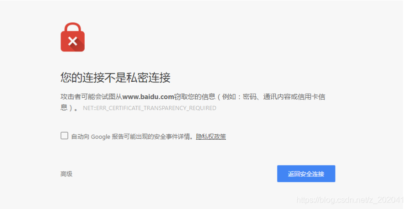
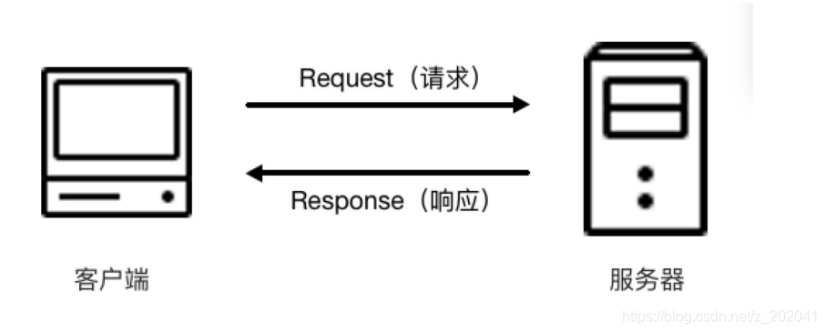
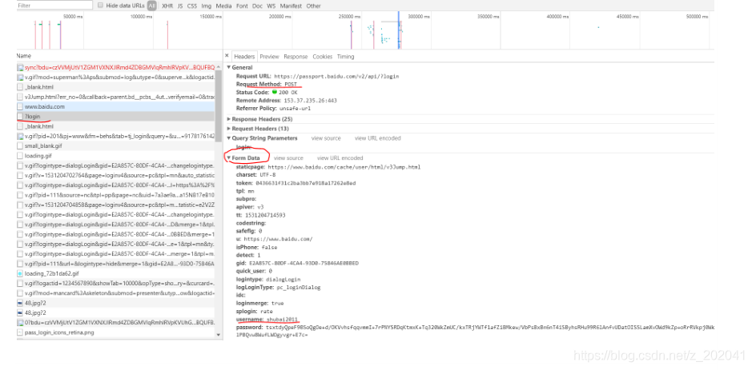

# HTTP 简介
超文本传输协议（HTTP，HyperText Transfer Protocol)是互联网上应用最为广泛的一种网络协议。所有的 WWW文件都必须遵守这个标准。设计 HTTP 最初的目的是为了提供一种发布和接收 HTML 页面的方法。HTTP 协议在网
络 OSI 模型中属于应用层协议，应用层协议除了 HTTP 还有：FTP，SMTP，DNS，RIP，Telnet 等。
HTTP 协议工作于客户端—服务端架构上。浏览器作为 HTTP 客户端通过 URL 向 HTTP 服务端（即 Web 服务器）
发送请求。
扩展资料：[计算机网络教程](https://www.51zxw.net/list.aspx?cid=417#!fenye=1)
# 超文本
超文本英文名称叫做  Hypertext ，我们在浏览器里面看到的网页就是超文本解析而成的，其网页源代码是一系列  HTML 代码，里面包含了一系列标签，如  img 显示图片， p 指定显示段落等，浏览器解析这些标签后便形成了我们平常看到的网页，而这网页的源代码  HTML 就可以称作超文本。
例如我们在 Chrome 浏览器里面打开如百度页面，右键点击"查看源代码"，这些源代码都是超文本。
# URL
我们在浏览器的地址栏里输入的网站地址叫做 URL (Uniform Resource Locator，统一资源定位符)。就像每家每户都有一个门牌地址一样，每个网页也都有一个 Internet 地址（如：http://www.51zxw.net）。当你在浏览器的
地址框中输入一个 URL 或是单击一个超级链接时， URL 就确定了要浏览的地址。浏览器通过超文本传输协议(HTTP)，将 Web 服务器上站点的网页代码提取出来，并翻译成漂亮的网页。
# HTTP 功能
HTTP 协议（HyperText Transfer Protocol，超文本传输协议）是用于从服务器传输超文本到本地浏览器的传输协议。它可以使浏览器更加高效，使网络传输减少。它不仅保证计算机正确快速地传输超文本文档，还确定传输文档中的哪一部分，以及哪部分内容首先显示(如文本先于图形)等。
# HTTP 特点
•  无连接：无连接的含义是限制每次连接只处理一个请求。服务器处理完客户的请求，并收到客户的应答后，即断开连接。采用这种方式可以节省传输时间。
•  媒体独立：这意味着，只要客户端和服务器知道如何处理的数据内容，任何类型的数据都可以通过 HTTP发送。客户端以及服务器指定使用适合的 MIME-type 来传输。 详见：MIME 参考手册
•  无状态：HTTP 协议是无状态协议。无状态是指协议对于事务处理没有记忆能力。如果服务器不需要先前信息，那么它的应答就比较快。但是缺少状态意味着如果后续处理需要前面的信息，则它必须重传，这样可能导致每次连接传送的数据量增大，此时可以设置缓存。
# HTTP 与 HTTPS
现在在浏览很多网站时，通过浏览器地址栏可以看到有的网站是 https 开头（https://www.baidu.com/ ）, 但是有的是 http 开头（如：http://www.weather.com.cn ）这两种有什么区别呢？难道加了 s 就是复数吗？
HTTPS 的全称是 Hyper Text Transfer Protocol over Secure Socket Layer，是以安全为目标的 HTTP 通道，简单讲是 HTTP 的安全版，即 HTTP 下加入 SSL 层（Secure Sockets Layer 安全套接层），简称为 HTTPS。S 其实是 Security 单词的首字母。HTTPS 的安全基础是 SSL，因此通过它传输的内容都是经过 SSL 加密的，它的主要作用可以分为两种：
1. 是建立一个信息安全通道，来保证数据传输的安全。
2. 确认网站的真实性，凡是使用了 https 的网站，都可以通过点击浏览器地址栏的锁头标志来查看网站认证之后的真实信息，也可以通过 CA 机构颁发的安全签章来查询。
现在越来越多的网站和 APP 都已经向 HTTPS 方向发展。例如：谷歌从 2017 年 1 月推出的 Chrome 56 开始，
对未进行 HTTPS 加密的网址链接亮出风险提示，即在地址栏的显著位置提醒用户“此网页不安全”。

# HTTP 与 TCP/IP 的区别
TCP/IP 协议是传输层协议，主要解决数据如何在网络中传输，而 HTTP 是应用层协议，主要解决如何包装数据。关于 TCP/IP 和 HTTP 协议的关系，网络有一段比较容易理解的介绍：“我们在传输数据时，可以只使用（传输层）
TCP/IP 协议，但是那样的话，如果没有应用层，便无法识别数据内容，如果想要使传输的数据有意义，则必须使用到应用层协议，应用层协议有很多，比如 HTTP、FTP、TELNET 等，也可以自己定义应用层协议。WEB 使用 HTTP
协议作应用层协议，以封装 HTTP 文本信息，然后使用 TCP/IP 做传输层协议将它发到网络上。”
# HTTP 请求过程
我们在浏览器输入百度首页的地址：https://www.baidu.com/ 输入之后浏览器会给我们打开百度首页。实际上这个过程是浏览器向网站所在的服务器发送了一个 Request，即请求，网站服务器接收到这个 Request 之后进行处理和解析，然后返回对应的一个 Response，即响应，然后传回给浏览器，Response 里面就包含了页面的源代码等内容，浏览器再对其进行解析便将网页呈现了出来。

# Request
Request，即请求，由客户端向服务端发出。可以将 Request 划分为四部分内容：
•  Request Method: 请求方式
•  Request URL: 请求链接
•  Request Headers: 请求头
•  Request Body: 请求体
Request Method
请求方式，请求方式常见的有两种类型，GET 和 POST。
•  GET 用于信息获取，而且应该是安全的和 幂等 的(幂等的的意思就是一个操作不会修改状态信息，并且每次操作的时候都返回同样的结果。) 从发送请求的角度，GET 请求相当于我们在数据库中做了查询的操作，这样的操作不影响数据库本身的数据。
•  POST 表示可能会修改服务器上资源的请求，也相当于在数据库中做了修改的操作，会影响数据库本身的数据（比如：注册了账户，发了帖子，做了评论，得到了积分等。这种情况下，资源状态被改变了）。
案例 1——GET 请求
在浏览器输入： https://www.baidu.com/s?wd=appium 并回车，这个其实就是在百度搜索 appium 这个关键词。 URL 中包含了请求的参数信息，这里参数 wd 就是要搜寻的关键字。在浏览器可以看到 Query String Parameters 选项就是请求的参数。发起一次 GET 请求时，参数会以 url string 的形式进行传递。即 ? 后的字符串则为其请求参数，并以 &作为分隔符。
案例 2——POST 请求
一般来说，网站登录验证的时候，需要提交用户名密码，这里包含了敏感信息，使用 GET 方式请求的话密码就会暴露在 URL 里面，造成密码泄露，所以这里最好以 POST 方式发送。文件的上传时，由于文件内容比较大，也会选用 POST 方式。比如百度账户登录，如下图所示：

除了常规的 GET，POST 请求，另外还有一些请求方式，如 HEAD、PUT、DELETE 等，简单将其总结如下：
|方法  |描述|
|--|--|
|GET|请求指定的页面信息，并返回实体主体。|
|POST|向指定资源提交数据进行处理请求，数据被包含在请求体中。|
|PUT|从客户端向服务器传送的数据取代指定的文档的内容。|
|PUT|对 PUT 方法的补充，用来对已知资源进行局部更新|
|DELETE|请求服务器删除指定的页面。|
|HEAD|类似于 GET 请求，只不过返回的响应中没有具体的内容，用于获取报头。|
|CONNECT|HTTP/1.1 协议中预留给能够将连接改为管道方式的代理服务器。|
|OPTIONS|允许客户端查看服务器的性能。|
|TRACE|回显服务器收到的请求，主要用于测试或诊断。|
# Request URL
Request URL 就是请求的网址，即统一资源定位符，用 URL 可以唯一确定我们想请求的资源。比如：https://www.baidu.com/
# Request Headers
请求头，用来说明服务器要使用的附加信息，比较重要的信息有 Cookie、Referer、User-Agent 等，下面将一些常用的头信息说明如下：
•  Accept ，请求报头域，用于指定客户端可接受哪些类型的信息。
•  Accept-Language ，指定客户端可接受的语言类型。
•  Accept-Encoding ，指定客户端可接受的内容编码。
•  Host ，用于指定请求资源的主机 IP 和端口号，其内容为请求 URL 的原始服务器或网关的位置。从 HTTP1.1 版本开始，Request 必须包含此内容。
•  Cookie ，也常用复数形式 Cookies，是网站为了辨别用户进行 Session 跟踪而储存在用户本地的数据。Cookies 的主要功能就是维持当前访问会话。
•  Referer ，此内容用来标识这个请求是从哪个页面发过来的，服务器可以拿到这一信息并做相应的处理，如做来源统计、做防盗链处理等。
•  User-Agent ，简称 UA，它是一个特殊字符串头，使得服务器能够识别客户使用的操作系统及版本、浏览器及版本等信息。在做爬虫时加上此信息可以伪装为浏览器，如果不加很可能会被识别出为爬虫。
•  Content-Type ，即 Internet Media Type，互联网媒体类型，也叫做 MIME 类型，在 HTTP 协议消息头中，使用它来表示具体请求中的媒体类型信息。例如  application/x-www-form-urlencoded 表示表单数据，  text/html 代表 HTML 格式， image/gif 代表 GIF 图片， application/json 代表 Json 类型，
# Request Body
即请求体，一般用于 POST 请求中，主要定义向服务器提交的数据类型，而对于 GET 请求 Request Body 则为空。比如在登录之前我们填写了用户名和密码信息，提交时就这些内容就会以  Form Data 的形式提交给服务器，此时注
意  Request Headers 中指定了 Content-Type 为  application/x-www-form-urlencoded ，只有设置  Content-Type 为  application/x-www-form-urlencoded 才会以  Form Data 形式提交，另外我们也可以将  Content-Type 设置为  application/json 来提交  Json 数据，或者设置为  multipart/form-data 来上传文件。常用 Content-Type 和 POST 提交数据方式的关系：
|Content-Type|提交数据方式|
|--|--|
|application/x-www-form-urlencoded|Form 表单提交|
|multipart/form-data|表单文件上传提交|
|application/json|序列化 Json 数据提交|
|text/xml|XML 数据提交|
- application/x-www-form-urlencoded 与 multipart/form-data 区别
•  在没有 type=file 时候，用默认的  application/x-www-form-urlencoded 就行。
•  在有  type=file 时候，要用 multipart/form-data 编码方式。浏览器会把表单以控件为单位分割，并且为每个部分加上 Content-Dispositon(form-data 或 file) 、 Content-Type (默认 text/plain)、 name (控件 name)等信
息，并加上分割符(boundary)。
# Response
Response，即响应，由服务端返回给客户端。Response 可以划分为三部分:
•  Response Status Code
•  Response Headers
•  Response Body
# Response Status Code
响应状态码，此状态码表示了服务器的响应状态，如 200 则代表服务器正常响应， 404 则代表页面未找到， 500 则代表服务器内部发生错误。常用响应状态码如下：
|状态码|说明|详情|
|--|--|--|
|200|成功|服务器已成功处理了请求。|
|201|已创建|请求成功并且服务器创建了新的资源。|
|301|永久移动|请求的网页已永久移动到新位置，即永久重定向。|
|302|临时移动|请求的网页暂时跳转到其他页面，即暂时重定向。|
|400|错误请求|服务器无法解析该请求。|
|401|未授权|请求没有进行身份验证或验证未通过。|
|403|禁止访问|服务器拒绝此请求。|
|404|未找到|服务器找不到请求的网页。|
|500|服务器内部错误|服务器遇到错误，无法完成请求。|
|501|未实现|服务器不具备完成请求的功能。|
|502|错误网关|服务器作为网关或代理，从上游服务器收到无效响应。|
扩展资料：[HTTP 响应码](https://tool.oschina.net/commons?type=5)
# Response Headers
响应头，其中包含了服务器对请求的应答信息，如 Content-Type、Server、Set-Cookie 等，下面将一些常用的头信息说明如下：
•  Date ，标识 Response 产生的时间。
•  Last-Modified ，指定资源的最后修改时间。
•  Content-Encoding ，指定 Response 内容的编码。
•  Server ，包含了服务器的信息，名称，版本号等。
•  Content-Type ，文档类型，指定了返回的数据类型是什么，如 text/html 则代表返回 HTML 文档，application/x-javascript 则代表返回 JavaScript 文件，image/jpeg 则代表返回了图片。
•  Set-Cookie ，设置 Cookie，Response Headers 中的 Set-Cookie 即告诉浏览器需要将此内容放在Cookies 中，下次请求携带 Cookies 内容。
•  Expires ，指定 Response 的过期时间，使用它可以控制代理服务器或浏览器将内容更新到缓存中，如果再次访问时，直接从缓存中加载，降低服务器负载，缩短加载时间。
# Response Body
即响应体，响应的正文数据都是在响应体中，如请求一个网页，它的响应体就是网页的 HTML 代码，请求一张图片，它的响应体就是图片的二进制数据。一般在接口的响应内容大多都是 Json 数据内容.

