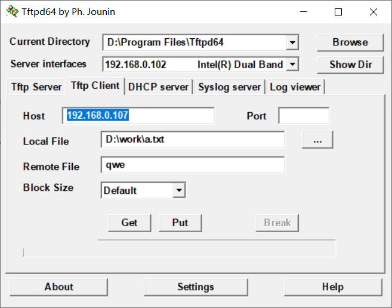
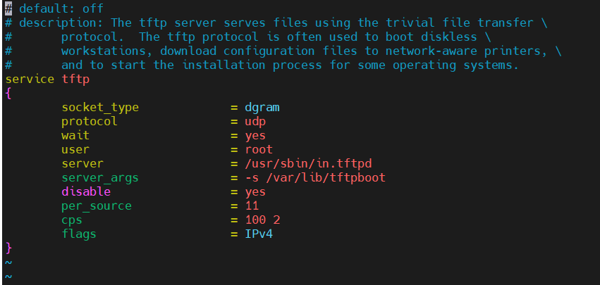

# 客户端

## windows10

https://blog.csdn.net/wkd_007/article/details/129018831




## openeuler 20.03

```bash
yum -y install xinetd tftp tftp-server
```


# 服务器

## Windows10

https://blog.csdn.net/m0_46141595/article/details/137144085


## openeuler 20.03

https://support.huawei.com/enterprise/zh/doc/EDOC1100273850/37b30a76#ZH-CN_TOPIC_0000001288527074



```bash
/etc/xinetd.d/tftp配置文件详解

/etc/xinetd.d/tftp 是 TFTP（Trivial File Transfer Protocol，简单文件传输协议）服务在 Linux 系统中的一个配置文件。以下是对该配置文件的详细解析：

‌服务启用‌：

disable = no：表示启用 TFTP 服务。如果设置为 yes，则表示服务被禁用。
‌Socket 类型‌：

socket_type = dgram：表示使用数据报套接字（UDP 协议）。
‌协议类型‌：

protocol = udp：明确指定使用 UDP 协议。
‌服务进程‌：

server = /usr/sbin/in.tftpd：指定 TFTP 服务进程的位置。
‌服务参数‌：

server_args = -s /home/me/work/tftpboot：指定 TFTP 服务器的根目录为 /home/me/work/tftpboot。-s 参数后面跟的是服务目录的路径。
‌用户权限‌：

user = root：表示以 root 用户权限启动服务进程。
‌连接限制‌：

per_source = 11：表示每个 IP 地址上最多可以建立的实例数目。
cps = 100 2：表示每秒最多允许 100 个入站链接，如果超过限制，则等待 2 秒。
‌等待模式‌：

wait = yes：表示服务进程会等待到启动完成。
TFTP 是一种简单的文件传输协议，基于 UDP 协议实现，默认端口号为 69。与基于 TCP 的 FTP 协议相比，TFTP 不需要认证，没有复杂的报文，适用于稳定的网络环境和小文件传输场景。

配置 TFTP 服务时，除了编辑 /etc/xinetd.d/tftp 文件，还需要确保 TFTP 服务器的根目录存在并且权限设置正确。此外，启动 TFTP 服务通常还需要重启 xinetd 服务，因为 TFTP 服务受控于 xinetd。

请注意，配置网络服务时，特别是涉及文件传输和权限设置时，应谨慎操作，确保系统的安全性。如果不熟悉相关操作，建议咨询网络管理员或专业人士。
```


