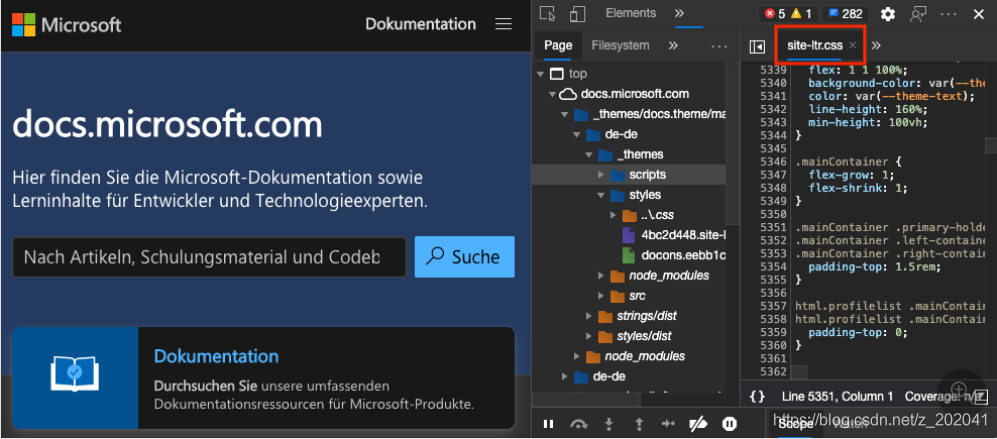
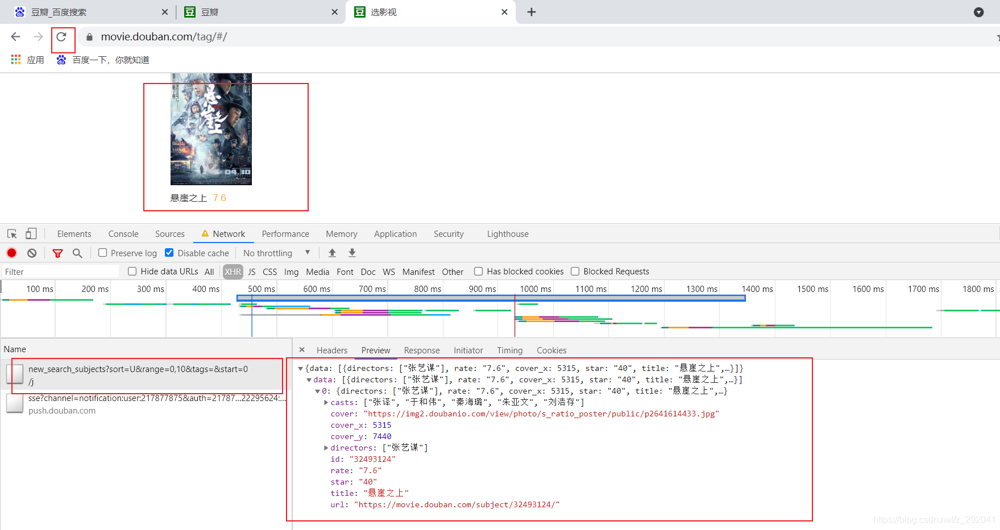

@[TOC](开发者工具)
# Sources
## msedge
- [详细内容见官方文档](https://docs.microsoft.com/en-us/microsoft-edge/devtools-guide-chromium/javascript/overrides)
### 使用 DevTools 使用本地副本替代Microsoft Edge资源
有时你需要尝试一些可能的网页修补程序，但你无法访问源文件，或者更改页面需要一个缓慢而复杂的生成过程。 你可以调试和修复 DevTools 中的所有类型问题。 但更改不会保留;刷新本地文件后，所有工作都消失。 源 工具中的替代 功能可帮助你解决此问题。
现在，您可以利用当前网页的资源，并在本地存储该资源。 刷新网页时，浏览器不会从服务器加载资源。 相反，浏览器会将其替换为你的本地资源副本。
#### 将本地文件夹设置为存储替代
1. 导航到 "源" 工具。
2. 在左侧 导航器 (窗格中，) " 替代" 选项卡。 如果未 显示"覆盖 "选项卡，请选择 ≫ 图标。

3. 在本地计算机上选择一个文件夹，以存储要替换的资源文件。
- 若要搜索文件夹，请选择" + 选择文件夹"进行替代。

4. DevTools 警告你必须具有对文件夹的完全访问权限，并且不应显示任何敏感信息。 在警告栏上，选择 "允许 "以授予访问权限。

5. 在 "覆盖" 选项卡中，"启用本地覆盖"旁边 会显示一个复选框。 "启用本地覆盖 "右侧****是"清除配置"图标，可用于删除本地覆盖设置。 现在，你已完成文件夹设置，并已准备好将实时资源替换为本地资源。

### 将文件添加到 Overrides 文件夹
若要将文件添加到替代文件夹，请打开 "元素 "工具并检查网页。 若要编辑，请选择样式检查器中的 CSS 文件 的名称。

在"源"编辑器上，将鼠标悬停在所选文件的文件名上，打开上下文菜单 (右键单击) ，然后选择"保存以替代"。

该文件存储在替代文件夹中。 验证 DevTools 是否使用具有正确目录结构的文件的 URL 创建名为 的文件夹。 文件存储在内部。 编辑器中的文件名现在还显示一个紫色点，指示文件是本地文件，而不是实时文件。

在下面的示例中，现在可以更改网页的样式。 若要在文件周围添加红色边框，在 " 样式"编辑器上复制以下样式，并将其添加到 body 元素中。
border: 10px solid firebrick
该文件将自动保存在您的计算机上。 如果刷新文件，将显示边框，并且不会丢失任何工作。

在" 源 "工具的" 页面 "部分，将鼠标悬停在任何文件上，打开上下文菜单 (右键单击) ，并将其添加到覆盖。 同样，已位于替代文件夹中的文件在图标上还有一个紫色点。

或者，在 " 网络"工具上，将鼠标悬停在任何文件上，打开上下文菜单 (右键单击) ，并将其添加到覆盖。 当替代生效时，位于您的计算机而不是实时网页中的文件。 当替代生效时，在 " 网络"工具上，找到文件名旁边的警告图标。

### 覆盖的双向交互
使用 DevTools 的 " 源"工具提供的编辑器或要更改文件的任何编辑器。 更改将跨访问覆盖文件夹中文件的所有产品进行同步。
## chrome
### Overrides
#### 资源本地化使用
1. 选择一个文件夹作为工作空间

用法同msedge
#### mock数据
eg：
- mock接口：https://movie.douban.com/j/new_search_subjects?sort=U&range=0,10&tags=&start=0
效果如下图：

- 原始接口的响应值。效果如下图：

- 创建文件夹（以“/”为分隔符），最后创建一个无后缀名的文件（“？”以“%3f”代替）。效果如下图：

- 使用编辑器编辑内容。效果如下图：
- 重新刷新页面后，效果图如下：
- 
以后浏览器只要发送这个请求，结果就是你mock的数据（除非不使用Local Overrides)

