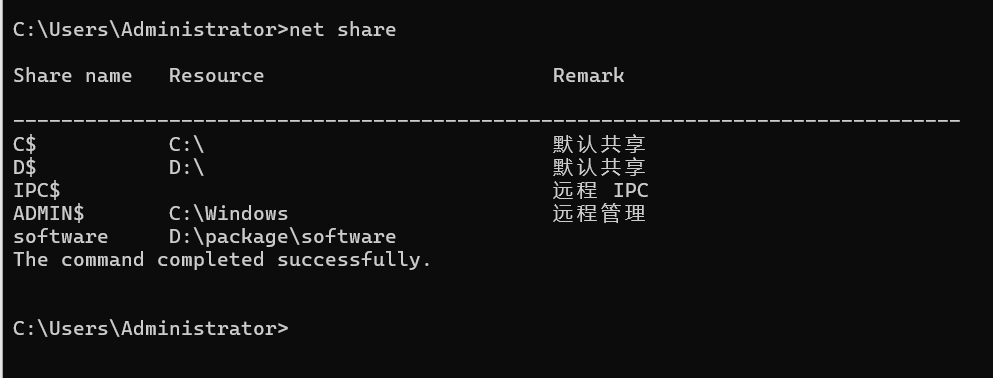
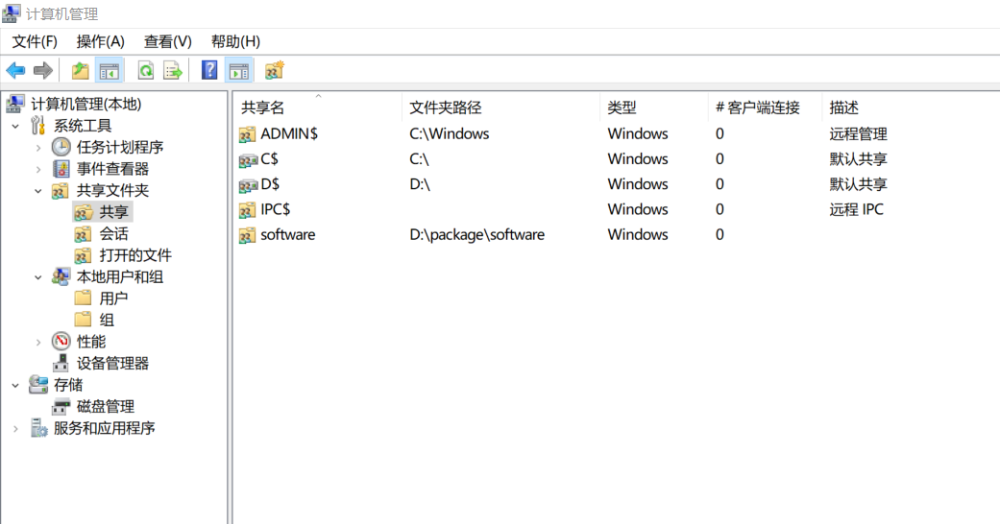
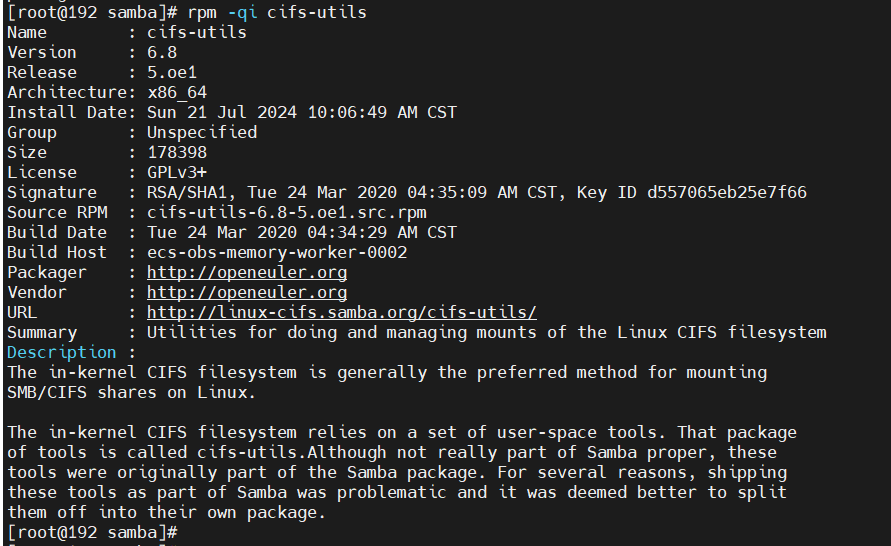
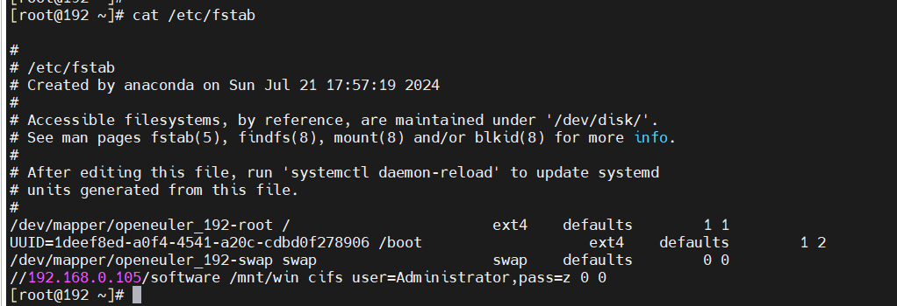
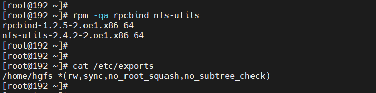
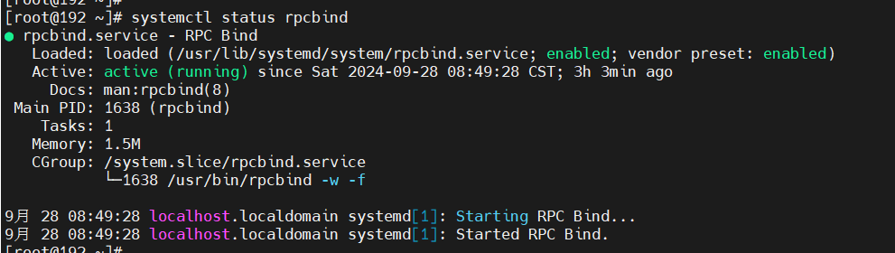
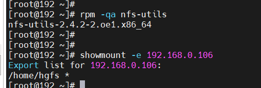
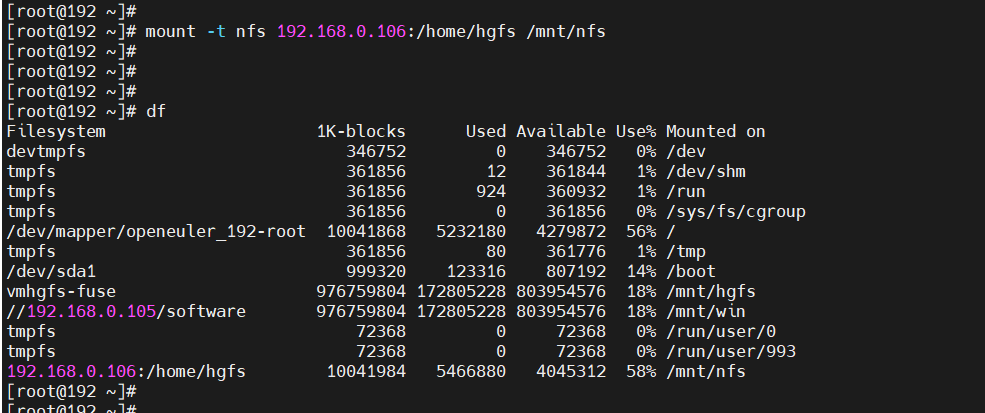
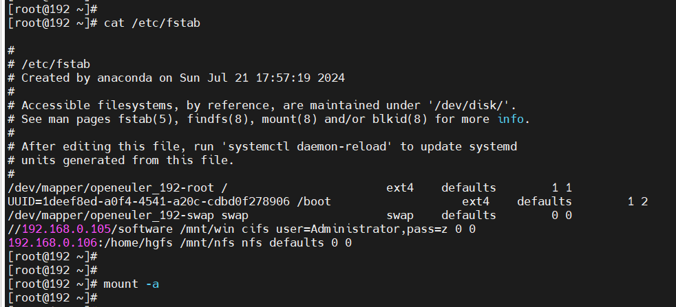
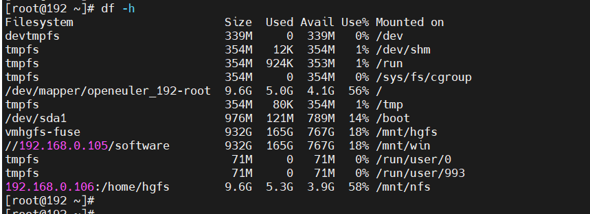

# windows共享

## 前提条件

- 查看windows共享文件

方法一 net share



方法二 



- linux扫描共享目录

```bash
smbclient -L //192.168.0.104 -N
```


- 查看是否安装cifs-utils




## linux挂载共享目录

- 手动挂载

```bash
mount -t cifs -o user=Administrator,pass=z //192.168.0.105/software /mnt/win
```

- 自动挂载




# linux共享


## 前提条件

- 服务端






- 客户端




## linux挂载共享目录

- 手动挂载




- 自动挂载






