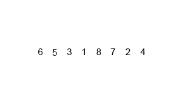

# **Day03笔记**

## **递归**

- **递归定义及特点**

  ```python
  【1】定义
      递归用一种通俗的话来说就是自己调用自己，但是需要分解它的参数，让它解决一个更小一点的问题，当问题小到一定规模的时候，需要一个递归出口返回
      
  【2】特点
      2.1) 递归必须包含一个基本的出口，否则就会无限递归，最终导致栈溢出
      2.2) 递归必须包含一个可以分解的问题
      2.3) 递归必须必须要向着递归出口靠近
  ```

- **递归示例1**

  ```python
  def f(n):
      if n == 0:
          return 
      print(n)
      f(n-1)
  
  f(3)
  # 结果: 3 2 1
  ```

- 


- **递归示例2**

  ```python
  def f(n):
    if n == 0:
      return 
    f(n-1)
    print(n)
    
  f(3)
  # 结果: 1 2 3
  ```

  

- **递归示例3**

  ```python
  # 打印 1+2+3+...+n 的和
  def sumn(n):
    if n == 1:
      return 1
    return n + sumn(n-1)
  
  print(sumn(3))
  ```

  

- **递归练习**

  ```python
  # 使用递归求出 n 的阶乘
  def fac(n):
    if n == 1:
      return 1
    return n * fac(n-1)
  
  print(fac(5))
  ```

- **递归总结**

  ```python
  # 前三条必须记住
  【1】递归一定要有出口,一定是先递推,再回归
  【2】调用递归之前的语句，从外到内执行，最终回归
  【3】调用递归或之后的语句，从内到外执行，最终回归
  
  【4】Python默认递归深度有限制，当递归深度超过默认值时，就会引发RuntimeError，默认值998
  【5】手动设置递归调用深度
      import sys
      sys.setrecursionlimit(1000000) #表示递归深度为100w
  ```

- **递归动态图解一**

  

- **递归动态图解二**

  

- **递归动态图解三**

  


- **递归练习**

  ```
  【1】一个青蛙一次可以跳1级台阶或2级台阶,一共有n级台阶,青蛙跳到顶部有几种跳法
  	思路一: 举例大法(能否找到一定的规律???)
  		1级台阶: 1
  		2级台阶: 2
  		3级台阶: 3
  		4级台阶: 5
  		5级台阶: 8
  		思考: 如何用python实现斐波那契数列即可！！！
  	思路二: 递归思想
  		青蛙最后一跳,只有2种跳法,(要么最后一条是1级,要么是2级)
  		最后一跳1级: f(n-1)
  		最后一跳2级: f(n-2)
  		总跳法: f(n-1) + f(n-2)
  		
  【2】一个青蛙一次可以跳1级、2级...n级台阶,一共有n级台阶,青蛙跳到顶部有几种跳法
  	递归思想:
  		考虑最后一跳,最后一跳可能是1级、2级、... n级
  		f(n) = f(n-1) + f(n-2) + f(n-3) + ... + f(0)
  		f(n-1) = f(n-2) + f(n-3) + ... + f(0)
  		最终发现总结: f(n) = 2 * f(n-1)
  		
  1级台阶: 1
  2级台阶: 2
  3级台阶: 4
  4级台阶: 8
  ```

## **二叉树**

- **定义**

  ```python
  二叉树（Binary Tree）是n（n≥0）个节点的有限集合，它或者是空集（n＝0），或者是由一个根节点以及两棵互不相交的、分别称为左子树和右子树的二叉树组成。二叉树与普通有序树不同，二叉树严格区分左孩子和右孩子，即使只有一个子节点也要区分左右
  ```


- **二叉树的分类 - 见图**

  ```python
  【1】满二叉树
      所有叶节点都在最底层的完全二叉树
  
  【2】完全二叉树
      对于一颗二叉树，假设深度为d，除了d层外，其它各层的节点数均已达到最大值，并且第d层所有节点从左向右连续紧密排列
      
  【3】二叉排序树
      任何一个节点，所有左边的值都会比此节点小，所有右边的值都会比此节点大
      
  【4】平衡二叉树
      当且仅当任何节点的两棵子树的高度差不大于1的二叉树
  ```

- **二叉树 - 添加元素代码实现**

  ```python
  """
  二叉树
  """
  
  class Node:
      def __init__(self, value):
          self.value = value
          self.left = None
          self.right = None
  
  class Tree:
      def __init__(self, node=None):
          """创建了一棵空树或者是只有树根的树"""
          self.root = node
  
      def add(self, value):
          """在树中添加一个节点"""
          node = Node(value)
          # 空树情况
          if self.root is None:
              self.root = node
              return
  
          # 不是空树的情况
          node_list = [self.root]
          while node_list:
              cur = node_list.pop(0)
              # 判断左孩子
              if cur.left is None:
                  cur.left = node
                  return
              else:
                  node_list.append(cur.left)
  
              # 判断右孩子
              if cur.right is None:
                  cur.right = node
                  return
              else:
                  node_list.append(cur.right)
  ```

### **广度遍历 - 二叉树**

- **广度遍历 - 代码实现**

  ```python
      def breadth_travel(self):
          """广度遍历 - 队列思想（即：列表的append()方法 和 pop(0) 方法"""
          # 1、空树的情况
          if self.root is None:
              return
          # 2、非空树的情况
          node_list = [self.root]
          while node_list:
              cur = node_list.pop(0)
              print(cur.value, end=' ')
              # 添加左孩子
              if cur.left is not None:
                  node_list.append(cur.left)
              # 添加右孩子
              if cur.right is not None:
                  node_list.append(cur.right)
  
          print()
  ```

### **深度遍历 - 二叉树**

```python
【1】遍历
    沿某条搜索路径周游二叉树，对树中的每一个节点访问一次且仅访问一次。

【2】遍历方式
    2.1) 前序遍历： 先访问树根，再访问左子树，最后访问右子树 - 根 左 右
    2.2) 中序遍历： 先访问左子树，再访问树根，最后访问右子树 - 左 根 右
    2.3) 后序遍历： 先访问左子树，再访问右子树，最后访问树根 - 左 右 根
```


```python
【1】前序遍历结果: 1 2 4 8 9 5 10 3 6 7
【2】中序遍历结果: 8 4 9 2 10 5 1 6 3 7
【3】后序遍历结果: 8 9 4 10 5 2 6 7 3 1
```

- **深度遍历 - 代码实现**

  ```python
  # 前序遍历
      def pre_travel(self, node):
          """前序遍历 - 根左右"""
          if node is None:
              return
  
          print(node.value, end=' ')
          self.pre_travel(node.left)
          self.pre_travel(node.right)
  
  # 中序遍历
      def mid_travel(self, node):
          """中序遍历 - 左根右"""
          if node is None:
              return
  
          self.mid_travel(node.left)
          print(node.value, end=' ')
          self.mid_travel(node.right)
  
  # 后续遍历
      def last_travel(self, node):
          """后序遍历 - 左右根"""
          if node is None:
              return
  
          self.last_travel(node.left)
          self.last_travel(node.right)
          print(node.value, end=' ')
  ```

- **二叉树完整代码**

  ```python
  """
  python实现二叉树
  """
  
  class Node:
      def __init__(self, value):
          self.value = value
          self.left = None
          self.right = None
  
  class Tree:
      def __init__(self, node=None):
          """创建了一棵空树或者是只有树根的树"""
          self.root = node
  
      def add(self, value):
          """在树中添加一个节点"""
          node = Node(value)
          # 空树情况
          if self.root is None:
              self.root = node
              return
  
          # 不是空树的情况
          node_list = [self.root]
          while node_list:
              cur = node_list.pop(0)
              # 判断左孩子
              if cur.left is None:
                  cur.left = node
                  return
              else:
                  node_list.append(cur.left)
  
              # 判断右孩子
              if cur.right is None:
                  cur.right = node
                  return
              else:
                  node_list.append(cur.right)
  
      def breadth_travel(self):
          """广度遍历 - 队列思想（即：列表的append()方法 和 pop(0) 方法"""
          # 1、空树的情况
          if self.root is None:
              return
          # 2、非空树的情况
          node_list = [self.root]
          while node_list:
              cur = node_list.pop(0)
              print(cur.value, end=' ')
              # 添加左孩子
              if cur.left is not None:
                  node_list.append(cur.left)
              # 添加右孩子
              if cur.right is not None:
                  node_list.append(cur.right)
  
          print()
  
      def pre_travel(self, node):
          """前序遍历 - 根左右"""
          if node is None:
              return
  
          print(node.value, end=' ')
          self.pre_travel(node.left)
          self.pre_travel(node.right)
  
      def mid_travel(self, node):
          """中序遍历 - 左根右"""
          if node is None:
              return
  
          self.mid_travel(node.left)
          print(node.value, end=' ')
          self.mid_travel(node.right)
  
      def last_travel(self, node):
          """后序遍历 - 左右根"""
          if node is None:
              return
  
          self.last_travel(node.left)
          self.last_travel(node.right)
          print(node.value, end=' ')
  
  if __name__ == '__main__':
      tree = Tree()
      tree.add(1)
      tree.add(2)
      tree.add(3)
      tree.add(4)
      tree.add(5)
      tree.add(6)
      tree.add(7)
      tree.add(8)
      tree.add(9)
      tree.add(10)
      # 广度遍历：1 2 3 4 5 6 7 8 9 10
      tree.breadth_travel()
      # 前序遍历：1 2 4 8 9 5 10 3 6 7
      tree.pre_travel(tree.root)
      print()
      # 中序遍历:8 4 9 2 10 5 1 6 3 7
      tree.mid_travel(tree.root)
      print()
      # 后序遍历：8 9 4 10 5 2 6 7 3 1
      tree.last_travel(tree.root)
  ```


### **二叉树练习一**

- **题目描述+试题解析**

  ```python
  【1】题目描述
      从上到下按层打印二叉树，同一层结点从左至右输出，每一层输出一行
   
  【2】试题解析
      1、广度遍历，利用队列思想
      2、要有2个队列，分别存放当前层的节点 和 下一层的节点
  ```

- **代码实现**

  ```python
  class Node:
      def __init__(self, value):
          self.value = value
          self.left = None
          self.right = None
  
  class Solution:
      def print_node_layer(self, root):
          # 空树情况
          if root is None:
              return []
          # 非空树情况
          cur_queue = [root]
          next_queue = []
          while cur_queue:
              cur_node = cur_queue.pop(0)
              print(cur_node.value, end=" ")
              # 添加左右孩子到下一层队列
              if cur_node.left:
                  next_queue.append(cur_node.left)
              if cur_node.right:
                  next_queue.append(cur_node.right)
              # 判断cur_queue是否为空
              # 为空：说明cur_queue已经打印完成,并且next_queue已经添加完成,交换变量
              if not cur_queue:
                  cur_queue, next_queue = next_queue, cur_queue
                  print()
  
  if __name__ == '__main__':
      s = Solution()
      p1 = Node(1)
      p2 = Node(2)
      p3 = Node(3)
      p4 = Node(4)
      p5 = Node(5)
      p6 = Node(6)
      p7 = Node(7)
      p8 = Node(8)
      p9 = Node(9)
      p10 = Node(10)
      p1.left = p2
      p1.right = p3
      p2.left = p4
      p2.right = p5
      p3.left = p6
      p3.right = p7
      p4.left = p8
      p4.right = p9
      p5.left = p10
      s.print_node_layer(p1)
  ```

### **二叉树练习二**

- **题目描述+试题解析**

  ```python
  【1】题目描述
      请实现一个函数按照之字形打印二叉树，即第一行按照从左到右的顺序打印， 第二层按照从右至左的顺序打印，第三行按照从左到右的顺序打印，其他行以此类推
      1
      3 2
      4 5 6 7
      9 8 
    
  【2】试题解析
      1、采用层次遍历的思想，用队列或者栈（先进先出或后进先出，此处二选一，我们选择栈）
      2、把每一层的节点添加到一个栈中，添加时判断是奇数层还是偶数层
         a) 奇数层：栈中存储时，二叉树中节点从右向左append，出栈时pop()则从左向右打印输出
         b) 偶数层: 栈中存储时，二叉树中节点从左向右append，出栈时pop()则从右向左打印输出
  ```

- **代码实现**

  ```python
  """
  请实现一个函数按照之字形打印二叉树，即第一行按照从左到右的顺序打印， 第二层按照从右至左的顺序打印，第三行按照从左到右的顺序打印，其他行以此类推
  思路：
      1、选择一种数据结构来解决问题 - 栈（LIFO后进先出） - 顺序表（append() 和 pop()）
      2、通过观察,发现了规律：
         2.1) 当前操作为奇数层时：先左后右 添加到下一层
         2.2) 当前操作为偶数层时：先右后左 添加到下一层
  """
  class Node:
      def __init__(self, value):
          self.value = value
          self.left = None
          self.right = None
  
  class Solution:
      def print_node_zhi(self, root):
          # 空树情况
          if root is None:
              return []
          # 非空树情况 - 栈思想（后进先出）
          cur_stack = [root]
          next_stack = []
          level = 1
          while cur_stack:
              cur_node = cur_stack.pop()
              print(cur_node.value, end=" ")
              # 添加左右孩子 - 当前层为奇数层从左至右,当前层为偶数层从右至左
              if level % 2 == 1:
                  if cur_node.left:
                      next_stack.append(cur_node.left)
                  if cur_node.right:
                      next_stack.append(cur_node.right)
              else:
                  if cur_node.right:
                      next_stack.append(cur_node.right)
                  if cur_node.left:
                      next_stack.append(cur_node.left)
  
              # 交换变量
              if not cur_stack:
                  cur_stack, next_stack = next_stack, cur_stack
                  level += 1
                  print()
  
  if __name__ == '__main__':
      s = Solution()
      p1 = Node(1)
      p2 = Node(2)
      p3 = Node(3)
      p4 = Node(4)
      p5 = Node(5)
      p6 = Node(6)
      p7 = Node(7)
      p8 = Node(8)
      p9 = Node(9)
      p10 = Node(10)
      p1.left = p2
      p1.right = p3
      p2.left = p4
      p2.right = p5
      p3.left = p6
      p3.right = p7
      p4.left = p8
      p4.right = p9
      p5.left = p10
      s.print_node_zhi(p1)
  ```

### **二叉排序树练习一**

- **题目描述+试题解析**

  ```python
  【1】题目描述
      给定一棵二叉搜索树，请找出其中的第 K 小的结点。例如，(5,3,7,2,4,6,8)中， 按结点数值大小顺序第三小结点的值是 4
    
  【2】试题解析
     1、二叉搜索树定义及特点
        a> 若它的左子树不空，则左子树上所有结点的值均小于它的根结点的值； 
        b> 若它的右子树不空，则右子树上所有结点的值均大于它的根结点的值； 
        c> 它的左、右子树也分别为二叉排序树
     2、二叉搜索树的中序遍历是递增的序列，利用中序遍历来解决
  ```

  - **二叉搜索树示例**

    

- **代码实现**

  ```python
  class TreeNode:
      def __init__(self,value):
          self.value = value
          self.left = None
          self.right = None
  
  class Solution:
      def __init__(self):
          self.result = []
  
      def get_k_node(self,root,k):
          array_list = self.inorder_travel(root)
          if k <= 0 or len(array_list) < k:
              return None
          return array_list[k-1]
  
      def inorder_travel(self,root):
          if root is None:
              return
  
          self.inorder_travel(root.left)
          self.result.append(root.value)
          self.inorder_travel(root.right)
  
          return self.result
  
  
  if __name__ == '__main__':
      s = Solution()
      t12 = TreeNode(12)
      t5 = TreeNode(5)
      t18 = TreeNode(18)
      t2 = TreeNode(2)
      t9 = TreeNode(9)
      t15 = TreeNode(15)
      t19 = TreeNode(19)
      t17 = TreeNode(17)
      t16 = TreeNode(16)
      # 开始创建树
      t12.left = t5
      t12.right = t18
      t5.left = t2
      t5.right = t9
      t18.left = t15
      t18.right = t19
      t15.right = t17
      t17.left = t16
  
      print(s.inorder_travel(t12))
      print(s.get_k_node(t12,3))
  ```

### **二叉排序树练习二**

- **题目描述+试题解析**

  ```python
  【1】题目描述
      输入一棵二叉搜索树，将该二叉搜索树转换成一个排序的双向链表。要求不能创建任何新的结点，只能调整树中节点指针的指向
    
  【2】试题解析
      a> 二叉搜索树的中序遍历是一个不减的排序结果，因此先将二叉树搜索树中序遍历
      b> 将遍历后的结果用相应的指针连接起来
  ```

**二叉搜索树示例**


- **代码实现**

  ```python
  class TreeNode:
      def __init__(self,value):
          self.value = value
          self.left = None
          self.right = None
  
  class Solution:
      def __init__(self):
          self.result = []
  
      def convert_tree_link(self,root):
          array_list = self.inner_travel(root)
          if len(array_list) == 0:
              return None
          if len(array_list) == 1:
              return root
  
          # 先把头节点和尾节点搞定
          array_list[0].left = None
          array_list[0].right = array_list[1]
          array_list[-1].left = array_list[-2]
          array_list[-1].right = None
          # 搞定中间节点
          for i in range(1,len(array_list)-1):
              array_list[i].left = array_list[i-1]
              array_list[i].right = array_list[i+1]
  
          return array_list[0]
  
      def inner_travel(self,root):
          if root is None:
              return
  
          self.inner_travel(root.left)
          self.result.append(root)
          self.inner_travel(root.right)
  
          return self.result
  
  if __name__ == '__main__':
      s = Solution()
      t12 = TreeNode(12)
      t5 = TreeNode(5)
      t18 = TreeNode(18)
      t2 = TreeNode(2)
      t9 = TreeNode(9)
      t15 = TreeNode(15)
      t19 = TreeNode(19)
      t17 = TreeNode(17)
      t16 = TreeNode(16)
      # 开始创建树
      t12.left = t5
      t12.right = t18
      t5.left = t2
      t5.right = t9
      t18.left = t15
      t18.right = t19
      t15.right = t17
      t17.left = t16
  
      head_node = s.convert_tree_link(t12)
      # 打印双向链表的头节点：2
      print(head_node.value)
      # 从头到尾打印双向链表的节点
      while head_node:
          print(head_node.value,end=" ")
          head_node = head_node.right
  
      print()
  ```

## **冒泡排序**

- **排序方式**

  ```python
  # 排序方式
  遍历列表并比较相邻的元素对，如果元素顺序错误，则交换它们。重复遍历列表未排序部分的元素，直到完成列表排序
  
  # 时间复杂度
  因为冒泡排序重复地通过列表的未排序部分，所以它具有最坏的情况复杂度O(n^2)
  ```


- **代码实现**

  ```python
  """
  冒泡排序
  3 8 2 5 1 4 6 7
  """
  def bubble_sort(li):
      # 代码第2步: 如果不知道循环几次，则举几个示例来判断
      for j in range(0,len(li)-1):
          # 代码第1步: 此代码为一波比对，此段代码一定一直循环，一直比对多次至排序完成
          for i in range(0,len(li)-j-1):
              if li[i] > li[i+1]:
                  li[i],li[i+1] = li[i+1],li[i]
  
      return li
  
  li = [3,8,2,5,1,4,6,7]
  print(bubble_sort(li))
  ```

## **归并排序**

- **排序规则**

  ```python
  # 思想
  分而治之算法
  
  # 步骤
  1) 连续划分未排序列表，直到有N个子列表，其中每个子列表有1个"未排序"元素，N是原始数组中的元素数
  2) 重复合并，即一次将两个子列表合并在一起，生成新的排序子列表，直到所有元素完全合并到一个排序数组中
  ```

  

  

- **代码实现 - 归并排序**

  ```python
  """
  归并排序
  """
  
  def merge_sort(li):
      # 递归出口
      if len(li) == 1:
          return li
  
      # 第1步：先分
      mid = len(li) // 2
      left = li[:mid]
      right = li[mid:]
      # left_li、right_li 为每层合并后的结果,从内到外
      left_li = merge_sort(left)
      right_li = merge_sort(right)
  
      # 第2步：再合
      return merge(left_li,right_li)
  
  # 具体合并的函数
  def merge(left_li,right_li):
      result = []
      while len(left_li)>0 and len(right_li)>0:
          if left_li[0] <= right_li[0]:
              result.append(left_li.pop(0))
          else:
              result.append(right_li.pop(0))
      # 循环结束,一定有一个列表为空,将剩余的列表元素和result拼接到一起
      result += left_li
      result += right_li
  
      return result
  
  if __name__ == '__main__':
      li = [1,8,3,5,4,6,7,2]
      print(merge_sort(li))
  ```

## **快速排序**

- **排序规则**

  ```python
  【1】介绍
      快速排序也是一种分而治之的算法，在大多数标准实现中，它的执行速度明显快于归并排序
  
  【2】排序步骤：
      2.1) 首先选择一个元素，称为数组的基准元素
      2.2) 将所有小于基准元素的元素移动到基准元素的左侧；将所有大于基准元素的移动到基准元素的右侧
      2.3) 递归地将上述两个步骤分别应用于比上一个基准元素值更小和更大的元素的每个子数组
  ```

  

- **代码实现 - 快速排序**

  ```python
  """
  快速排序
      1、left找比基准值大的暂停
      2、right找比基准值小的暂停
      3、交换位置
      4、当right<left时，即为基准值的正确位置，最终进行交换
  """
  def quick_sort(li, first, last):
      if first > last:
          return
  
      # 找到基准值的正确位置下表索引
      split_pos = part(li, first, last)
      # 递归思想,因为基准值正确位置左侧继续快排,基准值正确位置的右侧继续快排
      quick_sort(li, first, split_pos-1)
      quick_sort(li, split_pos+1, last)
  
  
  def part(li, first, last):
      """找到基准值的正确位置,返回下标索引"""
      # 基准值、左游标、右游标
      mid = li[first]
      lcursor = first + 1
      rcursor = last
      sign = False
      while not sign:
          # 左游标右移 - 遇到比基准值大的停
          while lcursor <= rcursor and li[lcursor] <= mid:
              lcursor += 1
          # 右游标左移 - 遇到比基准值小的停
          while lcursor <= rcursor and li[rcursor] >= mid:
              rcursor -= 1
          # 当左游标 > 右游标时,我们已经找到了基准值的正确位置,不能再移动了
          if lcursor > rcursor:
              sign = True
              # 基准值和右游标交换值
              li[first],li[rcursor] = li[rcursor],li[first]
          else:
              # 左右游标互相交换值
              li[lcursor],li[rcursor] = li[rcursor],li[lcursor]
  
      return rcursor
  
  if __name__ == '__main__':
      li = [6,5,3,1,8,7,2,4,6,5,3]
      quick_sort(li, 0, len(li)-1)
  
      print(li)
  ```

## **二分查找**

- **定义及规则**

  ```python
  【1】定义及优点
  	二分查找又称折半查找，优点是比较次数少，查找速度快，平均性能好
  
  【2】查找过程
  　　二分查找即搜索过程从数组的中间元素开始,如果中间元素正好是要查找的元素,则搜索过程结束;如果中间元素大于或小于要查找元素,则在小于或大于中间元素的那一半进行搜索,而且跟开始一样从中间元素开始比较. 如果在某一步骤数组为空,则代表找不到.这种算法每一次比较都会使搜索范围缩小一半.
  
  【3】适用条件
  	数组必须有序
  ```

- **二分查找图解一**

  

- **二分查找图解二**

  

- **代码实现**

  ```python
  def binary_search(alist, item):
      """
      二分查找
      """
      n = len(alist)
      first = 0
      last = n - 1
      while first <= last:
          mid = (last+first)//2
          if alist[mid] > item:
              last = mid - 1
          elif alist[mid] < item:
              first = mid + 1
          else:
              return True
      return False
  
  if __name__ == "__main__":
      lis = [2, 4, 5, 12, 14, 23]
      if binary_search(lis, 12):
          print('ok')
      else:
          print('false')
  ```

  


